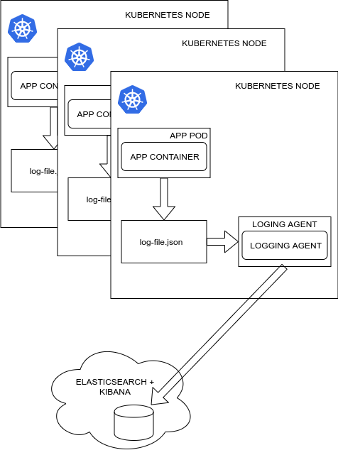
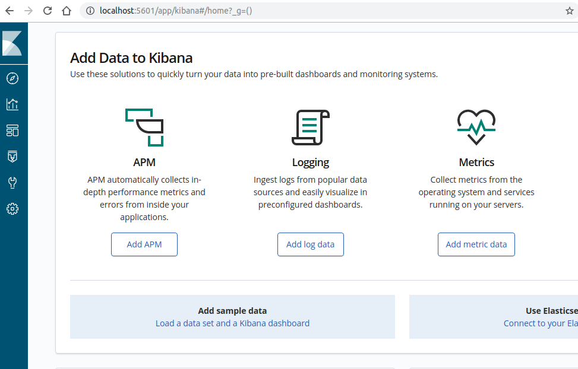
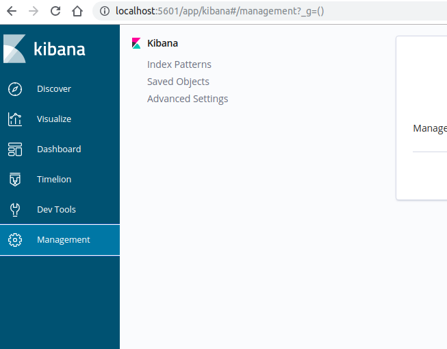
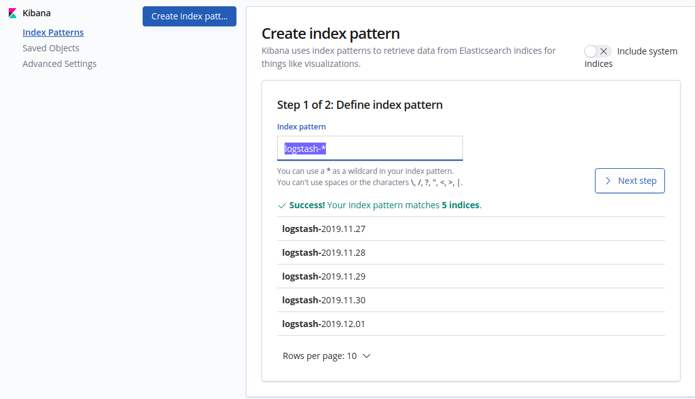
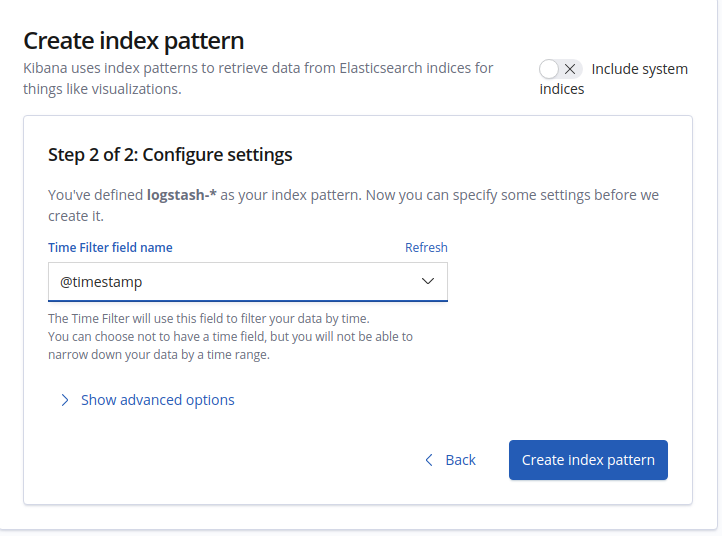
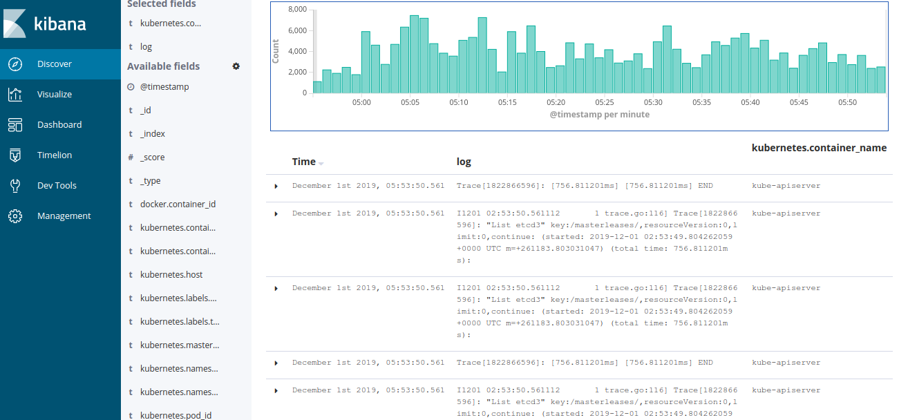

## Почему в Kubernetes необходимо специальное решение для логирования

Писать логи в контейнеры неудобно, потому что:

- данные, генерируемые в контейнеризированных приложениях, существуют, пока существует контейнер. При перезагрузке docker-контейнера данные, в том числе логи приложения, удаляются;
- логи нельзя ротировать в контейнере, так как ротация — это дополнительный процесс, помимо логируемого, а в одном контейнере не может быть запущено более одного процесса.

<info>

**Примечание**

Ротация логов - процесс обработки, очищения, архивации и отправки логов с помощью утилит.

</info>

Чтобы можно было получить доступ к логам контейнеризированных приложений в Kubernetes, docker-контейнеры должны передавать свои логи в стандартные потоки вывода (stdout) и ошибок (stderr). По умолчанию docker logging driver пишет логи в json-файл на ноде, откуда их можно получить с помощью команды:

```
kubectl logs pod_name
```

<info>

**Примечание**

Docker logging driver - механизм сбора логов, встроенный в docker-движок и поддерживающий множество [инструментов ротации логов](https://docs.docker.com/config/containers/logging/configure/).

</info>

Когда жизненным циклом docker-контейнеров управляет оркестратор Kubernetes, поды с контейнерами часто и непредсказуемо создаются, перезагружаются и удаляются. Если это допускают настройки драйвера логирования docker, можно получить доступ к последним до перезагрузки логам пода с помощью аргумента --previous:

```
kubectl logs pod_name --previous
```

Но получить логи за время более одной перезагрузки назад таким способом невозможно. Удаление пода означает удаление всей информации о нем, в том числе логов.

Поэтому для работы с логами приложений в Kubernetes необходима система, которая сможет собирать, агрегировать, сохранять и извлекать полезную информацию из логов. Для этой задачи подходит связка из поискового движка Elasticsearch, агента логирования Fluentd и дашборда Kibana — EFK-стек.

Схема системы логирования в кластере Kubernetes:



В зависимости от количества информации, необходимой в обработке Elasticsearch, можно выбрать различные пути инсталляции EFK-стека:

- При ожидаемых нагрузках в десятки тысяч логов в секунду не рекомендуется устанавливать Elasticsearch в кластер Kubernetes. Для высоконагруженного решения в продакшене лучше выделить отдельные виртуальные машины под кластер самого Elasticsearch, а логи посылать из Kubernetes с помощью лог-агрегаторов.
- Если система не производит десятки тысяч логов, и нужно наблюдать за логами на дев-, тест-окружениях, EFK-стек можно установить в кластер Kubernetes, поближе к приложениям.

В качестве агента сборщика логов используем fluentd - приложение для сбора, фильтрации и агрегации логов, написанное на языках C и Ruby и располагающее различными плагинами для расширения базового функционала приложения.

Организуем централизованную систему логирования для Kubernetes.

## Установка Elasticsearch в Kubernetes c помощью helm

1.  Создайте namespace kube-logging:

```
kubectl create ns kube-logging
```

<info>

**Примечание**

При установке из helm потребуется задать storage-class для приложения.

</info>

2.  Узнайте storage class, доступные в кластере Kubernetes:

```
admin@k8s:~$ kubectl get sc 
NAME            PROVISIONER            AGE
hdd (default)   kubernetes.io/cinder   103d
hdd-retain      kubernetes.io/cinder   103d
ssd             kubernetes.io/cinder   103d
ssd-retain      kubernetes.io/cinder   103d
```

3.  Установите Elasticsearch в кластер Kubernetes с заданными переменными:
    ```
    helm install stable/elasticsearch \
          --name elastic \
          --set client.replicas=1 \
          --set master.replicas=1 \
          --set data.replicas=1 \
          --set master.persistence.storageClass=hdd \
          --set data.persistence.storageClass=hdd \
          --set master.podDisruptionBudget.minAvailable=1 \
          --set resources.requests.memory=4Gi \
          --set cluster.env.MINIMUM_MASTER_NODES=1 \
          --set cluster.env.RECOVER_AFTER_MASTER_NODES=1 \
          --set cluster.env.EXPECTED_MASTER_NODES=1 \
          --namespace kube-logging
    ```
    В результате будет установлен кластер Elasticsearch, состоящий из 1 мастер-ноды, 1 ноды хранения данных и 1 ноды клиента.
4.  Убедитесь, что все поды готовы к работе:
    ```
    kubectl get po -n kube-logging
    ```
    ```
    NAME                                           READY   STATUS    RESTARTS   AGE
    elastic-elasticsearch-client-c74598797-9m7pm   1/1     Running  
    elastic-elasticsearch-data-0                   1/1     Running  
    elastic-elasticsearch-master-0                 1/1     Running  
    ```
5.  Узнайте название сервисов в  kube-logging:
    ```
    kubectl get svc -n kube-logging
    ```

```
NAME                              TYPE        CLUSTER-IP     EXTERNAL-IP   PORT(S)    AGE
elastic-elasticsearch-client      ClusterIP   10.233.8.213   <none>        9200/TCP   11m
elastic-elasticsearch-discovery   ClusterIP   None           <none>        9300/TCP   11m
```

Сервис elastic-elasticsearch-client будет использоваться для связки с kibana и fluentd. Дашборд Kibana установим также с помощью helm, но пропишем название сервиса elastic-elasticsearch-client в переменные его helm-чарта.

6.  Скачайте переменные helm-чарта kibana для редактирования:

```
helm fetch --untar stable/kibana
```

7.  Перейдите в каталог kibana и отредактируйте файл values.yaml:

```
cd kibana/ && vim values.yaml
```

8.  Впишите в секцию elasticsearch hosts имя сервиса elastic-elasticsearch-client:

```
35 files:
36   kibana.yml:
37     ## Default Kibana configuration from kibana-docker.
38     server.name: kibana
39     server.host: "0"
40     ## For kibana < 6.6, use elasticsearch.url instead
41     elasticsearch.hosts: http://elastic-elasticsearch-client:9200
```

9.  Установите Kibana с модифицированными параметрами:

```
helm install stable/kibana \
     --name kibana \
     --namespace kube-logging \
     -f values.yaml
```

10. Убедитесь, что под стартовал, и пробросьте на свою локальную машину порт 5601 пода Kibana для доступа к дашборду:

```
kubectl get pod -n kube-logging 
```

Впишите в следующую команду полное имя пода для kibana, полученное из вывода предыдущей команды, вместо kibana-pod_hash_id:

```
kubectl port-forward --namespace kube-logging kibana-pod_hash_id 5601:5601
```

11. В адресной строке браузера укажите строку подключения к проброшенному дашборду Kibana:

```
localhost:5601
```



## Установка агрегаторов логов fluentd в кластер kubernetes

Fluend в кластере Kubernetes умеет собирать не только логи подов, сервисов и хостов, но и метаданные, которые соотносятся с лейблами сущностей kubernetes.

Конфигурация fluentd содержит информацию об источниках для сбора логов, способах парсинга и фильтрации полезной информации, потребителях этой информации (в нашем случае такой потребитель — elasticsearch).

В конфигурационном файле fluentd в рамках элементов `<source>` указаны источники для сбора логов. В представленном ниже configmap указано, что fluentd будет собирать информацию из логов контейнеров приложений, из логов контейнеров самого kubernetes и системных логов нод kubernetes.

1.  Создайте configmap для fluentd со следующим содержанием:

```
**kind: ConfigMap
apiVersion: v1
data:
  containers.input.conf: |-
    <source>
      @type tail
      path /var/log/containers/*.log
      pos_file /var/log/es-containers.log.pos
      time_format %Y-%m-%dT%H:%M:%S.%NZ
      tag kubernetes.*
      read_from_head true
      format multi_format
      <pattern>
        format json
        time_key time
        time_format %Y-%m-%dT%H:%M:%S.%NZ
      </pattern>
      <pattern>
        format /^(?<time>.+) (?<stream>stdout|stderr) [^ ]* (?<log>.*)$/
        time_format %Y-%m-%dT%H:%M:%S.%N%:z
      </pattern>
    </source>
  system.input.conf: |-
    <source>
      @type tail
      format /^time="(?<time>[^)]*)" level=(?<severity>[^ ]*) msg="(?<message>[^"]*)"( err="(?<error>[^"]*)")?( statusCode=($<status_code>\d+))?/
      path /var/log/docker.log
      pos_file /var/log/es-docker.log.pos
      tag docker
    </source>

    <source>
      @type tail
      format none
      path /var/log/etcd.log
      pos_file /var/log/es-etcd.log.pos
      tag etcd
    </source>


    <source>
      @type tail
      format multiline
      multiline_flush_interval 5s
      format_firstline /^\w\d{4}/
      format1 /^(?<severity>\w)(?<time>\d{4} [^\s]*)\s+(?<pid>\d+)\s+(?<source>[^ \]]+)\] (?<message>.*)/
      time_format %m%d %H:%M:%S.%N
      path /var/log/kubelet.log
      pos_file /var/log/es-kubelet.log.pos
      tag kubelet
    </source>

    <source>
      @type tail
      format multiline
      multiline_flush_interval 5s
      format_firstline /^\w\d{4}/
      format1 /^(?<severity>\w)(?<time>\d{4} [^\s]*)\s+(?<pid>\d+)\s+(?<source>[^ \]]+)\] (?<message>.*)/
      time_format %m%d %H:%M:%S.%N
      path /var/log/kube-proxy.log
      pos_file /var/log/es-kube-proxy.log.pos
      tag kube-proxy
    </source>

    <source>
      @type tail
      format multiline
      multiline_flush_interval 5s
      format_firstline /^\w\d{4}/
      format1 /^(?<severity>\w)(?<time>\d{4} [^\s]*)\s+(?<pid>\d+)\s+(?<source>[^ \]]+)\] (?<message>.*)/
      time_format %m%d %H:%M:%S.%N
      path /var/log/kube-apiserver.log
      pos_file /var/log/es-kube-apiserver.log.pos
      tag kube-apiserver
    </source>


    <source>
      @type tail
      format multiline
      multiline_flush_interval 5s
      format_firstline /^\w\d{4}/
      format1 /^(?<severity>\w)(?<time>\d{4} [^\s]*)\s+(?<pid>\d+)\s+(?<source>[^ \]]+)\] (?<message>.*)/
      time_format %m%d %H:%M:%S.%N
      path /var/log/kube-controller-manager.log
      pos_file /var/log/es-kube-controller-manager.log.pos
      tag kube-controller-manager
    </source>

    <source>
      @type tail
      format multiline
      multiline_flush_interval 5s
      format_firstline /^\w\d{4}/
      format1 /^(?<severity>\w)(?<time>\d{4} [^\s]*)\s+(?<pid>\d+)\s+(?<source>[^ \]]+)\] (?<message>.*)/
      time_format %m%d %H:%M:%S.%N
      path /var/log/kube-scheduler.log
      pos_file /var/log/es-kube-scheduler.log.pos
      tag kube-scheduler
    </source>

    <source>
      @type tail
      format multiline
      multiline_flush_interval 5s
      format_firstline /^\w\d{4}/
      format1 /^(?<severity>\w)(?<time>\d{4} [^\s]*)\s+(?<pid>\d+)\s+(?<source>[^ \]]+)\] (?<message>.*)/
      time_format %m%d %H:%M:%S.%N
      path /var/log/rescheduler.log
      pos_file /var/log/es-rescheduler.log.pos
      tag rescheduler
    </source>

    # Logs from systemd-journal for interesting services.
    <source>
      @type systemd
      matches [{ "_SYSTEMD_UNIT": "docker.service" }]
      pos_file /var/log/gcp-journald-docker.pos
      read_from_head true
      tag docker
    </source>

    <source>
      @type systemd
      matches [{ "_SYSTEMD_UNIT": "kubelet.service" }]
      pos_file /var/log/gcp-journald-kubelet.pos
      read_from_head true
      tag kubelet
    </source>

    <source>
      @type systemd
      matches [{ "_SYSTEMD_UNIT": "node-problem-detector.service" }]
      pos_file /var/log/gcp-journald-node-problem-detector.pos
      read_from_head true
      tag node-problem-detector
    </source>
  forward.input.conf: |-
    # Takes the messages sent over TCP
    <source>
      @type forward
    </source>

    <match **>
       @type elasticsearch
       @log_level info
       include_tag_key true
       host elastic-elasticsearch-client
       port 9200
       logstash_format true
       logstash_prefix fluentd
       # Set the chunk limits.
       buffer_chunk_limit 2M
       buffer_queue_limit 8
       flush_interval 5s
       # Never wait longer than 5 minutes between retries.
       max_retry_wait 30
       # Disable the limit on the number of retries (retry forever).
       disable_retry_limit
       # Use multiple threads for processing.
       num_threads 2
    </match>
metadata:
  name: fluentd-es-config-v0.1.1
  namespace: kube-logging
  labels:
    addonmanager.kubernetes.io/mode: Reconcile**
```

2.  В kubernetes примените configmap:
    ```
    kubectl apply -f fluentd-cm.yaml
    ```

Так как fluentd будет собирать информацию со всего кластера, ему потребуется доступ к ресурсам kubernetes. Для обеспечения этого доступа создадим для fluentd сервисный аккаунт, роль. Затем присвоим сервисному аккаунту роль.

3.  Для fluentd создайте файл sa-r-crb.yaml с описанием service account, role и rolebinding:
    ```
    apiVersion: v1
    kind: ServiceAccount
    metadata:
       name: fluentd
       namespace: kube-logging
       labels:
         app: fluentd
    ---
    apiVersion: rbac.authorization.k8s.io/v1
    kind: ClusterRole
    metadata:
      name: fluentd
      labels:
        app: fluentd
    rules:
    - apiGroups:
      - ""
      resources:
      - pods
      - namespaces
      verbs:
      - get
      - list
      - watch
    ---
    kind: ClusterRoleBinding
    apiVersion: rbac.authorization.k8s.io/v1
    metadata:
      name: fluentd
    roleRef:
      kind: ClusterRole
      name: fluentd
      apiGroup: rbac.authorization.k8s.io
    subjects:
    - kind: ServiceAccount
      name: fluentd
      namespace: kube-logging
    ```
4.  Задеплойте ресурсы в кластер:

```
kubectl apply -f sa-r-crb.yaml
```

```
serviceaccount/fluentd created
clusterrole.rbac.authorization.k8s.io/fluentd created
clusterrolebinding.rbac.authorization.k8s.io/fluentd created
```

Установим fluentd. Поскольку fluentd необходимо установить на все ноды кластера, в качестве ресурса kubernetes выберем тип DaemonSet.

5.  Создайте манифест `fluentd-daemonset.yaml` с следующим содержанием:

```
apiVersion: apps/v1
kind: DaemonSet
metadata:
  name: fluentd
  namespace: kube-logging
  labels:
    app: fluentd
spec:
  selector:
    matchLabels:
      app: fluentd
  template:
    metadata:
      labels:
        app: fluentd
    spec:
      serviceAccount: fluentd
      serviceAccountName: fluentd
      tolerations:
      - key: node-role.kubernetes.io/master
        effect: NoSchedule
      containers:
      - name: fluentd
        image: fluent/fluentd-kubernetes-daemonset:v1.4.2-debian-elasticsearch-1.1
        env:
          - name:  FLUENT_ELASTICSEARCH_HOST
            value: "elastic-elasticsearch-client"
          - name:  FLUENT_ELASTICSEARCH_PORT
            value: "9200"
          - name: FLUENT_ELASTICSEARCH_SCHEME
            value: "http"
          - name: FLUENTD_SYSTEMD_CONF
            value: disable
          - name: FLUENT_ELASTICSEARCH_SED_DISABLE
            value: disable
        resources:
          limits:
            memory: 512Mi
          requests:
            cpu: 100m
            memory: 200Mi
        volumeMounts:
        - name: varlog
          mountPath: /var/log
        - name: varlibdockercontainers
          mountPath: /var/lib/docker/containers
          readOnly: true
        - name: config-volume
          mountPath: /fluentd/etc/conf.d
        - name: main-config
          mountPath: /fluentd/etc
      terminationGracePeriodSeconds: 3
      volumes:
      - name: varlog
        hostPath:
          path: /var/log
      - name: varlibdockercontainers
        hostPath:
          path: /var/lib/docker/containers
      - name: config-volume
        configMap:
            name: fluentd-es-config-v0.1.1
      - name: main-config
        configMap:
            name: fluentd-es-main-config-v0.1.1
            items:
              - key: fluent.conf
                path: fluent.conf


```

6.  Примените манифест в kubernetes:
    ```
    kubectl apply -f fluentd-daemonset.yaml
    ```

## Доступ к логам через дашборд Kibana

Настройте индекс в UI Kibana:

1.  Перейдите на вкладку с дашбордом Kibana и выберите меню Management:

    

2.  Выберите вкладку Index Patterns, нажмите кнопку Create index pattern и введите название logstash-\*

    

3.  Нажмите кнопку Next Step и выберите Create Index Pattern:



3.  Перейдите на вкладку Discover. Вы увидите логи из кластера kubernetes:



## Обратная связь

Возникли проблемы или остались вопросы? [Напишите нам, мы будем рады](https://mcs.mail.ru/help/contact-us)
