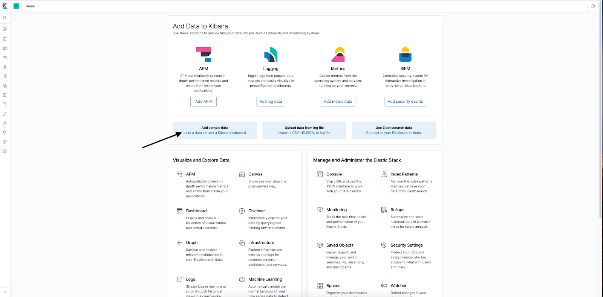
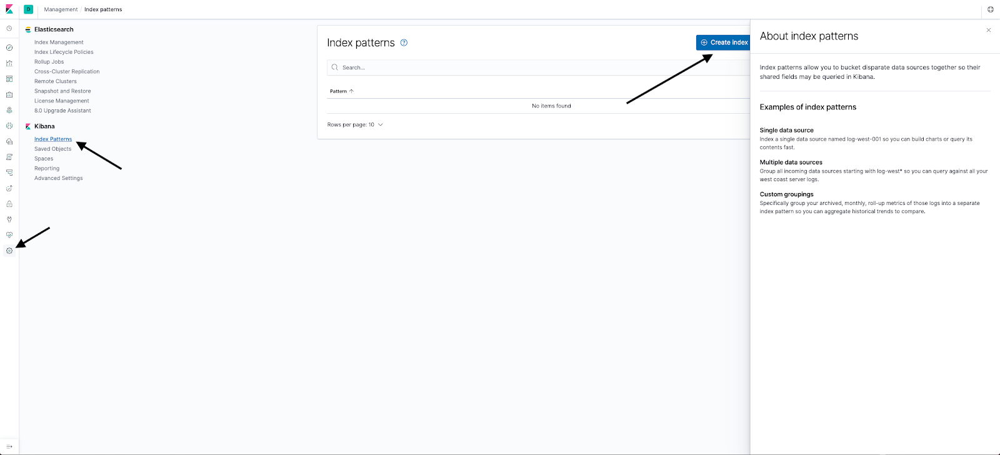
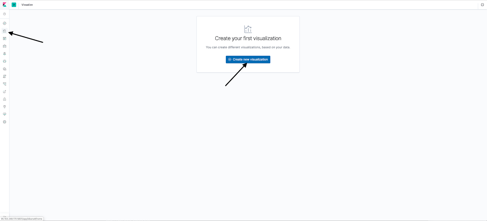
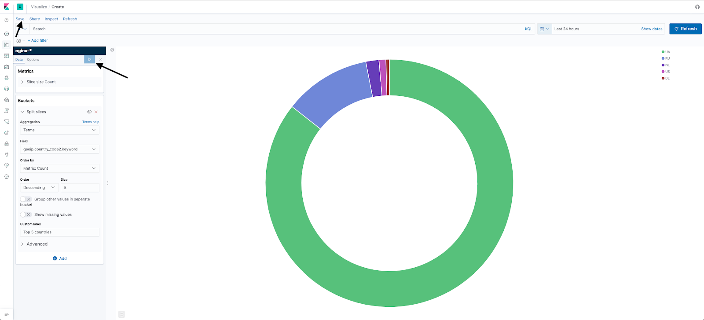

## Конфигурация оборудования

Чтобы выполнить данный сценарий, требуется установленный и настроенный сервер для ELK на ОС Ubuntu 18.04 LTS x86_64.

<warn>

**Внимание!**

При использовании других серверов и оборудования некоторые шаги сценария могут отличаться от описанных ниже.

</warn>

## Схема работы

****

Стек ELK состоит из трех компонентов:

- Elasticsearch - движок для хранения, индексирования и обработки данных в общем хранилище, а также для полнотекстового поиска данных.
- Logstash - утилита для сбора, фильтрации, агрегации, изменения  и последующего перенаправления исходных данных в конечное хранилище.
- Kibana - веб-интерфейс для просмотра и анализа данных из хранилища.

## Установка Elasticsearch, Logstash и Kibana

1.  Выполните логин на сервере Ubuntu с правами root.
2.  Импортируйте ключ репозитория Elasticsearch:

```
root@ubuntu-basic-1-1-10gb:~# wget -qO - https://artifacts.elastic.co/GPG-KEY-elasticsearch | sudo apt-key add -
OK
```

3.  Установите apt-transport-https:

```
root@ubuntu-basic-1-1-10gb:~# apt-get install apt-transport-https
```

4.  Добавьте репозиторий:

```
root@ubuntu-basic-1-1-10gb:~# echo "deb https://artifacts.elastic.co/packages/7.x/apt stable main" | sudo tee -a /etc/apt/sources.list.d/elastic-7.x.list
deb https://artifacts.elastic.co/packages/7.x/apt stable main
```

5.  Установите Elasticsearch:

```
root@ubuntu-basic-1-1-10gb:~# apt-get update && apt-get install elasticsearch
```

6.  Установите Kibana:

```
root@ubuntu-basic-1-1-10gb:~# apt-get install kibana
```

7.  Для работы Logstash установите OpenJDK:

```
root@ubuntu-basic-1-1-10gb:~# apt-get install openjdk-8-jre
```

8.  Установите Logstash:

```
root@ubuntu-basic-1-1-10gb:~# apt-get install logstash

```

## Настройка Elasticsearch

Elasticsearch настраивается с использованием трех конфигурационных файлов:

- **elasticsearch.yml  - основной конфигурационный файл;**
- **jvm.options - файл для настройки Java-машины для запуска Elasticsearch;**
- **log4j2.properties  - файл для настройки логирования Elasticsearch.**

**jvm.options**

Наиболее важной в этом файле является настройка памяти, выделенной для JVM (Heap Size). Для Elasticsearch этот параметр влияет напрямую на то, насколько крупные массивы данных он сможет обработать. Heap Size определяется парой параметров:

- Xms - начальное значение;
- Xmx - максимальное значение.

По умолчанию Heap Size составляет 1 ГБ. Если объем памяти на сервере позволяет, увеличьте это значение ([подробнее о Heap Size](https://www.elastic.co/guide/en/elasticsearch/reference/current/heap-size.html)). Для этого найдите строки:

```
Xms1g
Xmx1g
```

и замените их, например, на строки:

```
Xms4g
Xmx4g
```

**log4j2.properties**

Для удобства  можно поменять appender.rolling.policies.size.size, указывающий размер лога, при котором выполняется ротация (по умолчанию - 128 МБ). Подробнее о логировании [см.тут](https://www.elastic.co/guide/en/elasticsearch/reference/current/logging.html).

**elasticsearch.yml**

Настройте:

- node.name: elasticsearch - укажите имя ноды;
- network.host: 127.0.0.1 - установите слушать только localhost.

Запустите Elasticsearch:

```
root@ubuntu-basic-1-1-10gb:~# systemctl start elasticsearch.service
```

Если вы указали слишком большое значение Heap Size, запуск завершится неудачей. При этом в логах будет следующее:

```
root@ubuntu-basic-1-1-10gb:~# systemctl start elasticsearch.service
Job for elasticsearch.service failed because the control process exited with error code.
See "systemctl status elasticsearch.service" and "journalctl -xe" for details.
root@ubuntu-basic-1-1-10gb:~# journalctl -xe
-- Unit elasticsearch.service has begun starting up.
Nov 12 12:48:12 ubuntu-basic-1-1-10gb elasticsearch[29841]: Exception in thread "main" java.lang.RuntimeException: starting java failed with [1]
Nov 12 12:48:12 ubuntu-basic-1-1-10gb elasticsearch[29841]: output:
Nov 12 12:48:12 ubuntu-basic-1-1-10gb elasticsearch[29841]: #
Nov 12 12:48:12 ubuntu-basic-1-1-10gb elasticsearch[29841]: # There is insufficient memory for the Java Runtime Environment to continue.
Nov 12 12:48:12 ubuntu-basic-1-1-10gb elasticsearch[29841]: # Native memory allocation (mmap) failed to map 986513408 bytes for committing reserved memory.
Nov 12 12:48:12 ubuntu-basic-1-1-10gb elasticsearch[29841]: # An error report file with more information is saved as:
Nov 12 12:48:12 ubuntu-basic-1-1-10gb elasticsearch[29841]: # /var/log/elasticsearch/hs_err_pid29900.log
```

В случае успешного запуска добавьте Elasticsearch в список процессов, запускаемых автоматически:

```
root@ubuntu-basic-1-1-10gb:~# systemctl enable elasticsearch.service
Synchronizing state of elasticsearch.service with SysV service script with /lib/systemd/systemd-sysv-install.
Executing: /lib/systemd/systemd-sysv-install enable elasticsearch
Created symlink /etc/systemd/system/multi-user.target.wants/elasticsearch.service → /usr/lib/systemd/system/elasticsearch.service.
```

Убедитесь, что Elasticsearch отвечает на запросы:

```
root@ubuntu-basic-1-1-10gb:~# curl http://localhost:9200
{
"name" : "ubuntu-basic-1-1-10gb",
"cluster_name" : "elasticsearch",
"cluster_uuid" : "ZGDKK_5dQXaAOr75OQGw3g",
"version" : {
"number" : "7.4.2",
"build_flavor" : "default",
"build_type" : "deb",
"build_hash" : "2f90bbf7b93631e52bafb59b3b049cb44ec25e96",
"build_date" : "2019-10-28T20:40:44.881551Z",
"build_snapshot" : false,
"lucene_version" : "8.2.0",
"minimum_wire_compatibility_version" : "6.8.0",
"minimum_index_compatibility_version" : "6.0.0-beta1"
},
"tagline" : "You Know, for Search"
}
```

## Настройка Kibana

По умолчанию в конфигурационном файле Kibana /etc/kibana/kibana.yml содержатся все необходимые настройки. Единственный параметр, который нужно изменить: server.host: “localhost”. При настройке по умолчанию Kibana доступна только локально. Для удаленного доступа к Kibana замените “localhost” на внешний IP-адрес сервера, на котором установлена Kibana. Кроме того, если Elasticsearch расположен не на одном хосте с Kibana, измените настройку elasticsearch.hosts: ["[http://localhost:9200](http://localhost:9200/)"].

1.  Запустите Kibana:

```
root@ubuntu-basic-1-1-10gb:/etc/kibana# systemctl start kibana.service
```

2.  Добавьте Kibana в список приложений, запускаемых автоматически:

```
root@ubuntu-basic-1-1-10gb:/etc/kibana# systemctl enable kibana.service
Synchronizing state of kibana.service with SysV service script with /lib/systemd/systemd-sysv-install.
Executing: /lib/systemd/systemd-sysv-install enable kibana
```

3.  В браузере перейдите по адресу http://<IP-адрес сервера kibana>:5601.

Если Kibana работает, отобразится следующее:


## Настройка  безопасности Kibana и Elasticsearch

По умолчанию Elasticsearch и Kibana полностью доступны для всех. Доступ можно ограничить одним из способов:

- Использовать Nginx как reverse proxy с авторизацией и контролем доступа.
- Использовать встроенный механизм elasticsearch xpack.security (подробно об этом см. [тут](https://www.elastic.co/guide/en/elasticsearch/reference/7.4/configuring-security.html) или [тут](https://www.elastic.co/guide/en/kibana/current/using-kibana-with-security.html)).

Рассмотрим наиболее популярный первый способ.

1.  Установите Nginx:

```
root@ubuntu-basic-1-1-10gb:~# apt-get install nginx
```

2.  Убедитесь, что в конфигурационном файле /etc/elasticsearch/elasticsearch.yml параметр network.host имеет значение 127.0.0.1 или localhost. При необходимости выполните эту настройку и перезапустите демон elasticsearch:

```
root@ubuntu-basic-1-1-10gb:~# cat /etc/elasticsearch/elasticsearch.yml  | grep network.host
network.host: 127.0.0.1
root@ubuntu-basic-1-1-10gb:~# systemctl restart elasticsearch.service
```

3.  Убедитесь, что в конфигурационном файле /etc/kibana/kibana.yml параметр server.host имеет значение 127.0.0.1 или localhost. При необходимости выполните эту настройку и перезапустите демон kibana:

```
root@ubuntu-basic-1-1-10gb:~# cat /etc/kibana/kibana.yml  | grep server.host
server.host: "127.0.0.1"
# When this setting's value is true Kibana uses the hostname specified in the server.host
root@ubuntu-basic-1-1-10gb:~# systemctl restart kibana.service
```

4.  Убедитесь, что Elasticsearh и Kibana использовали интерфейс 127.0.0.1:

```
root@ubuntu-basic-1-1-10gb:~# netstat -tulpn | grep 9200
tcp6 0 0 127.0.0.1:9200 :::\* LISTEN 10512/java
root@ubuntu-basic-1-1-10gb:~# netstat -tulpn | grep 5601
tcp        0      0 127.0.0.1:5601          0.0.0.0:\*               LISTEN      11029/node
```

5.  В /etc/nginx/sites-available создайте файл kibana.conf и добавьте в него следующее:

```
server {
listen <внешний IP-адрес сервера с Kibana и Nginx>:5601;
server_name kibana;

error_log /var/log/nginx/kibana.error.log;
access_log /var/log/nginx/kibana.access.log;

location / {
auth_basic "Restricted Access";
auth_basic_user_file /etc/nginx/htpasswd;
rewrite ^/(.\*) /$1 break;
proxy_ignore_client_abort on;
proxy_pass http://localhost:5601;
proxy_set_header X-Real-IP $remote_addr;
proxy_set_header X-Forwarded-For $proxy_add_x_forwarded_for;
proxy_set_header Host $http_host;
}
}
```

6.  Укажите имя пользователя (USER) и пароль (PASSWORD):

```
root@ubuntu-basic-1-1-10gb:/etc/nginx# printf "USER:$(openssl passwd -crypt PASSWORD)\n" >> /etc/nginx/htpasswd
```

7.  Для включения сайта создайте симлинк в папку /etc/nginx/sites-enabled:

```
root@ubuntu-basic-1-1-10gb:~# ln -s /etc/nginx/sites-available/kibana.conf /etc/nginx/sites-enabled/kibana.conf
```

8.  Запустите Nginx:

```
root@ubuntu-basic-1-1-10gb:~# systemctl start nginx 
```

9.  В браузере перейдите по адресу http://<IP-адрес сервера kibana>:5601. В открывшемся окне введите логин и пароль для доступа к веб-интерфейсу Kibana.

Аналогично настройте Nginx в качестве reverse proxy для Elasticsearh (порт 9200) и Logstash (обычно порт 5044).

Для ознакомления с Kibana можно использовать тестовый набор данных:

[](https://hb.bizmrg.com/help-images/logging/Kibana_Dashboard_2.png)

[](https://hb.bizmrg.com/help-images/logging/Kibana_Dashboard_3.png)

## Установка filebeat

Beats - часть инфраструктуры Elasticsearch, так называемые Data Shippers (поставщики данных). Это легковесные агенты, которые берут данные из различных источников и преобразуют их для передачи в Elasticsearch. Функциональность Beats частично дублирует Logstash, но Beats легковеснее, проще настраиваются, быстрее работают и не требуют установки Java stack. Обычно на нодах, где формируются логи, устанавливаются соответствующие агенты Beats, которые передают логи в Logstash. Logstash аггрегирует, трансформирует логи и передает их в Elasticsearch. Существует множество разных Beats, в стандартный набор входят следующие агенты:

- Filebeat - сбор логов из различных log-файлов.
- Packetbeat - сбор сетевой статистики.
- Winlogbeat -  сбор логов на платформе Windows.
- Metricbeat - сбор разнообразных метрик.
- Heartbeat - сбор данных о доступности инфраструктуры.
- Auditbeat - сбор данных аудита систем.
- Functionbeat - сбор данных с Serverless проектов (AWS Lambda).
- Journalbeat - сбор логов Journald.

Наиболее распространен агент Filebeat, используем его для сбора логов Nginx.

1.  Установите Filebeat:

```
root@ubuntu-basic-1-1-10gb:~# apt-get install filebeat
```

2.  Разрешите обработку логов Nginx:

```
root@ubuntu-basic-1-1-10gb:~# mv /etc/filebeat/modules.d/nginx.yml.disabled /etc/filebeat/modules.d/nginx.yml
```

Если логи находятся в нестандартном месте, либо требуется обработка только части логов, в файле /etc/filebeat/modules.d/nginx.yml раскомментируйте и заполните переменные var.paths.

В примере далее будем собирать и анализировать логи обращения к сервису Kibana. При настройке Nginx мы определили, что логи обращений будут храниться в файлах /var/log/nginx/kibana.access.log  и /var/log/nginx/kibana.error.log.

3.  Приведите файл /etc/filebeat/modules.d/nginx.yml к следующему виду:

```
# Module: nginx
# Docs: https://www.elastic.co/guide/en/beats/filebeat/7.4/filebeat-module-nginx.html

- module: nginx
# Access logs
access:
enabled: true

# Set custom paths for the log files. If left empty,
# Filebeat will choose the paths depending on your OS.
var.paths:
- /var/log/nginx/kibana.access.log

# Error logs
error:
enabled: true

# Set custom paths for the log files. If left empty,
# Filebeat will choose the paths depending on your OS.
var.paths:
     - /var/log/nginx/kibana.error.log
```

4.  В файле /etc/filebeat/filebeat.yml отредактируйте секцию setup.kibana:

```
setup.kibana:
  host: "<IP-адрес сервера с Kibana>:5601"
  username: "логин"
  password: "пароль"
```

<info>

**Примечание**

Логин и пароль требуются для доступа Filebeat в Kibana с целью загрузки типовых dashboard под известные наборы данных.

</info>

5.  Логи будут пересылаться в Logstash, поэтому закомментируйте секцию output.elasticsearch и укажите IP-адрес сервера, на котором расположен Logstash, в секции output.logstash:

```
#-------------------------- Elasticsearch output ------------------------------
#output.elasticsearch:
# Array of hosts to connect to.
# hosts: ["localhost:9200"]

# Optional protocol and basic auth credentials.
#protocol: "https"
#username: "elastic"
#password: "changeme"

#----------------------------- Logstash output --------------------------------
output.logstash:
# The Logstash hosts
hosts: ["<IP-адрес сервера logstash>:5044"]

# Optional SSL. By default is off.
# List of root certificates for HTTPS server verifications
#ssl.certificate_authorities: ["/etc/pki/root/ca.pem"]

# Certificate for SSL client authentication
#ssl.certificate: "/etc/pki/client/cert.pem"

# Client Certificate Key
  #ssl.key: "/etc/pki/client/cert.key"
```

6.  Убедитесь, что в конфигурационном файле нет ошибок:

```
root@ubuntu-basic-1-1-10gb:/etc/filebeat# filebeat test config -c /etc/filebeat/filebeat.yml
Config OK
```

Перед запуском Filebeat настройте прием логов в Logstash.

## Настройка Logstash

Конфигурационный файл Logstash в общем виде состоит из трех секций:

- input - описание пункта назначения логов.
- filter - трансформация логов.
- output - описание пункта назначения преобразованных логов.

1.  Создайте файл /etc/logstash/conf.d/input-beats.conf, содержащий номер порта, на который Beats (в частности, Filebeat) присылает свои логи:

```
input {
beats {
port => 5044
}
}
```

2.  Создайте файл /etc/logstash/conf.d/output-elasticsearch.conf и укажите, что логи нужно отправлять в Elasticsearch по адресу localhost и индексы нужно именовать в формате nginx-<дата> (то есть каждый день будет создаваться новый индекс, это удобно для анализа):

```
output {
elasticsearch {
hosts => [ "localhost:9200" ]
        manage_template => false
        index => "nginx-%{+YYYY.MM.dd}"
    }
}
```

3.  Создайте файл /etc/logstash/conf.d/filter-nginx.conf следующего содержания:

```
filter {
 if [event][dataset] == "nginx.access" {
   grok {
    match => [ "message" , "%{IPORHOST:clientip} %{USER:ident} %{USER:auth} \[%{HTTPDATE:timestamp}\] \"(?:%{WORD:verb} %{NOTSPACE:request}(?: HTTP/%{NUMBER:httpversion})?|%{DATA:rawrequest})\" %{NUMBER:response} (?:%{NUMBER:bytes}|-) %{QS:referrer} %{QS:user_agent}"]
    overwrite => [ "message" ]
   }
   mutate {
    convert => ["response", "integer"]
    convert => ["bytes", "integer"]
    convert => ["responsetime", "float"]
   }
  geoip {
   source => "clientip"
   target => "geoip"
   add_tag => [ "nginx-geoip" ]
  }
  date {
   match => [ "timestamp" , "dd/MMM/YYYY:HH:mm:ss Z" ]
   remove_field => [ "timestamp" ]
  }
  
  useragent {
   source => "user_agent"
  }
 }
}
```

Filebeat, который будет пересылать логи Nginx в Logstash, записывает всю строчку лога Nginx  в поле message. Поэтому это поле нужно разобрать на переменные, с которыми можно будет работать в Elasticsearch. Этот разбор осуществляется в секции grok в формате NGINX ACCESS LOG .

В секции mutate можно изменить формат хранения данных (например, чтобы поле bytes из лога хранилось как число, а не как строка).

В секции geoip к логу добавляются поля геолокации по IP-адресу запроса.

Секция date используется для парсинга поля даты запроса из лога и преобразование для передачи в Elasticsearch.

Секция  useragent заполняет поля по полю из лога. Обратите внимание, что обычно в подобных руководствах используется поле agent. Это поле не будет работать в связке Filebeat + Logstash, так как оно предназначено для использования при прямой записи из Filebeat в Elasticsearh. При использовании в Logstash будет выдаваться ошибка:

```
[2019-11-19T09:55:46,254][ERROR][logstash.filters.useragent][main] Uknown error while parsing user agent data {:exception=>#<TypeError: cannot convert instance of class org.jruby.RubyHash to class java.lang.String>, :field=>"agent", :event=>#<LogStash::Event:0x1b16bb2>}
```

По той же причине в секции  grok match не нужно использовать макрос %{COMBINEDAPACHELOG}.

Для отслеживания ошибок в Logstash включите дебаг. Для этого в секцию output добавьте следующую строку:

```
stdout { codec => rubydebug }
```

В результате вывод в базу Elasticsearch будет дублироваться выводом на консоль/syslog. Кроме того, для проверки выражений grok match полезно использовать [Grok Debugger](https://grokdebug.herokuapp.com/).

4.  Запустите Logstash и добавьте его в список приложений для автоматического запуска:

```
root@ubuntu-basic-1-1-10gb:~# systemctl start logstash
root@ubuntu-basic-1-1-10gb:~# systemctl enable logstash
Created symlink /etc/systemd/system/multi-user.target.wants/logstash.service → /etc/systemd/system/logstash.service.
```

5.  Убедитесь, что сервис запустился:

```
root@ubuntu-basic-1-1-10gb:~# netstat -tulpn | grep 5044
tcp6       0      0 :::5044                 :::\*                    LISTEN      18857/java
```

6.  Протестируйте работу Filebeat:

```
root@ubuntu-basic-1-1-10gb:~# service filebeat start
```

## Настройка Kibana Templates

После запуска Filebeat логи обращения к Kibana поступают в Logstash, затем в Elasticsearch. Чтобы просмотреть эти логи, в Kibana необходимо настроить templates.

1.  Перейдите в Kibana, в левом меню нажмите шестеренку, выберите Kibana > Index Patterns и нажмите Create Index Pattern.

[](https://hb.bizmrg.com/help-images/logging/Template-1.png)

2.  Чтобы выбрать все записи, в поле Index pattern введите nginx-\*  и нажмите Next step.

[](https://hb.bizmrg.com/help-images/logging/Template-2.png)

3.  Чтобы использоваться временные метки из лог-файлов, в поле Time Filter field name выберите @timestamp и нажмите Create index pattern.

[](https://hb.bizmrg.com/help-images/logging/Template-3.png)

Будет создан index pattern.

[](https://hb.bizmrg.com/help-images/logging/Template-4.png)

Чтобы просмотреть логи, попавшие в Elasticsearch, перейдите в Discover.

## Настройка Kibana Visualizations

Dashboard в Kibana состоит из визуализаций. Визуализация - это разновидность графика, построенного по определенным запросам из Elasticsearch.

Построим первую визуализацию  - топ 10 клиентов.

1.  В левом меню выберите Visualisations и нажмите кнопку Create new visualisation.

[](https://hb.bizmrg.com/help-images/logging/Visualisation_1.png)

2.  Выберите Vertical bar.


3.  Выберите темплейт nginx-\*.


4.  Добавьте ось X.

[](https://hb.bizmrg.com/help-images/logging/Visualisation-4.png)

5.  Введите данные:

- Aggregation: Terms - возвращает указанное количество топ-значений.
- Field: clientip.keyword - выбираем клиента по IP-адресу.
- Size: 10 - 10 топ значений.
- Custom Label: Top 10 clients - название визуализации.

[](https://hb.bizmrg.com/help-images/logging/Visualisation-5.png)

6.  Выполните запрос и сохраните визуализацию.

[](https://hb.bizmrg.com/help-images/logging/Visualisation-6.png)

В результате на визуализации показаны топ-10 IP-адресов, с которых были обращения.

Построим вторую визуализацию - круговую диаграмму, показывающую топ 5 стран, откуда обращались пользователи.

1.  В левом меню выберите Visualisations и нажмите кнопку Create new visualisation.
2.  Выберите Pie.
3.  Выберите темплейт nginx-\*.
4.  Добавьте ось X.
5.  Чтобы данные отображались секторам, выберите Add bucket / Split slices.

[](https://hb.bizmrg.com/help-images/logging/Visualisation_21.png)

1.  Введите следующие данные:

- Aggregation: Terms - выбираем топ значения данных.
- Field: geoip.country_code2.keyword - двухбуквенное обозначение страны.
- Size:5  - выбираем топ 5.
- Custom label: Top 5 countries -  название графика.

[](https://hb.bizmrg.com/help-images/logging/Visualisation_22.png)

9.  Выполните запрос и сохраните визуализацию.

[](https://hb.bizmrg.com/help-images/logging/Visualisation_23.png)

На графике отобразятся топ 5 стран, из которых был доступ.

Построим третью визуализацию - график количества запросов, с делением по кодам ответа.

1.  В левом меню выберите Visualisations и нажмите кнопку Create new visualisation.
2.  Выберите TSVB.
3.  Выберите темплейт nginx-\*.
4.  Чтобы получить все коды ответов сервера (то есть все запросы, отправленные серверу), в появившемся окне впишите в название Requests, выберите группировать по фильтру и в строке запроса укажите responce:\*.
5.  Для добавления второй линии на график, .
6.  Чтобы на втором графике получить выборку количества ответов сервера "200 ОК" в единицу времени, нажмите "+", выберите другой цвет, в названии укажите Responce:200, в строке запроса - responce:200.
7.  Нажмите "+" и аналогичным образом добавьте код ответа 302. Затем сохраните визуализацию.

[](https://hb.bizmrg.com/help-images/logging/Visualisation_32.png)

## Настройка Kibana Dashboard

Kibana Dashboard - это набор визуализаций.

1.  Нажмите Dashboards, затем Create New Dashboard.

[](https://hb.bizmrg.com/help-images/logging/Dashboard_1.png)

2.  В верхнем меню нажмите Add.

[](https://hb.bizmrg.com/help-images/logging/Dashboard_2.png)

3.  В открывшемся окне выберите созданные вами визуализации.

[](https://hb.bizmrg.com/help-images/logging/Dashboard_3.png)

4.  При необходимости измените порядок и размер визуализаций, затем нажмите Save.

[](https://hb.bizmrg.com/help-images/logging/Dashboard_4.png)

## Обратная связь**

Возникли проблемы или остались вопросы? [Напишите нам, мы будем рады](https://mcs.mail.ru/help/contact-us)
