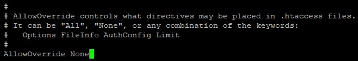
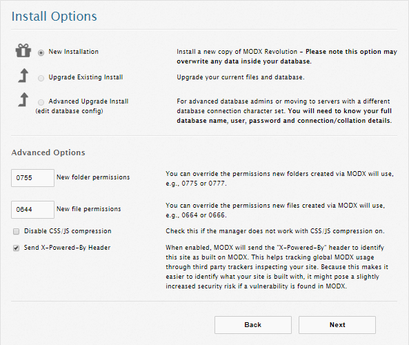
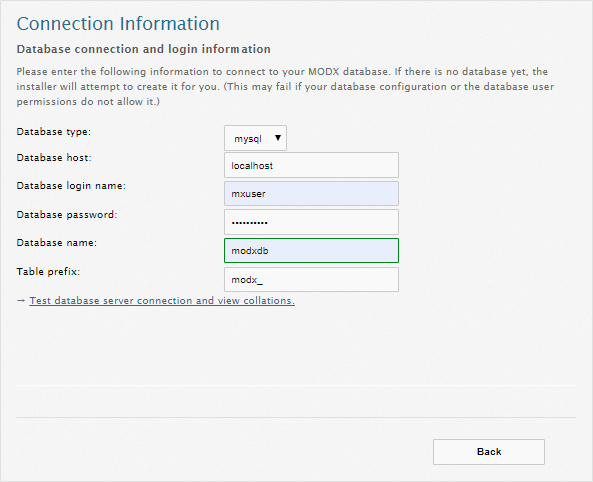
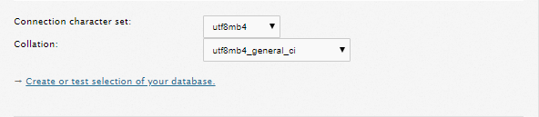
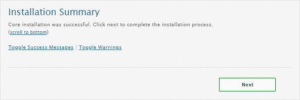
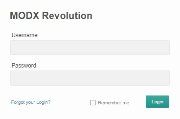
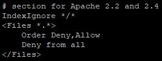

ModX - это система управления контентом с открытым кодом. ModX предназначена для создания, редактирования и управления содержимым сайтов.

## Требования

- Операционная система CentOS версии 7.4.
- Пользователь с доступом к команде sudo.
- Установленный стек LAMP.

Если у вас еще не установлен стек LAMP:

- Вы можете получить готовый стек LAMP в облаке [в виде настроенной виртуальной машины](https://mcs.mail.ru/app/services/marketplace/) на Ubuntu 18.04 и [установить ModX на нем](https://mcs.mail.ru/help/modx-linux/modx-ubuntu-18). При регистрации вы получаете бесплатный бонусный счет, которого хватает, чтобы тестировать сервер несколько дней.
- Вы можете установить стек LAMP самостоятельно. О том, как установить стек LAMP на CentOS 7.4, [читайте тут](https://mcs.mail.ru/help/lamp-on-linux/lamp-centos-7-4).

## Настройка СУБД MySQL

Чтобы начать работу с ModX, необходимо создать и настроить выделенную базу данных MySQL. Для этого:

1.  Откройте окно терминала.
2.  Для перехода в оболочку MySQL выполните команду:

```
sudo mysql -u root -p 
```

Используйте аутентификацию учетной записи root, относящуюся исключительно к СУБД MySQL.

3.  Создайте новую базу данных для ModX, используя команду:

```
CREATE DATABASE имя_базы;
Например: CREATE DATABASE modxdb;
```

**Внимание**

После каждой команды СУБД MySQL должна ставиться точка с запятой.

4.  Создайте пользователя с правами полного доступа к созданной базе данных и назначьте ему пароль, используя команду:

```
CREATE USER имя_пользователя@localhost IDENTIFIED BY 'пароль';
Например: CREATE USER mxuser@localhost IDENTIFIED BY 'mypassword';
```

5.  Предоставьте пользователю привилегии, необходимые для создания и изменения таблиц базы данных, выполнив команду:

```
GRANT ALL PRIVILEGES ON  имя_базы.\* TO имя_пользователя@localhost;
Например: GRANT ALL PRIVILEGES ON modxdb.\* TO mxuser@localhost;
```

6.  Актуализируйте предоставление привилегий к таблицам базы данных, выполнив команду:

```
FLUSH PRIVILEGES;
```

7.  Выйдите из оболочки MySQL, выполнив команду:

```
exit
```

## Подготовка к установке ModX

Перед установкой ModX:

1.  Перейдите на сайт [https://modx.com/download](https://modx.com/download) и запомните номер версии ModX:

    

2.  Откройте окно терминала.
3.  Установите архиватор ZIP, выполнив команду:

```
sudo yum install unzip -y

```

4.  Установите дополнительные пакеты PHP, выполнив команду:

```
sudo yum install php-common php-mbstring php-xmlrpc php-ldap php-sqlite3 php-pdo -y

```

5.  Перейдите в домашний каталог, выполнив команду:

```
cd ~
```

6.  Создайте временный каталог tempMX, выполнив команду:

```
mkdir tempMX 
```

7.  Перейдите в каталог tempMX, выполнив команду:

```
cd ~/tempMX
```

8.  Скачайте архив ModX, выполнив команду:

```
wget https://modx.s3.amazonaws.com/releases/<версия>/modx-<версия>.zip
Например: wget https://modx.s3.amazonaws.com/releases/2.7.1/modx-2.7.1-p1.zip
```

9.  Распакуйте архив ModX, выполнив команду:

```
sudo unzip modx-<версия>.zip
Например: sudo unzip modx-2.7.1-pl.zip
```

10. Переместите файлы из текущего каталога в каталог /var/www/html/modx, выполнив команду:

```
sudo cp -r modx-<версия> /var/www/html/modx
Например: sudo cp -r modx-2.7.1-pl /var/www/html/modx
```

11. Удалите временный каталог tempMX, выполнив команду:

```
sudo rm -Rf ~/tempMX
```

12. Замените владельца каталогов и файлов в корневом каталоге веб-сервера, используя команду:

```
sudo chown -R имя_пользователя:apache /var/www/html/modx
где имя_пользователя - это имя пользователя sudo, www-data - имя группы
Например: sudo chown -R apache:apache /var/www/html/modx
```

**Внимание**

Во избежание ошибок веб-сервера Apache при запуске скриптов используйте имя пользователя apache и имя группы apache по умолчанию.

13. Если необходимо предоставить доступ к файлам корневого каталога веб-сервера другому пользователю, включите этого пользователя в группу www-data, используя команду:

```
sudo usermod -a -G www-data имя_пользователя
Например: sudo usermod -a -G apache mxuser
```

14. Настройте права доступа к файлам и папкам корневого каталога, используя команду:

```
sudo chmod -R 775 /var/www/html/modx
```

15. Разрешите сервису httpd запись в веб-директорию modx, выполнив команду:

```
sudo chcon -R -t httpd_sys_rw_content_t /var/www/html/modx

```

16. Откройте конфигурационный файл httpd.conf для редактирования, выполнив команду:

```
sudo nano /etc/httpd/conf/httpd.conf

```

17. В файле httpd.conf:

- Найдите строку:

```
DocumentRoot "/var/www/html"
```

и замените ее на строку:

```
DocumentRoot "/var/www/html/modx"

```

- Найдите раздел:

****

В этом разделе замените строку **AllowOverride None** на строку **AllowOverride All**.

Сохраните изменения, используя сочетание клавиш CTRL+O, и завершите редактирование, используя сочетание клавиш CTRL+X.

18. Перезагрузите веб-сервер Apache, выполнив команду:

```
sudo systemctl restart httpd.service
```

## Установка ModX

Для установки ModX в адресной строке веб-браузера введите:

```
http://<внешний IP-адрес вашего веб-сервера>/setup
```

В результате будет запущен мастер установки ModX, следуйте его указаниям:

1.  Выберите язык установки:


Рекомендуется выбрать английский язык - **en**

2.  Нажмите кнопку **Next**:


3.  Выберите параметры установки и нажмите кнопку **Next**:



4.  Выполните конфигурацию базы данных:



Используйте имя пользователя базы данных, пароль и имя базы данных, которые вы указали при настройке БД MySQL . Другим параметрам рекомендуется оставить значения по умолчанию.

5.  Проверьте параметры подключения к БД MySQL. При успешной проверке отобразится примерно следующая строка:

```
Connecting to database server: Success!
```

6.  Выберите кодировку подключения:



Рекомендуется использовать параметры, приведенные в примере. При успешном создании или выборке из БД отобразится строка:

```
Database check: Success!
```

7.  Укажите данные для создания учетной записи администратора ModX и нажмите кнопку **Next**:


8.  Убедитесь, что все параметры проверки имеют статус **OK**, и нажмите кнопку **Install**:

    

9.  Если установка ModX прошла успешно, откроется страница с отчетом об установке. Просмотрите сообщения или предупреждения, возникшие в процессе установки. Для завершения установки нажмите кнопку **Next**:



10. Чтобы выполнить аутентификацию и начать работу, нажмите кнопку **Login**:

****

11. Введите имя пользователя и пароль, которые вы указали при создании учетной записи администратора ModX:

****

В результате откроется главная страница ModX:


12. Для повышения безопасности ModX выполните следующее:

- Откройте окно терминала.
- Перейдите в корневой каталог ModX, выполнив команду:

```
cd /var/www/html/modx/core

```

- Переименуйте файл ht.access, выполнив команду:

```
sudo mv ht.access .htaccess

```

- Откройте файл .htaccess для редактирования, выполнив команду:

```
sudo nano .htaccess
```

- В файле .htaccess найдите параметр **IndexIgnore** и замените его на строки:\*\*

  

  \*\*

Сохраните изменения, используя сочетание клавиш CTRL+O, и завершите редактирование, используя сочетание клавиш CTRL+X.

13. Перезагрузите веб-сервер Apache, выполнив команду:

```
sudo systemctl restart httpd.service
```

**Обратная связь**

Возникли проблемы или остались вопросы? [Напишите нам, мы будем рады вам помочь](https://mcs.mail.ru/help/contact-us).
