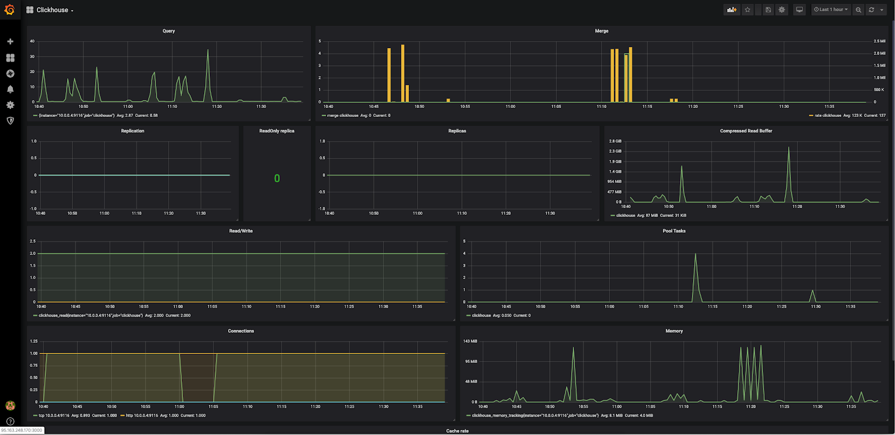

## Конфигурация оборудования

Чтобы выполнить данный сценарий мониторинга, установите и настройте серверы c использованием следующего оборудования:

- Prometheus 2.13 на ОС Ubuntu 18.04 LTS x86_64.
- Grafana 6.4.2 на ОС Ubuntu 18.04 LTS x86_64.
- Clickhouse 19.15.3.6 на ОС Ubuntu 18.04 LTS x86_64.

<warn>

**Внимание**

При использовании серверов и оборудования других версий некоторые шаги сценария могут отличаться от описанных ниже.

</warn>

## Схема работы

****

Для мониторинга параметров Clickhouse и сбора метрик в Prometheus используется экспортер, который опрашивает сервер Clickhouse и передает данные серверу Prometheus. Данные визуализируются в Grafana с помощью Dashboard.

## Установка clickhouse_exporter

1.  Выполните логин на сервере Clickhouse c правами суперпользователя.
2.  Поскольку exporter не существует в бинарном виде, установите пакеты для его сборки:

```
root@clickhouse:~# apt-get -y install git golang

```

3.  Создайте пользователя prometheus и группу prometheus, от имени которых вы будете запускать clickhouse_exporter:

```
root@clickhouse:~# groupadd --system prometheus
root@clickhouse:~# useradd --system -g prometheus -s /bin/false prometheus

```

4.  Скачайте exporter:

```
root@clickhouse:~# go get github.com/percona-lab/clickhouse_exporter

```

5.  Скомпилируйте exporter:

```
root@clickhouse:~# go build github.com/percona-lab/clickhouse_exporter

```

6.  Переместите exporter в папку /usr/local/bin:

```
root@clickhouse:~# mv ./clickhouse_exporter /usr/local/bin

```

7.  Измените владельца на prometheus:

```
root@clickhouse:~# chown -R prometheus:prometheus /usr/local/bin/clickhouse_exporter

```

8.  Создайте пользователя мониторинга на сервере Clickhouse. Для этого создайте файл /etc/clickhouse-server/users.d/web.xml со следующим содержимым:

```
<yandex>
    <users>
        <web>
            <password>web</password>
            <networks incl="networks" replace="replace">
                    <ip>::1</ip>
                <ip>127.0.0.1</ip>
                </networks>
            <profile>readonly</profile>
            <quota>default</quota>
            <allow_databases>
                <database>test</database>
            </allow_databases>
        </web>
    </users>
</yandex>

```

<info>

**Примечание**

Данный конфигурационный файл описывает пользователя Clickhouse с логином web и паролем web, с доступом только на чтение базы test и с разрешением на подключение только с localhost. Это необходимо для мониторинга.

</info>

9.  Запустите сервер Clickhouse:

```
root@clickhouse:~# systemctl restart clickhouse-server

```

10. Создайте сценарий запуска systemd сервиса clickhouse_exporter. Для этого создайте файл /etc/systemd/system/clickhouse_exporter.service со следующим содержимым:

    ```
    [Unit]
    Description=Prometheus Clickhouse Exporter
    After=network.target

    [Service]
    Type=simple
    Restart=always
    User=prometheus
    Group=prometheus
    Environment=CLICKHOUSE_USER=web
    Environment=CLICKHOUSE_PASSWORD=web
    ExecStart=/usr/local/bin/clickhouse_exporter
    [Install]
    WantedBy=multi-user.target

    ```

<warn>

**Внимание**

Адрес и порт (9116), используемые clickhouse_exporter, должны быть доступны с сервера Prometheus. Если порт недоступен, возможно, вам потребуется изменить настройки firewall на сервере с clickhouse_exporter.

</warn>

11. Запустите clickhouse_exporter:

```
root@clickhouse:~# systemctl daemon-reload
root@clickhouse:~# systemctl start clickhouse_exporter.service
root@clickhouse:~# systemctl enable clickhouse_exporter.service
Created symlink /etc/systemd/system/multi-user.target.wants/clickhouse_exporter.service → /etc/systemd/system/clickhouse_exporter.service.

```

12. Убедитесь, что сервис запустился:

```
root@clickhouse:~# systemctl status clickhouse_exporter.service
● clickhouse_exporter.service - Prometheus Clickhouse Exporter
   Loaded: loaded (/etc/systemd/system/clickhouse_exporter.service; disabled; vendor preset: enabled)
   Active: active (running) since Thu 2019-10-24 06:26:17 UTC; 8s ago
 Main PID: 10421 (clickhouse_expo)
    Tasks: 5 (limit: 1151)
   CGroup: /system.slice/clickhouse_exporter.service
           └─10421 /usr/local/bin/clickhouse_exporter

Oct 24 06:26:17 clickhouse systemd[1]: Started Prometheus Clickhouse Exporter.
Oct 24 06:26:17 clickhouse clickhouse_exporter[10421]: time="2019-10-24T06:26:17Z" level=info msg="Error scraping clickhouse: Error scraping clickhouse url http://localhost:812
Oct 24 06:26:17 clickhouse clickhouse_exporter[10421]: " file=exporter.go line=292
Oct 24 06:26:17 clickhouse clickhouse_exporter[10421]: time="2019-10-24T06:26:17Z" level=info msg="Starting Server: :9116" file="clickhouse_exporter.go" line=34

```

## Настройка сервера Prometheus для получения данных Clickhouse_exporter

1.  Выполните логин на ноду Prometheus.
2.  В файла /opt/prometheus/prometheus.yml в секцию scrape_configs добавьте секцию работы с clickhouse_exporter:

```
scrape_configs:
 - job_name: clickhouse
    static_configs:
      - targets: ['<IP-адрес и порт сервера clickhouse_exporter>']
        labels:
          alias: clickhouse

```

3.  Перезапустите сервис Prometheus:

```
root@prometheus:~# systemctl reload prometheus.service

```

## Настройка Grafana

Для визуализации полученных данных установите соответствующий Dashboard (например, [базовый](https://grafana.com/grafana/dashboards/882) ).

После установки и настройки получения данных с сервера Prometheus отобразится примерно следующее:

**[](https://hb.bizmrg.com/help-images/monitoring-with-prometheus/clickhouse-exporter/Grafana1.png)**

## Создание тестовой нагрузки

Чтобы посмотреть, как изменятся графики при нагрузке на сервер Clickhouse, создадим нагрузку .

Для этого:

1.  Установите соответствующий пакет:

```
root@clickhouse:~# apt-get -y install clickhouse-test

```

2.  Запустите тесты:

```
root@clickhouse:~# cd /usr/share/clickhouse-test/performance
root@clickhouse:/usr/share/clickhouse-test/performance# clickhouse performance-test --user default --password 'пароль пользователя default'
2019.10.24 08:03:11.856560 <Information> PerformanceTestSuite: Trying to find test scenario files in the current folder...
2019.10.24 08:03:11.857526 <Information> PerformanceTestSuite: Found 82 input files
2019.10.24 08:03:11.863838 <Information> PerformanceTestSuite: Preparing test configurations
2019.10.24 08:03:12.092390 <Information> PerformanceTestSuite: Test configurations prepared
2019.10.24 08:03:12.092833 <Information> PerformanceTestSuite: Config for test 'IPv4' parsed
2019.10.24 08:03:12.092992 <Information> PerformanceTestSuite: Preconditions for test 'IPv4' are fullfilled
2019.10.24 08:03:12.093084 <Information> PerformanceTestSuite: Preparing for run, have 15 create and fill queries
2019.10.24 08:03:12.093166 <Information> PerformanceTest: Executing create or fill query "CREATE TABLE IF NOT EXISTS ips_v4(ip String) ENGINE = MergeTree() PARTITION BY tuple() ORDER BY tuple()"
...

```

<info>

**Примечание**

Выполнение всех тестов занимает продолжительное время.

</info>

В результате тестовой нагрузки графики в Grafana изменяться:

**[](https://hb.bizmrg.com/help-images/monitoring-with-prometheus/clickhouse-exporter/Grafana_performance.png)**

## Удаление clickhouse_exporter

Чтобы удалить clickhouse_exporter:

1.  Удалите Dashboard из Grafana.
2.  Из конфигурационного файла prometheus удалите секцию - job_name: clickhouse.
3.  На сервере с clickhouse_exporter выполните команды:

```
root@clickhouse:~# systemctl stop clickhouse_exporter.service 
root@clickhouse:~# systemctl disable clickhouse_exporter.service 
Removed /etc/systemd/system/multi-user.target.wants/clickhouse_exporter.service.
root@clickhouse:~# rm /etc/systemd/system/clickhouse_exporter.service
root@clickhouse:~# systemctl daemon-reload
root@clickhouse:~# rm -f /usr/local/bin/clickhouse_exporter
root@clickhouse:~# userdel prometheus
root@clickhouse:~# groupdel prometheus

```

## **Обратная связь**

Возникли проблемы или остались вопросы? [Напишите нам, мы будем рады](https://mcs.mail.ru/help/contact-us)
