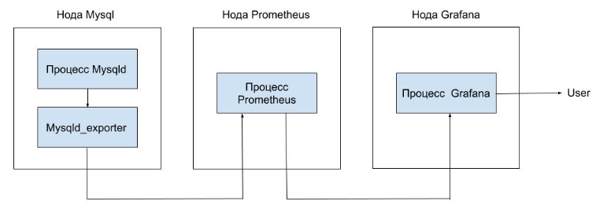
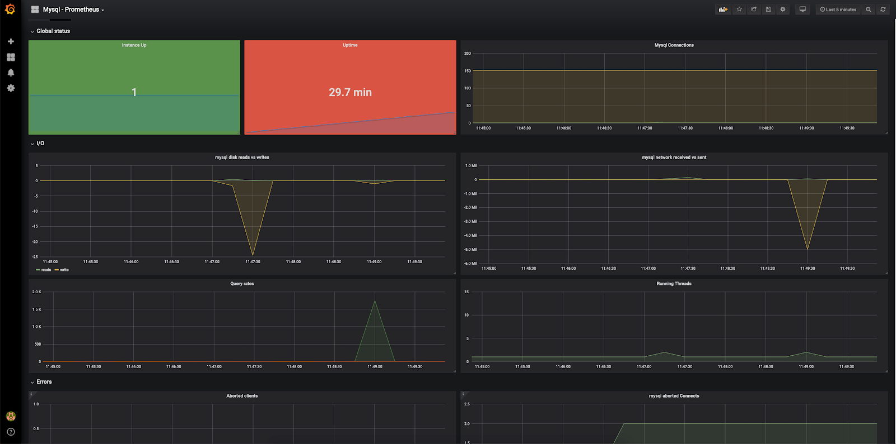

## Конфигурация оборудования

Чтобы выполнить данный сценарий мониторинга, установите и настройте серверы c использованием следующего оборудования:

- Prometheus 2.13 на ОС Ubuntu 18.04 LTS x86_64.
- Grafana 6.4.2 на ОС Ubuntu 18.04 LTS x86_64.
- MySQL 5.7 на ОС Ubuntu 18.04 LTS x86_64.

<warn>

**Внимание**

При использовании серверов и оборудования других версий некоторые шаги сценария могут отличаться от описанных ниже.

</warn>

## Схема работы



Для мониторинга параметров MySQL и сбора метрик в Prometheus используется экспортер, который опрашивает сервер MySQL и передает данные серверу Prometheus. Данные можно визуализировать в Grafana с помощью Dashboard.

## Установка mysqld_exporter

1.  Выполните логин на сервере MySQL с правами суперпользователя.
2.  Укажите актуальную версию экспортера:

```
root@mysql:~# export VERSION="<версия>"
```

<info>

**Примечание**

Актуальную версию mysqld_exporter можно [найти и скачать тут](https://prometheus.io/download/#mysqld_exporter).

</info>

3.  Создайте пользователя prometheus и группу prometheus, от имени которых вы будете запускать mysqld_exporter:

```
root@mysql:~# groupadd --system prometheus
root@mysql:~# useradd --system -g prometheus -s /bin/false prometheus
```

4.  Скачайте архив mysqld_exporter и распакуйте его в папку /tmp:

```
root@mysql:~# wget https://github.com/prometheus/mysqld_exporter/releases/download/v$VERSION/mysqld_exporter-$VERSION.linux-amd64.tar.gz -O - | tar -xzv -C /tmp
```

5.  Скопируйте содержимое распакованного архива в папку /usr/local/bin:

```
root@mysql:~# cp /tmp/mysqld_exporter-$VERSION.linux-amd64/mysqld_exporter /usr/local/bin
```

6.  Удалите содержимое распакованного архива из папки /tmp:

    ```
    root@mysql:~# rm -rf /tmp/mysqld_exporter-$VERSION.linux-amd64
    ```

7.  Измените владельца mysqld_exporter на prometheus:

    ```
    root@mysql:~# chown -R prometheus:prometheus /usr/local/bin/mysqld_exporter
    ```

8.  Для работы mysqld_exporter создайте пользователя mysql и дайте ему соответствующие права:

    ```
    mysql> CREATE USER 'exporter'@'localhost' IDENTIFIED BY '<пароль>' WITH MAX_USER_CONNECTIONS 3;
    Query OK, 0 rows affected (0.001 sec)

    mysql> GRANT PROCESS, REPLICATION CLIENT, SELECT ON *.* TO 'exporter'@'localhost';
    Query OK, 0 rows affected (0.000 sec)
    ```

<warn>

**Внимание**

Параметр WITH MAX_USER_CONNECTIONS 3 не поддерживается некоторыми версиями сервера MySQL. Если при создании пользователя вы получили ошибку, уберите этот параметр и выполните команду еще раз.

</warn>

9.  Создайте файл, содержащий правила доступа к mysqld_exporter, и добавьте туда настройки аутетинтификации пользователя mysql, созданного на предыдушем шаге:

```
root@mysql:~# cat <<EOF>>/usr/local/etc/.mysqld_exporter.cnf
[client]
user=exporter
password=<пароль>
EOF

root@mysql:~# chown prometheus:prometheus /usr/local/etc/.mysqld_exporter.cnf
```

10. Создайте сценарий запуска systemd сервиса mysqld_exporter. Для этого создайте файл /etc/systemd/system/mysqld_exporter.service со следующим содержимым:

```
[Unit]
Description=Prometheus MySQL Exporter
After=network.target

[Service]
Type=simple
Restart=always
User=prometheus
Group=prometheus
ExecStart=/usr/local/bin/mysqld_exporter \
--config.my-cnf /usr/local/etc/.mysqld_exporter.cnf \
--collect.global_status \
--collect.info_schema.innodb_metrics \
--collect.auto_increment.columns \
--collect.info_schema.processlist \
--collect.binlog_size \
--collect.info_schema.tablestats \
--collect.global_variables \
--collect.info_schema.query_response_time \
--collect.info_schema.userstats \
--collect.info_schema.tables \
--collect.perf_schema.tablelocks \
--collect.perf_schema.file_events \
--collect.perf_schema.eventswaits \
--collect.perf_schema.indexiowaits \
--collect.perf_schema.tableiowaits \
--collect.slave_status \
--web.listen-address=0.0.0.0:9104

[Install]
WantedBy=multi-user.target
```

<info>

**Примечания**

- Параметры, начинающиеся с collect, отвечают за метрики, которые будут собираться с сервера MySQL. Подробное описание собираемых метрик [см. тут](https://github.com/prometheus/mysqld_exporter).
- В параметре web.listen-address указываются адрес и порт, по которым будет доступен mysqld_exporter (0.0.0.0 означает любой адрес на сервере). Эти адрес и порт должны быть доступны с сервера Prometheus. Если порт недоступен, попробуйте изменить настройки межсетевого экрана на сервере с mysqld_exporter.

</info>

11. Запустите mysqld_exporter:

```
root@mysql:~# systemctl daemon-reload
root@mysql:~# systemctl start mysqld_exporter.service
root@mysql:~# systemctl enable mysqld_exporter.service
Created symlink /etc/systemd/system/multi-user.target.wants/mysqld_exporter.service → /etc/systemd/system/mysqld_exporter.service.
```

12. Убедитесь, что сервис запустился:

```
root@mysql:~# systemctl status mysqld_exporter.service
● mysqld_exporter.service - Prometheus MySQL Exporter
Loaded: loaded (/etc/systemd/system/mysqld_exporter.service; enabled; vendor preset: enabled)
Active: active (running) since Tue 2019-10-01 10:26:30 MSK; 40s ago
Main PID: 24617 (mysqld_exporter)
Tasks: 4 (limit: 2359)
Memory: 6.4M
CGroup: /system.slice/mysqld_exporter.service
└─24617 /usr/local/bin/mysqld_exporter/mysqld_exporter --config.my-cnf /usr/local/etc/.mysqld_exporter.cnf --collect.global_status --collect.info_schema.innodb_metrics --collect.auto_increment.columns --collect.info_schema.processlist --collect.binlog_size --colle

Oct 01 10:26:30 mysql mysqld_exporter[24617]: time="2019-10-01T10:26:30+03:00" level=info msg=" --collect.perf_schema.tableiowaits" source="mysqld_exporter.go:273"
Oct 01 10:26:30 mysql mysqld_exporter[24617]: time="2019-10-01T10:26:30+03:00" level=info msg=" --collect.perf_schema.indexiowaits" source="mysqld_exporter.go:273"
Oct 01 10:26:30 mysql mysqld_exporter[24617]: time="2019-10-01T10:26:30+03:00" level=info msg=" --collect.perf_schema.tablelocks" source="mysqld_exporter.go:273"
Oct 01 10:26:30 mysql mysqld_exporter[24617]: time="2019-10-01T10:26:30+03:00" level=info msg=" --collect.info_schema.tablestats" source="mysqld_exporter.go:273"
Oct 01 10:26:30 mysql mysqld_exporter[24617]: time="2019-10-01T10:26:30+03:00" level=info msg=" --collect.perf_schema.file_events" source="mysqld_exporter.go:273"
Oct 01 10:26:30 mysql mysqld_exporter[24617]: time="2019-10-01T10:26:30+03:00" level=info msg=" --collect.info_schema.userstats" source="mysqld_exporter.go:273"
Oct 01 10:26:30 mysql mysqld_exporter[24617]: time="2019-10-01T10:26:30+03:00" level=info msg=" --collect.info_schema.innodb_cmp" source="mysqld_exporter.go:273"
Oct 01 10:26:30 mysql mysqld_exporter[24617]: time="2019-10-01T10:26:30+03:00" level=info msg=" --collect.info_schema.innodb_cmpmem" source="mysqld_exporter.go:273"
Oct 01 10:26:30 mysql mysqld_exporter[24617]: time="2019-10-01T10:26:30+03:00" level=info msg=" --collect.info_schema.query_response_time" source="mysqld_exporter.go:273"
Oct 01 10:26:30 mysql mysqld_exporter[24617]: time="2019-10-01T10:26:30+03:00" level=info msg="Listening on 0.0.0.0:9104" source="mysqld_exporter.go:283"
```

## Настройка Prometheus для получения данных mysqld_exporter

1.  На ноде Prometheus выполните логин.
2.  В файле prometheus.yml для работы с mysqld_exporter:
    - В scrape_configs добавьте следующую секцию:

```
scrape_configs:
  - job_name: mysql
    static_configs:
      - targets: ['10.0.0.4:9104']
        labels:
          alias: mysql

```

- В секции targets впишите IP-адрес сервера MySQL, где установлен mysqld_exporter.

3.  Перезапустите сервис Prometheus:

```
root@prometheus:~# systemctl reload prometheus.service

```

## Настройка Grafana

Для визуализации полученных данных установите соответствующий Dashboard (например, [базовый Dashboard](https://grafana.com/grafana/dashboards/6239) или [Dashboard Percona](https://grafana.com/grafana/dashboards/7362)).

После установки и настройки получения данных с сервера Prometheus отобразится примерно следующее при использовании базового Dashboard:

****

И примерно следующее при использовании Dashboard Percona:


## Создание тестовой нагрузки

Чтобы посмотреть, как изменятся графики при нагрузке на сервер MySQL, воспользуйтесь утилитой sysbench (примеры использования см. [тут](https://ruhighload.com/%D0%A2%D0%B5%D1%81%D1%82%D0%B8%D1%80%D0%BE%D0%B2%D0%B0%D0%BD%D0%B8%D0%B5+%D0%BD%D0%B0%D0%B3%D1%80%D1%83%D0%B7%D0%BA%D0%B8+mysql) и [тут](https://github.com/akopytov/sysbench)).

Для этого:

1.  Установите утилиту sysbench:

```
root@mysql:~# apt-get install sysbench
```

2.  На ноде MySQL запустите генерацию тестового набора:

```
root@mysql:~# sysbench oltp_read_only --mysql-db=test --mysql-user=root --mysql-password --db-driver=mysql prepare
sysbench 1.0.17 (using bundled LuaJIT 2.1.0-beta2)
Creating table 'sbtest1'...
Inserting 10000 records into 'sbtest1'
Creating a secondary index on 'sbtest1'...
```

3.  Запустите тест:

```
root@mysql:~# sysbench oltp_read_only --mysql-db=test --mysql-user=root --mysql-password --db-driver=mysql run
sysbench 1.0.17 (using bundled LuaJIT 2.1.0-beta2)

Running the test with following options:
Number of threads: 1
Initializing random number generator from current time

Initializing worker threads...

Threads started!

SQL statistics:
queries performed:
read: 109340
write: 0
other: 15620
total: 124960
transactions: 7810 (780.72 per sec.)
queries: 124960 (12491.51 per sec.)
ignored errors: 0 (0.00 per sec.)
reconnects: 0 (0.00 per sec.)

General statistics:
total time: 10.0007s
total number of events: 7810

Latency (ms):
min: 0.59
avg: 1.28
max: 10.28
95th percentile: 2.26
sum: 9979.28

Threads fairness:
events (avg/stddev): 7810.0000/0.00
    execution time (avg/stddev):   9.9793/0.00
```

В результате тестовой нагрузки графики в Grafana изменятся:

****

## Удаление mysql_exporter

Чтобы удалить mysqld_exporter:

1.  Удалите Dashboard из Grafana.
2.  Из конфигурационного файла prometheus удалите секцию - job_name: mysql.
3.  На ноде с mysqld_exporter выполните следующие команды:

```
root@mysql:~# systemctl stop mysqld_exporter.service
root@mysql:~# systemctl disable mysqld_exporter.service
Removed /etc/systemd/system/multi-user.target.wants/mysqld_exporter.service.
root@mysql:~# rm /etc/systemd/system/mysqld_exporter.service
root@mysql:~# systemctl daemon-reload
root@mysql:~# rm -f /usr/local/bin/mysqld_exporter /usr/local/etc/.mysqld_exporter.cnf
root@mysql:~# userdel prometheus
root@mysql:~# groupdel prometheus
```

4.  На ноде mysql в консоли mysql удалите пользователя:

```
mysql> drop user 'exporter'@'localhost';
Query OK, 0 rows affected (0.020 sec)

mysql> flush privileges;
Query OK, 0 rows affected (0.007 sec)
```
