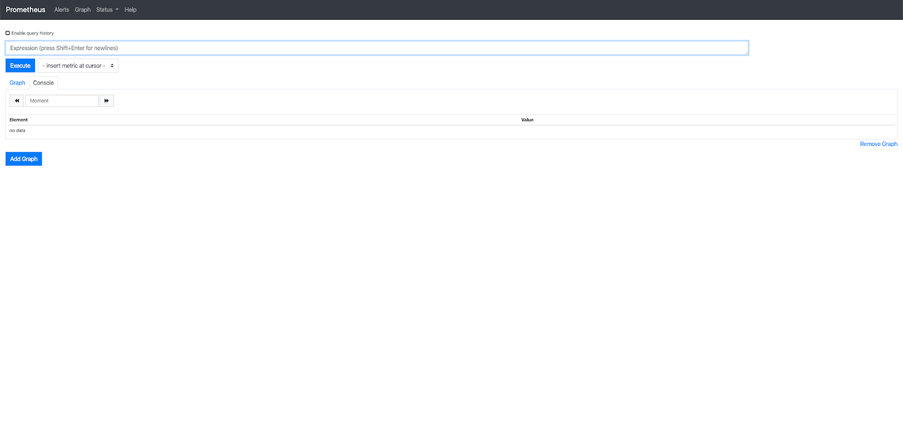
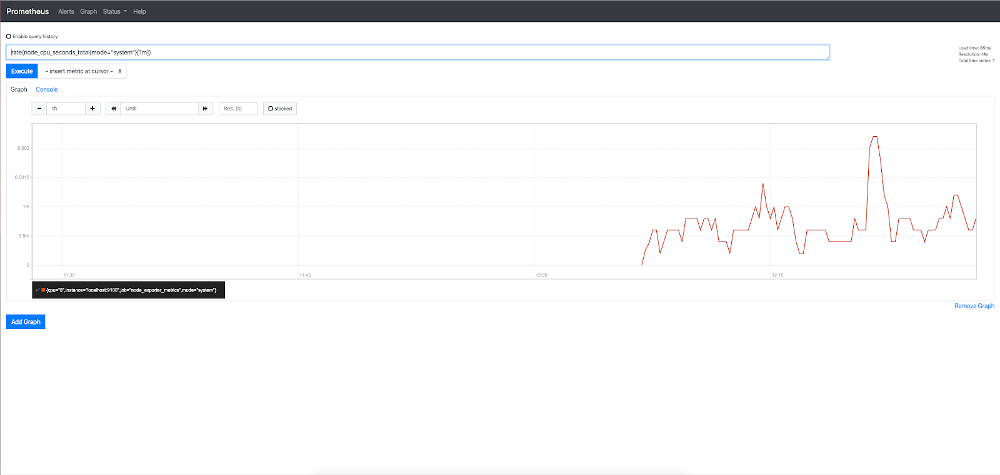
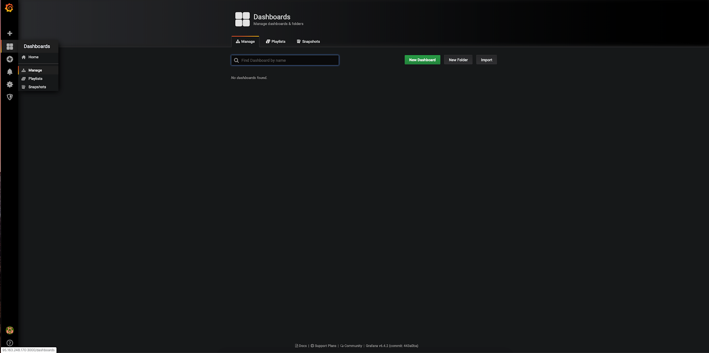

## Конфигурация оборудования

Установленный и настроенный сервер ОС Ubuntu 18.04 LTS x86_64.

<warn>

**Внимание**

При использовании серверов и оборудования других версий некоторые шаги сценария могут отличаться от описанных ниже.

</warn>

## Схема работы


## Описание компонентов

**Prometheus** - центральный сервер, предназначенный для сбора и хранения данных. Данные постоянно изменяются во времени (например, уровень заполненности диска, трафик через сетевой интерфейс, время отклика сайта). Элементы данных называются метриками. Сервер Prometheus с заданной периодичностью считывает метрики и помещает полученные данные в Time Series DB. Time Series DB - это разновидность баз данных, предназначенная для хранения временных рядов (значений с привязкой ко времени). Кроме того, Prometheus предоставляет интерфейс для выполнения запросов и визуализации полученных данных. Язык запросов Prometheus называется PromQL. Prometheus работает по модели Pull, то есть он сам опрашивает endpoints с целью получения данных.

**Exporters** — процессы, обеспечивающие сбор и их передачу серверу Prometheus. Существует много разных exporters, например:

- Node_exporter - сбор системных метрик (процессор, память, и т.д.).
- Mysqld_exporter - сбор метрик работы сервера MySQL.
- Postgres_exporter - сбор метрик работы сервера PostgreSQL.

После запуска exporter начинает сбор соответствующих метрик и ожидает запросов от сервера Prometheus по заданному порту. Данных передаются в формате http.

**Grafana** — удобный frontend для визуализации накопленных данных, может использоваться для работы с данными сервера Prometheus, предоставляет различные преднастроенные Dashboard для отображения данных.

Помимо функций сбора, анализа и визуализации данных, Prometheus и Grafana поддерживают настраиваемые оповещения. В Grafana этот механизм является встроенным, в Prometheus он реализуется отдельным компонентом (Alert_manager). Подробнее см. [тут](https://prometheus.io/docs/alerting/overview/).

## Установка Prometheus

1.  Выполните логин на сервере Prometheus c правами суперпользователя.
2.  Укажите актуальную версию Prometheus:

```
root@ubuntu-basic-1-1-10gb:~# export VERSION="<версия>"
```

<info>

**Примечание**

Актуальную версию Prometheus можно [найти и скачать тут](https://prometheus.io/download/).[](https://prometheus.io/download/#mysqld_exporter)

</info>

3.  Создайте пользователя prometheus и группу prometheus, от имени которых вы будете запускать prometheus:

```
root@ubuntu-basic-1-1-10gb:~#  groupadd --system prometheus
root@ubuntu-basic-1-1-10gb:~# useradd --system -g prometheus -s /bin/false prometheus
```

4.  Установите wget и tar:

```
root@ubuntu-basic-1-1-10gb:~# apt install -y wget tar
```

5.  Скачайте архив prometheus и распакуйте его в папку /tmp:

```
root@ubuntu-basic-1-1-10gb:~# wget https://github.com/prometheus/prometheus/releases/download/v$VERSION/prometheus-$VERSION.linux-amd64.tar.gz -O - | tar -xzv -C /tmp
```

6.  Создайте директорию для конфигурационного файла:

```
root@ubuntu-basic-1-1-10gb:~# mkdir /etc/prometheus
```

7.  Создайте директорию для данных:

```
root@ubuntu-basic-1-1-10gb:~# mkdir /var/lib/prometheus
```

8.  Скопируйте содержимое распакованного архива:

```
root@ubuntu-basic-1-1-10gb:~# cp /tmp/prometheus-$VERSION.linux-amd64/prometheus /usr/local/bin
root@ubuntu-basic-1-1-10gb:~# cp /tmp/prometheus-$VERSION.linux-amd64/promtool /usr/local/bin
root@ubuntu-basic-1-1-10gb:~# cp /tmp/prometheus-$VERSION.linux-amd64/tsdb /usr/local/bin
root@ubuntu-basic-1-1-10gb:~# cp -r /tmp/prometheus-$VERSION.linux-amd64/console\* /etc/prometheus
```

9.  Удалите содержимое распакованного архива из папки /tmp:

```
root@ubuntu-basic-1-1-10gb:~# rm -rf /tmp/prometheus-$VERSION.linux-amd64
```

10. Создайте конфигурационный файл /etc/prometheus/prometheus.yml со следующим содержимым:

```
global:
  scrape_interval:     10s
scrape_configs:
  - job_name: 'prometheus'
    static_configs:
    - targets: ['localhost:9090']
```

В секции global указывается период опроса данных, в секции scrape_configs подключается мониторинг ресурсов Prometheus.

11. Измените владельца созданных файлов:

```
root@ubuntu-basic-1-1-10gb:~# chown -R prometheus:prometheus /var/lib/prometheus /etc/prometheus
root@ubuntu-basic-1-1-10gb:~# chown prometheus:prometheus /usr/local/bin/prometheus /usr/local/bin/promtool /usr/local/bin/tsdb
```

12. Создайте сценарий запуска systemd сервиса Prometheus. Для этого создайте файл /etc/systemd/system/prometheus.service со следующим содержимым:

```
[Unit]
Description=Prometheus
Wants=network-online.target
After=network-online.target

[Service]
User=prometheus
Group=prometheus
ExecStart=/usr/local/bin/prometheus \
    --config.file /etc/prometheus/prometheus.yml \
    --storage.tsdb.path /var/lib/prometheus \
    --web.console.templates=/etc/prometheus/consoles \
    --web.console.libraries=/etc/prometheus/console_libraries
ExecReload=/bin/kill -HUP $MAINPID
[Install]
WantedBy=default.target
```

13. Запустите Prometheus:

```
root@ubuntu-basic-1-1-10gb:~# systemctl daemon-reload
root@ubuntu-basic-1-1-10gb:~# systemctl start prometheus.service
root@ubuntu-basic-1-1-10gb:~# systemctl enable prometheus.service
Created symlink /etc/systemd/system/default.target.wants/prometheus.service → /etc/systemd/system/prometheus.service.
```

14. Убедитесь, что сервис запустился:

```
root@ubuntu-basic-1-1-10gb:~# systemctl status prometheus.service
● prometheus.service - Prometheus
   Loaded: loaded (/etc/systemd/system/prometheus.service; enabled; vendor preset: enabled)
   Active: active (running) since Wed 2019-10-16 07:26:45 UTC; 1s ago
 Main PID: 3980 (prometheus)
    Tasks: 6 (limit: 1151)
   CGroup: /system.slice/prometheus.service
           └─3980 /usr/local/bin/prometheus --config.file /etc/prometheus/prometheus.yml --storage.tsdb.path /var/lib/prometheus --web.console.templates=/etc/prometheus/consoles --web.console.libraries=/etc/prometheus/console_libraries

Oct 16 07:26:46 ubuntu-basic-1-1-10gb prometheus[3980]: level=info ts=2019-10-16T07:26:46.082Z caller=main.go:336 vm_limits="(soft=unlimited, hard=unlimited)"
Oct 16 07:26:46 ubuntu-basic-1-1-10gb prometheus[3980]: level=info ts=2019-10-16T07:26:46.089Z caller=main.go:657 msg="Starting TSDB ..."
Oct 16 07:26:46 ubuntu-basic-1-1-10gb prometheus[3980]: level=info ts=2019-10-16T07:26:46.099Z caller=web.go:450 component=web msg="Start listening for connections" address=0.0.0.0:9090
Oct 16 07:26:46 ubuntu-basic-1-1-10gb prometheus[3980]: level=info ts=2019-10-16T07:26:46.104Z caller=head.go:512 component=tsdb msg="replaying WAL, this may take awhile"
Oct 16 07:26:46 ubuntu-basic-1-1-10gb prometheus[3980]: level=info ts=2019-10-16T07:26:46.107Z caller=head.go:560 component=tsdb msg="WAL segment loaded" segment=0 maxSegment=0
Oct 16 07:26:46 ubuntu-basic-1-1-10gb prometheus[3980]: level=info ts=2019-10-16T07:26:46.110Z caller=main.go:672 fs_type=EXT4_SUPER_MAGIC
Oct 16 07:26:46 ubuntu-basic-1-1-10gb prometheus[3980]: level=info ts=2019-10-16T07:26:46.110Z caller=main.go:673 msg="TSDB started"
Oct 16 07:26:46 ubuntu-basic-1-1-10gb prometheus[3980]: level=info ts=2019-10-16T07:26:46.110Z caller=main.go:743 msg="Loading configuration file" filename=/opt/prometheus/prometheus.yml
Oct 16 07:26:46 ubuntu-basic-1-1-10gb prometheus[3980]: level=info ts=2019-10-16T07:26:46.150Z caller=main.go:771 msg="Completed loading of configuration file" filename=/etc/prometheus/prometheus.yml
Oct 16 07:26:46 ubuntu-basic-1-1-10gb prometheus[3980]: level=info ts=2019-10-16T07:26:46.150Z caller=main.go:626 msg="Server is ready to receive web requests."
```

15. Войдите в веб-консоль Prometheus по порту 9090:



## Установка Node_exporter

1.  Укажите актуальную версию Node_exporter:

```
root@ubuntu-basic-1-1-10gb:~# export VERSION="0.18.1"
```

<info>

**Примечание**

Актуальную версию node_exporter можно [найти и скачать тут](https://prometheus.io/download/) [](https://prometheus.io/download/#mysqld_exporter).

</info>

2.  Скачайте архив mysqld_exporter и распакуйте его в папку /tmp:

```
root@ubuntu-basic-1-1-10gb:~# wget  https://github.com/prometheus/node_exporter/releases/download/v$VERSION/node_exporter-$VERSION.linux-amd64.tar.gz -O - | tar -xzv -C /tmp
```

3.  Скопируйте содержимое распакованного архива в папку /usr/local/bin:

```
root@ubuntu-basic-1-1-10gb:~# cp  /tmp/node_exporter-$VERSION.linux-amd64/node_exporter /usr/local/bin
```

4.  Измените владельца созданных файлов:

```
root@ubuntu-basic-1-1-10gb:~# chown -R prometheus:prometheus /usr/local/bin/node_exporter
```

4.  Создайте сценарий запуска systemd сервиса node_exporter. Для этого создайте файл /etc/systemd/system/node_exporter.service со следующим содержимым:

```
[Unit]
Description=Prometheus Node Exporter
After=network.target

[Service]
Type=simple
Restart=always
User=prometheus
Group=prometheus
ExecStart=/usr/local/bin/node_exporter

[Install]
WantedBy=multi-user.target
```

5.  Запустите node_exporter:

```
root@ubuntu-basic-1-1-10gb:~# systemctl daemon-reload
root@ubuntu-basic-1-1-10gb:~# systemctl start node_exporter.service
root@ubuntu-basic-1-1-10gb:~# systemctl enable node_exporter.service
Created symlink /etc/systemd/system/multi-user.target.wants/node_exporter.service → /etc/systemd/system/node_exporter.service.
```

6.  Убедитесь, что сервис запустился:

```
root@ubuntu-basic-1-1-10gb:~# systemctl status node_exporter.service
● node_exporter.service - Prometheus Node Exporter
Loaded: loaded (/etc/systemd/system/node_exporter.service; enabled; vendor preset: enabled)
Active: active (running) since Wed 2019-10-16 07:45:29 UTC; 2min 50s ago
Main PID: 4166 (node_exporter)
Tasks: 3 (limit: 1151)
CGroup: /system.slice/node_exporter.service
└─4166 /usr/local/bin/node_exporter

Oct 16 07:45:29 ubuntu-basic-1-1-10gb node_exporter[4166]: time="2019-10-16T07:45:29Z" level=info msg=" - sockstat" source="node_exporter.go:104"
Oct 16 07:45:29 ubuntu-basic-1-1-10gb node_exporter[4166]: time="2019-10-16T07:45:29Z" level=info msg=" - stat" source="node_exporter.go:104"
Oct 16 07:45:29 ubuntu-basic-1-1-10gb node_exporter[4166]: time="2019-10-16T07:45:29Z" level=info msg=" - textfile" source="node_exporter.go:104"
Oct 16 07:45:29 ubuntu-basic-1-1-10gb node_exporter[4166]: time="2019-10-16T07:45:29Z" level=info msg=" - time" source="node_exporter.go:104"
Oct 16 07:45:29 ubuntu-basic-1-1-10gb node_exporter[4166]: time="2019-10-16T07:45:29Z" level=info msg=" - timex" source="node_exporter.go:104"
Oct 16 07:45:29 ubuntu-basic-1-1-10gb node_exporter[4166]: time="2019-10-16T07:45:29Z" level=info msg=" - uname" source="node_exporter.go:104"
Oct 16 07:45:29 ubuntu-basic-1-1-10gb node_exporter[4166]: time="2019-10-16T07:45:29Z" level=info msg=" - vmstat" source="node_exporter.go:104"
Oct 16 07:45:29 ubuntu-basic-1-1-10gb node_exporter[4166]: time="2019-10-16T07:45:29Z" level=info msg=" - xfs" source="node_exporter.go:104"
Oct 16 07:45:29 ubuntu-basic-1-1-10gb node_exporter[4166]: time="2019-10-16T07:45:29Z" level=info msg=" - zfs" source="node_exporter.go:104"
Oct 16 07:45:29 ubuntu-basic-1-1-10gb node_exporter[4166]: time="2019-10-16T07:45:29Z" level=info msg="Listening on :9100" source="node_exporter.go:170"
```

## Настройка сервера Prometheus для получения данных Node_exporter

1.  В файла /opt/prometheus/prometheus.yml в секцию scrape_configs добавьте секцию работы с node_exporter:

```
scrape_configs:
- job_name: 'node'
scrape_interval: 10s
static_configs:
      - targets: ['localhost:9100']
```

<info>

**Примечание**

Секция scrape_configs предназначена для описания целей и средств мониторинга. Подробно о настройках см. в [документации](https://prometheus.io/docs/prometheus/latest/configuration/configuration/#scrape_config).

</info>

В примере выше мы настроили сбор данных по адресу **localhost** и порту 9100, на котором запущен node_exporter, присвоили задаче имя node и указали, что сбор данных должен выполняться каждые 10 секунд.

Если вы создали базу с доступом в интернет, вместо **localhost** укажите IP-адрес базы, например:


[](https://prometheus.io/docs/prometheus/latest/configuration/configuration/#scrape_config)

2.  Перезапустите сервиc Prometheus:

```
root@ubuntu-basic-1-1-10gb:~# systemctl reload prometheus.service
```

3.  Подождите несколько минут, чтобы накопились данные.

4.  Для просмотра графика средней загрузки CPU в браузере перейдите по ссылке:

```
http://<IP-адрес вашего сервера PROMETHEUS>:9090/graph?g0.range_input=1h&g0.expr=rate(node_cpu_seconds_total{mode="system"}[1m])&g0.tab=1
```



5.  Для просмотра дискового пространства, доступного пользователям, в браузере перейдите по ссылке:

```
http://<IP-адрес вашего сервера PROMETHEUS>:9090/graph?g0.range_input=1h&g0.expr=node_filesystem_avail_bytes&g0.tab=1
```


6.  Для просмотра среднего входящего трафика через сетевые интерфейсы (байт/секунда) в браузере перейдите по ссылке:

```
http://<IP-адрес вашего сервера PROMETHEUS>:9090/graph?g0.range_input=1h&g0.expr=rate(node_network_receive_bytes_total[1m])&g0.tab=1
```

7.  Для просмотра типовых консолей Prometheus (наборов графиков) в браузере перейдите по ссылке:

```
http://<IP-адрес вашего сервера PROMETHEUS>:9090/consoles/index.html.example
```

Вы увидите две ссылки - Node и Prometheus. Пример графиков консоли Node:


## Установка Grafana

Установим Grafana из репозитория:

1.  Установите необходимое дополнительное ПО:

```
root@ubuntu-basic-1-1-10gb:~# apt-get install -y software-properties-common wget apt-transport-https
```

2.  Добавьте ключ репозитория Grafana:

```
root@ubuntu-basic-1-1-10gb:~# wget -q -O - https://packages.grafana.com/gpg.key | apt-key add -
```

3.  Добавьте репозиторий Grafana:

```
root@ubuntu-basic-1-1-10gb:~# add-apt-repository "deb https://packages.grafana.com/oss/deb stable main"
```

4.  Обновите репозитории и установите Grafana:

```
root@ubuntu-basic-1-1-10gb:~# apt-get update && apt-get -y install grafana
```

5.  Создайте файл /etc/grafana/provisioning/datasources/prometheus.yml со следующим содержимым:

```
apiVersion: 1
datasources:
- name: Prometheus
type: prometheus
access: proxy
url: http://localhost:9090
```

<info>

**Примечание**

Provisioning - новая возможность Grafana по преднастройке сервера. В данном случае мы настраиваем источник данных Prometheus в процессе установки, чтобы не делать это потом в веб-интерфейсе Grafana.

</info>

6.  Измените владельца файла /etc/grafana/provisioning/datasources/prometheus.yml:

```
root@ubuntu-basic-1-1-10gb:~# chown grafana:grafana /etc/grafana/provisioning/datasources/prometheus.yml
```

<info>

**Примечание**

Мы подключили Prometheus к Grafana. Если Prometheus физически расположен на другом сервере, измените localhost на IP-адрес сервера Prometheus.

</info>

7.  Запустите Grafana:

```
root@ubuntu-basic-1-1-10gb:~# systemctl start grafana-server.service
root@ubuntu-basic-1-1-10gb:~# systemctl enable grafana-server.service
Synchronizing state of grafana-server.service with SysV service script with /lib/systemd/systemd-sysv-install.
Executing: /lib/systemd/systemd-sysv-install enable grafana-server
Created symlink /etc/systemd/system/multi-user.target.wants/grafana-server.service → /usr/lib/systemd/system/grafana-server.service.
```

8.  Убедитесь в работоспособности Grafana:

```
root@ubuntu-basic-1-1-10gb:~# systemctl status grafana-server.service

● grafana-server.service - Grafana instance
Loaded: loaded (/usr/lib/systemd/system/grafana-server.service; enabled; vendor preset: enabled)
Active: active (running) since Wed 2019-10-16 13:26:25 UTC; 9min ago
Docs: http://docs.grafana.org
Main PID: 6958 (grafana-server)
Tasks: 12 (limit: 1151)
CGroup: /system.slice/grafana-server.service
└─6958 /usr/sbin/grafana-server --config=/etc/grafana/grafana.ini --pidfile=/var/run/grafana/grafana-server.pid --packaging=deb cfg:default.paths.logs=/var/log/grafana cfg:default.paths.data=/var/lib/grafa

Oct 16 13:26:25 ubuntu-basic-1-1-10gb grafana-server[6958]: t=2019-10-16T13:26:25+0000 lvl=info msg="Initializing provisioningServiceImpl" logger=server
Oct 16 13:26:25 ubuntu-basic-1-1-10gb grafana-server[6958]: t=2019-10-16T13:26:25+0000 lvl=info msg="inserting datasource from configuration " logger=provisioning.datasources name=Prometheus
Oct 16 13:26:26 ubuntu-basic-1-1-10gb grafana-server[6958]: t=2019-10-16T13:26:26+0000 lvl=info msg="Backend rendering via phantomJS" logger=rendering
Oct 16 13:26:26 ubuntu-basic-1-1-10gb grafana-server[6958]: t=2019-10-16T13:26:26+0000 lvl=warn msg="phantomJS is deprecated and will be removed in a future release. You should consider migrating from phantomJS to gr
Oct 16 13:26:26 ubuntu-basic-1-1-10gb grafana-server[6958]: t=2019-10-16T13:26:26+0000 lvl=info msg="Initializing Stream Manager"
Oct 16 13:26:26 ubuntu-basic-1-1-10gb grafana-server[6958]: t=2019-10-16T13:26:26+0000 lvl=info msg="HTTP Server Listen" logger=http.server address=0.0.0.0:3000 protocol=http subUrl= socket=
Oct 16 13:27:31 ubuntu-basic-1-1-10gb grafana-server[6958]: t=2019-10-16T13:27:31+0000 lvl=info msg="Request Completed" logger=context userId=0 orgId=0 uname= method=GET path=/ status=302 remote_addr=93.171.201.25 ti
Oct 16 13:27:46 ubuntu-basic-1-1-10gb grafana-server[6958]: t=2019-10-16T13:27:46+0000 lvl=info msg="Successful Login" logger=http.server User=admin@localhost
Oct 16 13:28:23 ubuntu-basic-1-1-10gb grafana-server[6958]: 2019/10/16 13:28:23 http: proxy error: unsupported protocol scheme ""
Oct 16 13:28:23 ubuntu-basic-1-1-10gb grafana-server[6958]: t=2019-10-16T13:28:23+0000 lvl=info msg="Request Completed" logger=context userId=1 orgId=1 uname=admin method=GET path=/api/datasources/proxy/2/api/v1/quer

```

После запуска Grafana будет доступна по протоколу http, порт 3000.  Логин и пароль для первого входа - admin/admin. При первом входе пароль нужно будет сменить.

9.  Перейдите в веб-интерфейсе Grafana по пути Configuration/Data Sources и убедитесь, что Datasource Prometheus активен:

****

10. Нажмите Datasource Prometheus, затем Test:

****

11. Установите Dashboard для визуализации Node Exporter ([готовые Dashboard](https://grafana.com/grafana/dashboards), [популярный Dashboard для Node Exporter](https://grafana.com/grafana/dashboards/1860)). Для установки в веб-интерфейсе перейдите в Dashboards/Manage:



12. Нажмите Import и в поле Grafana.com Dashboard введите [https://grafana.com/grafana/dashboards/1860:](https://grafana.com/grafana/dashboards/1860:)

****

Нажмите Load, выберите Datasource Prometheus и нажмите Import:

****

13. Откроется Dashboard:


## Создание тестовой нагрузки

Чтобы посмотреть, как изменятся графики при нагрузке на сервер, воспользуйтесь утилитой sysbench.

Для этого:

1.  Установите утилиту sysbench:

```
root@ubuntu-basic-1-1-10gb:~# apt -y install sysbench
```

2.  Запустите серию тестов:

```
root@ubuntu-basic-1-1-10gb:~# sysbench cpu  --cpu-max-prime=2000000 --time=60 run

root@ubuntu-basic-1-1-10gb:~# sysbench memory --cpu-max-prime=2000000 --time=60 run

root@ubuntu-basic-1-1-10gb:~# sysbench fileio --file-test-mode=rndrw --time=60 prepare
root@ubuntu-basic-1-1-10gb:~# sysbench fileio --file-test-mode=rndrw --time=60 run

root@ubuntu-basic-1-1-10gb:~# sysbench threads --time=60 run

root@ubuntu-basic-1-1-10gb:~# sysbench mutex --time=60 run
```

В результате тестовой нагрузки графики в Grafana изменяться:

****

## Удаление

Чтобы удалить развернутые инструменты:

1.  Удалите Grafana:

```
root@ubuntu-basic-1-1-10gb:~# systemctl stop grafana-server.service
root@ubuntu-basic-1-1-10gb:~# systemctl disable grafana-server.service
root@ubuntu-basic-1-1-10gb:~# apt -y remove grafana
```

2.  Удалите Node_exporter:

```
root@ubuntu-basic-1-1-10gb:~# systemctl stop node_exporter.service
root@ubuntu-basic-1-1-10gb:~# systemctl disable node_exporter.service 
root@ubuntu-basic-1-1-10gb:~# rm /etc/systemd/system/node_exporter.service
root@ubuntu-basic-1-1-10gb:~# rm -rf /opt/node_exporter
```

3.  Удалите Prometheus:

```
root@ubuntu-basic-1-1-10gb:~# systemctl stop prometheus.service
root@ubuntu-basic-1-1-10gb:~# systemctl disable prometheus.service
root@ubuntu-basic-1-1-10gb:~# rm /etc/systemd/system/prometheus.service 
root@ubuntu-basic-1-1-10gb:~# rm -rf /opt/prometheus
```

4.  Удалите пользователя и группу:

```
root@ubuntu-basic-1-1-10gb:~# userdel prometheus
root@ubuntu-basic-1-1-10gb:~# groupdel prometheus
```

## **Обратная связь**

Возникли проблемы или остались вопросы? [Напишите нам, мы будем рады вам помочь](https://mcs.mail.ru/help/contact-us).
