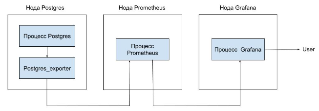
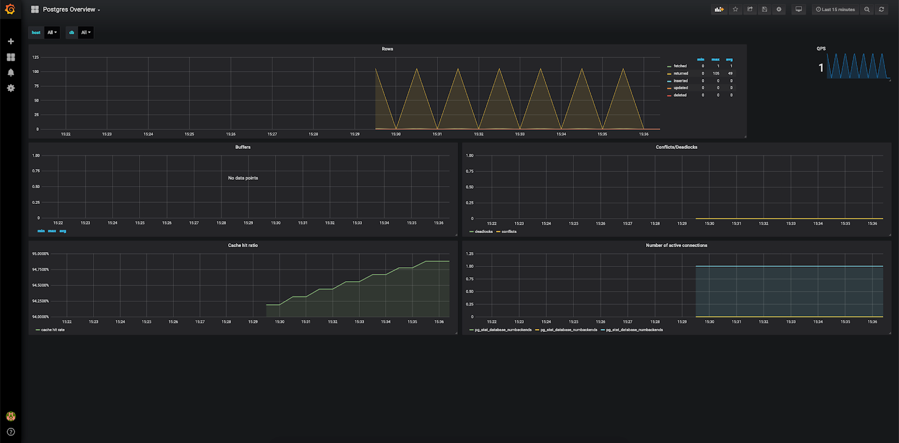
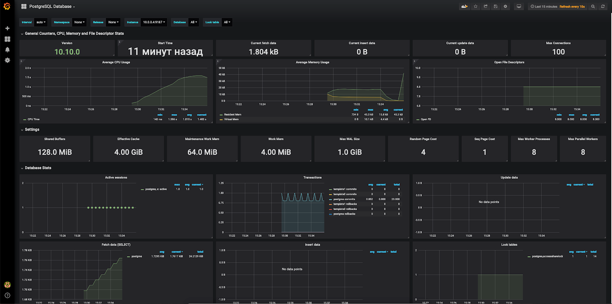
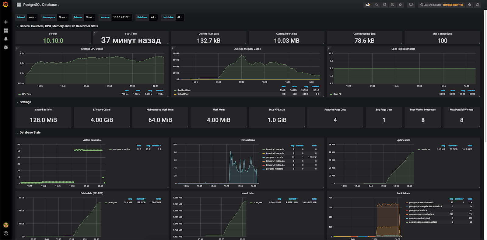

## Конфигурация оборудования

Чтобы выполнить данный сценарий мониторинга, установите и настройте серверы c использованием следующего оборудования:

- Prometheus 2.13 на ОС Ubuntu 18.04 LTS x86_64.
- Grafana 6.4.2 на ОС Ubuntu 18.04 LTS x86_64.
- PostgreSQL 10 на ОС Ubuntu 18.04 LTS x86_64.

**Внимание**

При использовании серверов и оборудования других версий некоторые шаги сценария могут отличаться, от описанных ниже.

## Схема работы



Для мониторинга параметров PostreSQL и сбора метрик в Prometheus используется экспортер, который опрашивает сервер PostgreSQL и передает данные серверу Prometheus. Данные можно визуализировать в Grafana с помощью Dashboard.

## Установка postgres_exporter

1.  Выполните логин на сервере PostgreSQL с правами суперпользователя.
2.  Укажите актуальную версию экспортера:

```
root@postgresql:~# export VERSION="<версия>"
```

**Примечание**

Актуальную версию postgres_exporter можно [найти и скачать тут](https://github.com/wrouesnel/postgres_exporter/releases).

3.  Скачайте архив postgres_exporter и распакуйте его в папку /tmp:

```
root@postgreql:~# wget https://github.com/wrouesnel/postgres_exporter/releases/download/v$VERSION/postgres_exporter_v$VERSION_linux-amd64.tar.gz -O - | tar -xzv -C /tmp
```

4.  Скопируйте содержимое распакованного архива в папку /usr/local/bin:
    ```
    root@postgresql:~# cp /tmp/postgres_exporter_v$VERSION_linux-amd64/postgres_exporter /usr/local/bin
    ```
5.  Удалите содержимое распакованного архива из папки /tmp:
    ```
    root@postgresql:~# rm -rf /tmp/postgres_exporter_v$VERSION_linux-amd64
    ```
6.  Измените владельца postgres_exporter на postgres:

```
root@postgresql:~# chown -R postgres:postgres /usr/local/bin/postgres_exporter
```

7.  Создайте сценарий запуска systemd сервиса postgres_exporter. Для этого создайте файл /etc/systemd/system/postgres_exporter.service со следующим содержимым:

```
[Unit]
Description=Prometheus PostgreSQL Exporter
After=network.target

[Service]
Type=simple
Restart=always
User=postgres
Group=postgres
Environment=DATA_SOURCE_NAME="user=postgres host=/var/run/postgresql/ sslmode=disable"
ExecStart=/usr/local/bin/postgres_exporter
[Install]
WantedBy=multi-user.target
```

**Примечание**

Параметр Environment описывает передаваемые параметры доступа к серверу PostgreSQL. Если вы используете нестандартную инсталляцию PostgreSQL либо сервер и exporter расположены на разных нодах, [настройте этот параметр](https://godoc.org/github.com/lib/pq).

8.  Запустите postgres_exporter:

```
root@postgresql:~# systemctl daemon-reload
root@postgresql:~# systemctl start postgres_exporter.service
root@postgresql:~# systemctl enable postgres_exporter.service
Created symlink /etc/systemd/system/multi-user.target.wants/postgres_exporter.service → /etc/systemd/system/postgres_exporter.service.
```

9.  Убедитесь, что сервис запустился:

```
root@postgresql:~# systemctl status postgres_exporter.service 
● postgres_exporter.service - Prometheus PostgreSQL Exporter
   Loaded: loaded (/etc/systemd/system/postgres_exporter.service; disabled; vendor preset: enabled)
   Active: active (running) since Mon 2019-10-07 09:01:26 MSK; 6min ago
 Main PID: 4144 (postgres_export)
    Tasks: 4 (limit: 2359)
   Memory: 4.4M
   CGroup: /system.slice/postgres_exporter.service
           └─4144 /usr/local/bin/postgres_exporter

Oct 07 09:01:26 postgresql systemd[1]: Started Prometheus PostgreSQL Exporter.
Oct 07 09:01:26 postgresql postgres_exporter[4144]: time="2019-10-07T09:01:26+03:00" level=info msg="Established new database connection to \"/var/run/postgresql/:5432\"." source="postgres_exporter.go:777"
Oct 07 09:01:26 postgresql postgres_exporter[4144]: time="2019-10-07T09:01:26+03:00" level=info msg="Semantic Version Changed on \"/var/run/postgresql/:5432\": 0.0.0 -> 11.5.0" source="postgres_exporter.go:1229
Oct 07 09:01:26 postgresql postgres_exporter[4144]: time="2019-10-07T09:01:26+03:00" level=info msg="Starting Server: :9187" source="postgres_exporter.go:1437"
```

**Внимание**

По умолчанию postgres_exporter запускается на порту 9187, который должен быть доступен серверу Prometheus. При необходимости настройте межсетевой экран соответствующим образом.

## Настройка Prometheus для получения данных postgres_exporter

1.  На ноде Prometheus выполните логин.
2.  В файле prometheus.yml для работы с postgres_exporter:

- В scrape_configs добавьте следующую секцию:

```
scrape_configs:
  - job_name: postgresql
    static_configs:
      - targets: ['10.0.0.4:9187']
        labels:
          alias: postgres

```

- В секции targets впишите IP-адрес сервера postgres_exporter.

3.  Перезапустите сервиc Prometheus:

```
root@prometheus:~# systemctl reload prometheus.service

```

## Настройка Grafana

Для визуализации полученных данных установите соответствующий Dashboard (например, [Dashboard 1](https://grafana.com/grafana/dashboards/455) или [Dashboard 2](https://grafana.com/grafana/dashboards/9628) ).

После установки и настройки получения данных с сервера Prometheus отобразится примерно следующее при использовании Dashboard 1:



И примерно следующее при использовании Dashboard 2:

****

## Создание тестовой нагрузки

Чтобы посмотреть, как изменятся графики при нагрузке на сервер PostgreSQL, воспользуйтесь утилитой pgbench, которая обычно входит в состав дистрибутива PostgreSQL (примеры использования см. [тут](https://wiki.postgresql.org/wiki/Pgbench) и [тут](https://www.8host.com/blog/testirovanie-proizvoditelnosti-upravlyaemoj-bazy-dannyx-postgresql-s-pomoshhyu-pgbench/)) .

Для этого:

1.  На сервере PostgreSQL запустите утилиту pgbench от имени пользователя postgres и создайте тестовое окружение:

```
postgres@postgresql:~pgbench -i -s 100
dropping old tables...
creating tables...
generating data...
100000 of 10000000 tuples (1%) done (elapsed 0.29 s, remaining 28.50 s)
200000 of 10000000 tuples (2%) done (elapsed 0.77 s, remaining 37.91 s)
300000 of 10000000 tuples (3%) done (elapsed 1.13 s, remaining 36.45 s)
...
10000000 of 10000000 tuples (100%) done (elapsed 44.51 s, remaining 0.00 s)
vacuuming...
creating primary keys...
done.


```

2.  Запустите тест:

```
latency average = 1146.629 ms
latency stddev = 788.623 ms
tps = 43.459191 (including connections establishing)
tps = 43.460132 (excluding connections establishing)postgres@postgresql:~pgbench -c 50 -j 2 -P 60 -T 600
starting vacuum...end.
progress: 60.0 s, 66.9 tps, lat 738.050 ms stddev 486.979
progress: 120.0 s, 51.2 tps, lat 967.935 ms stddev 543.852
progress: 180.0 s, 45.5 tps, lat 1110.148 ms stddev 694.265
progress: 240.0 s, 36.4 tps, lat 1367.563 ms stddev 880.951
progress: 300.0 s, 31.3 tps, lat 1556.174 ms stddev 958.462
progress: 360.0 s, 40.6 tps, lat 1254.119 ms stddev 865.300
progress: 420.0 s, 33.7 tps, lat 1500.918 ms stddev 816.979
progress: 480.0 s, 47.4 tps, lat 1057.629 ms stddev 789.382
progress: 540.0 s, 49.4 tps, lat 1009.890 ms stddev 703.514
progress: 600.0 s, 33.2 tps, lat 1500.623 ms stddev 847.839
transaction type: <builtin: TPC-B (sort of)>
scaling factor: 100
query mode: simple
number of clients: 50
number of threads: 2
duration: 600 s
number of transactions actually processed: 26183
```

В результате тестовой нагрузки графики в Grafana изменяться:

****

## Удаление postgres_exporter

Чтобы удалить postgres_exporter:

1.  Удалите Dashboard из Grafana.
2.  Из конфигурационного файла prometheus удалите секцию - job_name: postgresql.

3.  На сервере с postres_exporter выполните команды:

```
root@postgresql:~# systemctl stop postgres_exporter.service 
root@postgresql:~# systemctl disable postgres_exporter.service 
Removed /etc/systemd/system/multi-user.target.wants/postgres_exporter.service.
root@postgresql:~# rm /etc/systemd/system/postgres_exporter.service
root@postgresql:~# systemctl daemon-reload
root@postgresql:~# rm -f /usr/local/bin/postgres_exporter
```

**Обратная связь**

Возникли проблемы или остались вопросы? [Напишите нам, мы будем рады вам помочь](https://mcs.mail.ru/help/contact-us).
