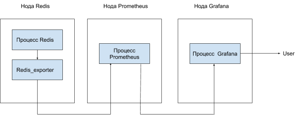
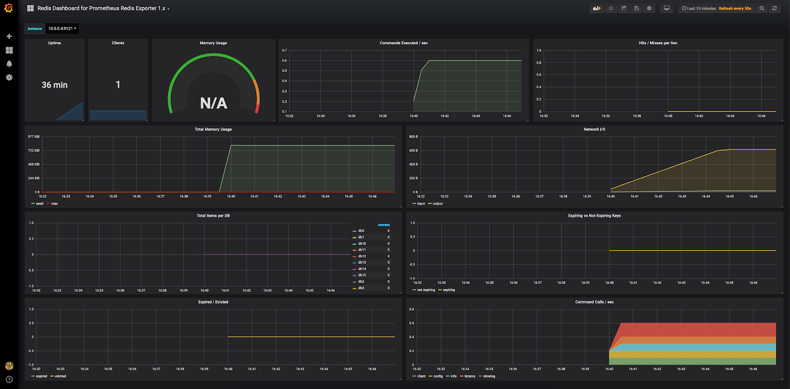
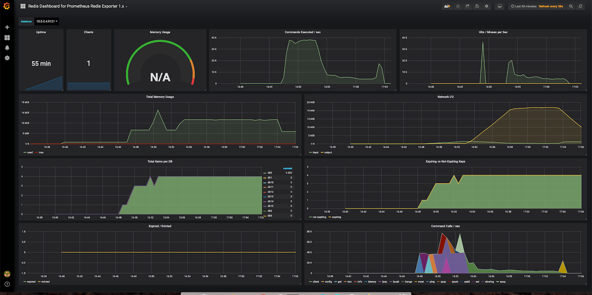

## Конфигурация оборудования

Чтобы выполнить данный сценарий мониторинга, установите и настройте серверы c использованием следующего оборудования:

- Prometheus 2.13 на ОС Ubuntu 18.04 LTS x86_64.
- Grafana 6.4.2 на ОС Ubuntu 18.04 LTS x86_64.
- Redis 5 на ОС Ubuntu 18.04 LTS x86_64.

<warn>

**Внимание**

При использовании серверов и оборудования других версий некоторые шаги сценария могут отличаться, от описанных ниже.

</warn>

## Схема работы

****

Для мониторинга параметров Redis и сбора метрик в Prometheus используется экспортер, который опрашивает сервер Redis и передает данные серверу Prometheus. Данные можно визуализировать в Grafana с помощью Dashboard.

## Установка redis_exporter

1.  Выполните логин на сервер Redis с правами суперпользователя.
2.  Укажите актуальную версию экспортера:

```
root@redis:~# export VERSION="<версия>"
```

<info>

**Примечание**

Актуальную версию redis_exporter можно [найти и скачать тут](https://github.com/oliver006/redis_exporter/releases) [или тут](https://prometheus.io/download/#mysqld_exporter).

</info>

3.  Создайте пользователя prometheus и группу prometheus, от имени которых вы будете запускать redis_exporter:

```
root@redis:~# groupadd --system prometheus
root@redis:~# useradd --system -g prometheus -s /bin/false prometheus
```

4.  Скачайте redis_exporter и распакуйте в папку /tmp:

```
root@redis:~# wget https://github.com/oliver006/redis_exporter/releases/download/v$VERSION/redis_exporter-v$VERSION.linux-amd64.tar.gz -O - | tar -xzv -C /tmp
```

5.  Cкопируйте содержимое распакованного файла в папку /usr/local/bin:

```
root@redis:~# cp /tmp/redis_exporter-v$VERSION.linux-amd64/redis_exporter /usr/local/bin
```

6.  Удалите содержимое распакованного архива из папки /tmp:

```
root@redis:~# rm -rf /tmp/redis_exporter-v$VERSION.linux-amd64
```

7.  Измените владельца redis_exporter на prometheus:

```
root@redis:~# chown -R prometheus:prometheus /usr/local/bin/redis_exporter
```

8.  Создайте сценарий запуска systemd сервиса redis_exporter. Для этого создайте файл /etc/systemd/system/redis_exporter.service со следующим содержимым:

```
[Unit]
Description=Prometheus Redis Exporter
After=network.target

[Service]
Type=simple
Restart=always
User=prometheus
Group=prometheus
ExecStart=/usr/local/bin/redis_exporter -include-system-metrics
[Install]
WantedBy=multi-user.target
```

<warn>

**Внимание**

Адрес и порт, используемые redis_exporter, должны быть доступны с сервера Prometheus. Для этого [настройте политику firewall для сервера с redis_exporter](https://mcs.mail.ru/help/network/security).

</warn>

9.  Запустите redis_exporter:

```
root@redis:~# systemctl daemon-reload
root@redis:~# systemctl start redis_exporter
root@redis:~# systemctl enable redis_exporter
Created symlink /etc/systemd/system/multi-user.target.wants/redis_exporter.service → /etc/systemd/system/redis_exporter.service.
```

10. Убедитесь, что сервис запустился:

```
root@redis:~# systemctl status redis_exporter
● redis_exporter.service - Prometheus Redis Exporter
Loaded: loaded (/etc/systemd/system/redis_exporter.service; enabled; vendor preset: enabled)
Active: active (running) since Fri 2019-10-11 07:10:00 UTC; 3min 31s ago
Main PID: 16236 (redis_exporter)
Tasks: 3 (limit: 1152)
CGroup: /system.slice/redis_exporter.service
└─16236 /usr/local/bin/redis_exporter -include-system-metrics -redis.addr 10.0.0.7

Oct 11 07:10:00 redis systemd[1]: Started Prometheus Redis Exporter.
Oct 11 07:10:00 redis redis_exporter[16236]: time="2019-10-11T07:10:00Z" level=info msg="Redis Metrics Exporter v1.3.1 build date: 2019-10-08-14:33:37 sha1: c3213a117be9f65d93ce0c099a419e913
Oct 11 07:10:00 redis redis_exporter[16236]: time="2019-10-11T07:10:00Z" level=info msg="Providing metrics at :9121/metrics"
```

## Настройка сервера Prometheus для получения данных redis_exporter

1.  Выполните логин на сервере Prometheus.

2.  В файле prometheus.yml для работы с redis_exporter:

- В scrape_configs добавьте следующую секцию:

```
scrape_configs:
- job_name: redis
    static_configs:
        - targets: ['10.0.0.4:9121']
        labels:
          alias: redis
```

- В секции targets впишите IP-адрес сервера redis_exporter.

3.  Перезапустите сервиc Prometheus:

```
root@prometheuskit-11102019-instance-5bqp2hk6nrgk:~# systemctl reload prometheus.service
```

## Настройка Grafana

Для визуализации полученных данных установите [соответствующий Dashboard](https://grafana.com/grafana/dashboards/763).

После установки и настройки получения данных с сервера Prometheus отобразится примерно следующее:

****

## Создание тестовой нагрузки

Чтобы посмотреть, как изменятся графики при нагрузке на сервер Redis, воспользуйтесь утилитой redis-benchmark, входящей в состав redis-tools.root@redis:

```
~# redis-benchmark -n 1000000 -c 100 -q
PING_INLINE: 39514.76 requests per second
PING_BULK: 37774.34 requests per second
SET: 37871.61 requests per second
GET: 34598.48 requests per second
INCR: 35792.26 requests per second
LPUSH: 37345.48 requests per second
RPUSH: 37873.05 requests per second
LPOP: 37661.95 requests per second
RPOP: 37936.27 requests per second
SADD: 37854.41 requests per second
HSET: 39003.08 requests per second
SPOP: 37636.43 requests per second
LPUSH (needed to benchmark LRANGE): 36524.34 requests per second
LRANGE_100 (first 100 elements): 19450.71 requests per second
LRANGE_300 (first 300 elements): 7574.84 requests per second
LRANGE_500 (first 450 elements): 5414.83 requests per second
LRANGE_600 (first 600 elements): 4037.40 requests per second
MSET (10 keys): 24537.47 requests per second
```

Теперь посмотрите, как в результате тестовой нагрузки в Grafana изменились графики:****

## Удаление redis_exporter

1.  Удалите Dashboard из Grafana.
2.  Из конфигурационного файла prometheus удалите секцию - job_name: redis.
3.  На ноде с redis_exporter выполните следующие команды:

```
root@redis:~# systemctl stop redis_exporter.service
root@redis:~# systemctl disable redis_exporter.service
Removed /etc/systemd/system/multi-user.target.wants/redis_exporter.service.
root@redis:~# rm /etc/systemd/system/redis_exporter.service 
root@redis:~# systemctl daemon-reload
root@redis:~# rm -f /usr/local/bin/redis_exporter
root@redis:~# userdel prometheus
root@redis:~# groupdel prometheus
```

## **Обратная связь**

Возникли проблемы или остались вопросы? [Напишите нам, мы будем рады вам помочь](https://mcs.mail.ru/help/contact-us).
