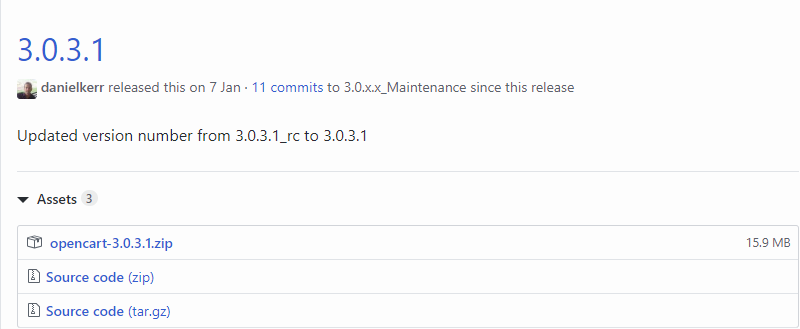
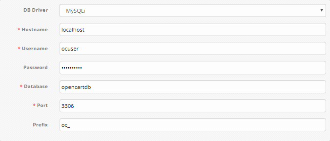
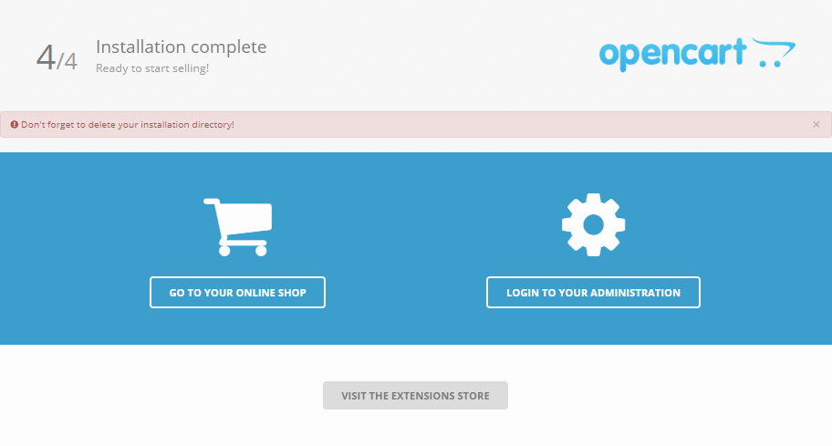
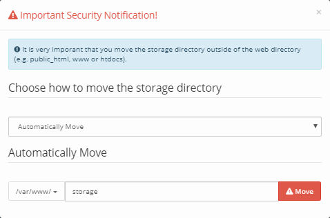

OpenCart - это платформа для создания интернет-магазина. OpenCart построена по принципу MVC и может быть установлена на любом веб-сервере с поддержкой PHP и MySQL.

Требования
----------

*   Операционная система Ubuntu версии 18.04.
*   Пользователь с доступом к команде sudo.
*   Установленный стек LAMP. 

Если у вас еще не установлен стек LAMP:

*   Вы можете получить готовый стек LAMP в облаке [в виде настроенной виртуальной машины](https://mcs.mail.ru/app/services/marketplace/) на Ubuntu 18.04. При регистрации вы получаете бесплатный бонусный счет, которого хватает, чтобы тестировать сервер несколько дней. 
*   Вы можете установить стек LAMP самостоятельно. О том, как установить стек LAMP на Ubuntu 18.04, [читайте тут](https://mcs.mail.ru/help/lamp-setup/lamp-ubuntu-18).

Подготовка к установке OpenCart
-------------------------------

Перед установкой OpenCart:

1.  Перейдите на сайт [https://github.com/opencart/opencart/releases/](https://github.com/opencart/opencart/releases/) и запомните номер версии OpenCart:
    



2.  Откройте окно терминала.
    
3.  Установите архиватор ZIP, выполнив команду: 
    

```
sudo apt install unzip -y
```

3.  Установите дополнительные пакеты PHP, выполнив команду: 
    

```
sudo apt-get install php-common php-mbstring php-xmlrpc  -y
```

4.  Перейдите в домашний каталог, выполнив команду: 
    

```
cd ~
```

5.  Создайте временный каталог tempOC, выполнив команду:
    

```
mkdir tempOC
```

6.  Перейдите в каталог tempOC, выполнив команду:
    

```
cd ~/tempOC
```

7.  Скачайте архив OpenCart, выполнив команду:
    

```
[https://github.com/opencart/opencart/releases/download/<версия>/opencart-<версия>.zip](https://github.com/opencart/opencart/releases/download/<версия>/opencart-<версия>.zip)
Например: wget [https://github.com/opencart/opencart/releases/download/3.0.3.1/opencart-3.0.3.1.zip](https://github.com/opencart/opencart/releases/download/3.0.3.1/opencart-3.0.3.1.zip)
```

8.  Распакуйте архив OpenCart, выполнив команду: 
    

```
sudo unzip opencart-<версия>.zip
Например: sudo unzip opencart-3.0.3.1.zip
```

9.  Переместите файлы из текущего каталога в каталог /var/www/html/opencart, выполнив команду:
    

```
sudo cp -r upload /var/www/html/opencart
```

10.  Удалите временный каталог tempOC, выполнив команду: 
    

```
sudo rm -Rf ~/tempOC
```

11.  Переименуйте файл opencart/config-dist.php, выполнив команду:

```
sudo mv /var/www/html/opencart/config-dist.php /var/www/html/opencart/config.php
```

12.  Переименуйте файл opencart/admin/config-dist.php, выполнив команду:
    

```
sudo mv /var/www/html/opencart/admin/config-dist.php /var/www/html/opencart/admin/config.php
```

13.  Замените владельца каталогов и файлов в корневом каталоге веб-сервера, используя команду: 
    

```
sudo chown -R имя_пользователя:www-data /var/www/html/opencart
где имя_пользователя - это имя пользователя sudo, www-data - имя группы
Например: sudo chown -R www-data:www-data /var/www/html/opencart
```

**Внимание**

Во избежание ошибок веб-сервера Apache при запуске скриптов используйте имя пользователя www-data и имя группы www-data по умолчанию.

14.  Если необходимо предоставить доступ к файлам корневого каталога веб-сервера другому пользователю, включите этого пользователя в группу www-data, используя команду:

```
sudo usermod -a -G www-data имя_пользователя
Например: sudo usermod -a -G www-data ocuser
```

15.  Настройте права доступа к файлам и папкам корневого каталога, используя команду:
    

```
sudo chmod -R 775 /var/www/html/opencart
```

16.  Подключите модуль Apache rewrite, выполнив команду:
    

```
sudo a2enmod rewrite
```

17.  Перезагрузите веб-сервер Apache, выполнив команду:
    

```
sudo systemctl reload apache2
```

Настройка СУБД MySQL
--------------------

Чтобы начать работу с OpenCart, необходимо создать и настроить выделенную базу данных MySQL. Для этого: 

1.  Откройте окно терминала.
    
2.  Для перехода в оболочку MySQL выполните команду: 
    

```
sudo mysql -u root -p 
```

Используйте аутентификацию учетной записи root, относящуюся исключительно к СУБД MySQL.

3.  Создайте новую базу данных для OpenCart, используя команду: 
    

```
CREATE DATABASE имя_базы;
Например: CREATE DATABASE opencartdb;
```

**Внимание**

После всех команд СУБД MySQL должна ставиться точка с запятой.

4.  Создайте пользователя с правами полного доступа к созданной базе данных и назначьте ему пароль, используя команду:
    

```
CREATE USER имя_пользователя@localhost IDENTIFIED BY 'пароль';
Например: CREATE USER ocuser@localhost IDENTIFIED BY 'mypassword';
```

5.  Предоставьте пользователю привилегии, необходимые для создания и изменения таблиц базы данных, выполнив команду:  
    

```
GRANT ALL PRIVILEGES ON  имя_базы.\* TO имя_пользователя@localhost;
Например: GRANT ALL PRIVILEGES ON opencartdb.\* TO ocuser@localhost;
```

6.  Актуализируйте предоставление привилегий к таблицам базы данных, выполнив команду:
    

```
FLUSH PRIVILEGES;
```

7.  Выйдите из оболочки MySQL, выполнив команду: 
    

```
exit
```
**

Установка OpenCart
------------------

Для установки OpenCart в адресной строке веб-браузера введите следующее:

**
```
http://<внешний IP-адрес вашего веб-сервера>/OpenCart
```
**

В результате будет запущен мастер установки OpenCart, следуйте его указаниям:

**

1.  Ознакомьтесь с лицензионным соглашением и нажмите кнопку **Continue**.
2.  Проверьте конфигурационные параметры OpenCart. Убедитесь, что все поля с элементом **Status** выделены зеленым, и нажмите кнопку **Continue**.
3.  Выберите конфигурацию базы данных:**
    
    
    
    **Используйте имя пользователя базы данных, пароль и имя базы данных, которые вы указали при настройке СУБД MySQL [](https://docs.google.com/document/d/1rnpyTW7ZXIRdr5lmsYLyvWH3PcGEitDNetoq2mSyfTM/edit#heading=h.u2usy4a5aptn). Другим параметрам рекомендуется оставить значения по умолчанию.
4.  Создайте учетную запись администратора OpenCart:**
    
    
    
    **Для запуска установки нажмите кнопку **Continue**.
5.  Если установка OpenCart прошла успешно, отобразится следующая страница:
    
     ********Чтобы начать работу, нажмите кнопку **Login to your administration**.
6.  Выполните аутентификацию, используя имя и пароль, которые вы указали при создании учетной записи администратора OpenCart [](https://docs.google.com/document/d/1rnpyTW7ZXIRdr5lmsYLyvWH3PcGEitDNetoq2mSyfTM/edit#heading=h.2zc4fulm9yjh):**
    
    
    
    **
7.  Если вы выполняете аутентификацию впервые, вам будет предложено переместить каталог Storage из веб-каталога:
    

****

**Внимание**

Перемещение каталога Storage позволяет повысить уровень безопасности данных и не влияет на работоспособность OpenCart. В случае отсутствия необходимости можно не выполнять это действие и просто закрыть окно с сообщением о перемещении каталога Storage.

Для перемещения каталога Storage мы рекомендуем выбрать ручной метод (Manually Move) и выполнить следующее:

*   Откройте окно терминала.
*   Переместите каталог Storage, выполнив команду:

```
sudo mv /var/www/html/opencart/system/storage/ /var/www/storage/   
```

*   Откройте файл opencart/config.php для редактирования, выполнив команду:

```
sudo nano /var/www/html/opencart/config.php
```

*   В этом файле найдите строку:

```
define('DIR_STORAGE', DIR_SYSTEM . 'storage/');
```

и замените ее на строку:

```
define('DIR_STORAGE', '/var/www/storage/');
```

Затем сохраните изменения, используя сочетание клавиш CTRL+O, и завершите редактирование, используя сочетание клавиш CTRL+X.

*   Откройте файл opencart/admin/config.php для редактирования, выполнив команду:

```
sudo nano /var/www/html/opencart/admin/config.php
```

*   В этом файле найдите строку:

```
define('DIR_STORAGE', DIR_SYSTEM . 'storage/');
```

и замените ее на строку:

```
define('DIR_STORAGE', '/var/www/storage/');
```

Затем сохраните изменения, используя сочетание клавиш CTRL+O, и завершите редактирование, используя сочетание клавиш CTRL+X.

8.  Откройте веб-страницу Opencart, закройте информационное сообщение и обновите веб-страницу, нажав клавишу F5.

В результате должна отобразиться примерно следующая страница:


 

**Примечание**

По завершении установки OpenCart удалите директорию с файлами установки. Для этого откройте терминал и выполните команду:

```
sudo rm -rf /var/www/html/opencart/install
```

**Обратная связь**

Возникли проблемы или остались вопросы? [Напишите нам, мы будем рады вам помочь](https://mcs.mail.ru/help/contact-us).