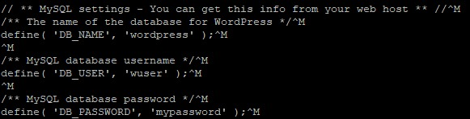
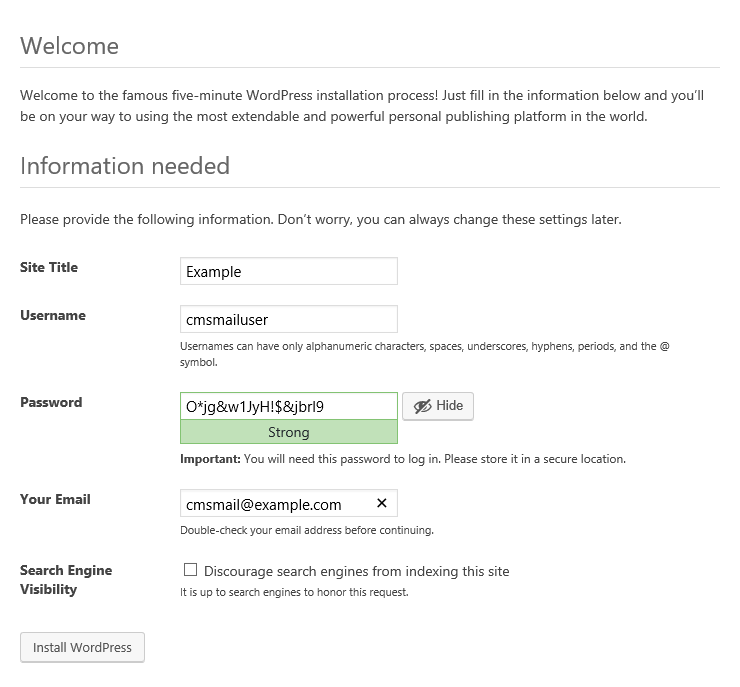
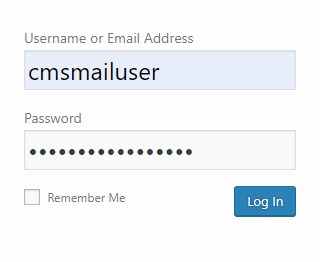
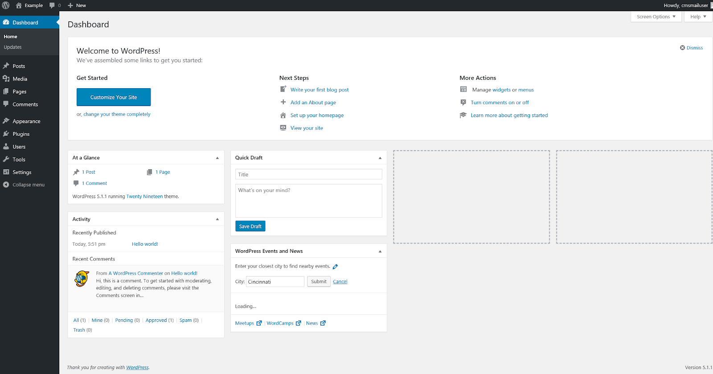

WordPress — самая популярная система управления контентом веб-страниц (CMS). Для данной системы создано множество плагинов, её сообщество в мире очень обширное. Для работы с WordPress не нужны специальные знания, все понятно на интуитивном уровне.

## Требования

- Операционная система FreeBSD версии 10.3.
- Пользователь с доступом к команде sudo.
- Установленный стек FAMP.

Если у вас еще не установлен стек FAMP:

- Вы можете установить стек FAMP самостоятельно. О том, установить стек FAMP на FreeBSD 10.3, [читайте тут](https://mcs.mail.ru/help/famp-on-linux/famp-freebsd-10).
- Вы можете получить готовый стек LAMP в облаке [в виде настроенной виртуальной машины](https://mcs.mail.ru/app/services/marketplace/) на Ubuntu 18.04 и [установить Wordpress на нем](https://mcs.mail.ru/help/wordpress-on-linux/wordpress-ubuntu-18). При регистрации вы получаете бесплатный бонусный счет, которого хватает, чтобы тестировать сервер несколько дней.

## Настройка СУБД MySQL (mariadb)

Чтобы начать работу с WordPress, необходимо создать и настроить выделенную базу данных MySQL (mariadb). Для этого:

1.  Откройте окно терминала.
2.  Для перехода в оболочку MySQL (mariadb) выполните команду:

```
sudo mysql -u root -p
```

Используйте аутентификацию учетной записи root, относящуюся исключительно к СУБД MySQL.

3.  Создайте новую базу данных для Wordpress, используя команду:

```
CREATE DATABASE имя_базы;
```

Например:

```
CREATE DATABASE wordpress;
```

<warn>

**Внимание**

После всех команд СУБД MySQL должна ставиться точка с запятой.

</warn>

4.  Создайте пользователя с правами полного доступа к созданной базе данных и назначьте ему пароль, используя команду:

```
CREATE USER имя_пользователя@localhost IDENTIFIED BY 'пароль';
```

Например:

```
CREATE USER wuser@localhost IDENTIFIED BY 'mypassword';
```

5.  Предоставьте пользователю необходимые привилегии для создания и изменения таблиц базы данных, выполнив команду:

```
GRANT ALL PRIVILEGES ON  имя_базы.\* TO имя_пользователя@localhost;
```

Например:

```
GRANT ALL PRIVILEGES ON wordpress.\* TO wuser@localhost;
```

6.  Актуализируйте предоставление привилегий к таблицам базы данных, выполнив команду:

```
FLUSH PRIVILEGES;
```

7.  Выйдите из оболочки, выполнив команду:

```
exit
```

## Подготовка к установке WordPress

Перед установкой WordPress выполните следующее:

1.  Откройте окно терминала.

2.  Перейдите в домашний каталог, выполнив команду:

```
cd ~
```

3.  Создайте временный каталог tempWR, выполнив команду:

```
mkdir tempWP 
```

4.  Перейдите в каталог tempWR, выполнив команду:

```
cd ~/tempWP
```

5.  Скачайте архив WordPress, выполнив команду:

```
curl -O https://wordpress.org/latest.tar.gz
```

6.  Распакуйте и переместите файлы из текущего каталога в каталог /usr/local/www/apache24/data/, выполнив команду:

```
sudo tar zxvf ~/tempWP/latest.tar.gz -C /usr/local/www/apache24/data/

```

7.  Удалите временный каталог tempWP, выполнив команду:

```
rm -Rf ~/tempWP
```

8.  Перейдите в каталог с файлами конфигурации WordPress, выполнив команду:

```
cd /usr/local/www/apache24/data/wordpress

```

9.  Переименуйте файл wp-config-sample.php, выполнив команду:

```
sudo mv wp-config-sample.php wp-config.php
```

10. Откройте файл wp-config.php для редактирования, используя команду:

```
sudo ee wp-config.php
```

11. В файле wp-config.php найдите следующие строки:

****

12. Замените значения по умолчанию на значения, которые вы указали при настройке mariadb

Например:

```
define( 'DB_NAME', 'wordpress' );
define( 'DB_USER', 'wuser' );
define( 'DB_PASSWORD', 'mypassword' );
```

Затем сохраните изменения и завершите редактирование.

13. Замените владельца каталогов и файлов в корневом каталоге веб-сервера, используя команду:

```
sudo chown -R имя_пользователя:www-data /var/www/html/wordpress/
```

где `имя_пользователя` - имя пользователя, `www-data` - имя группы
Например:

```
sudo chown www:www /usr/local/www/apache24/data**/**
```

<info>

**Примечание**

Во избежание ошибок веб-сервера Apache при запуске скриптов используйте имя пользователя www и имя группы www по умолчанию.

</info>

14. Если необходимо предоставить доступ к файлам корневого каталога веб-сервера другому пользователю, включите этого пользователя в группу www, используя команду:

```
sudo usermod -a -G www имя_пользователя
```

Например:

```
sudo usermod -a -G www wuser
```

15. Настройте права доступа к файлам и папкам корневого каталога, используя команду:

```
sudo chmod -R 775 www:www /usr/local/www/apache24/data/

```

16. Перезагрузите веб-сервер Apache, выполнив команду:

```
sudo service apache24 restart

```

## Установка WordPress

Чтобы установить WordPress:

1.  В адресной строке браузера к внешнему адресу веб-сервера добавьте строку:

```
/wordpress/wp-admin/install.php
```

2.  На странице настроек:

- Выберите имя сайта WordPress и имя пользователя.
- По умолчанию будет сгенерирован надежный пароль. Используйте этот пароль или введите новый.

**Внимание**

Использование ненадежного пароля приводит к снижению сетевой безопасности сайта, поэтому задавать ненадежный пароль рекомендуется только при работе в тестовом или демонстрационном режиме

- Введите адрес электронной почты.
- При необходимости настройте видимость сайта для поисковых систем.
- Нажмите кнопку **Install** **WordPress**:

****

3.  После установки Wordpress войдите в систему. Для этого нажмите кнопку **Log In**, затем введите имя пользователя и пароль:

****

****

В результате откроется главная страница WordPress:

****
