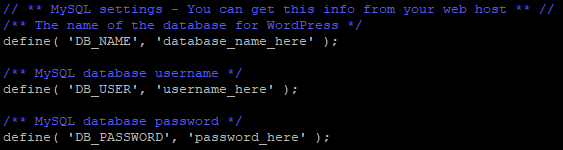
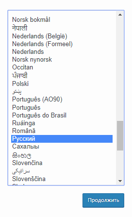
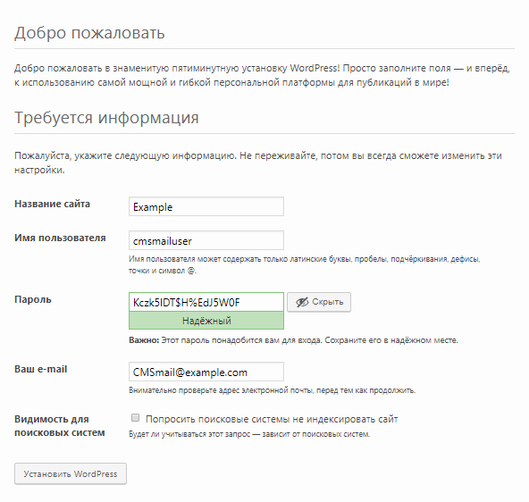
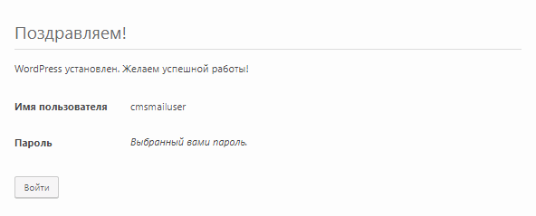

WordPress — самая популярная система управления контентом веб-страниц (CMS). Для данной системы создано множество плагинов, её сообщество в мире очень обширное. Для работы с WordPress не нужны специальные знания, все понятно на интуитивном уровне.

## Требования

- Операционная система CentOS 6.9.
- Пользователь с доступом к команде sudo.
- Установленный стек LAMP.

Если у вас еще не установлен стек LAMP:

- Вы можете получить готовый стек LAMP в облаке [в виде настроенной виртуальной машины](https://mcs.mail.ru/app/services/marketplace/) на Ubuntu 18.04 и [установить Wordpress на нем](https://mcs.mail.ru/help/wordpress-on-linux/wordpress-ubuntu-18). При регистрации вы получаете бесплатный бонусный счет, которого хватает, чтобы тестировать сервер несколько дней.
- Вы можете установить стек LAMP самостоятельно. О том, как установить стек LAMP на CentOS 6.9, [читайте тут](https://mcs.mail.ru/help/lamp-on-linux/lamp-centos-6-9).

## Подготовка к установке WordPress

Перед установкой WordPress выполните следующее:

1.  Откройте окно терминала.
2.  Перейдите в домашний каталог, выполнив команду:

```
cd ~
```

3.  Создайте временный каталог tempWP, выполнив команду:

```
mkdir tempWP 
```

4.  Перейдите в созданный каталог, выполнив команду:

```
cd ~/tempWP
```

5.  Скачайте архив WordPress, выполнив команду:

```
wget https://wordpress.org/latest.tar.gz
```

6.  Распакуйте и переместите файлы из текущего каталога в каталог /var/www/html/, выполнив команду:

```
sudo tar zxvf ~/tempWP/latest.tar.gz -C /var/www/html
```

7.  Удалите каталог tempWP, выполнив команду:

```
rm -Rf ~/tempWP
```

## Настройка БД MySQL

Чтобы начать работу с WordPress, необходимо создать и настроить выделенную базу данных MySQL. Для этого:

1.  Откройте окно терминала.
2.  Для перехода в оболочку MySQL выполните команду:

```
sudo mysql -u root -p 
```

Используйте аутентификацию учетной записи root, которая относится исключительно к СУБД MySQL

3.  Создайте новую базу данных для WordPress, используя команду:

```
CREATE DATABASE имя_базы;
```

Например:

```
CREATE DATABASE wordpress;
```

<warn>

**Внимание**

После всех команд СУБД MySQL должна ставиться точка с запятой.

</warn>

4.  Создайте пользователя с правами полного доступа к созданной базе данных и назначьте ему пароль, используя команду:

```
CREATE USER имя_пользователя@localhost IDENTIFIED BY 'пароль';
```

Например:

```
CREATE USER wuser@localhost IDENTIFIED BY 'mypassword';
```

5.  Предоставьте пользователю необходимые привилегии для создания и изменения таблиц базы данных, выполнив команду:

```
GRANT ALL PRIVILEGES ON  имя_базы.\* TO имя_пользователя@localhost;
```

Например:

```
GRANT ALL PRIVILEGES ON wordpress.\* TO wuser@localhost;
```

6.  Актуализируйте предоставление привилегий к таблицам базы данных, выполнив команду:

```
FLUSH PRIVILEGES;
```

7.  Выйдите из оболочки MySQL, выполнив команду:

```
exit
```

## Настройка файла конфигурации WordPress

Для первичной настройки конфигурационного файла WordPress:

1.  Перейдите в каталог с конфигурационными файлами WordPress, выполнив команду:

```
cd /var/www/html/wordpress
```

2.  Переименуйте файл wp-config-sample.php, используя команду:

```
mv 
Например: sudo mv wp-config-sample.php wp-config.php
```

3.  Откройте файл wp-config.php для редактирования, используя команду:

```
sudo nano wp-config.php
```

4.  В файле wp-config.php найдите следующие строки:



5.  В файле wp-config.php:

- Замените значения по умолчанию на значения, которые вы указали при настройке MySQL (см. предыдущий раздел)

```
Например:
define( 'DB_NAME', 'wordpress' );
define( 'DB_USER', 'wuser' );
define( 'DB_PASSWORD', 'mypassword' );
```

- Сохраните изменения, используя сочетание клавиш CTRL+O.
- Завершите редактирование, используя сочетание клавиш CTRL+X.

6.  Замените владельца каталогов и файлов в корневом каталоге веб-сервера, используя команду:

```
sudo chown -R имя_пользователя:apache /var/www/html/wordpress
```

где `имя_пользователя` - имя пользователя, `apache` - имя группы
Например:

```
sudo chown -R apache:apache /var/www/html/wordpress/
```

<info>

**Примечание**

Во избежание ошибок веб-сервера Apache при запуске скриптов используйте имя пользователя apache и имя группы apache по умолчанию.

</info>

7.  Если необходимо предоставить доступ к файлам корневого каталога веб-сервера другому пользователю, включите этого пользователя в группу apache, используя команду:

```
sudo usermod -a -G apache имя_пользователя
```

Например:

```
sudo usermod -a -G apache user
```

8.  Настройте права доступа к файлам и папкам, выполнив команду:

```
sudo chmod -R 755 /var/www
```

9.  Перезагрузите веб-сервер Apache, выполнив команду:

```
sudo service httpd restart

```

## Установка WordPress

Чтобы установить WordPress:

1.  В адресной строке браузера к внешнему адресу веб-сервера добавьте строку:

```
/wordpress/wp-admin/install.php
```

2.  Выберите язык системы и нажмите кнопку **Продолжить**:



3.  На странице настроек:

- Выберите имя сайта WordPress и имя пользователя.
- По умолчанию будет сгенерирован надежный пароль. Используйте этот пароль или введите новый.

<warn>

**Внимание**

Использование ненадежного пароля приводит к снижению сетевой безопасности сайта, поэтому задавать ненадежный пароль рекомендуется только при работе в тестовом или демонстрационном режимах.

</warn>

- Введите адрес электронной почты.
- При необходимости настройте видимость сайта для поисковых систем.
- Нажмите кнопку **Установить WordPress**:



4.  После установки Wordpress войдите в систему:



В результате откроется главная страница WordPress:


