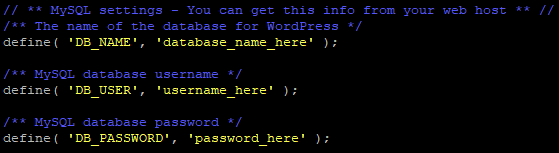
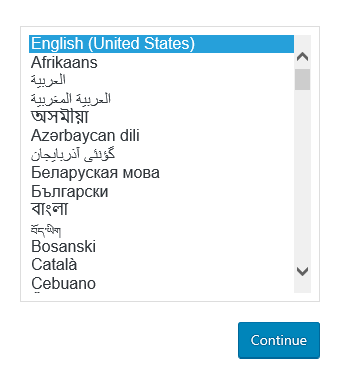

WordPress — самая популярная система управления контентом веб-страниц (CMS). Для данной системы создано множество плагинов, её сообщество в мире очень обширное. Для работы с WordPress не нужны специальные знания, все понятно на интуитивном уровне.

## Требования

- Операционная система openSUSE версии 42.3.
- Пользователь с доступом к команде sudo.
- Установленный стек LAMP.

Если у вас еще не установлен стек LAMP:

- Вы можете получить готовый стек LAMP в облаке [в виде настроенной виртуальной машины](https://mcs.mail.ru/app/services/marketplace/) на Ubuntu 18.04 и [установить Wordpress на нем](https://mcs.mail.ru/help/wordpress-on-linux/wordpress-ubuntu-18). При регистрации вы получаете бесплатный бонусный счет, которого хватает, чтобы тестировать сервер несколько дней.
- Вы можете установить стек LAMP самостоятельно. О том, как установить стек LAMP на openSUSE 42.3, [читайте тут](https://mcs.mail.ru/help/lamp-on-linux/lamp-opensuse-42).

## Настройка СУБД MySQL (mariadb)

Чтобы начать работу с WordPress, необходимо создать и настроить выделенную базу данных MySQL (mariadb). Для этого:

1.  Откройте окно терминала.
2.  Для перехода в оболочку MySQL (mariadb) выполните команду:

```
sudo mysql -u root -p
```

Используйте аутентификацию учетной записи root, относящуюся исключительно к СУБД MySQL.

3.  Создайте новую базу данных для Wordpress, используя команду:

```
CREATE DATABASE имя_базы;
Например: CREATE DATABASE wordpress;
```

### Внимание!

После всех команд СУБД MySQL должна ставиться точка с запятой.

4.  Создайте пользователя с правами полного доступа к созданной базе данных и назначьте ему пароль, используя команду:

```
CREATE USER имя_пользователя@localhost IDENTIFIED BY 'пароль';
Например: CREATE USER wuser@localhost IDENTIFIED BY 'mypassword';
```

5.  Предоставьте пользователю необходимые привилегии для создания и изменения таблиц базы данных, выполнив команду:

```
GRANT ALL PRIVILEGES ON  имя_базы.\* TO имя_пользователя@localhost;
Например: GRANT ALL PRIVILEGES ON wordpress.\* TO wuser@localhost;
```

6.  Актуализируйте предоставление привилегий к таблицам базы данных, выполнив команду:

```
FLUSH PRIVILEGES;
```

7.  Выйдите из оболочки MySQL, выполнив команду:

```
exit
```

## Подготовка к установке WordPress

Перед установкой WordPress выполните следующее:

1.  Откройте окно терминала.
2.  В брандмауэре операционной системы для сервиса apache откройте доступ к порту 80. Для этого:

- Откройте файл SuSEfirewall2 для редактирования, выполнив команду:

```
sudo nano /etc/sysconfig/SuSEfirewall2
```

### Примечание.

Для быстрого поиска по файлу используйте сочетание клавиш CTRL+W

- В файле SuSEfirewall2 найдите строку:

```
FW_CONFIGURATIONS_EXT=""
```

И замените ее на строку:

```
FW_CONFIGURATIONS_EXT="apache2"
```

- Сохраните изменения, используя сочетание клавиш CTRL+O.
- Завершите редактирование, используя сочетание клавиш CTRL+X.

3.  Перезагрузите брандмауэр, выполнив команду:

```
sudo systemctl restart SuSEfirewall2
```

4.  Установите дополнительные пакеты PHP, выполнив команду:

```
sudo zypper install libXpm4 libjpeg8 php7-bz2 php7-curl php7-gd php7-gettext php7-mbstring php7-openssl php7-zip pwgen
```

5.  Перейдите в домашний каталог, выполнив команду:

```
cd ~
```

6.  Создайте временный каталог tempWR, выполнив команду:

```
mkdir tempWP 
```

7.  Перейдите в каталог tempWR, выполнив команду:

```
cd ~/tempWP
```

8.  Скачайте архив WordPress, выполнив команду:

```
wget https://wordpress.org/latest.tar.gz
```

9.  Распакуйте и скопируйте файлы из текущего каталога в каталог /srv/www/htdocs/, выполнив команду:

```
sudo tar zxvf ~/tempWP/latest.tar.gz -C /srv/www/htdocs
```

10. Удалите временный каталог tempWP, выполнив команду:

```
sudo rm -Rf ~/tempWP
```

11. Перейдите в каталог с файлами конфигурации WordPress, выполнив команду:

```
cd /srv/www/htdocs/wordpress
```

12. Переименуйте файл wp-config-sample.php, выполнив команду:

```
sudo mv wp-config-sample.php wp-config.php
```

13. Откройте файл wp-config.php для редактирования, используя команду:

```
sudo nano wp-config.php
```

14. В файле wp-config.php найдите следующие строки:



15. Замените значения по умолчанию на значения, которые вы указали при настройке СУБД MySQL

Например:

```
define( 'DB_NAME', 'wordpress' );
define( 'DB_USER', 'wuser' );
define( 'DB_PASSWORD', 'mypassword' );
```

Затем сохраните изменения, используя сочетание клавиш CTRL+O, и завершите редактирование, используя сочетание клавиш CTRL+X.

16. Сделайте пользователя wwwrun, от имени которого запускается сервис apache, владельцем корневого каталога, используя команду:

```
sudo chown -R wwwrun /srv/www/htdocs/
```

17. Настройте права доступа к файлам и папкам корневого каталога, используя команду:

```
sudo chmod -R 775 /srv/www/htdocs/
```

18. Перезагрузите веб-сервер Apache, выполнив команду:

```
sudo systemctl restart apache2
```

## Установка WordPress

Чтобы установить WordPress:

1.  В адресной строке браузера к внешнему адресу веб-сервера добавьте строку:

```
/wordpress/wp-admin/install.php
```

2.  Выберите язык системы и нажмите кнопку **Continue**:

****

3.  На странице настроек:

- Выберите имя сайта WordPress и имя пользователя.
- По умолчанию будет сгенерирован надежный пароль. Используйте этот пароль или введите новый.

### Внимание!

Использование ненадежного пароля приводит к снижению сетевой безопасности сайта, поэтому задавать ненадежный пароль рекомендуется только при работе в тестовом или демонстрационном режимах.

- Введите адрес электронной почты.
- При необходимости настройте видимость сайта для поисковых систем.
- Нажмите кнопку **Install** **WordPress**:

****

4.  После установки Wordpress войдите в систему:

****

В результате откроется главная страница WordPress:

****

### Обратная связь

Возникли проблемы или остались вопросы? [Напишите нам, мы будем рады вам помочь](https://mcs.mail.ru/help/contact-us)!
