<info>

Автор: Михаил Волынов

</info>

Эта статья поможет вам установить сервер мониторинга ELK и подключить к нему filebeat-агенты для логов приложения Nginx, а также познакомит с некоторыми возможностями Kibana для работы с логами.

## Схема стенда

Будет развернут сервер ELK в облаке VK Cloud и подключены агенты мониторинга Nginx на удаленных узлах:

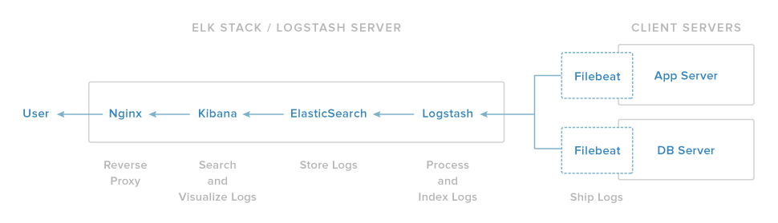

(источник: www.digitalocean.com)

В данной статье будем считать, что у нас есть несколько узлов, на которых необходимо настроить Nginx для экспорта логов в ELK. Чтобы обеспечить возможность взаимодействия между машинами, эти узлы должны быть объединены в одну сеть.

## Подключение сервера ELK

1. [Установите стек EKL](/ru/additionals/cases/cases-elk/elk-u18) на целевой инстанс.
2. Запомните IP-адрес инстанса, имя и пароль пользователя для доступа к Kibana. Они понадобятся позже, при проверке функциональности на узле c ELK.
3. Подключитесь к инстансу по ssh, используя pem-файл. Для этого выполните команду:

```bash
ssh -i /path/to/key.pem ubuntu@<instance_ip>
```

4.  Установите плагины `ingest-geoip` и `ingest-user-agent` для Elasticsearch, они необходимы для совместной работы Kibana и логов Nginx. Для этого, находясь в папке с установленным elasticsearch (по умолчанию для Ubuntu — `/usr/share/elasticsearch/`), выполните команды:

```bash
bin/elasticsearch-plugin install ingest-geoip
bin/elasticsearch-plugin install ingest-user-agent

```

5.  Чтобы подключить установленные модули, перезапустите Elasticsearch, выполнив команду:

```bash
sudo service elasticsearch restart
```

## Настройки на удаленных узлах

1.  Подключитесь к удаленному узлу, который вы хотите подключить к ELK.
2.  Поскольку создается связь ELK и Nginx, установите Nginx из стандартных репозиториев Ubuntu, выполнив команду:

```bash
sudo apt update
sudo apt install nginx
```

3.  Для анализа логов в реальном времени [установите Filebeat](https://www.elastic.co/guide/en/beats/filebeat/6.4/filebeat-installation.html)
4.  Откройте конфигурационный файл `/etc/filebeat/filebeat.yml` для редактирования и укажите в нем свои настройки:

    ```yaml
    output.elasticsearch:
        hosts: ["<es_url>"]
    setup.kibana:
        host: "<kibana_url>"
    ```

- `<es_url>` — IP-адрес elasticsearch с номером порта `9200`;
- `<kibana_url>` — IP-адрес инстанса с Kibana.

Примеры для `<es_url>`:

- прямой адрес:

```yaml
output.elasticsearch:   
hosts: ["https://localhost:9200"]
```

- явное указание протокола:

```yaml
output.elasticsearch:  
hosts: ["localhost:9200"]   
protocol: "https"
```

- множественное указание хостов:

```yaml
output.elasticsearch:   
hosts: ["10.45.3.2:9220", "10.45.3.1:9200"]   
protocol: https
```

<info>

Подробнее о настройках в файле `filebeat.yml` читайте [тут](https://www.elastic.co/guide/en/beats/filebeat/current/elasticsearch-output.html)

</info>

5.  Включите модуль Nginx для Filebeat, выполнив команду:

```bash
sudo filebeat modules enable nginx
```

6.  Чтобы гибко настроить filebeat, отредактируйте файл `/etc/filebeat/modules.d/nginx.yml`. Вид этого файла по умолчанию:

```yaml
- module: nginx
  # Access logs
  access:
    enabled: true

    # Set custom paths for the log files. If left empty,
    # Filebeat will chose the paths depending on your OS.
    #var.paths:

  # Error logs
  error:
    enabled: true

    # Set custom paths for the log files. If left empty,
    # Filebeat will choose the paths depending on your OS.
    #var.paths
```

7.  Если дашборды для Kibana не были настроены ранее, выполните их загрузку, используя команду:

```bash
sudo filebeat setup
```

8.  Для запуска Filebeat выполните команду:

```bash
sudo service filebeat start
```

Один узел настроен. Дополнительные узлы настраиваются аналогично.

## Проверка функциональности на узле с ELK

1. Чтобы удобно и эффективно работать с логами, используя соответствующие IP-адрес инстанса, имя и пароль пользователя (используйте https), подключитесь к Kibana:

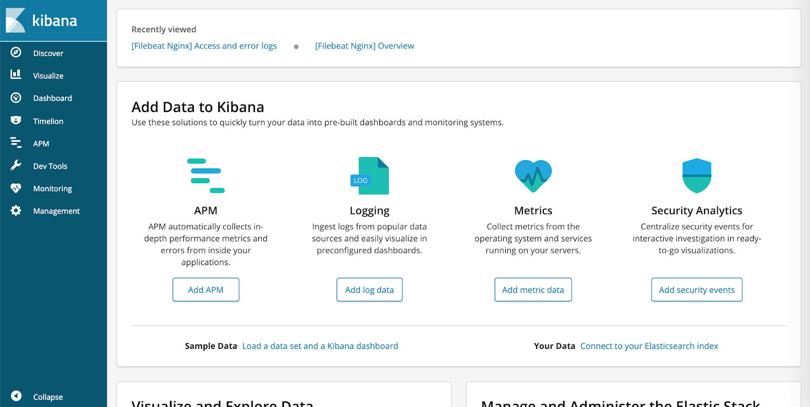

<info>

В VK Cloud Marketplace используются самоподписанные сертификаты. Чтобы пользоваться SSL, добавьте сертификат в исключения или используйте свой сертификат.

</info>

2.  Чтобы убедиться, что все верно настроено, перейдите в раздел **Logging**. Для этого нажмите кнопку **Add log data** и выберите подраздел **Nginx logs**.

.png)

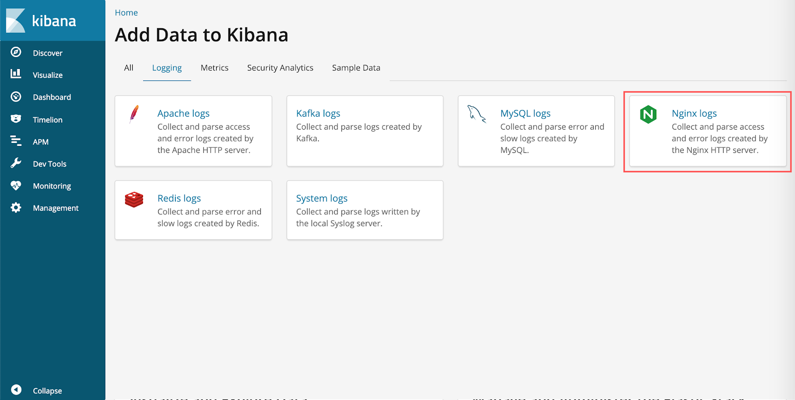

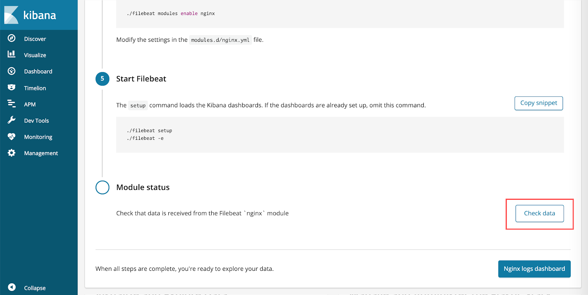

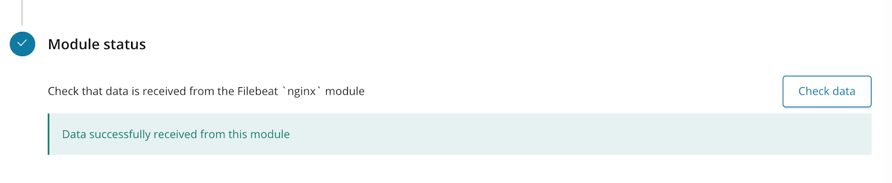

Если все сделано верно, при нажатии на кнопку **Check data** появится сообщение **Data successfully received from this module**.

## Работа с дашбордами Kibana

Дашборды Kibana позволяют просмотреть детализацию по логам Nginx с удаленного узла и при необходимости выполнить фильтрацию и поиск. Поэтому работа с дашбордами имеет смысл только при наличии логов Nginx, доступных для просмотра.

В боковом меню выберите пункт **Dashboard**. В результате отобразится стандартный Dashboard для Nginx Filebeat с множеством различных данных о запросах. Он позволяет строить наглядные диаграммы, а также показывает карту мира для IP-адресов, обращавшихся к серверу.

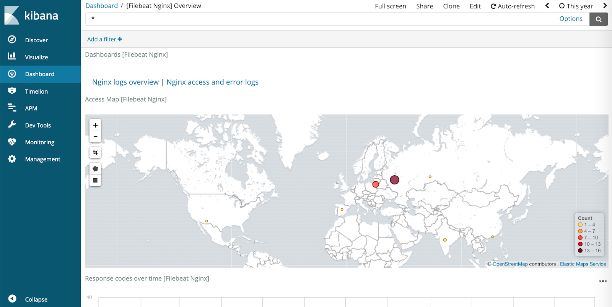

Чтобы просмотреть список всех запросов к серверу за период, указанный в правом верхнем углу, нажмите кнопку **Nginx access and error logs**.

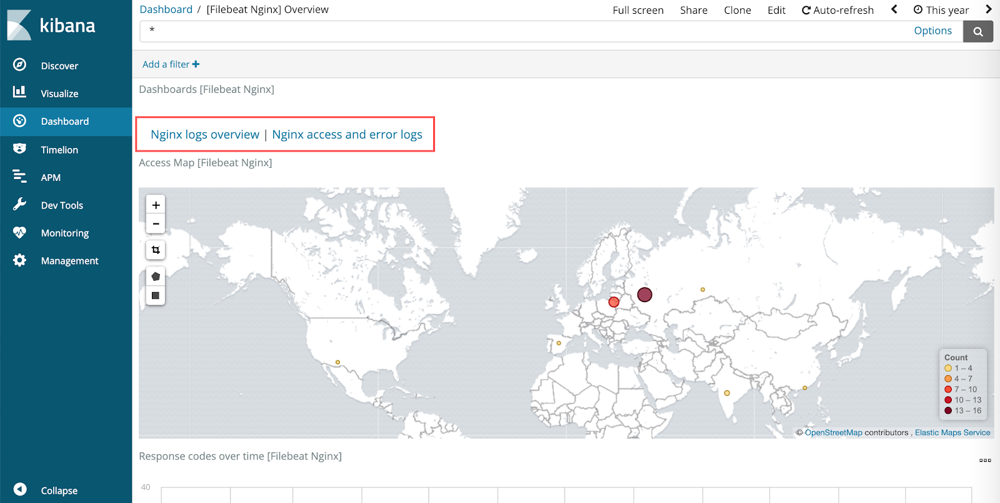

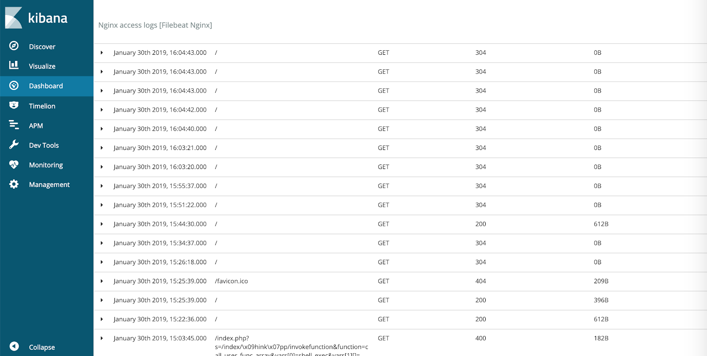

Чтобы просмотреть детализацию по запросу, нажмите треугольник в левой части соответствующей строки:

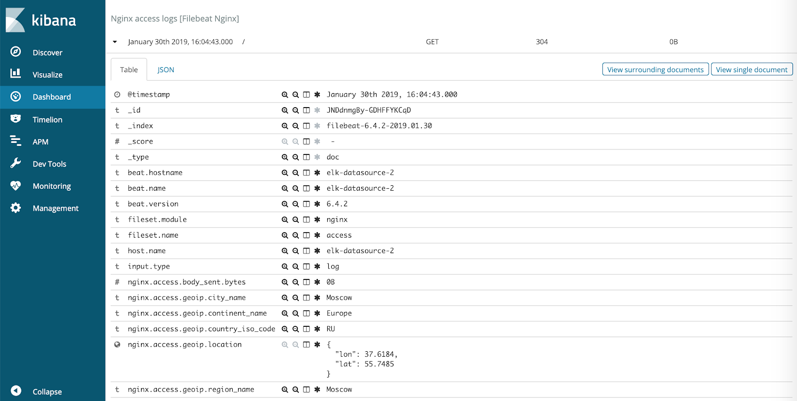

Для быстрого поиска можно использовать фильтрацию, нажав кнопку **Add filter** слева вверху.

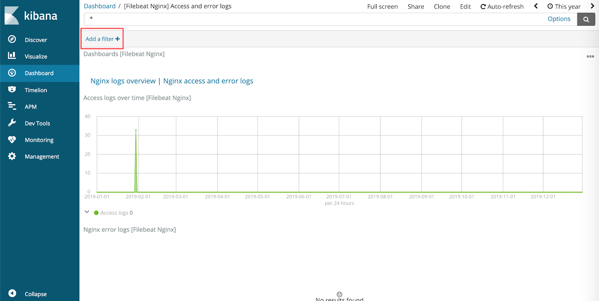

При настройке фильтра нужно выбрать поле из представленных и обозначить условие поиска (например, на скриншоте ниже все запросы с кодом ответа `200`).

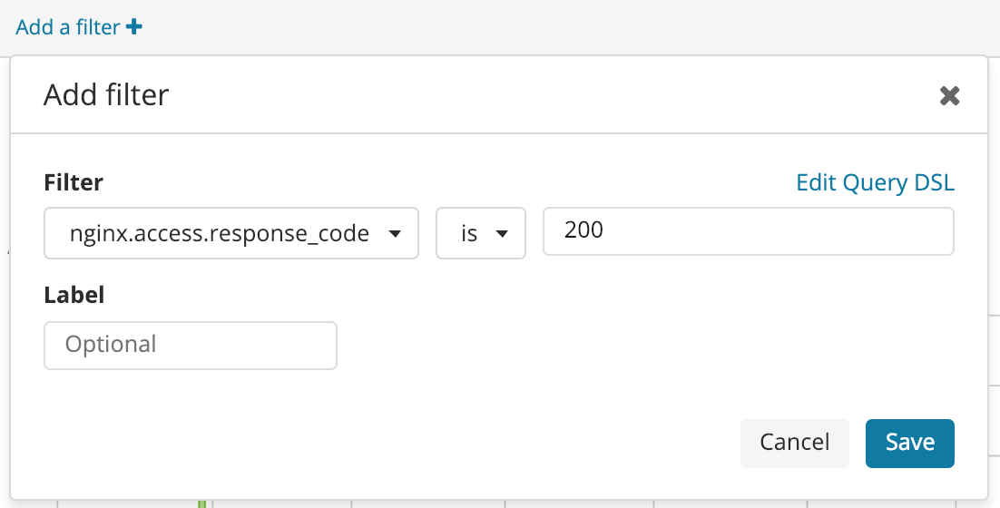
