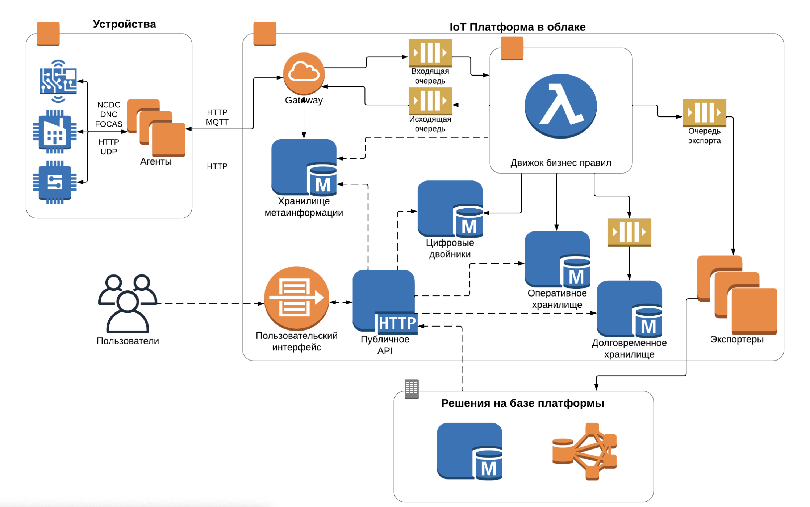

IoT — платформа интернета вещей, которая позволяет агрегировать данные с устройств и обрабатывать их.

Платформа предоставляет большой набор инструментов для разработки приложений:

- ведение реестра устройств, их шаблонов, настроек и другой важной информации;
- сбор показателей и с устройств любого типа по любому протоколу;
- построение аналитики на потоке данных с устройств в режиме квазиреального времени с помощью бизнес-правил на языке программирования Python;
- быстрый кеш для доступа к оперативным данным и аналитическое долговременное хранилище для аналитики по историческим данным;
- инструменты интеграции со сторонними системами.

## Особенности платформы

### Общая архитектура

В этом разделе мы рассмотрим общую архитектуру, взаимосвязи компонентов и потоки данных в платформе.

### Поток данных от устройств

Как видно из схемы, показатели с устройств собирают агенты, которые развернуты на железе рядом с этими устройствами. Агенты передают события от устройств по специализированному протоколу платформы на базе HTTP / MQTT в шлюз (gateway) платформы.

После попадания в шлюз платформы события обрабатываются в соответствии с заданными настройками:

- сохранение события в оперативное хранилище / долговременное хранилище / сервис цифровых двойников;
- запуск на выполнение бизнес-правил, которые прикреплены к источнику события.

Бизнес-правила выполняются в движке бизнес-правил.

Из правила можно получить данные из любого хранилища платформы, отправить http запросы в сторонние системы, а также отправить данные на экспорт через сервис экспортеров.

### Подключение устройств

Чтобы иметь возможность собирать показатели с любого типа устройств по любому протоколу платформа реализует protocol agnostic подход. Вместо того чтобы держать связь напрямую с устройствами, платформа делегирует данную задачу специализированному программному обеспечению - [агентам](../agents/).

Агенты подключаются к платформе по специализированному протоколу, авторизуются и получают список и конфигурацию всех закрепленных за агентом устройств. На основе полученной конфигурации агенты подключатся к закрепленным за ними устройствам и обеспечивают обмен данными между конечными устройствами и платформой.

Таким образом, агенты выступают адаптером между протоколом платформы и протоколом конкретного устройства, позволяя расширять поддержку доступных устройств и протоколов без модификации самой платформы.

Подробнее смотрите документацию:

- [Как создать устройство](../iot-start/create-device/)
- [Как подключить устройство](../iot-start/create-device/)

### Бизнес правила

Для обработки потока данных от устройств, а также для интеграции со сторонними системами в платформе предоставляются инструменты для выполнения пользовательских бизнес-правил.

Пользовательские бизнес-правила — это написанные пользователями скрипты на языке высокого уровня Python, которые отправляются на выполнение по наступлению определенного события. Например, если прикрепить бизнес-правило к датчику температуры устройства, платформа будет выполнять правило каждый раз, когда датчик будет присылать очередное измерение.

При этом правило можно назначить целиком на устройство и даже на группу устройств в иерархической модели мира, что приведет к выполнению правила для каждого события от этого устройства / группы устройств.

Еше бизнес-правила можно запускать по расписанию для выполнения каких-то периодических действий без привязки к событиям от устройств.

В контексте бизнес-правил доступен sdk, который позволяет обращаться к хранилищам платформы и внешним системам с помощью коннекторов. Например, в правиле при получении измерения от термометра можно получить из оперативного хранилища данные за последние 5 минут, подсчитать тренд и, в случае превышения порога, отослать предупреждение пользователю через сторонний sms шлюз.

Подробнее смотрите [документацию](../rules/).

### Публичное API

Публичное HTTP API является входной точкой для всех запросов от пользователей и других систем кроме устройств.

HTTP API предоставляет доступ пользователям к следующему функционалу:

- доступ в хранилище метаинформации, которое содержит реестр устройств, их шаблонов и настроек, модель мира;
- доступ к данным от устройств в оперативном и долговременном хранилище, а также сервис цифровых двойников;
- отправка команд на устройства и доступ к статусам этих команд;
- доступ к пользовательским логам от правил, агентов устройств;
- управление пользователями и сервисными аккаунтами.

На базе публичного HTTP API построен пользовательский графический интерфейс платформы, который позволяет получить доступ к большей части функционала API в браузере.

Подробнее смотрите [документацию API](../../../additionals/api/api-iot).
