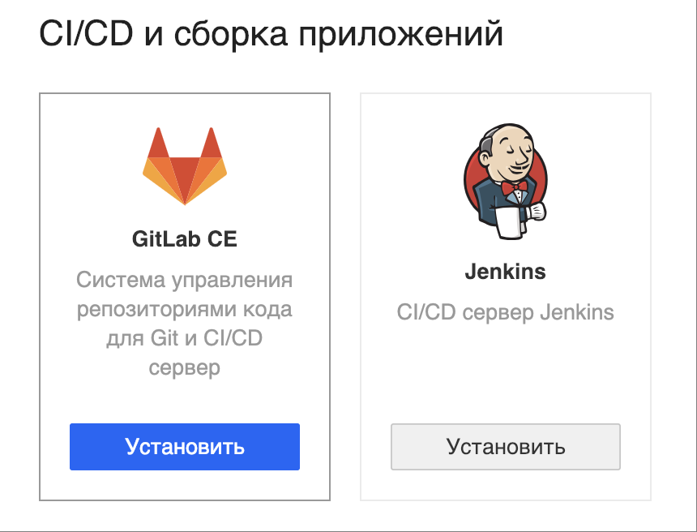
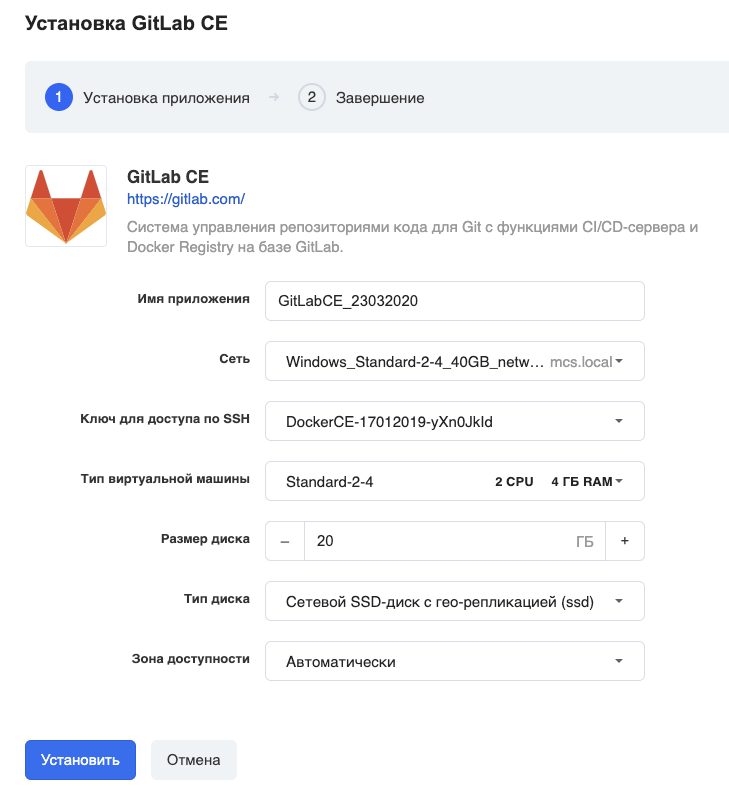
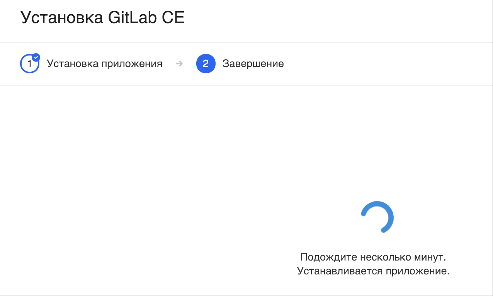
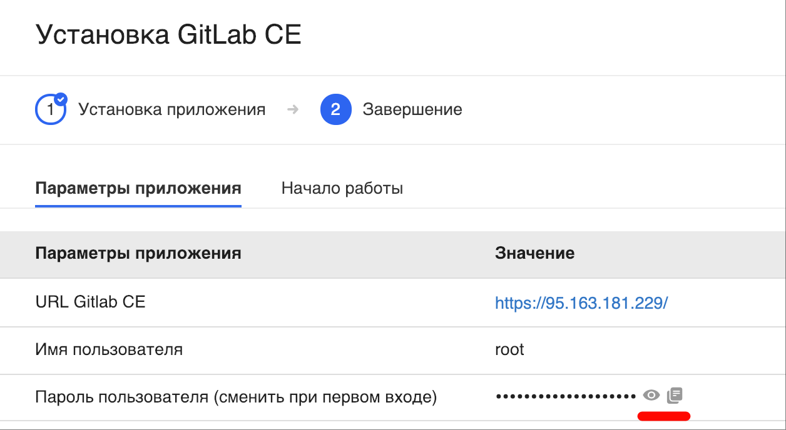
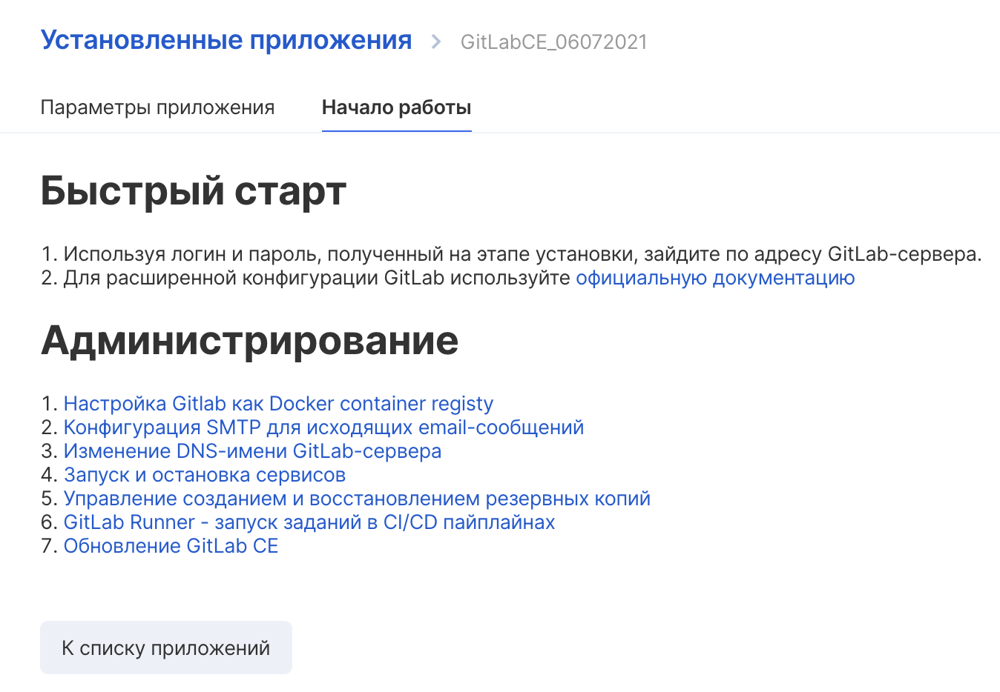

## Что такое GitLab CE

GitLab CE: система управления репозиториями кода для [Git](https://ru.wikipedia.org/wiki/Git "Git"). Имеет собственную справочную WiKi-подобную систему и система отслеживания ошибок. Распространяется на основе лицензии [Open core](https://ru.wikipedia.org/wiki/Open_core).

## Быстрый запуск

Перейдите в [личный кабинет](https://mcs.mail.ru/app/services/marketplace/) в раздел "Магазин приложений" и нажмите "Установить":

В следующем окне выберите нужные параметры виртуальной машины - имя приложения, сеть, зона доступности и т.д.:

### Важно!

Убедитесь, что у вас есть ранее созданный и сохранённый на вашем компьютере ключ доступа по SSH. Если такого нет, то выберите "Создать новый ключ".

Подождите несколько минут:

и вы увидите на карточке установленного приложения параметры доступа:

Первоначальный пароль пользователя можно посмотреть и скопировать в один клик.

Также на вкладке "Начало работы" вы найдёте ссылки на всю необходимую документацию по установленному приложению:

### Обратите внимание

VK Cloud гарантирует только корректную работу стороннего ПО, предустановленного в виртуальные машины по умолчанию. По вопросам конфигурирования, доработки, документации предустановленного стороннего ПО из раздела "Магазин приложений" мы консультаций не оказываем.
