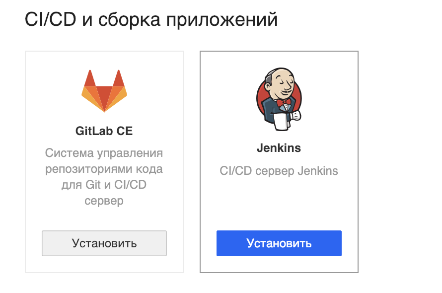
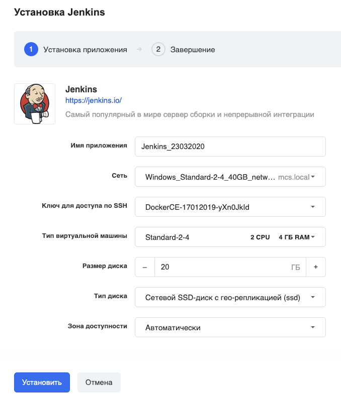
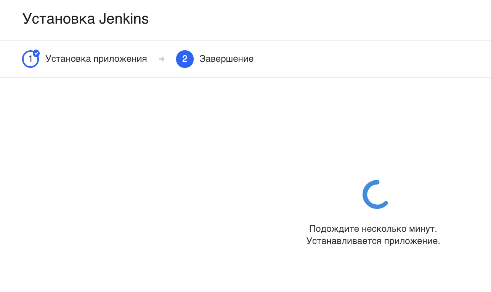
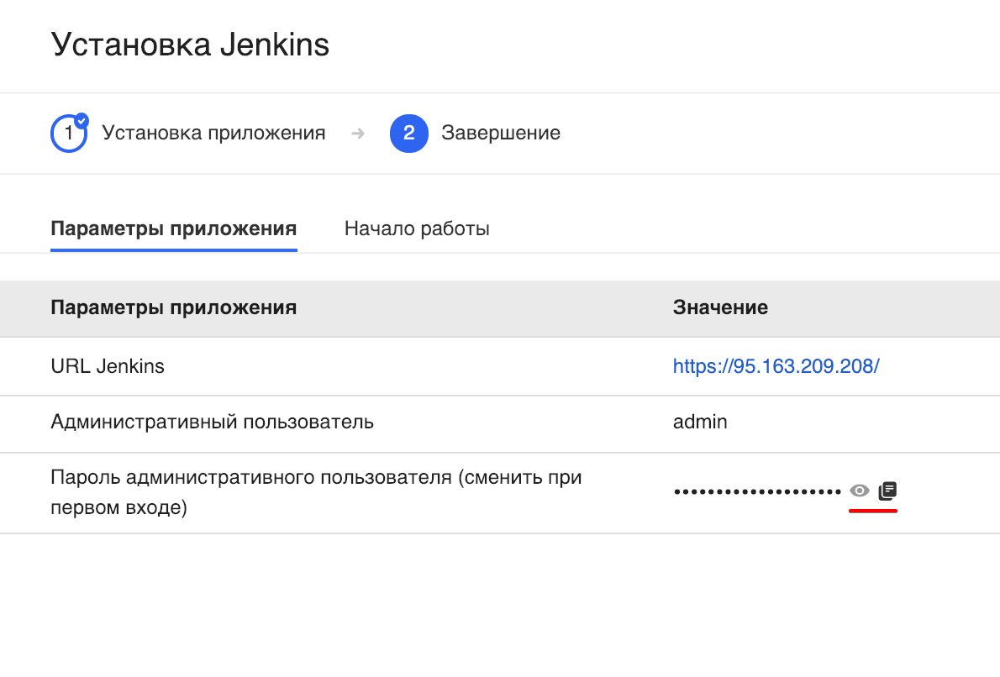
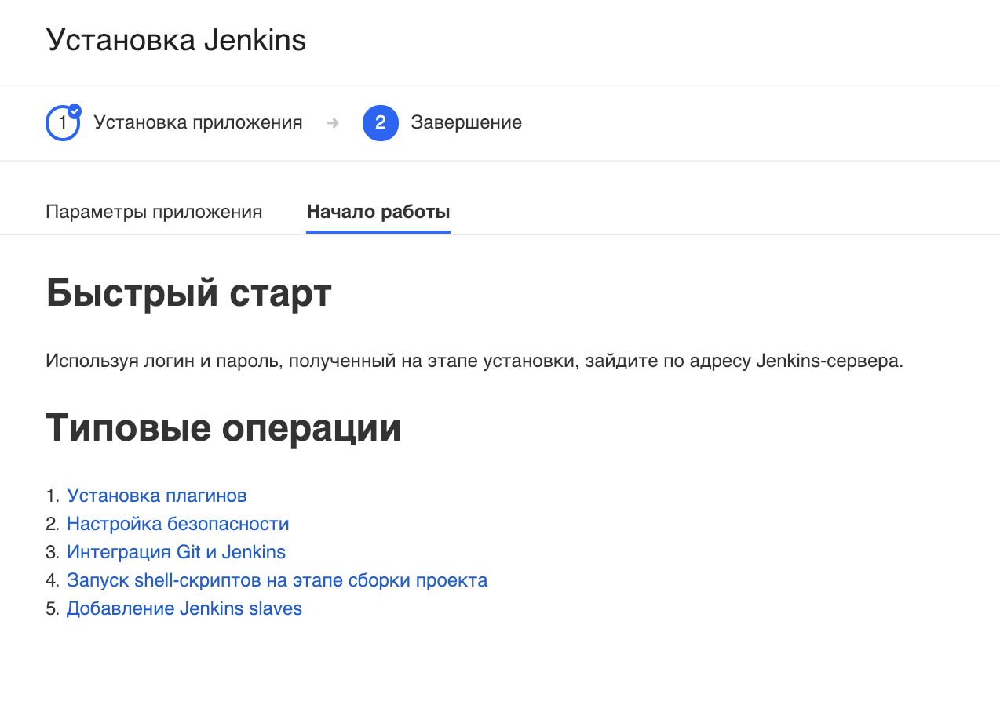

**Jenkins** — программная система с [открытым исходным кодом](https://ru.wikipedia.org/wiki/%D0%9E%D1%82%D0%BA%D1%80%D1%8B%D1%82%D0%BE%D0%B5_%D0%BF%D1%80%D0%BE%D0%B3%D1%80%D0%B0%D0%BC%D0%BC%D0%BD%D0%BE%D0%B5_%D0%BE%D0%B1%D0%B5%D1%81%D0%BF%D0%B5%D1%87%D0%B5%D0%BD%D0%B8%D0%B5 "Открытое программное обеспечение") на [Java](https://ru.wikipedia.org/wiki/Java "Java"), предназначенная для обеспечения процесса [непрерывной интеграции программного обеспечения](https://ru.wikipedia.org/wiki/%D0%9D%D0%B5%D0%BF%D1%80%D0%B5%D1%80%D1%8B%D0%B2%D0%BD%D0%B0%D1%8F_%D0%B8%D0%BD%D1%82%D0%B5%D0%B3%D1%80%D0%B0%D1%86%D0%B8%D1%8F "Непрерывная интеграция").

Позволяет автоматизировать часть [процесса разработки программного обеспечения](https://ru.wikipedia.org/wiki/%D0%A0%D0%B0%D0%B7%D1%80%D0%B0%D0%B1%D0%BE%D1%82%D0%BA%D0%B0_%D0%BF%D1%80%D0%BE%D0%B3%D1%80%D0%B0%D0%BC%D0%BC%D0%BD%D0%BE%D0%B3%D0%BE_%D0%BE%D0%B1%D0%B5%D1%81%D0%BF%D0%B5%D1%87%D0%B5%D0%BD%D0%B8%D1%8F "Разработка программного обеспечения"), в котором не обязательно участие человека, обеспечивая функции непрерывной интеграции.

---

Перейдите в [личный кабинет](https://mcs.mail.ru/app/services/marketplace/) в раздел "Магазин приложений" и нажмите "Установить":

В следующем окне выберите нужные параметры виртуальной машины - имя приложения, зона доступности и т.д.:

### Важно!

Убедитесь, что у вас есть ранее созданный и сохранённый на вашем компьютере ключ доступа по SSH. Если такого нет, то выберите "Создать новый ключ".

Если вы выбрали "Создать новый ключ", то вам на компьютер должен скачаться файл с расширением \*.pem:

Подождите несколько минут.

После установки откроется карточка приложения с параметрами подключения:

а на второй вкладке карточки приложения есть полезная информация и полезные ссылки:

### Обратите внимание

VK CS гарантирует только корректную работу стороннего ПО, предустановленного в виртуальные машины по умолчанию. По вопросам конфигурирования, доработки, документации предустановленного стороннего ПО из раздела "Магазин приложений" вы можете обратиться к разработчикам этих приложений самостоятельно.
