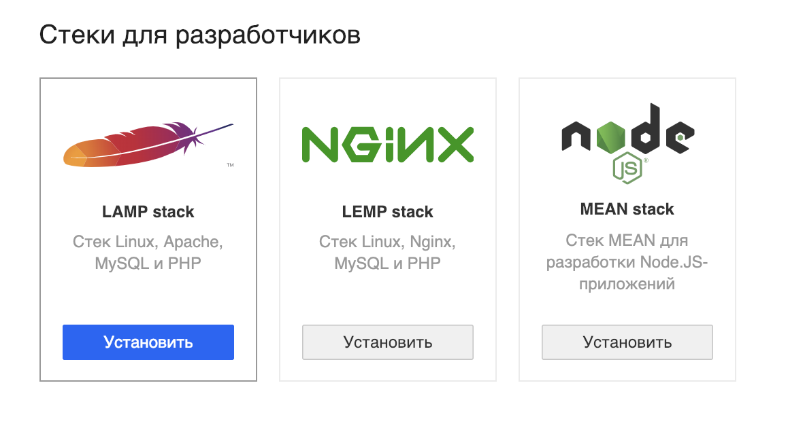
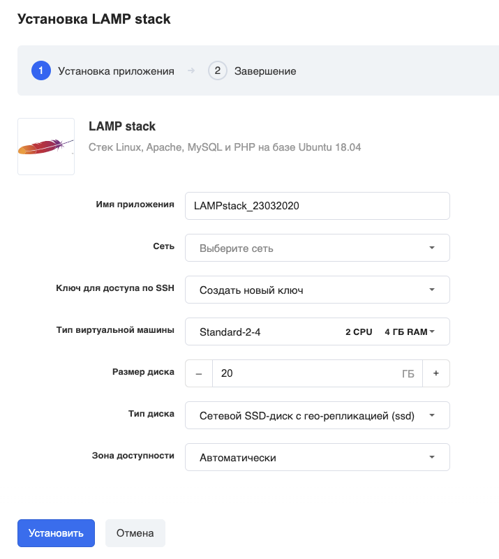
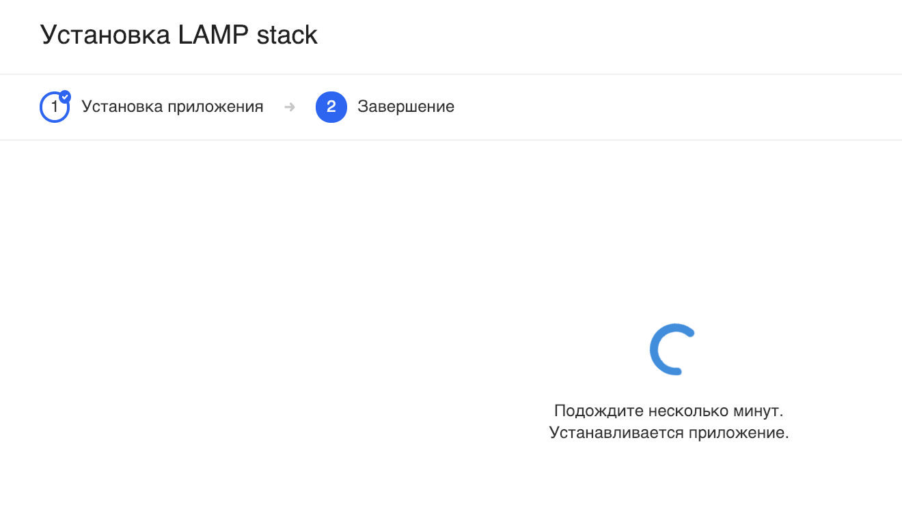
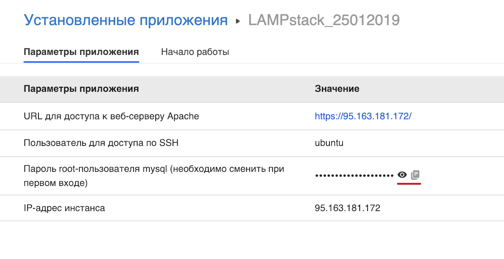
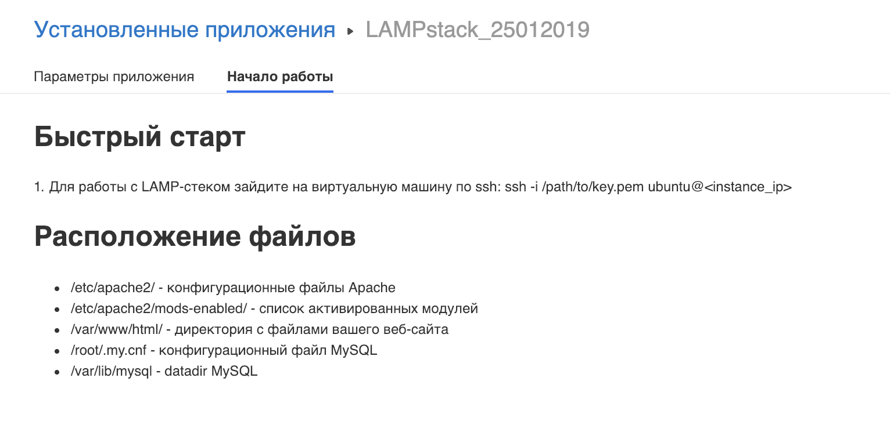

## Установка

Перейдите в [личный кабинет](https://mcs.mail.ru/app) в раздел "Магазин приложений" и нажмите "Установить":

В следующем окне выберите нужные параметры виртуальной машины - имя приложения, зона доступности и т.д.:

### Важно!

Убедитесь, что у вас есть ранее созданный и сохранённый на вашем компьютере ключ доступа по SSH. Если такого нет, то выберите "Создать новый ключ".

Если вы выбрали "Создать новый ключ", то вам на компьютер должен скачаться файл с расширением \*.pem:

Подождите несколько минут.

После установки откроется карточка приложения с параметрами подключения:

а на второй вкладке карточки приложения есть полезная информация и ссылка на дополнительные материалы:

