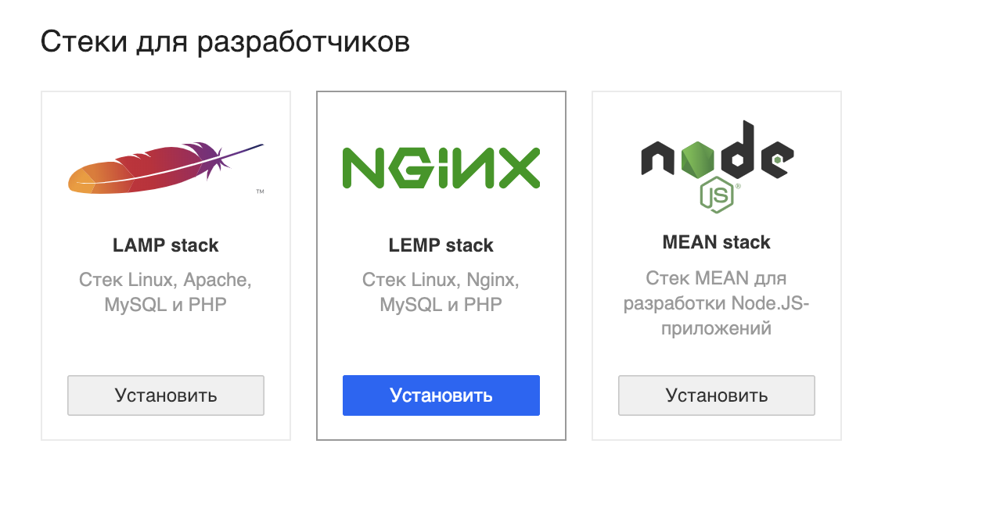
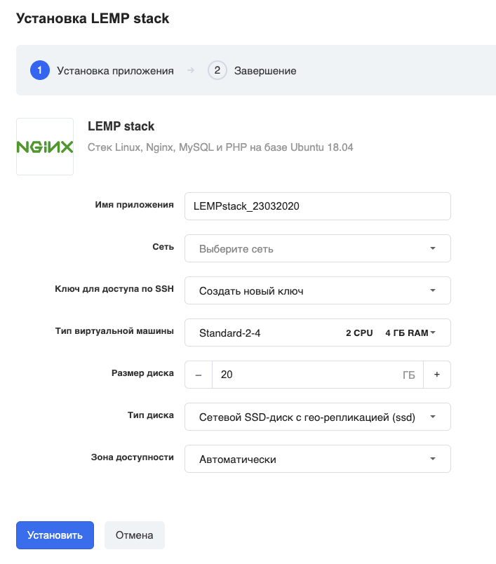
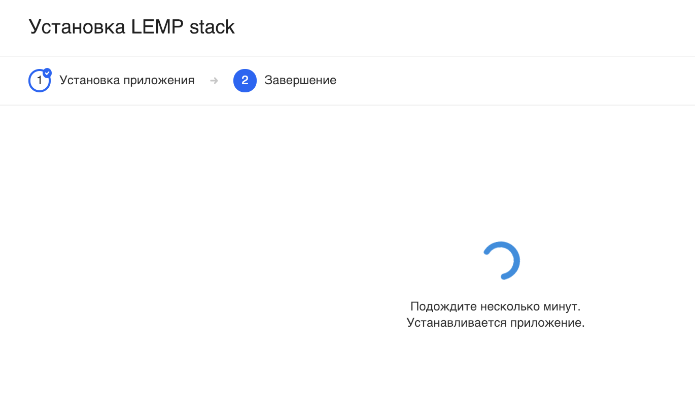
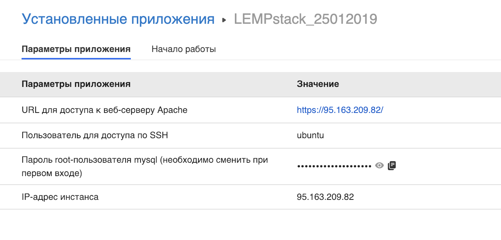
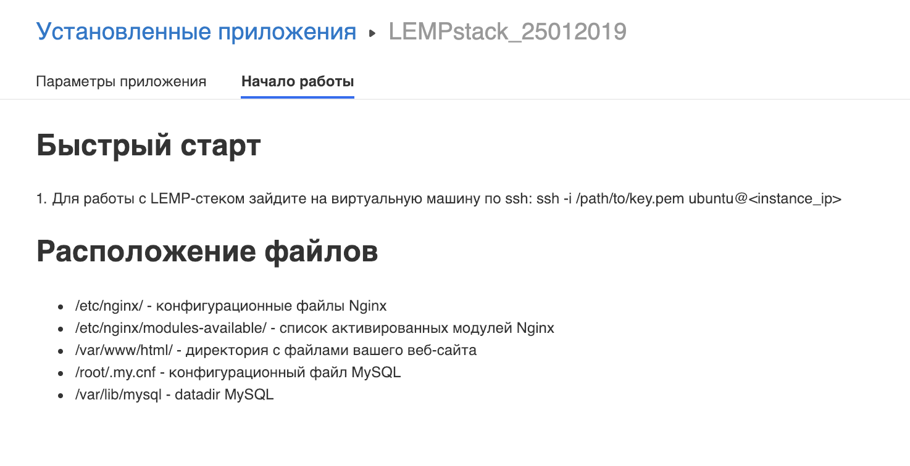

Nginx [engine x] — это HTTP-сервер и обратный прокси-сервер, почтовый прокси-сервер, а также TCP/UDP прокси-сервер общего назначения, изначально написанный [Игорем Сысоевым](http://sysoev.ru/). Уже длительное время он обслуживает серверы многих высоконагруженных российских сайтов, таких как [Mail.Ru](http://mail.ru/), [ВКонтакте](http://vk.com/) и [Рамблер](http://www.rambler.ru/). Согласно статистике Netcraft nginx обслуживал или проксировал [25.89% самых нагруженных сайтов в декабре 2018 года](https://news.netcraft.com/archives/2018/12/17/december-2018-web-server-survey.html). Вот некоторые примеры успешного внедрения nginx (тексты на английском языке): [Dropbox](https://blogs.dropbox.com/tech/2017/09/optimizing-web-servers-for-high-throughput-and-low-latency/), [Netflix](https://openconnect.netflix.com/en/software/), [Wordpress.com](https://www.nginx.com/case-studies/nginx-wordpress-com/),[FastMail.FM](http://blog.fastmail.fm/2007/01/04/webimappop-frontend-proxies-changed-to-nginx/).

---

Перейдите в [личный кабинет](https://mcs.mail.ru/app/services/marketplace/setup/lemp/) в раздел "Магазин приложений" и нажмите "Установить":

В следующем окне выберите нужные параметры виртуальной машины - имя приложения, зона доступности и т.д.:

### Важно!

Убедитесь, что у вас есть ранее созданный и сохранённый на вашем компьютере ключ доступа по SSH. Если такого нет, то выберите "Создать новый ключ".

Если вы выбрали "Создать новый ключ", то вам на компьютер должен скачаться файл с расширением \*.pem:

Подождите несколько минут.

После установки откроется карточка приложения с параметрами подключения:

а на второй вкладке карточки приложения есть полезная информация и ссылка на дополнительные материалы:

### Обратите внимание

VK Cloud гарантирует только корректную работу стороннего ПО, предустановленного в виртуальные машины по умолчанию. По вопросам конфигурирования, доработки, документации предустановленного стороннего ПО из раздела "Магазин приложений" мы консультаций не оказываем.
