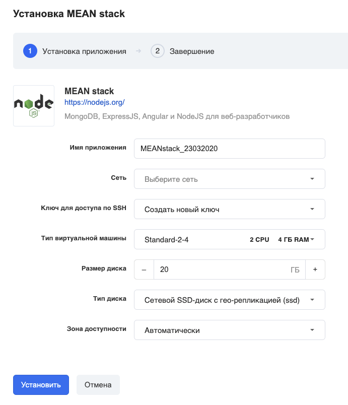
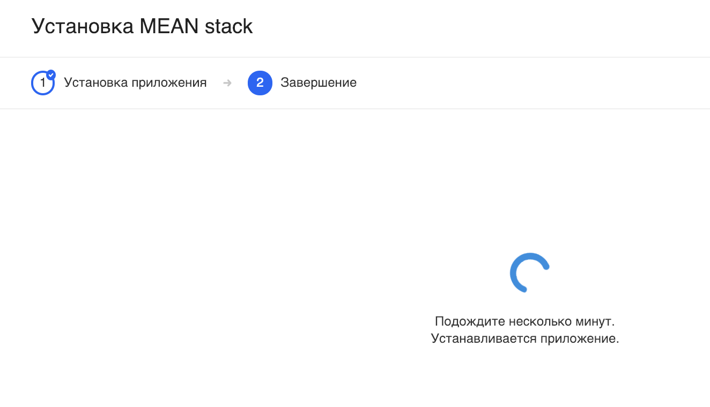
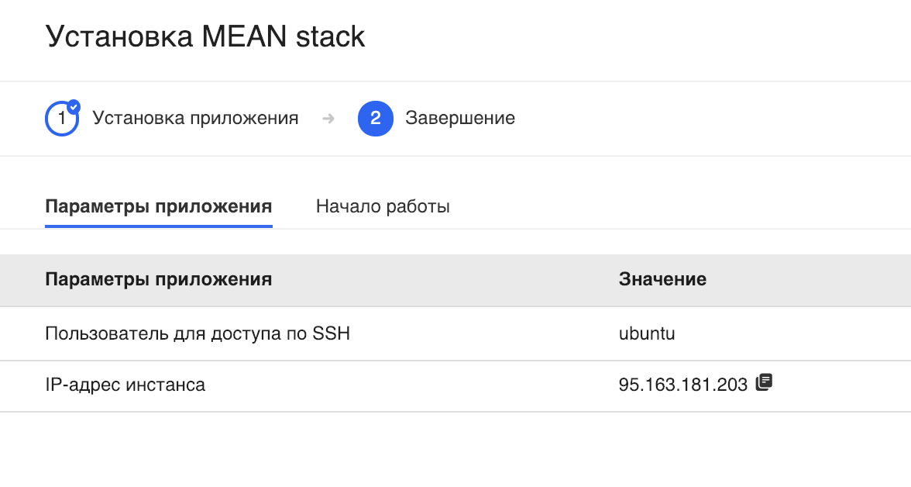
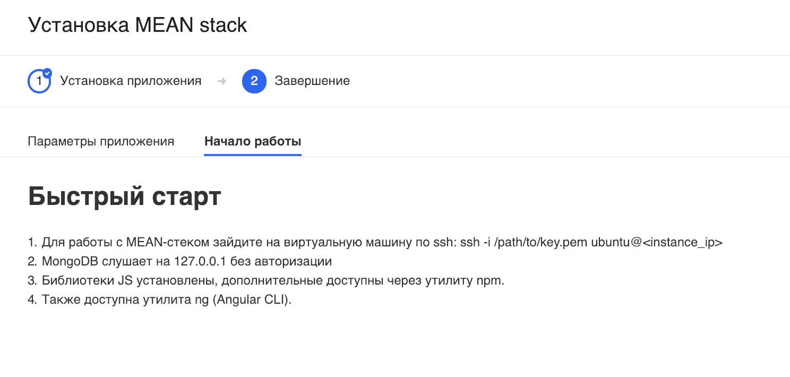

**MEAN** (аббревиатура от [MongoDB](https://ru.wikipedia.org/wiki/MongoDB "MongoDB"), [Express.js](https://ru.wikipedia.org/wiki/Express.js "Express.js"), [Angular.js](https://ru.wikipedia.org/wiki/Angular.js "Angular.js"), [Node.js](https://ru.wikipedia.org/wiki/Node.js "Node.js")) — набор (комплекс) серверного программного обеспечения, который, подобно [LAMP](https://ru.wikipedia.org/wiki/LAMP "LAMP"), используется для [веб-разработки](https://ru.wikipedia.org/wiki/%D0%92%D0%B5%D0%B1-%D1%80%D0%B0%D0%B7%D1%80%D0%B0%D0%B1%D0%BE%D1%82%D0%BA%D0%B0 "Веб-разработка"). Поскольку все компоненты набора (стека) поддерживают программирование на [JavaScript](https://ru.wikipedia.org/wiki/JavaScript "JavaScript"), и [серверная и клиентская часть](https://ru.wikipedia.org/wiki/Front_end_%D0%B8_Back_end "Front end и Back end") MEAN-приложений может быть написана на этом языке программирования.

---

Перейдите в [личный кабинет](https://mcs.mail.ru/app/services/marketplace/) в раздел "Магазин приложений" и нажмите "Установить":

В следующем окне выберите нужные параметры виртуальной машины - имя приложения, зона доступности и т.д.:

### Важно!

Убедитесь, что у вас есть ранее созданный и сохранённый на вашем компьютере ключ доступа по SSH. Если такого нет, то выберите "Создать новый ключ".

Если вы выбрали "Создать новый ключ", то вам на компьютер должен скачаться файл с расширением \*.pem:

Подождите несколько минут.

После установки откроется карточка приложения с параметрами подключения:

а на второй вкладке карточки приложения есть полезная информация:

### Обратите внимание

VK Cloud гарантирует только корректную работу стороннего ПО, предустановленного в виртуальные машины по умолчанию. По вопросам конфигурирования, доработки, документации предустановленного стороннего ПО из раздела "Магазин приложений" мы консультаций не оказываем.
