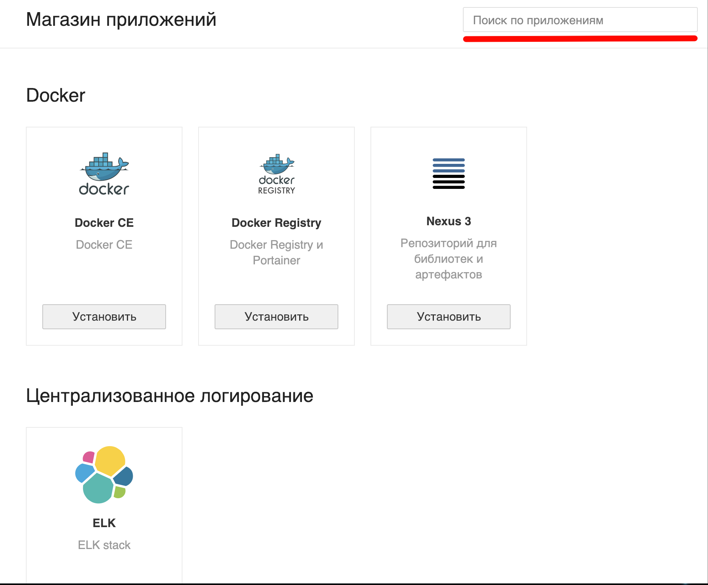

## Создание виртуальной машины с предустановленным ПО

В [разделе личного кабинета "Магазин приложений"](https://mcs.mail.ru/app/services/marketplace/) вам уже доступны для создания виртуальные машины с предустановленным ПО:

### Внимание!

Первичное подключение магазина приложений и создание виртуальных машин занимает некоторое время - в среднем от 1 до 10 минут.

Затем вы увидите этот раздел полностью - с доступными для развёртывания приложениями. Также в этом разделе есть поиск по приложениям:

## Подключение и управление

Выберите нужный вам тип подключения и прочитайте о том, как это сделать, в следующих статьях:

- [Подключение к инстансу через консоль VNC](https://mcs.mail.ru/help/iaas-create/vnc)
- [Подключение к инстансу через консоль PuTTY](https://mcs.mail.ru/help/iaas-create/putty)
- [Подключение к инстансу через консоль Cygwin](https://mcs.mail.ru/help/iaas-create/cygwin)
- [Подключение к инстансу через RDP](https://mcs.mail.ru/help/iaas-create/rdp-connect?kb_language=ru_RU)

Также рекомендуем следующие статьи:

- [Устройство панели управления VK Cloud](https://mcs.mail.ru/help/iaas-create/control?kb_language=ru_RU)
