#### Автор: Михаил Волынов

Эта статья поможет вам установить сервер мониторинга ELK и подключить к нему filebeat-агенты для логов приложения Nginx, а также познакомит с некоторыми возможностями Kibana для работы с логами

**ELK** — это мощный набор инструментов для эффективного решения широкого спектра задач сбора, хранения и анализа данных:

- **E**lasticsearch – решение для полнотекстового поиска, построенное поверх Apache Lucene и имеющее дополнительные удобства
- **L**ogstash – утилита для сборки, фильтрации и последующего перенаправления в конечное хранилище данных
- **K**ibana — приложение, позволяющее брать/искать данные по Elasticsearch и строить наглядные графики

## **Схема стенда**

Мы поднимем сервер ELK в облаке VK Cloud Solutions и подключим к нему агенты мониторинга Nginx на удаленных узлах

**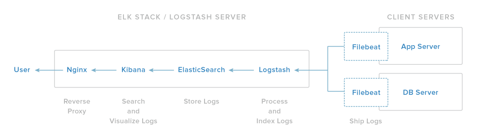**

(источник: www.digitalocean.com)

В данной статье будем считать, что у нас есть несколько узлов, на которых необходимо настроить Nginx для экспорта логов в ELK. Чтобы обеспечить возможность взаимодействия между машинами, эти узлы должны быть объединены в одну сеть

## **Подключение сервера ELK в Marketplace**

1.  [Выполните быстрый запуск ELK Stack](https://mcs.mail.ru/help/quick-start/-elk-stack-elasticsearch-logstash-kibana)
2.  Запомните IP-адрес инстанса, имя и пароль пользователя для доступа к Kibana. Они понадобятся позже, при проверке функциональности на узле c ELK
3.  Подключитесь к инстансу по ssh, используя pem-файл. Для этого выполните команду:

```
ssh -i /path/to/key.pem ubuntu@<instance_ip>
```

4.  Установите плагины ingest-geoip и ingest-user-agent для Elasticsearch, они необходимы для совместной работы Kibana и логов Nginx. Для этого, находясь в папке с установленным elasticsearch (по умолчанию для Ubuntu — /usr/share/elasticsearch/), выполните команды:

```
bin/elasticsearch-plugin install ingest-geoip
bin/elasticsearch-plugin install ingest-user-agent

```

5.  Чтобы подключить установленные модули, перезапустите Elasticsearch, выполнив команду:

```
sudo service elasticsearch restart
```

## **Настройки на удаленных узлах**

1.  Подключитесь к удаленному узлу, который вы хотите подключить к ELK
2.  Поскольку мы создаем связь ELK и Nginx, установите Nginx из стандартных репозиториев Ubuntu, выполнив команду:

```
sudo apt update
sudo apt install nginx
```

3.  Для анализа логов в реальном времени [установите Filebeat](https://www.elastic.co/guide/en/beats/filebeat/6.4/filebeat-installation.html)
4.  Откройте конфигурационный файл /etc/filebeat/filebeat.yml для редактирования и укажите в нем свои настройки:\*\*

    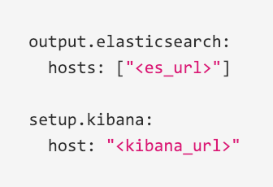

    \*\*

- <es_url> — IP-адрес elasticsearch с номером порта 9200
- <kibana_url> — IP-адрес инстанса с Kibana

Примеры для <es_url>:

- прямой адрес:

```
output.elasticsearch:   
hosts: ["https://localhost:9200"]
```

- явное указание протокола:

```
output.elasticsearch:  
hosts: ["localhost:9200"]   
protocol: "https"
```

- множественное указание хостов:

```
output.elasticsearch:   
hosts: ["10.45.3.2:9220", "10.45.3.1:9200"]   
protocol: https
```

**Примечание**

Подробнее о настройках в файле filebeat.yml читайте [тут](https://www.elastic.co/guide/en/beats/filebeat/current/elasticsearch-output.html)

5.  Включите модуль Nginx для Filebeat, выполнив команду:

```
sudo filebeat modules enable nginx
```

6.  Чтобы гибко настроить filebeat, отредактируйте файл /etc/filebeat/modules.d/nginx.yml. Вид этого файла по умолчанию:

```
- module: nginx
  # Access logs
  access:
    enabled: true

    # Set custom paths for the log files. If left empty,
    # Filebeat will chose the paths depending on your OS.
    #var.paths:

  # Error logs
  error:
    enabled: true

    # Set custom paths for the log files. If left empty,
    # Filebeat will choose the paths depending on your OS.
    #var.paths
```

7.  Если дашборды для Kibana не были настроены ранее, выполните их загрузку, используя команду:

```
sudo filebeat setup
```

8.  Для запуска Filebeat выполните команду:

```
sudo service filebeat start
```

Один узел настроен. Дополнительные узлы настраиваются аналогично

## **Проверка функциональности на узле с ELK**

1.  Чтобы удобно и эффективно работать с логами, используя соответствующие IP-адрес инстанса, имя и пароль пользователя (используйте https), подключитесь к Kibana:

**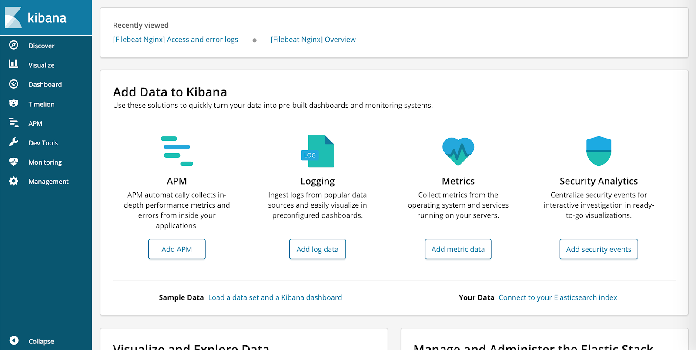**

### Примечание.

В VK CS Marketplace используются самоподписанные сертификаты. Чтобы пользоваться SSL, добавьте сертификат в исключения или используйте свой сертификат

2.  Чтобы убедиться, что все верно настроено, перейдите в раздел **Logging**. Для этого нажмите кнопку **Add log data** и выберите подраздел **Nginx logs**

.png>)

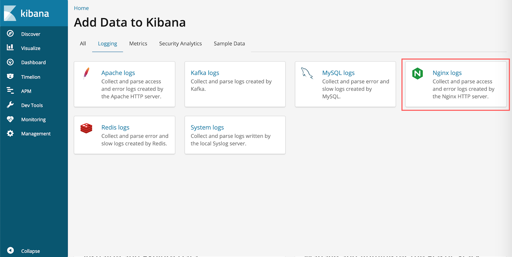

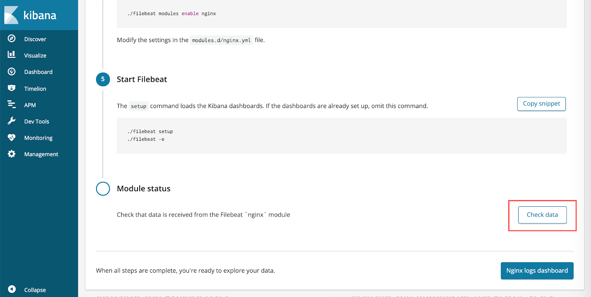

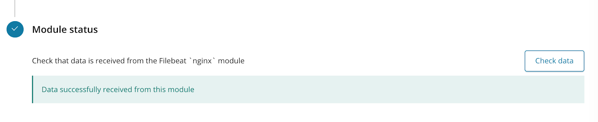

Если все сделано верно, при нажатии на кнопку **Check data** появится сообщение **Data successfully received from this module**

## **Работа с дашбордами Kibana**

Дашборды Kibana позволяют просмотреть детализацию по логам Nginx с удаленного узла и при необходимости выполнить фильтрацию и поиск. Поэтому работа с дашбордами имеет смысл только при наличии логов Nginx, доступных для просмотра

В боковом меню выберите пункт **Dashboard**. В результате отобразится стандартный Dashboard для Nginx Filebeat с множеством различных данных о запросах. Он позволяет строить наглядные диаграммы, а также показывает карту мира для IP-адресов, обращавшихся к серверу

**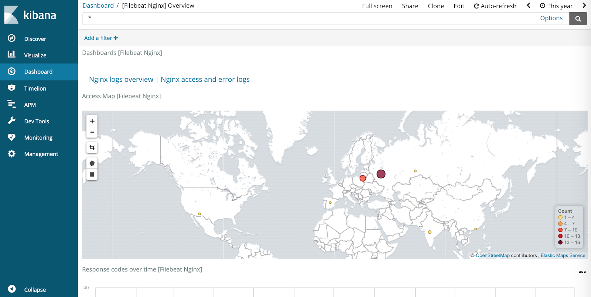**

Чтобы просмотреть список всех запросов к серверу за период, указанный в правом верхнем углу, нажмите кнопку **Nginx access and error logs**

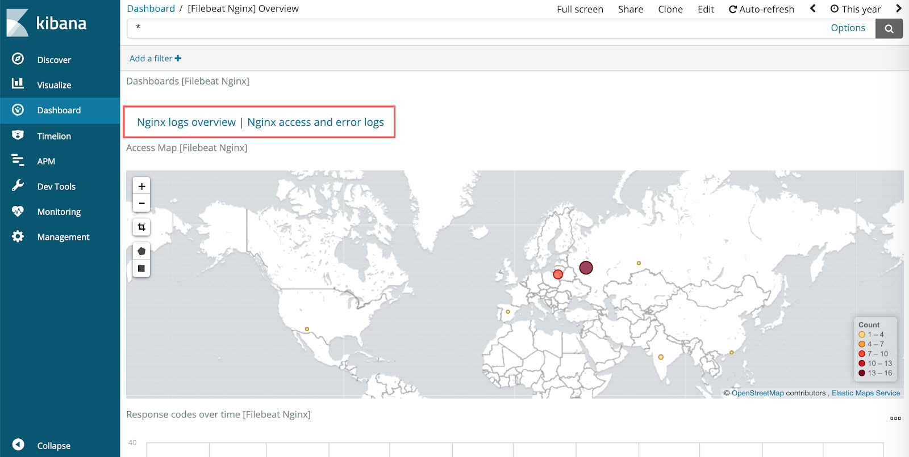

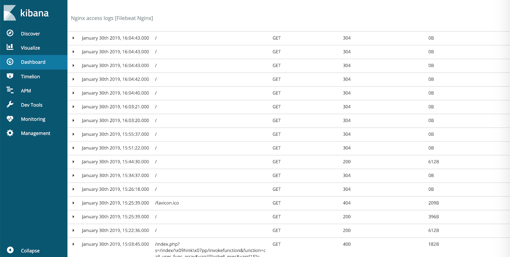

Чтобы просмотреть детализацию по запросу, нажмите треугольник в левой части соответствующей строки

**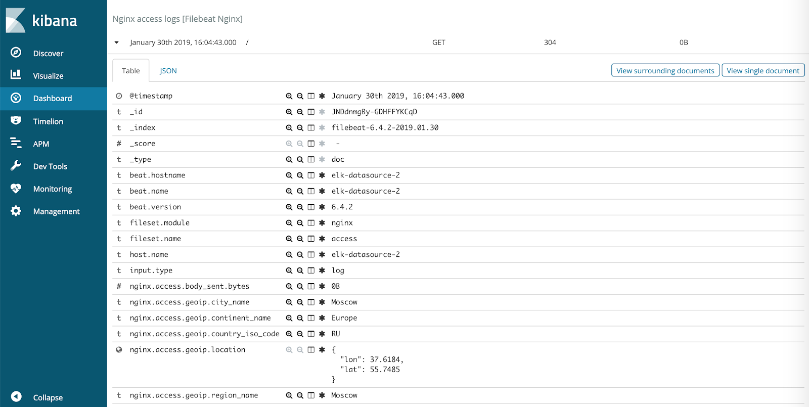**

Для быстрого поиска можно использовать фильтрацию, нажав кнопку **Add filter** слева вверху.

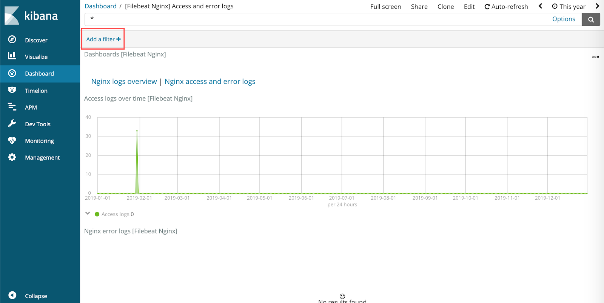

При настройке фильтра нужно выбрать поле из представленных и обозначить условие поиска (например, на скриншоте ниже все запросы с кодом ответа 200)

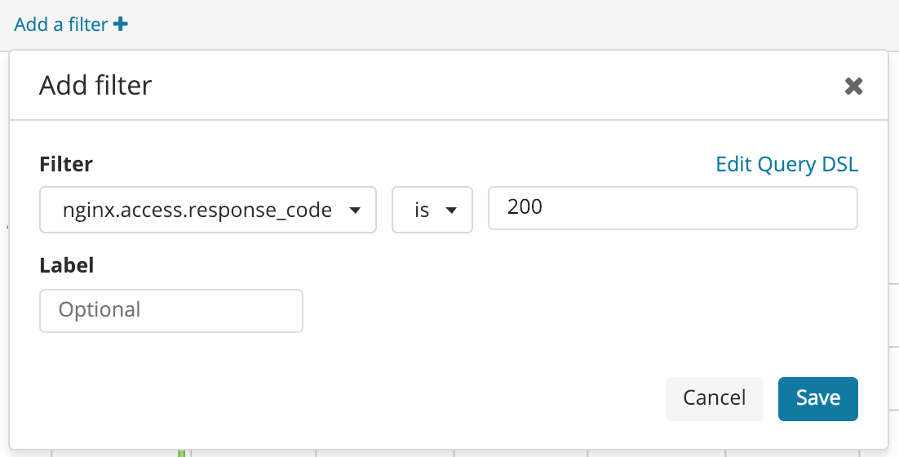
