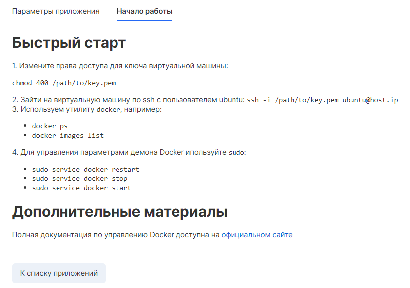
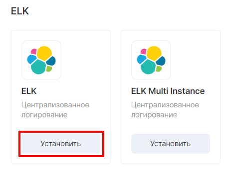
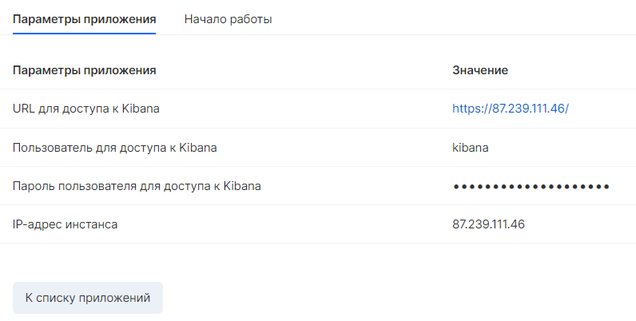
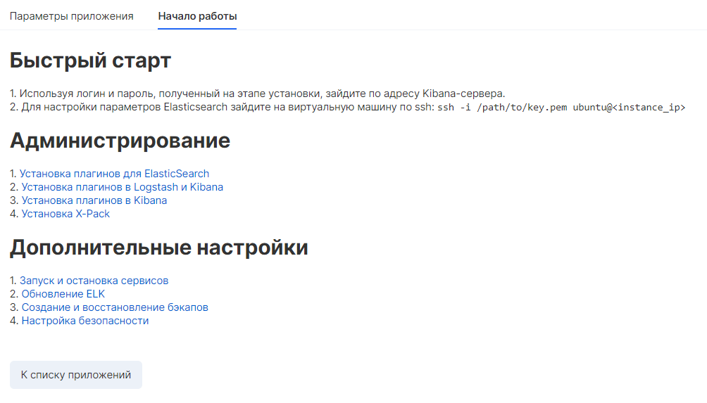
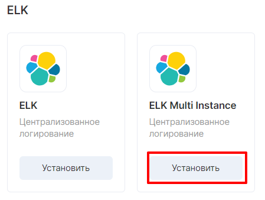
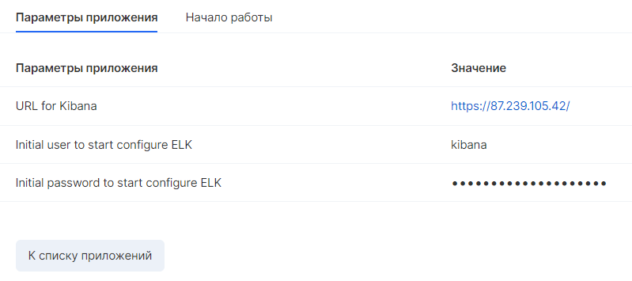
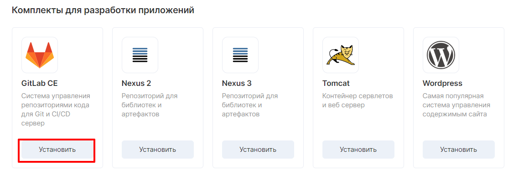
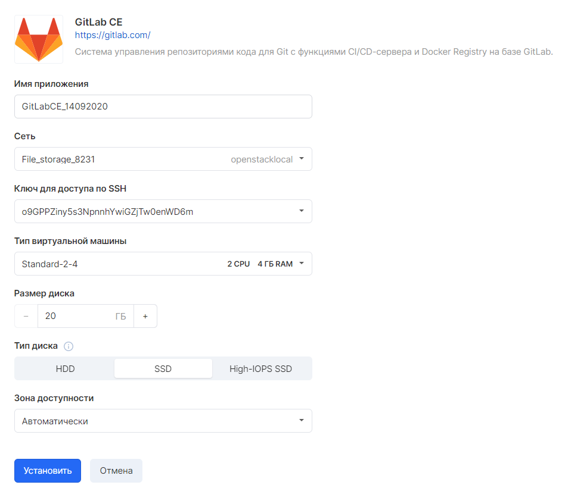
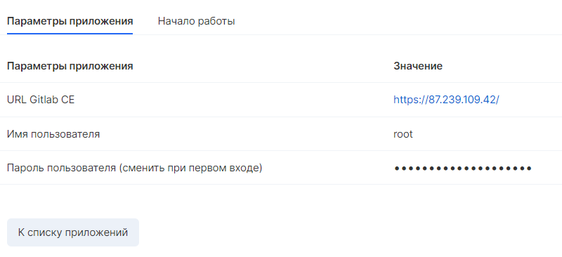

Docker CE
---------

При выборе соответстующего приложения открывается окно настройки:

После выбора соответствующих характеристик необходимо подождать несколько минут для установки приложения. 

После установки откроется карточка приложения с параметрами подключения:

Docker Registry
---------------

 

После выбора соответствующего приложения откроется окно с выбором параметров:

В течение нескольких минут будет проходить установка приложения. Далее, откроется окно с характеристиками ВМ:

Nexus
-----

При выборе Nexus открывается окно с установкой необходимых параметров:

Приложение устанавливается несколько минут. Далее появляется окно с характеристиками:

 

ELK
---

В следующем окне необходимо выбрать параметры ВМ:

Через несколько минут после установки откроется карточка приложения с параметрами приложения и описанием начала работы:

  

ELK Multi instance
------------------

При выборе соответствующего приложения открывается окно установки параметров для elasticsearch instance и gatewayinstance:

Далее, в дополнительных настройках будет предложено указать количество нод для Elasticsearch

После нескольких минут установки будет доступна информация по параметрам приложения и описание начала работы:

GitLab CE
---------

Далее, на этапе установки необходимо указать параметры приложения:

В завершении установки появится карточка приложения:

Panel title
-----------

Panel content