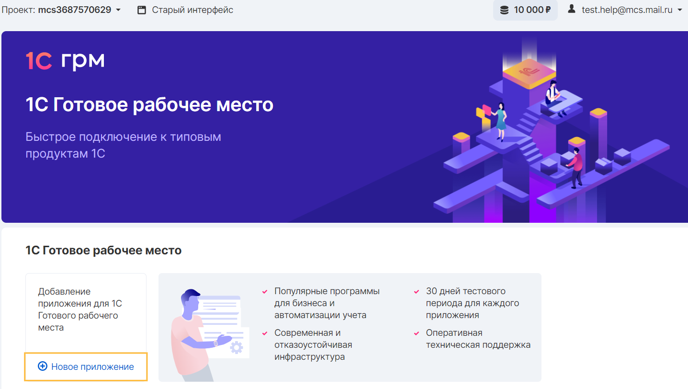
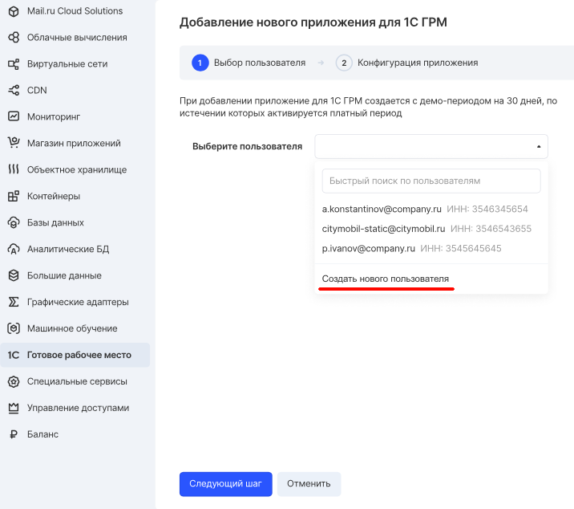
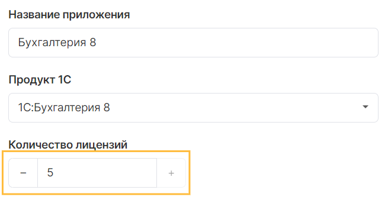
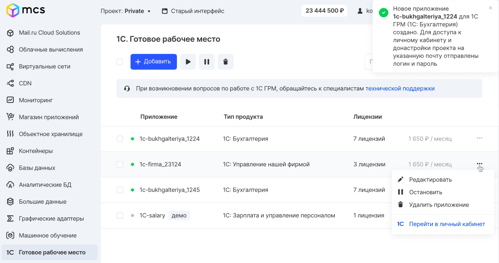
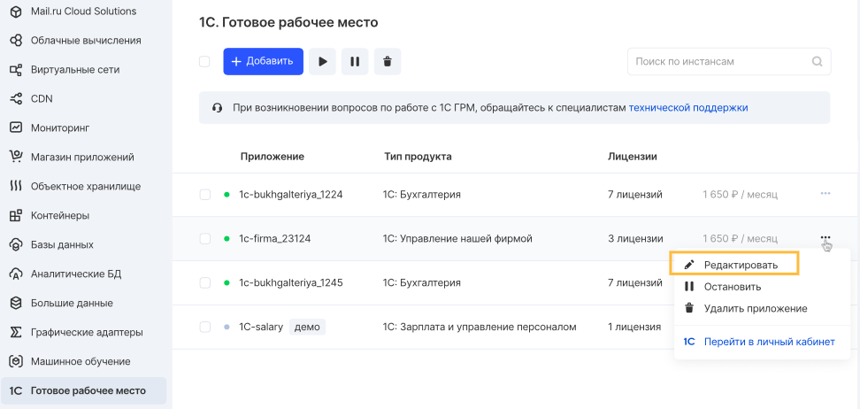
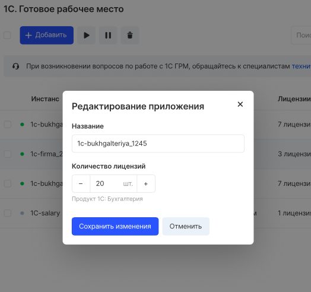

Для активации сервиса 1С:ГРМ необходимо иметь зарегистрированную учетную запись и активный проект. В случае необходимости следует подтвердить учетную запись и активировать номер телефона, после чего о доступности создания приложения сообщит панель VK CS:

Добавление приложения 1С состоит из нескольких этапов, которые сопровождает мастер создания приложения.

## Пользователь

Пользователем приложения является представитель юридического лица, регистрирующий организацию в приложении.

### **Примечание**

Данные учетной записи пользователя не вносятся в базу приложения 1С и регистрацию организации необходимо выполнить самостоятельно после запуска приложения.

Для его создания необходимо на первом шаге выбрать соответствующий пункт "Создать нового пользователя":

## Создание пользователей

В мастере создания нового пользователя необходимо заполнить карточку его данными:

- Фамилия Имя Отчество. Данные контактного лица организации
- Телефон. Контактный телефон представителя организации
- Email. Актуальной почтовый адрес представителя, на который будут отправляться уведомления
- ИНН. Идентификационный номер организации-налогоплательщика

### **Внимание**

При регистрации пользователя следует обращать внимание на заполняемые данные. После создания пользователя изменить или удалить его данные невозможно.

Поле ИНН подлежит проверке на этапе создания с использованием базы данных 1С:Контрагент. По завершении заполнения данных формы создания приложения происходит верификация ИНН. В случае его некорректного заполнения, приложение не будет создано, для корректировки значения поля ИНН следует вернуться на первый этап и указать корректное значение.

Зарегистрированному пользователю на указанный email адрес будет отправлено сообщение, содержащее данные для входа и администрирования приложения 1С.

## Лицензии

Удаленный доступ к приложению через веб-интерфейс возможен при наличии достаточного количества лицензий, предоставляющих право доступа пользователю к созданному приложению.

Для приложений 1С предусмотрено максимальное значение возможных лицензий удаленного доступа:

- Для файлового режима: от 1 до 5 единиц
- Для клиент-серверного режима: от 6 до 50 единиц

Назначение лицензий происходит автоматически при создании пользователя в приложении.

Количество лицензий можно изменить в панели управления приложениями как в большую, так и в меньшую сторону но только в рамках выбранного режима. Если возникает необходимость увеличения лицензий сверх 5 единиц при использовании файлового режима, необходимо [обратиться в техническую поддержку 1С ГРМ](mailto:support.1c.grm@mcs.mail.ru) с запросом на изменение типа.

### **Примечание**

Изменение количества лицензий в карточке приложения происходит моментально, однако для вступления в силу изменений в приложении может понадобиться до 5 минут.

## Запуск приложения

После успешного создания приложения оно отобразится в списке приложений панели VK CS. В карточке приложения указываются данные, внесенные при создании. Изменить или удалить эти данные невозможно.

### **Внимание**

Процесс создания приложения может занимать до 15 минут. В это время создается виртуальная инфраструктура и разворачивается приложение 1С. В этот период действия с приложением будут недоступны.

## Редактирование приложения

Управление установленными приложениями доступно в [разделе личного кабинета](https://mcs.mail.ru/app/services/grm/apps/) в контекстном меню каждого из приложений.

Редактирование возможно только для количества лицензий, предоставляющих удаленный доступ пользователям к приложению:

## Подключение к приложению

Удаленный доступ к приложению для его администрирования осуществляется с помощью учетных записей пользователей, создаваемых в приложении. Каждый создаваемый пользователь потребляет одну лицензию, назначенную на приложение в панели VK CS.

Первичное подключение для настройки и администрирования приложения может быть выполнено при использовании одной лицензии, назначаемой Пользователю при создании приложения 1С:ГРМ. Данные о подключении направляются на почтовый адрес Пользователя, указанный при его регистрации.
