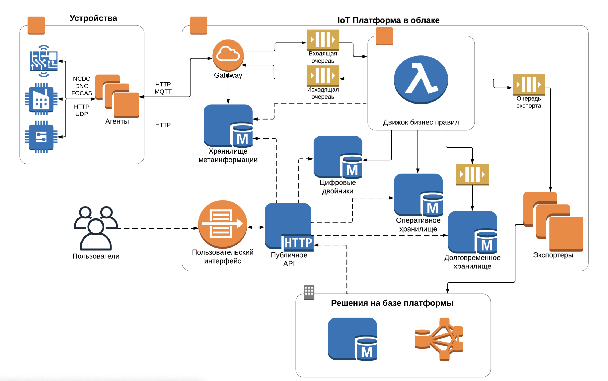

Cloud IoT Platform позволяет агрегировать данные с подключенных [устройств](../devices/) и обрабатывать их:

- вести реестр устройств, их шаблонов, настроек и другой информации;
- подключать устройства по любому протоколу с помощью [агентов](../agents/);
- анализировать данные с устройств в режиме, близком к реальному времени, с помощью бизнес-правил на Python;
- использовать быстрый кеш для доступа к оперативным данным и долговременное хранилище для аналитики по историческим данным;
- интегрироваться со сторонними системами.

Работать с платформой можно через [личный кабинет](https://iot.mcs.mail.ru) или через [API](../../../../additionals/api/api-iot).

## Архитектура платформы IoT

Агенты — программы, обеспечивающие совместимость протоколов платформы и устройства. Они собирают данные с устройств и передают информацию в шлюз (Gateway) платформы по специализированному протоколу на базе HTTP/MQTT.

Данные с устройств обрабатываются скриптами пользователя (бизнес-правилами) и, в зависимости от настроек, сохраняются в оперативное хранилище, долговременное хранилище или сервис цифровых двойников.

[Бизнес-правила](#biznes-pravila) могут использовать данные из любого хранилища платформы, отправлять HTTP-запросы в сторонние системы, а также отправлять данные через сервис экспортеров.

## Типы данных

В Cloud IoT Platform хранятся следующие типы данных:

- Метаинформация — пользовательские настройки, информация об устройствах и их шаблонах, бизнес-правила.
- Данные с устройств — измерения сенсоров, информация о текущем состоянии устройств.

## Подключение устройств

К платформе можно подключить любые типы устройств по любому протоколу (подход Protocol Agnostic) с помощью агентов. Для подключения устройств агенты:

1. Подключаются к платформе по протоколу HTTP/MQTT и авторизуются.
1. Получают список всех закрепленных за ними устройств и их конфигурацию.
1. Подключаются к этим устройствам, используя нужный протокол, и становятся адаптером между устройством и платформой.

Подробнее о подключении устройств читайте в разделе [Как подключить устройство](../devices/connect-device/).

## Бизнес-правила

Бизнес-правила — это написанные пользователями скрипты на Python. Они выполняются при наступлении определенного события или момента времени. Их можно использовать для обработки потока данных от устройств, а также для интеграции со сторонними системами на платформе.

Выполнение бизнес-правил может быть привязано:

- К одному устройству. Правило будет выполняться при наступлении события для этого устройства.

- К группе устройств. Правило будет выполняться при наступлении события для любого из устройств этой группы.

- Ко времени. Правило будет выполняться по расписанию, без привязки к событиям от устройств.

Для бизнес-правил доступен SDK, который позволяет обращаться к хранилищам платформы и внешним системам.

Например, по данным из оперативного хранилища можно прогнозировать значения и сравнивать прогноз с данными, поступающими от датчиков. При несоответствии отправлять пользователю предупреждения через сторонний SMS-шлюз.

Подробнее о правилах читайте в разделе [Библиотека SDK](../rules/).

## Публичный API

С помощью Cloud IoT Platform API можно:

- обращаться к хранилищу метаинформации;
- использовать данные от устройств в оперативном и долговременном хранилище, а также сервис цифровых двойников;
- отправлять команды на устройства и проверять статусы этих команд;
- просматривать логи правил и агентов;
- управлять пользователями и сервисными аккаунтами.

Подробнее об API читайте в разделе [Платформа интернета вещей](../../../../additionals/api/api-iot).
