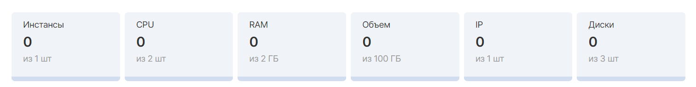

## Бонусные баллы

При первой регистрации в VK Cloud и активации сервисов начисляются бонусные баллы, подробнее в разделе [Биллинг](/ru/additionals/billing/concepts/bonus).

По итогам предоставления информации о задачах, которые планируются решить с помощью платформы VK Cloud, служба поддержки может расширить период тестирования.

<info>

1 бонусный балл = 1 рублю.

</info>

Решение о расширении периода тестирования принимается по итогам предоставления информации о целях использования платформы и задачах.

## Стартовые квоты

При [регистрации](https://mcs.mail.ru/app/signup/) и подключении сервисов выделяется следующая квота на ресурсы:

<table style="width: 63%; margin-right: calc(37%);"><tbody><tr><td style="width: 58.2372%;"><em>Ресурс</em></td><td style="width: 22.532%;"><em>Количество</em></td><td style="width: 19.0705%;"><em>Единица</em></td></tr><tr><td style="width: 58.2372%;">Инстанс</td><td style="width: 22.532%;">1</td><td style="width: 19.0705%;">шт.</td></tr><tr><td style="width: 58.2372%;">CPU</td><td style="width: 22.532%;">2</td><td style="width: 19.0705%;">шт.</td></tr><tr><td style="width: 58.2372%;">RAM</td><td style="width: 22.532%;">2</td><td style="width: 19.0705%;">GB</td></tr><tr><td style="width: 58.2372%;">Диск</td><td style="width: 22.532%;">3</td><td style="width: 19.0705%;">шт.</td></tr><tr><td style="width: 58.2372%;">Объем диска HDD / SSD</td><td style="width: 22.532%;">100</td><td style="width: 19.0705%;">GB</td></tr><tr><td style="width: 58.2372%;">Объем диска High-iops SSD</td><td style="width: 22.532%;">10</td><td style="width: 19.0705%;">GB</td></tr><tr><td style="width: 58.2372%;">IP адрес (Floating IP)</td><td style="width: 22.532%;">1</td><td style="width: 19.0705%;">шт.</td></tr><tr><td style="width: 58.2372%;">Маршрутизатор</td><td style="width: 22.532%;">1</td><td style="width: 19.0705%;">шт.</td></tr></tbody></table>

Доступные ресурсы отображаются в разделах соответствующих сервисов и могут отличаться, в зависимости от выбранного сервиса. Пример набора квот у [Облачных вычислений](https://mcs.mail.ru/app/services/infra/servers/):

<warn>

В личном кабинете отображаются не все квоты проекта. Полный список можно получить при помощи API.

</warn>
