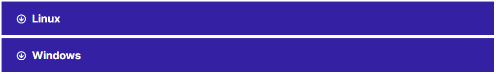

В документации VK CS используется несколько типографских условных обозначений.

## Заметки

Заметки оформляются следующим образом.

**Примечание**

Комментарий с дополнительной информацией, поясняющей часть текста.

**Важно**

Информация, которую необходимо знать прежде, чем продолжить.

**Совет**

Необязательный, но весьма полезный совет.

**Предупреждение**

Критически важная информация о риске потери данных или проблемах с безопасностью.

## Запросы команд

```
command
```

Любой пользователь, включая пользователя root, может выполнять команды, начинающиеся с "$".

```
# command
```

Команды, начинающиеся с "#", должен выполнять пользователь root. Кроме того, эти команды можно начинать с команды sudo (если доступна), чтобы выполнять их.

Каждый блок кода можно скопировать, а также увидеть на каком языке написан код.


## Скрытый текст

Чтобы не переполнять информацией статью, она может быть скрыта в блоки выпадающих текстов, при выборе которых отображается информация. Нажатие на соответствующий блок отобразит скрытый текст.



Команда поддержки VK CS будет рада пожеланиям и дополнениям, а также сообщениям об ошибках в Документации. [Сообщите нам](mailto:support@mcs.mail.ru) и мы внесем изменения.
