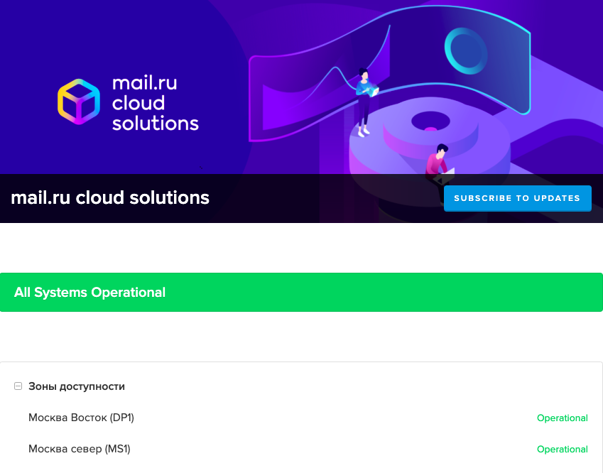
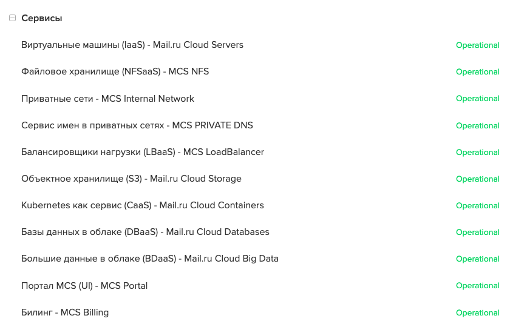
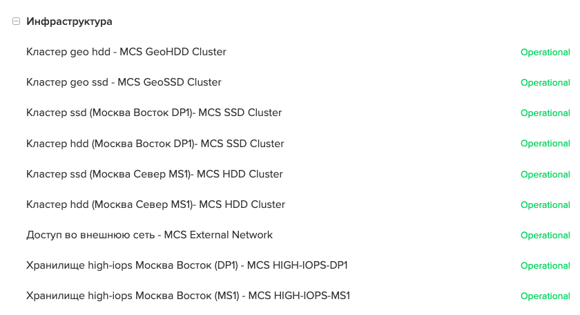

Состояние системы - инструмент информирования о текущей ситуации в режиме реального времени. Он позволяет получить сведения о статусах и инцидентах, возникающих на платформе VK CS. В интерфейсе отражаются информация о следующих инфраструктурных объектах VK CS:

*   Зоны доступности
*   Сервисы
*   Инфраструктура

Доступ к интерфейсу осуществляется из [личного кабинета](https://mcs.mail.ru/app/main/) в выпадающем меню учетной записи или по прямой ссылке [https://status.mcs.mail.ru/](https://status.mcs.mail.ru/)

Страница сервиса Состояния систем выглядит следующим образом:

При изменении статуса сервиса изменения отразятся в интерфейсе в реальном времени.