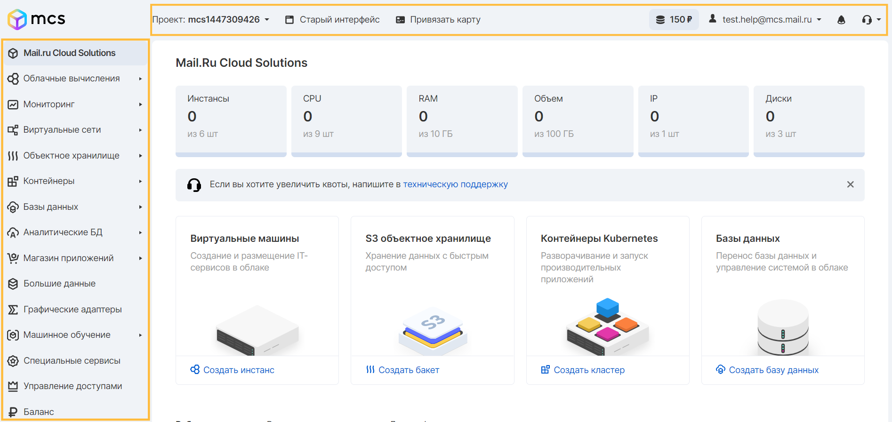
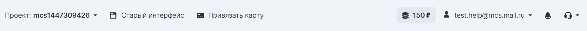

Администраторам необходимо администрировать и управлять ресурсами проекта для выполнения различных рабочих функций. Важно, чтобы эти средства управления были понятны и защищены.

Платформа VK Cloud Solutions предоставляет несколько интерфейсов управления для пользователей.

## Панель управления VK CS

Панель управления VK CS, или личный кабинет, состоит из информации о проекте (сверху), панели сервисов (слева) и основного рабочего экрана (по центру).



Рассмотрим некоторые элементы этой панели:



В **верхней части** можно увидеть:

- Информацию о проекте;
- Привязку карты для автоматического пополнения баланса;
- Текущий баланс проекта и переход в раздел "Баланс";
- Свойства учетной записи;
- Системные уведомления;
- Способы быстрого обращения в поддержку.

В левой части экрана располагаются сервисы VK CS. Набор сервисов изменяется по мере дополнения функциональности платформы.

**Основная (центральная) часть** экрана отражает возможности управления соответствующими сервисами в и ресурсами.

## CLI

Работа с виртуальной инфраструктурой также возможна через OpenStackClient. Это клиент, позволяющий использовать API OpenStack через интерфейс командной строки c использованием единой и простой структуры команд.

Полный список клиентов и информация по их использованию находится в официальной [документации разработчика](https://docs.openstack.org/python-openstackclient/latest/).

### Установка openstack-client

Пакет python3-openstackclient включает в себя базовый набор команд для управления платформой.

Следующие инструкции помогут установить openstackclient:

#### Linux

##### C помощью apt (Debian, Ubuntu):

```
apt update
apt install python3-openstackclient
```

##### С помощью dnf (RHEL 8, CentOS 8,  Fedora):

```
dnf install [https://www.rdoproject.org/repos/rdo-release.el8.rpm](https://www.rdoproject.org/repos/rdo-release.el8.rpm) 
dnf update
dnf install python3-openstackclient
```

##### С помощью yum (CentOS 7):

```
yum install [https://rdoproject.org/repos/rdo-release.rpm](https://rdoproject.org/repos/rdo-release.rpm) 
yum update
yum install python2-openstackclient
```

##### C помощью pip3:

Для установки с помощью pip3 в системе должны присутствовать пакеты: gcc, pyhton3-dev, python3-pip.

```
pip3 install -UI pbr testresources setuptools pytz wheel
pip3 install -UI python-openstackclient
```

#### Windows

Прежде чем начать, следует установить последнюю версию [Python3](https://www.python.org/downloads/window) и [Microsoft Build Tools](https://visualstudio.microsoft.com/ru/visual-cpp-build-tools/). В установщике Visual Studio необходимо выбрать "Средства сборки C++" в разделе "Рабочие нагрузки", в компонентах установки отметить только пакет SDK для Windows 10 и MSVC - средства сборки C++.

Далее, выполните следующие команды в командной строке:

```
pip3 install -UI pbr setuptools pytz wheel
pip3 install -UI python-openstackclient
```

### Установка дополнительных пакетов openstack

Следующие отдельные клиенты устарели в пользу общего клиента openstack-client. Вместо того, чтобы устанавливать и изучать все эти клиенты, рекомендуется установить и использовать клиент OpenStack.

В некоторых случаях необходимо установить клиент отдельного проекта, поскольку функциональности клиента OpenStack может быть недостаточно. Для установки пакета отдельного клиента, следует заменить имя `PROJECT` в этой команде `pip install`, используя приведенный ниже список:

```
\# pip install python-PROJECTclient
```

- cinder – API блочного хранилища и расширений
- glance – API образов
- heat – API оркестрации
- manila – Shared file systems API файлового хранилища
- neutron – API сетей
- nova – API облачных вычислений (ВМ) и расширений
- sahara – API обработки больших данных
- trove – API баз данных

### Авторизация в CLI

Загрузите в панели [API ключи](https://mcs.mail.ru/app/project/keys/) личного кабинета openrc файл для конфигурации CLI.

> **Важно:**<br>Для каждого региона используется свой файл openrc. Подробнее о регионах вы можете узнать в статье [Регионы](https://mcs.mail.ru/docs/ru/additionals/start/user-account/regions).

Затем, выполните действия, соответствующие процедуре для операционной системы на вашем компьютере:

#### Linux

Выполните импорт переменных из файла openrc с помощью команды `source`:

```
source file.sh
```

#### Windows

Откройте загруженный из личного кабинета файл openrc, найдите в нем переменные, начинающиеся на OS\_, и импортируйте в командную строку с помощью команды `SET` по примеру, в каждую переменную подставив значение из сохраненного openrc файла без кавычек:

```
set OS_INTERFACE=public
set OS_AUTH_URL=[https://infra.mail.ru:35357/v3/](https://infra.mail.ru:35357/v3/)
set OS_USERNAME=email
set OS_PROJECT_ID=projectID
set OS_REGION_NAME=regionName
set OS_USER_DOMAIN_NAME=users
set OS_PASSWORD=your_password
set OS_IDENTITY_API_VERSION=3
```

Для PowerShell следует использовать следующие значения переменных:

```
$env:OS_INTERFACE = "public"
$env:OS_AUTH_URL = "[https://infra.mail.ru:35357/v3/](https://infra.mail.ru:35357/v3/)"
$env:OS_USERNAME = "email"
$env:OS_PROJECT_ID = "projectID"
$env:OS_REGION_NAME = "regionName"
$env:OS_USER_DOMAIN_NAME = "users"
$env:OS_PASSWORD = "your_password"
$env:OS_IDENTITY_API_VERSION = "3"
```

> **Важно:**<br>Для переменной `OS_PASSWORD` нужно ввести действительный пароль учетной записи, его нет в файле openrc.

#### Проверка работы CLI

Проверьте работу CLI с помощью команды, например:

```
openstack flavor list
```

В результате будет получен список доступных конфигураций инстансов.

Или:

```
aws --version
```

## S3 CLI

Платформа VK CS использует S3-совместимое объектное хранилище в качестве сервиса [Cloud Storage](https://mcs.mail.ru/app/services/storage/).

Для работы с Cloud Storage можно установить AWS S3 CLI:

### Linux

Установка осуществляется с помощью команды:

```
pip install awscli
```

### Windows

Установить можно с помощью [64-битной](https://s3.amazonaws.com/aws-cli/AWSCLI64.msi) и [32-битной](https://s3.amazonaws.com/aws-cli/AWSCLI32.msi) программы-установщика, а также при помощи команды:

```
pip install awscli
```

## SQS CLI

Подробнее о работе с сервисом очередей сообщений Cloud Queues через CLI вы можете узнать в статье [Работа с Cloud Queues в AWS CLI](https://mcs.mail.ru/docs/ru/manage/cloud-queues/cloud-queues-cli).

## API

Для управления ресурсами платформы VK CS можно использовать API для запуска инстансов, создания образов, назначения метаданных инстансам и образам, создания контейнеров и объектов хранения и выполнения других действий в проектах.

> **Важно:**<br>Список эндпоинтов меняется в зависимости от выбранного региона. Подробнее о регионах вы можете узнать в статье [Регионы](https://mcs.mail.ru/docs/ru/additionals/start/user-account/regions).

Список доступных эндпоинтов всегда доступен в панели VK CS [в разделе "API Endpoints"](https://mcs.mail.ru/app/project/endpoints/).

### Примеры использования API

После аутентификации с помощью Identity можно использовать другие API-интерфейсы для создания и управления ресурсами в проекте.

Чтобы начать отправлять запросы API, используется один из следующих методов:

- **cURL** – Инструмент командной строки, который позволяет отправлять HTTP-запросы и получать ответы.
- **Openstack CLI** – клиент, который позволяет получать доступ к API через простые в использовании команды.
- **REST клиенты** – Mozilla и Google предоставляют браузерные графические интерфейсы для REST. Для Firefox см. [RESTClient](https://addons.mozilla.org/en-US/firefox/addon/restclient/). Для Chrome см. [rest-client](https://code.google.com/archive/p/rest-client/).
- **OpenStack Python Software Development Kit (SDK)** – SDK для написания скриптов автоматизации Python, которые создают ресурсы в проекте и управляют ими. В SDK реализованы привязки Python к API-интерфейсу OpenStack, который позволяет выполнять задачи автоматизации в Python, выполняя вызовы объектов Python вместо непосредственных вызовов REST. Все инструменты командной строки OpenStack реализованы с использованием Python SDK.
- **OpenStack APIs**

## Terraform

C помощью Terraform можно управлять инфраструктурой в облаке как кодом (IaС). Это позволяет затрачивать меньше времени на рутинные операции и снижает риск возникновения ошибок за счет использования скриптов.

Подробнее о работе с Terraform в инфраструктуре VK CS можно узнать [на портале документации Terraform](https://registry.terraform.io/providers/MailRuCloudSolutions/mcs/latest/docs).

Для использования Terraform необходимо загрузить файл конфигурации openrc в [настройках проекта в личном кабинете](https://mcs.mail.ru/app/project/terraform/). Для каждого региона существует свой файл конфигурации. Подробнее о регионах можно узнать в статье [Регионы](https://mcs.mail.ru/docs/ru/additionals/start/user-account/regions).
