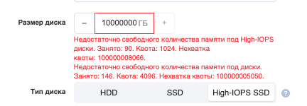
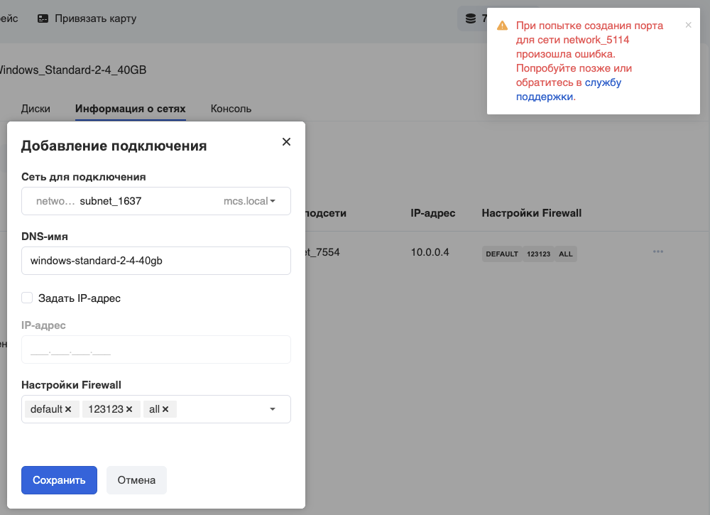
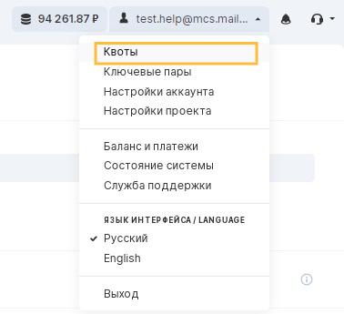
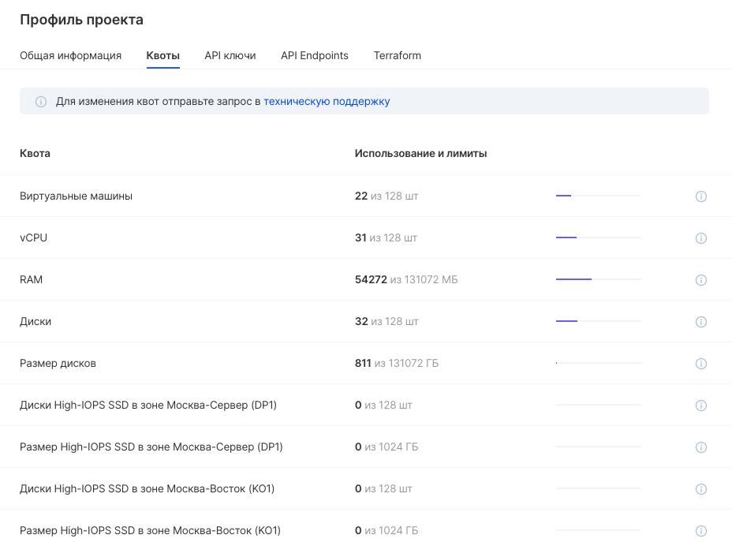
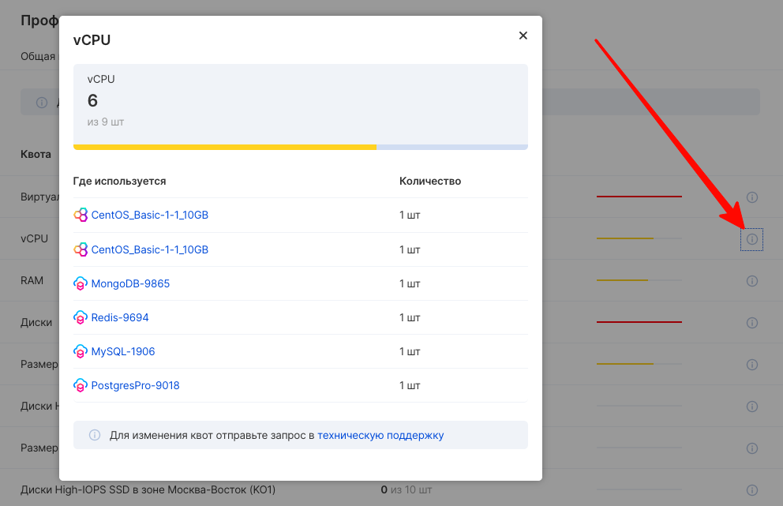

Технические и организационные ограничения необходимы для гарантии стабильности и надежности платформы. Ограничения использования ресурсов позволяют клиентам платформы беспрепятственно получать доступ к сервисам VK CS.

## Квоты

Квоты - организационные ограничения операционной активности каждого проекта.

Квоты применяются путем предоставления или резервирования ресурсов при выполнении запроса, например, при создании новой виртуальной машины. Если выделение ресурсов невозможно, запрос на создание ресурса отклоняется. Если резервирование завершается успешно, операция продолжается до того момента, когда резервирование либо преобразуется в использование (операция была успешной), либо откатывается (операция завершилась неудачно).

При создании проекту назначаются минимальные квоты. Квоты отличаются в зависимости от регона проекта. Подробнее о регионах можно узнать в статье [Регионы](https://mcs.mail.ru/docs/ru/additionals/start/user-account/regions)

Сообщение о недостаточном количестве квот в проекте бывают нескольких типов:

**При создании ресурса в окне запроса на создание**:


\* для High-IOPS SSD:



или (для некоторых сущностей) **при попытке создания сущности**:



## Квоты проекта

Текущие квоты проекта можно увидеть на отдельной странице. Для этого надо нажать в правом верхнем углу на логин, и выбрать в выпадающем меню пункт "Квоты":



Квоты отобразятся в виде графически-информационного списка:



Для получения подробной информации по конкретной квоте можно кликнуть на значок "**i**" справа:



## Базовые квоты

При создании проекта ему назначаются квоты на ресурсы, установленные по умолчанию для всех новых проектов. Каждый новый проект не наследует доступное количество квот от уже имеющихся проектов.

Квоты отличаются в зависимости от регона проекта. Подробнее о регионах можно узнать в статье [Регионы](https://mcs.mail.ru/docs/ru/additionals/start/user-account/regions)

Отображение основных квот для ресурсов находится в верхней части окна каждого сервиса.

Полный список квот в проекте можно получить через CLI, используя команду:

```
openstack quota show
```

или в отдельности по каждому сервису:

```
nova quota-show
cinder quota-show
manila quota-show
neutron quota-show
```

Стандартный набор квот определяется следующим образом:

**Виртуальные машины**

<table border="0" cellpadding="0" cellspacing="0" style="margin-right: calc(2%); width: 98%;" width="227"><tbody><tr><td height="19" style="text-align: center; background-color: rgb(239, 239, 239); width: 53.1135%;" width="66.07929515418502%">Наименование</td><td style="text-align: center; background-color: rgb(239, 239, 239); width: 46.7546%;" width="33.92070484581498%">Значение</td></tr><tr><td height="19" style="width: 53.1135%;">instances</td><td align="right" style="width: 46.7546%;">6</td></tr><tr><td height="19" style="width: 53.1135%;">cores</td><td align="right" style="width: 46.7546%;">9</td></tr><tr><td height="19" style="width: 53.1135%;">ram</td><td align="right" style="width: 46.7546%;">10240</td></tr><tr><td height="19" style="width: 53.1135%;">key_pairs</td><td align="right" style="width: 46.7546%;">100</td></tr></tbody></table>

**Диски**

<table border="0" cellpadding="0" cellspacing="0" style="margin-right: calc(2%); width: 98%;" width="227"><tbody><tr><td height="19" style="text-align: center; background-color: rgb(239, 239, 239); width: 54.4063%;" width="66.07929515418502%">Наименование</td><td style="text-align: center; background-color: rgb(239, 239, 239); width: 45.4618%;" width="33.92070484581498%">Значение</td></tr><tr><td height="19" style="width: 54.4063%;">backups</td><td align="right" style="width: 45.4618%;">400</td></tr><tr><td height="19" style="width: 54.4063%;">gigabytes</td><td align="right" style="width: 45.4618%;">100</td></tr><tr><td height="19" style="width: 54.4063%;">gigabytes_dp1-high-iops</td><td align="right" style="width: 45.4618%;">100</td></tr><tr><td height="19" style="width: 54.4063%;">gigabytes_ko1-high-iops</td><td align="right" style="width: 45.4618%;">100</td></tr><tr><td height="19" style="width: 54.4063%;">snapshots</td><td align="right" style="width: 45.4618%;">200</td></tr><tr><td height="19" style="width: 54.4063%;">volumes</td><td align="right" style="width: 45.4618%;">3</td></tr></tbody></table>

**Файловое хранилище**

<table border="0" cellpadding="0" cellspacing="0" style="margin-right: calc(2%); width: 98%;" width="227"><tbody><tr><td height="19" style="text-align: center; background-color: rgb(239, 239, 239); width: 55.0923%;" width="66.07929515418502%">Наименование</td><td style="text-align: center; background-color: rgb(239, 239, 239); width: 44.7758%;" width="33.92070484581498%">Значение</td></tr><tr><td height="19" style="width: 55.0923%;">gigabytes</td><td align="right" style="width: 44.7758%;">100</td></tr><tr><td height="19" style="width: 55.0923%;">id</td><td style="width: 44.7758%;"><br></td></tr><tr><td height="19" style="width: 55.0923%;">share_networks</td><td align="right" style="width: 44.7758%;">5</td></tr><tr><td height="19" style="width: 55.0923%;">shares</td><td align="right" style="width: 44.7758%;">5</td></tr><tr><td height="19" style="width: 55.0923%;">snapshot_gigabytes</td><td align="right" style="width: 44.7758%;">100</td></tr><tr><td height="19" style="width: 55.0923%;">snapshots</td><td align="right" style="width: 44.7758%;">5</td></tr></tbody></table>

**Сети**

<table border="0" cellpadding="0" cellspacing="0" style="margin-right: calc(2%); width: 98%;" width="227"><tbody><tr><td height="19" style="text-align: center; background-color: rgb(239, 239, 239); width: 56.3852%;" width="66.07929515418502%">Наименование</td><td style="text-align: center; background-color: rgb(239, 239, 239); width: 43.4829%;" width="33.92070484581498%">Значение</td></tr><tr><td height="19" style="width: 56.3852%;">floatingip</td><td align="right" style="width: 43.4829%;">1</td></tr><tr><td height="19" style="width: 56.3852%;">loadbalancer</td><td align="right" style="width: 43.4829%;">3</td></tr><tr><td height="19" style="width: 56.3852%;">network</td><td align="right" style="width: 43.4829%;">10</td></tr><tr><td height="19" style="width: 56.3852%;">pool</td><td align="right" style="width: 43.4829%;">30</td></tr><tr><td height="19" style="width: 56.3852%;">port</td><td align="right" style="width: 43.4829%;">30</td></tr><tr><td height="19" style="width: 56.3852%;">router</td><td align="right" style="width: 43.4829%;">3</td></tr><tr><td height="19" style="width: 56.3852%;">security_group</td><td align="right" style="width: 43.4829%;">3</td></tr><tr><td height="19" style="width: 56.3852%;">security_group_rule</td><td align="right" style="width: 43.4829%;">200</td></tr><tr><td height="19" style="width: 56.3852%;">subnet</td><td align="right" style="width: 43.4829%;">10</td></tr></tbody></table>

## Увеличение квот

**Примечание**

Если вы хотите увеличить лимит или квоту выше предельного значения по умолчанию, отправьте запрос в техническую поддержку.

В качестве примера используем квоты виртуальных процессоров.Чтобы запросить увеличение квоты на виртуальные CPU, необходимо решить, сколько виртуальных CPU вы хотите использовать дополнительно. Определите также какие квоты требуются дополнительно, затем создайте обращение [в техническую поддержку](https://mcs.mail.ru/docs/contacts) с указанием:

- наименование учетной записи
- номер проекта (mcs_pid)
- тип квоты
- на какой объем требуется увеличение

## Технические лимиты

Стабильность работы сервисов VK CS обеспечивается назначением технических лимитов платформы. Это общие ограничения, обусловленные особенностями архитектуры VK CS.

Текущие технические ограничения имеют следующие значения:

**Общие**

<table style="box-sizing: border-box; outline: 0px; border: 1px solid rgb(221, 221, 221); text-align: left; border-collapse: collapse; width: 98%; color: rgb(51, 51, 51); font-family: &quot;Proxima Nova&quot;, sans-serif; font-size: 15px; font-style: normal; font-variant-ligatures: normal; font-variant-caps: normal; font-weight: 400; letter-spacing: normal; orphans: 2; text-indent: 0px; text-transform: none; white-space: normal; widows: 2; word-spacing: 0px; -webkit-text-stroke-width: 0px; background-color: rgb(255, 255, 255); text-decoration-style: initial; text-decoration-color: initial; margin-right: calc(2%);"><tbody style="box-sizing: border-box; outline: 0px;"><tr><td style="box-sizing: border-box; outline: 0px; border: 1px solid rgb(221, 221, 221); text-align: center; padding: 8px; line-height: 1.42857; vertical-align: top; width: 403.2px; background-color: rgb(239, 239, 239);">Параметр</td><td style="box-sizing: border-box; outline: 0px; border: 1px solid rgb(221, 221, 221); text-align: center; padding: 8px; line-height: 1.42857; vertical-align: top; width: 335.2px; background-color: rgb(239, 239, 239);">Количество / объем</td></tr><tr style="box-sizing: border-box; outline: 0px;"><td style="box-sizing: border-box; outline: 0px; border: 1px solid rgb(221, 221, 221); text-align: left; padding: 8px; line-height: 1.42857; vertical-align: top; width: 403.2px;">Администраторов в проекте</td><td colspan="1" style="box-sizing: border-box; outline: 0px; border: 1px solid rgb(221, 221, 221); text-align: left; padding: 8px; line-height: 1.42857; vertical-align: top; width: 335.2px;">50</td></tr><tr style="box-sizing: border-box; outline: 0px;"><td style="box-sizing: border-box; outline: 0px; border: 1px solid rgb(221, 221, 221); text-align: left; padding: 8px; line-height: 1.42857; vertical-align: top; width: 403.2px;">Инстансов в проекте</td><td colspan="1" style="box-sizing: border-box; outline: 0px; border: 1px solid rgb(221, 221, 221); text-align: left; padding: 8px; line-height: 1.42857; vertical-align: top; width: 335.2px;">1000</td></tr><tr style="box-sizing: border-box; outline: 0px;"><td style="box-sizing: border-box; outline: 0px; border: 1px solid rgb(221, 221, 221); text-align: left; padding: 8px; line-height: 1.42857; vertical-align: top; width: 403.2px;"><span style="font-size: 16px;">Размер одного инстанса в Гб</span></td><td colspan="1" style="box-sizing: border-box; outline: 0px; border: 1px solid rgb(221, 221, 221); text-align: left; padding: 8px; line-height: 1.42857; vertical-align: top; width: 335.2px;">зависит от (Диск)+(RAM)</td></tr><tr><td style="box-sizing: border-box; outline: 0px; border: 1px solid rgb(221, 221, 221); text-align: left; padding: 8px; line-height: 1.42857; vertical-align: top; width: 403.2px;">Созданных проектов в учетной записи</td><td style="box-sizing: border-box; outline: 0px; border: 1px solid rgb(221, 221, 221); padding: 8px; line-height: 1.42857; vertical-align: top; width: 335.2px;">5</td></tr><tr style="box-sizing: border-box; outline: 0px;"><td colspan="1" style="box-sizing: border-box; outline: 0px; border: 1px solid rgb(221, 221, 221); text-align: left; padding: 8px; line-height: 1.42857; vertical-align: top; width: 403.2px;"><p style="box-sizing: border-box; outline: 0px;"><span style="font-size: 16px;">CPU у инстанса</span></p></td><td colspan="1" style="box-sizing: border-box; outline: 0px; border: 1px solid rgb(221, 221, 221); padding: 8px; line-height: 1.42857; vertical-align: top; width: 335.2px;">80 vCPU</td></tr><tr style="box-sizing: border-box; outline: 0px;"><td colspan="1" style="box-sizing: border-box; outline: 0px; border: 1px solid rgb(221, 221, 221); text-align: left; padding: 8px; line-height: 1.42857; vertical-align: top; width: 403.2px;">High-Freq CPU у инстанса</td><td colspan="1" style="box-sizing: border-box; outline: 0px; border: 1px solid rgb(221, 221, 221); text-align: left; padding: 8px; line-height: 1.42857; vertical-align: top; width: 335.2px;">40 vCPU</td></tr><tr style="box-sizing: border-box; outline: 0px;"><td colspan="1" style="box-sizing: border-box; outline: 0px; border: 1px solid rgb(221, 221, 221); text-align: left; padding: 8px; line-height: 1.42857; vertical-align: top; width: 403.2px;">GPU у инстанса</td><td colspan="1" style="box-sizing: border-box; outline: 0px; border: 1px solid rgb(221, 221, 221); text-align: left; padding: 8px; line-height: 1.42857; vertical-align: top; width: 335.2px;">4</td></tr><tr style="box-sizing: border-box; outline: 0px;"><td colspan="1" style="box-sizing: border-box; outline: 0px; border: 1px solid rgb(221, 221, 221); text-align: left; padding: 8px; line-height: 1.42857; vertical-align: top; width: 403.2px;">RAM у инстанса</td><td colspan="1" style="box-sizing: border-box; outline: 0px; border: 1px solid rgb(221, 221, 221); text-align: left; padding: 8px; line-height: 1.42857; vertical-align: top; width: 335.2px;">1024 ГБ</td></tr></tbody></table>

**Контейнеры Kubernetes**

<table style="box-sizing: border-box; outline: 0px; border: 1px solid rgb(221, 221, 221); text-align: left; border-collapse: collapse; width: 98%; color: rgb(51, 51, 51); font-family: &quot;Proxima Nova&quot;, sans-serif; font-size: 15px; font-style: normal; font-variant-ligatures: normal; font-variant-caps: normal; font-weight: 400; letter-spacing: normal; orphans: 2; text-indent: 0px; text-transform: none; white-space: normal; widows: 2; word-spacing: 0px; -webkit-text-stroke-width: 0px; background-color: rgb(255, 255, 255); text-decoration-style: initial; text-decoration-color: initial; margin-right: calc(2%);"><tbody style="box-sizing: border-box; outline: 0px;"><tr><td style="box-sizing: border-box; outline: 0px; border: 1px solid rgb(221, 221, 221); text-align: center; padding: 8px; line-height: 1.42857; vertical-align: top; width: 403.2px; background-color: rgb(239, 239, 239);">Параметр</td><td style="box-sizing: border-box; outline: 0px; border: 1px solid rgb(221, 221, 221); text-align: center; padding: 8px; line-height: 1.42857; vertical-align: top; width: 335.2px; background-color: rgb(239, 239, 239);">Количество / объем</td></tr><tr style="box-sizing: border-box; outline: 0px;"><td style="box-sizing: border-box; outline: 0px; border: 1px solid rgb(221, 221, 221); text-align: left; padding: 8px; line-height: 1.42857; vertical-align: top; width: 403.2px;">Нод</td><td colspan="1" style="box-sizing: border-box; outline: 0px; border: 1px solid rgb(221, 221, 221); text-align: left; padding: 8px; line-height: 1.42857; vertical-align: top; width: 335.2px;">100</td></tr><tr style="box-sizing: border-box; outline: 0px;"><td style="box-sizing: border-box; outline: 0px; border: 1px solid rgb(221, 221, 221); text-align: left; padding: 8px; line-height: 1.42857; vertical-align: top; width: 403.2px;">Подов у ноды</td><td colspan="1" style="box-sizing: border-box; outline: 0px; border: 1px solid rgb(221, 221, 221); text-align: left; padding: 8px; line-height: 1.42857; vertical-align: top; width: 335.2px;">110</td></tr><tr style="box-sizing: border-box; outline: 0px;"><td colspan="1" style="box-sizing: border-box; outline: 0px; border: 1px solid rgb(221, 221, 221); text-align: left; padding: 8px; line-height: 1.42857; vertical-align: top; width: 403.2px;">Сущностей у кластера</td><td colspan="1" style="box-sizing: border-box; outline: 0px; border: 1px solid rgb(221, 221, 221); text-align: left; padding: 8px; line-height: 1.42857; vertical-align: top; width: 335.2px;">3000</td></tr><tr style="box-sizing: border-box; outline: 0px;"><td style="box-sizing: border-box; outline: 0px; border: 1px solid rgb(221, 221, 221); text-align: left; padding: 8px; line-height: 1.42857; vertical-align: top; width: 403.2px;">Длина имени кластера k8s и node group</td><td style="box-sizing: border-box; outline: 0px; border: 1px solid rgb(221, 221, 221); text-align: left; padding: 8px; line-height: 1.42857; vertical-align: top; width: 335.2px;">24 символа</td></tr></tbody></table>

**Диски**

<table style="box-sizing: border-box; outline: 0px; border: 1px solid rgb(221, 221, 221); text-align: left; border-collapse: collapse; width: 98%; color: rgb(51, 51, 51); font-family: &quot;Proxima Nova&quot;, sans-serif; font-size: 15px; font-style: normal; font-variant-ligatures: normal; font-variant-caps: normal; font-weight: 400; letter-spacing: normal; orphans: 2; text-indent: 0px; text-transform: none; white-space: normal; widows: 2; word-spacing: 0px; -webkit-text-stroke-width: 0px; background-color: rgb(255, 255, 255); text-decoration-style: initial; text-decoration-color: initial; margin-right: calc(2%);"><tbody style="box-sizing: border-box; outline: 0px;"><tr><td style="box-sizing: border-box; outline: 0px; border: 1px solid rgb(221, 221, 221); text-align: center; padding: 8px; line-height: 1.42857; vertical-align: top; width: 403.2px; background-color: rgb(239, 239, 239);">Параметр</td><td style="box-sizing: border-box; outline: 0px; border: 1px solid rgb(221, 221, 221); text-align: center; padding: 8px; line-height: 1.42857; vertical-align: top; width: 335.2px; background-color: rgb(239, 239, 239);">Количество / объем</td></tr><tr style="box-sizing: border-box; outline: 0px;"><td style="box-sizing: border-box; outline: 0px; border: 1px solid rgb(221, 221, 221); text-align: left; padding: 8px; line-height: 1.42857; vertical-align: top; width: 403.2px;">Дисков у инстанса</td><td colspan="1" style="box-sizing: border-box; outline: 0px; border: 1px solid rgb(221, 221, 221); text-align: left; padding: 8px; line-height: 1.42857; vertical-align: top; width: 335.2px;">28</td></tr><tr style="box-sizing: border-box; outline: 0px;"><td colspan="1" style="box-sizing: border-box; outline: 0px; border: 1px solid rgb(221, 221, 221); text-align: left; padding: 8px; line-height: 1.42857; vertical-align: top; width: 403.2px;">Объём диска HDD</td><td colspan="1" style="box-sizing: border-box; outline: 0px; border: 1px solid rgb(221, 221, 221); text-align: left; padding: 8px; line-height: 1.42857; vertical-align: top; width: 335.2px;">50 ТБ</td></tr><tr style="box-sizing: border-box; outline: 0px;"><td colspan="1" style="box-sizing: border-box; outline: 0px; border: 1px solid rgb(221, 221, 221); text-align: left; padding: 8px; line-height: 1.42857; vertical-align: top; width: 403.2px;">Объём диска SSD</td><td colspan="1" style="box-sizing: border-box; outline: 0px; border: 1px solid rgb(221, 221, 221); text-align: left; padding: 8px; line-height: 1.42857; vertical-align: top; width: 335.2px;">10 ТБ</td></tr><tr style="box-sizing: border-box; outline: 0px;"><td colspan="1" style="box-sizing: border-box; outline: 0px; border: 1px solid rgb(221, 221, 221); text-align: left; padding: 8px; line-height: 1.42857; vertical-align: top; width: 403.2px;">Объём диска SSD-HIGH-IOPS</td><td colspan="1" style="box-sizing: border-box; outline: 0px; border: 1px solid rgb(221, 221, 221); text-align: left; padding: 8px; line-height: 1.42857; vertical-align: top; width: 335.2px;">2 ТБ</td></tr><tr style="box-sizing: border-box; outline: 0px;"><td style="box-sizing: border-box; outline: 0px; border: 1px solid rgb(221, 221, 221); text-align: left; padding: 8px; line-height: 1.42857; vertical-align: top; width: 403.2px;">Объём Файлового хранилища</td><td colspan="1" style="box-sizing: border-box; outline: 0px; border: 1px solid rgb(221, 221, 221); text-align: left; padding: 8px; line-height: 1.42857; vertical-align: top; width: 335.2px;">50 ТБ</td></tr></tbody></table>

**Сеть**

<table style="box-sizing: border-box; outline: 0px; border: 1px solid rgb(221, 221, 221); text-align: left; border-collapse: collapse; width: 98%; color: rgb(51, 51, 51); font-family: &quot;Proxima Nova&quot;, sans-serif; font-size: 15px; font-style: normal; font-variant-ligatures: normal; font-variant-caps: normal; font-weight: 400; letter-spacing: normal; orphans: 2; text-indent: 0px; text-transform: none; white-space: normal; widows: 2; word-spacing: 0px; -webkit-text-stroke-width: 0px; background-color: rgb(255, 255, 255); text-decoration-style: initial; text-decoration-color: initial; margin-right: calc(2%);"><tbody style="box-sizing: border-box; outline: 0px;"><tr><td style="box-sizing: border-box; outline: 0px; border: 1px solid rgb(221, 221, 221); text-align: center; padding: 8px; line-height: 1.42857; vertical-align: top; width: 403.2px; background-color: rgb(239, 239, 239);">Параметр</td><td style="box-sizing: border-box; outline: 0px; border: 1px solid rgb(221, 221, 221); text-align: center; padding: 8px; line-height: 1.42857; vertical-align: top; width: 335.2px; background-color: rgb(239, 239, 239);">Количество / объем</td></tr><tr style="box-sizing: border-box; outline: 0px;"><td colspan="1" style="box-sizing: border-box; outline: 0px; border: 1px solid rgb(221, 221, 221); text-align: left; padding: 8px; line-height: 1.42857; vertical-align: top; width: 403.2px;">Групп Firewall</td><td colspan="1" style="box-sizing: border-box; outline: 0px; border: 1px solid rgb(221, 221, 221); text-align: left; padding: 8px; line-height: 1.42857; vertical-align: top; width: 335.2px;">200</td></tr><tr style="box-sizing: border-box; outline: 0px;"><td colspan="1" style="box-sizing: border-box; outline: 0px; border: 1px solid rgb(221, 221, 221); text-align: left; padding: 8px; line-height: 1.42857; vertical-align: top; width: 403.2px;">Правил Firewall внутри группы</td><td colspan="1" style="box-sizing: border-box; outline: 0px; border: 1px solid rgb(221, 221, 221); text-align: left; padding: 8px; line-height: 1.42857; vertical-align: top; width: 335.2px;">50</td></tr><tr style="box-sizing: border-box; outline: 0px;"><td colspan="1" style="box-sizing: border-box; outline: 0px; border: 1px solid rgb(221, 221, 221); text-align: left; padding: 8px; line-height: 1.42857; vertical-align: top; width: 403.2px;">Сетей у проекта</td><td colspan="1" style="box-sizing: border-box; outline: 0px; border: 1px solid rgb(221, 221, 221); text-align: left; padding: 8px; line-height: 1.42857; vertical-align: top; width: 335.2px;">10</td></tr><tr style="box-sizing: border-box; outline: 0px;"><td colspan="1" style="box-sizing: border-box; outline: 0px; border: 1px solid rgb(221, 221, 221); text-align: left; padding: 8px; line-height: 1.42857; vertical-align: top; width: 403.2px;">Подсетей у сети</td><td colspan="1" style="box-sizing: border-box; outline: 0px; border: 1px solid rgb(221, 221, 221); text-align: left; padding: 8px; line-height: 1.42857; vertical-align: top; width: 335.2px;">10</td></tr><tr style="box-sizing: border-box; outline: 0px;"><td style="box-sizing: border-box; outline: 0px; border: 1px solid rgb(221, 221, 221); text-align: left; padding: 8px; line-height: 1.42857; vertical-align: top; width: 403.2px;">Балансировщиков</td><td colspan="1" style="box-sizing: border-box; outline: 0px; border: 1px solid rgb(221, 221, 221); text-align: left; padding: 8px; line-height: 1.42857; vertical-align: top; width: 335.2px;">10</td></tr><tr style="box-sizing: border-box; outline: 0px;"><td colspan="1" style="box-sizing: border-box; outline: 0px; border: 1px solid rgb(221, 221, 221); text-align: left; padding: 8px; line-height: 1.42857; vertical-align: top; width: 403.2px;">Правил у балансировщика</td><td colspan="1" style="box-sizing: border-box; outline: 0px; border: 1px solid rgb(221, 221, 221); text-align: left; padding: 8px; line-height: 1.42857; vertical-align: top; width: 335.2px;">100</td></tr></tbody></table>

**Бэкапы**

<table style="box-sizing: border-box; outline: 0px; border: 1px solid rgb(221, 221, 221); text-align: left; border-collapse: collapse; width: 98%; color: rgb(51, 51, 51); font-family: &quot;Proxima Nova&quot;, sans-serif; font-size: 15px; font-style: normal; font-variant-ligatures: normal; font-variant-caps: normal; font-weight: 400; letter-spacing: normal; orphans: 2; text-indent: 0px; text-transform: none; white-space: normal; widows: 2; word-spacing: 0px; -webkit-text-stroke-width: 0px; background-color: rgb(255, 255, 255); text-decoration-style: initial; text-decoration-color: initial; margin-right: calc(2%);"><tbody style="box-sizing: border-box; outline: 0px;"><tr><td style="box-sizing: border-box; outline: 0px; border: 1px solid rgb(221, 221, 221); text-align: center; padding: 8px; line-height: 1.42857; vertical-align: top; width: 403.2px; background-color: rgb(239, 239, 239);">Параметр</td><td style="box-sizing: border-box; outline: 0px; border: 1px solid rgb(221, 221, 221); text-align: center; padding: 8px; line-height: 1.42857; vertical-align: top; width: 335.2px; background-color: rgb(239, 239, 239);">Количество / объем</td></tr><tr style="box-sizing: border-box; outline: 0px;"><td colspan="1" style="box-sizing: border-box; outline: 0px; border: 1px solid rgb(221, 221, 221); text-align: left; padding: 8px; line-height: 1.42857; vertical-align: top; width: 403.2px;">Планов автобэкапа</td><td colspan="1" style="box-sizing: border-box; outline: 0px; border: 1px solid rgb(221, 221, 221); text-align: left; padding: 8px; line-height: 1.42857; vertical-align: top; width: 335.2px;">50</td></tr><tr style="box-sizing: border-box; outline: 0px;"><td colspan="1" style="box-sizing: border-box; outline: 0px; border: 1px solid rgb(221, 221, 221); text-align: left; padding: 8px; line-height: 1.42857; vertical-align: top; width: 403.2px;">Количество бэкапов</td><td colspan="1" style="box-sizing: border-box; outline: 0px; border: 1px solid rgb(221, 221, 221); text-align: left; padding: 8px; line-height: 1.42857; vertical-align: top; width: 335.2px;">200</td></tr><tr style="box-sizing: border-box; outline: 0px;"><td colspan="1" style="box-sizing: border-box; outline: 0px; border: 1px solid rgb(221, 221, 221); text-align: left; padding: 8px; line-height: 1.42857; vertical-align: top; width: 403.2px;">Размер бэкапа</td><td colspan="1" style="box-sizing: border-box; outline: 0px; border: 1px solid rgb(221, 221, 221); text-align: left; padding: 8px; line-height: 1.42857; vertical-align: top; width: 335.2px;">320 ТБ</td></tr><tr style="box-sizing: border-box; outline: 0px;"><td colspan="1" style="box-sizing: border-box; outline: 0px; border: 1px solid rgb(221, 221, 221); text-align: left; padding: 8px; line-height: 1.42857; vertical-align: top; width: 403.2px;">Размер снапшота</td><td colspan="1" style="box-sizing: border-box; outline: 0px; border: 1px solid rgb(221, 221, 221); text-align: left; padding: 8px; line-height: 1.42857; vertical-align: top; width: 335.2px;">неограничен</td></tr></tbody></table>

**Бакеты S3**

<table style="box-sizing: border-box; outline: 0px; border: 1px solid rgb(221, 221, 221); text-align: left; border-collapse: collapse; width: 98%; color: rgb(51, 51, 51); font-family: &quot;Proxima Nova&quot;, sans-serif; font-size: 15px; font-style: normal; font-variant-ligatures: normal; font-variant-caps: normal; font-weight: 400; letter-spacing: normal; orphans: 2; text-indent: 0px; text-transform: none; white-space: normal; widows: 2; word-spacing: 0px; -webkit-text-stroke-width: 0px; background-color: rgb(255, 255, 255); text-decoration-style: initial; text-decoration-color: initial; margin-right: calc(2%);"><tbody style="box-sizing: border-box; outline: 0px;"><tr><td style="box-sizing: border-box; outline: 0px; border: 1px solid rgb(221, 221, 221); text-align: center; padding: 8px; line-height: 1.42857; vertical-align: top; width: 208px; background-color: rgb(239, 239, 239);">Параметр</td><td style="box-sizing: border-box; outline: 0px; border: 1px solid rgb(221, 221, 221); text-align: center; padding: 8px; line-height: 1.42857; vertical-align: top; width: 530.4px; background-color: rgb(239, 239, 239);">Количество / объем</td></tr><tr style="box-sizing: border-box; outline: 0px;"><td style="box-sizing: border-box; outline: 0px; border: 1px solid rgb(221, 221, 221); text-align: left; padding: 8px; line-height: 1.42857; vertical-align: top; width: 208px;">Аккаунты</td><td style="box-sizing: border-box; outline: 0px; border: 1px solid rgb(221, 221, 221); text-align: left; padding: 8px; line-height: 1.42857; vertical-align: top; width: 530.4px;">25</td></tr><tr style="box-sizing: border-box; outline: 0px;"><td style="box-sizing: border-box; outline: 0px; border: 1px solid rgb(221, 221, 221); text-align: left; padding: 8px; line-height: 1.42857; vertical-align: top; width: 208px;">Бакеты</td><td style="box-sizing: border-box; outline: 0px; border: 1px solid rgb(221, 221, 221); text-align: left; padding: 8px; line-height: 1.42857; vertical-align: top; width: 530.4px;">25</td></tr><tr style="box-sizing: border-box; outline: 0px;"><td style="box-sizing: border-box; outline: 0px; border: 1px solid rgb(221, 221, 221); text-align: left; padding: 8px; line-height: 1.42857; vertical-align: top; width: 208px;">Объектов в бакете</td><td style="box-sizing: border-box; outline: 0px; border: 1px solid rgb(221, 221, 221); text-align: left; padding: 8px; line-height: 1.42857; vertical-align: top; width: 530.4px;">неограниченно<br></td></tr><tr style="box-sizing: border-box; outline: 0px;"><td colspan="1" style="box-sizing: border-box; outline: 0px; border: 1px solid rgb(221, 221, 221); text-align: left; padding: 8px; line-height: 1.42857; vertical-align: top; width: 208px;">Размер файла</td><td colspan="1" style="box-sizing: border-box; outline: 0px; border: 1px solid rgb(221, 221, 221); text-align: left; padding: 8px; line-height: 1.42857; vertical-align: top; width: 530.4px;">32 ГБ для обычного файла, 320 ТБ для мультипартового</td></tr><tr style="box-sizing: border-box; outline: 0px;"><td colspan="1" style="box-sizing: border-box; outline: 0px; border: 1px solid rgb(221, 221, 221); text-align: left; padding: 8px; line-height: 1.42857; vertical-align: top; width: 208px;">Размер бакета</td><td colspan="1" style="box-sizing: border-box; outline: 0px; border: 1px solid rgb(221, 221, 221); text-align: left; padding: 8px; line-height: 1.42857; vertical-align: top; width: 530.4px;">безлимит</td></tr><tr style="box-sizing: border-box; outline: 0px;"><td style="box-sizing: border-box; outline: 0px; border: 1px solid rgb(221, 221, 221); text-align: left; padding: 8px; line-height: 1.42857; vertical-align: top; background-color: rgb(239, 239, 239); width: 208px;">Рейт-лимиты</td><td style="box-sizing: border-box; outline: 0px; border: 1px solid rgb(221, 221, 221); text-align: left; padding: 8px; line-height: 1.42857; vertical-align: top; width: 530.4px; background-color: rgb(239, 239, 239);"><br style="box-sizing: border-box; outline: 0px;"></td></tr><tr style="box-sizing: border-box; outline: 0px;"><td style="box-sizing: border-box; outline: 0px; border: 1px solid rgb(221, 221, 221); text-align: left; padding: 8px; line-height: 1.42857; vertical-align: top; width: 208px;">Обычные</td><td style="box-sizing: border-box; outline: 0px; border: 1px solid rgb(221, 221, 221); text-align: left; padding: 8px; line-height: 1.42857; vertical-align: top; width: 530.4px;">запрос/сек: 500, запрос/день: 10.000.000&nbsp;</td></tr><tr style="box-sizing: border-box; outline: 0px;"><td style="box-sizing: border-box; outline: 0px; border: 1px solid rgb(221, 221, 221); text-align: left; padding: 8px; line-height: 1.42857; vertical-align: top; width: 208px;">Запрос на листинг</td><td style="box-sizing: border-box; outline: 0px; border: 1px solid rgb(221, 221, 221); text-align: left; padding: 8px; line-height: 1.42857; vertical-align: top; width: 530.4px;">запрос/сек: 15, запрос/день: 10.000.000&nbsp;</td></tr></tbody></table>
