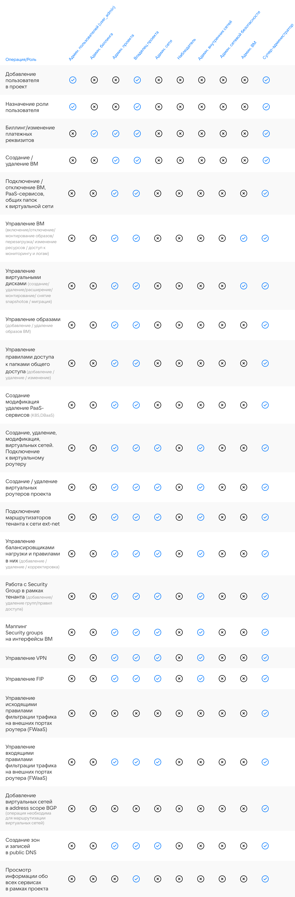

## Роли

В личном кабинете VK Cloud можно добавить дополнительных участников проекта, которые будут иметь доступ к работе с облачными сервисами. При добавлении указывается роль участника.

## Матрица ролей

Платформа VK Cloud поддерживает разграничение прав доступа к ресурсам проекта на базе ролевой модели. Ниже приведен список ролей и соответствующее разрешение им.

Список ролей и разрешения:

<!-- prettier-ignore
| Операция/Роль                                                                                                               | Админ.&nbsp;пользователей (user_admin) | Админ. биллинга | Админ. проекта | Владелец проекта | Админ. сети | Наблюдатель | Админ. внутренних сетей | Админ. сетевой безопасности | Админ. ВМ | Суперадминистратор |
|-----------------------------------------------------------------------------------------------------------------------------|----------------------------------------|-----------------|----------------|------------------|-------------|-------------|-------------------------|-----------------------------|-----------|--------------------|
| Добавление пользователя в проект&nbsp;                                                                                      | X                                     | -               | -              | X               | -           | -           | -                       | -                           | -         | Х                  |
| Назначение роли пользователя                                                                                                | X                                     | -               | -              | Х               | -           | -           | -                       | -                           | -         | Х                  |
| Биллинг/изменение платежных реквизитов                                                                                      | -                                      | Х               | Х              | Х                | -           | -           | -                       | -                           | -         | Х                  |
| Создание / удаление ВМ                                                                                                      | -                                      | -               | Х              | Х                | -           | -           | -                       | -                           | -         | Х                  |
| Подключение / отключение ВМ, PaaS-сервисов, общих папок &nbsp;к виртуальной сети                                            | -                                      | -               | Х              | Х                | -           | -           | -                       | -                           | -         | Х                  |
| Управление ВМ (включение/отключение/монтирование образов/ перезагрузка/ изменение ресурсов / /доступ к мониторингу и логам) | -                                      | -               | Х              | Х                | -           | -           | -                       | -                           | Х         | Х                  |
| Управление виртуальными дисками (создание/удаление/расширение/монтирование/ снятие snapshot&rsquo;ов / миграция)            | -                                      | -               | Х              | Х                | -           | -           | -                       | -                           | Х         | Х                  |
| Управление образами (добавление / удаление образов ВМ)                                                                      | -                                      | -               | Х              | Х                | -           | -           | -                       | -                           | -         | Х                  |
| Управление папками общего доступа (добавление / удаление / изменение размера)                                               | -                                      | -               | Х              | Х                | -           | -           | -                       | -                           | -         | Х                  |
| Управление правилами доступа к папками общего доступа (добавление / удаление / изменение)                                   | -                                      | -               | Х              | Х                | -           | -           | -                       | -                           | -         | Х                  |
| Создание модификация удаление PaaS-сервисов (K8S,DBaaS)                                                                     | -                                      | -               | Х              | Х                | -           | -           | -                       | -                           | -         | Х                  |
| Создание, удаление, модификация, виртуальных сетей. Подключение к виртуальному роутеру&nbsp;                                | -                                      | -               | Х              | Х                | Х           | -           | Х                       | -                           | -         | Х                  |
| Создание / удаление виртуальных роутеров проекта.                                                                           | -                                      | -               | Х              | Х                | Х           | -           | Х                       | -                           | -         | Х                  |
| Подключение маршрутизаторов тенанта к сети ext-net                                                                          | -                                      | -               | Х              | Х                | Х           | -           | Х                       | -                           | -         | Х                  |
| Управление балансировщиками нагрузки и правилами в них (добавление / удаление / корректировка)                              | -                                      | -               | Х              | Х                | Х           | -           | Х                       | -                           | -         | Х                  |
| Работа с Security Group в рамках тенанта (добавление/удаление групп/правил доступа)                                         | -                                      | -               | Х              | Х                | Х           | -           | -                       | Х                           | -         | Х                  |
| Маппинг Security groups на интерфейсы&nbsp;ВМ                                                                               | -                                      | -               | Х              | Х                | Х           | -           | -                       | Х                           | -         | Х                  |
| Управление VPN                                                                                                              | -                                      | -               | Х              | Х                | Х           | -           | -                       | -                           | -         | Х                  |
| Управление FIP                                                                                                              | -                                      | -               | Х              | Х                | Х           | -           | -                       | -                           | -         | Х                  |
| Управление&nbsp;исходящими&nbsp;правилами фильтрации трафика на внешних портах роутера (FWaaS)                              | -                                      | -               | -              | -                | -           | -           | -                       | -                           | -         | Х                |
| Управление&nbsp;входящими&nbsp;правилами фильтрации трафика на внешних портах роутера (FWaaS)                               | -                                      | -               | X            | X              | Х           | -           | -                       | -                           | -         | Х                |
| Добавление виртуальных сетей в address scope BGP (операция необходима для маршрутизации виртуальных сетей)                  | -                                      | -               | -              | -                | -           | -           | -                       | -                           | -         | Х                  |
| Создание зон и записей в public DNS                                                                                         | -                                      | -               | X              | X                | X           | -           | -                       | -                           | -         | Х                  |
| Просмотр информации обо всех сервисах в рамках проекта                                                                      | -                                      | -               | -              | Х                |             | Х           | -                       | -                           | -         | Х                  |
-->

## Матрица ролей для сервиса контейнеров

В [сервисе контейнеров](../../../../base/k8s) помимо стандартных ролей действуют свои, особые роли.

Роли личного кабинета, назначенные пользователям, влияют:

- На [права в кластерах Kubernetes](../../../../base/k8s/k8s-concepts/k8s-sso).

  <info>

  Это справедливо для кластеров Kubernetes версии 1.23 и выше.

  Кластеры более старых версий можно [обновить](../../../../base/k8s/k8s-clusters/update-k8s) для получения таких же возможностей.

  </info>

- На доступность операций с кластерами в личном кабинете, перечисленных в таблице ниже.

<!-- prettier-ignore -->
| Операция/Роль | Владелец проекта Администратор проекта Суперадминистратор | Администратор Kubernetes | Оператор Kubernetes | Аудитор Kubernetes |
| --------------| --------------------------------------------------------------- | --------------------------- | ---------------------- | --------------------- |
| Создать кластер                                           | X  | X  | -  | -                |
| Удалить кластер                                           | X  | X  | -  | -                |
| Запустить кластер                                         | X  | X  | X  | -                |
| Остановить кластер                                        | X  | X  | X  | -                |
| Отобразить информацию о кластере, нод-группах          | X  | X  | X  | X                |
| Получить kubeconfig                                       | X  | X  | X  | X                |
| Получить секрет для доступа в Kubernetes Dashboard     | X  | X  | X  | X                |
| Обновить версию                                           | X  | X  | X  | -                |
| Изменить тип виртуальной машины                           | X  | X  | X  | -                |
| Изменить размер диска Prometheus                          | X  | X  | X  | -                |
| Добавить группу узлов                                     | X  | X  | X  | -                |
| Удалить группу узлов                                      | X  | X  | X  | -                |
| Изменить настройки масштабирования                        | X  | X  | X  | Только чтение |
| Изменить Labels и Taints                                  | X  | X  | X  | Только чтение |
<!-- prettier-ignore -->

## Удаление участника

В личном кабинете во вкладке «Пользователи» и «Роли» можно не только добавить, но и удалить участников.

Выберите нужного участника и нажмите «Удалить», затем подтвердите свой выбор.

<warn>

Если из личного кабинета удален пользователь, от имени которого был создан кластер Kubernetes версии 1.16 и ниже, то такой кластер станет неработоспособен после перезапуска. Чтобы восстановить работоспособность кластера, перезапустите его еще раз.

</warn>
