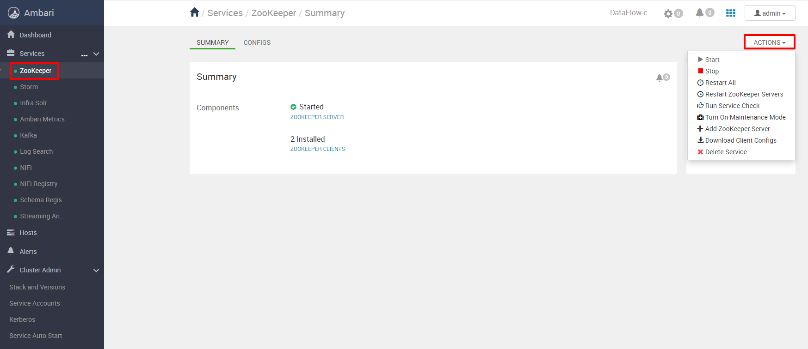
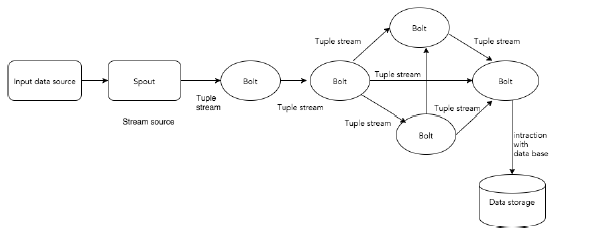
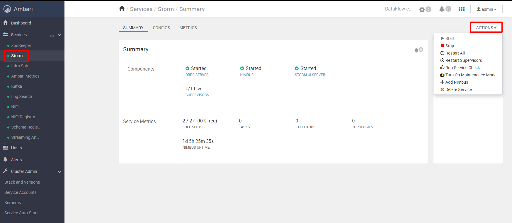
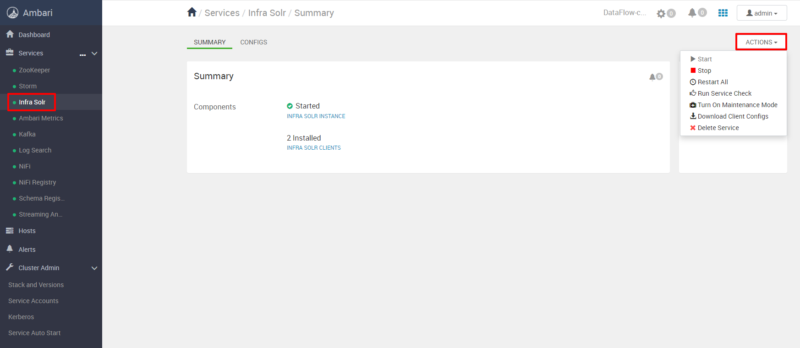
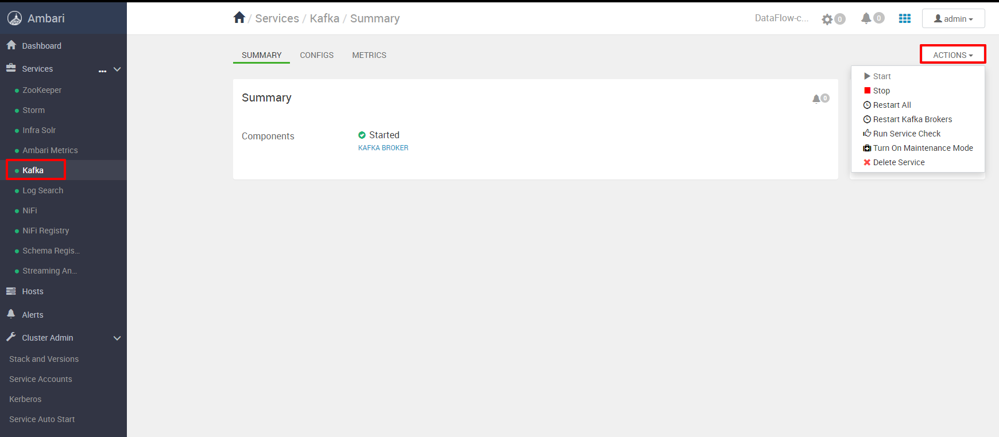
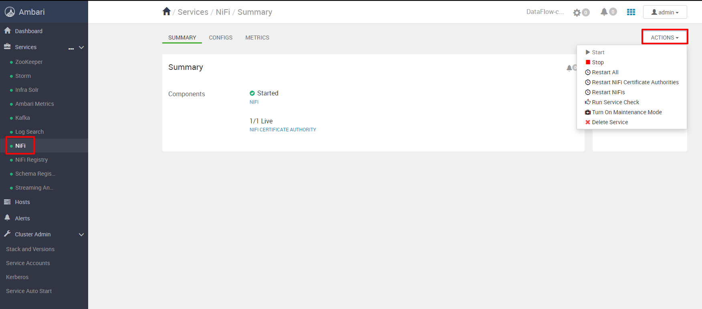

## Компоненты сборки

Вариант сборки DataFlow состоит из предустановленных компонент, описание которых дано ниже. Дополнительные компоненты можно установить в интерфейсе Ambari.

## ZooKeeper

Apache Zookeeper — open source проект Apache Software Foundation,cервис-координатор, который обеспечивает распределенную синхронизацию небольших по объему данных (конфигурационная информация, пространство имен) для группы приложений. Zookeeper представляет из себя распределенное хранилище "ключ-значение", гарантирующий надежное хранение информации за счет синхронной репликации между узлами, контроля версий, механизма очередей и блокировок. За счет использования оперативной памяти и масштабируемости обладает высокой скоростью.

Архитектурно Zookeeper организован по клиент-серверной технологии, когда клиентские приложения обращаются к одному из узлов, объединенных в ансамбль. Среди ансамбля серверов выделяется главный узел — Лидер, который выполняет все операции записи и запускает автоматическое восстановление при отказе любого из подключенных серверов. Остальные узлы — подписчики или последователи, реплицируют данные с Лидера и используются клиентскими приложениями для чтения.

ZooKeeper имитирует виртуальную древовидную файловую систему из взаимосвязанных узлов, которые представляют собой совмещенное понятие файла и директории. Каждый узел этой иерархии может одновременно хранить данные и иметь подчиненные узлы-потомки.

В интерфейсе Ambari для управления компонентом Zookeeper необходимо открыть соответствующую вкладку и открыть выпадающее меню "Действия/Actions":

## Storm

Apache Storm представляет собой фреймворк для распределенных потоковых вычислений в реальном времени.

Storm легко интегрируется с уже используемыми менеджерами очередей и базами данных. Топология Storm использует потоки данных и обрабатывает их сколь угодно сложными способами, перераспределяя потоки между этапами вычислений по мере необходимости.

Apache Storm являетсясвободнойраспределенной системой вычислений в реальном времени соткрытым исходным кодом. Storm упрощает надежную обработку неограниченных потоков данных, делая в режиме реального времени то же, что и делаетHadoopдля пакетов данных.

Apache Storm читает поток "сырых" данных на входе, пропускает его через последовательность небольших обработчиков и далее подает на выход результат обработки. Диаграмма, данная ниже, иллюстрирует основные концепции Apache Storm:

В интерфейсе Ambari для управления компонентом Storm необходимо открыть соответствующую вкладку и открыть выпадающее меню "Действия/Actions":

## Infra Solr

Apache Solr - поисковая платформа с открытым исходным кодом, построенная на Apache Lucene™. Solr обладает высокой надежностью, масштабируемостью и отказоустойчивостью, обеспечивая распределенное индексирование, репликацию и балансировку нагрузки, автоматическое восстановление после сбоев, централизованную конфигурацию и многое другое. Solr поддерживает функции поиска и навигации многих крупнейших интернет-сайтов в мире. Так как в Solr есть возможность распределенного поиска и репликации, Solr хорошо масштабируем.

Solr работает как автономный полнотекстовый поисковый сервер. Он использует библиотеку поискаLucene Java в своей основе для полнотекстового индексирования и поиска, и имеет REST-подобные API HTTP / XML и JSON, которые делают его пригодным для использования на самых популярных языках программирования. Внешняя конфигурация Solr позволяет адаптировать ее ко многим типам приложений без Java-кодирования и иметь архитектуру плагина для поддержки более детальной настройки.

В интерфейсе Ambari для управления компонентом Solr необходимо открыть соответствующую вкладку и открыть выпадающее меню "Действия/Actions":

## AmbariMetrics

Ambari Metrics System (AMS) - собирает, агрегирует и обслуживает системные метрики в кластерах, управляемых Ambari и имеет 4 компонента:

-
- мониторы метрик на каждом хосте в кластере собирают метрики системного уровня и публикуют их в Metrics Collector
- Hadoop Sinks подключается к компонентам Hadoop для публикации метрик в Metrics Collector
- Metrics Collector это демон, работающий на определенном хосте в кластере и получающий данные от зарегистрированных пользователей, мониторов или приемников
- Grafana это демон, который работает на определенном хосте в кластере и обслуживает предварительно созданные панели мониторинга для визуализации метрик.

В интерфейсе Ambari для управления компонентом Ambari Metrics необходимо открыть соответствующую вкладку и открыть выпадающее меню "Действия/Actions":

## Kafka

Apache Kafka - распределенный программный брокер сообщений, поддерживающий транзакционность при работе с потребителями и поставщиками событий:

-
- публикует и подписывается на поток записей подобно очереди сообщений и корпоративной системе сообщений
- хранит поток записей (событий) обеспечивая отказоустойчивость и надежность
- обрабатывает поток записей (событий) по мере поступления

Kafka как правило используется как система обработки событий для двух классов приложений:

-
- построение потоков каналов данных в режиме реального времени с надежностью получения данных между системами и приложениями;
- построение потоковых приложений работающих в режиме реального времени которые трансформируют или реагируют на данные потока.

В интерфейсе Ambari для управления компонентом Kafka необходимо открыть соответствующую вкладку и открыть выпадающее меню "Действия/Actions":

## NiFi

Apache NiFi — это простая платформа обработки событий (сообщений), предоставляющая возможности управления потоками данных из разнообразных источников в режиме реального времени с использованием графического интерфейса. Программа Apache NiFi написана для диспетчеризации данных, поддерживающих работу с разнообразными небольшими сетевыми граничными устройствами, крупными кластерами данных и облачной инфраструктурой.

Apache NiFi использует концепцию потока, рассматриваемую как последовательность операций: передача, преобразование и обогащение данных над последовательностью отдельных событий. Таким образом, поток не рассматривается как большая пакетная операция, требующая выполнения первоначальной загрузки всех данных перед началом обработки. Например, SQL база данных с миллионами строк рассматривается Apache NiFi как миллионы отдельных строк, требующие своей обработки.

В интерфейсе Ambari для управления компонентом NiFi необходимо открыть соответствующую вкладку и открыть выпадающее меню "Действия/Actions":

