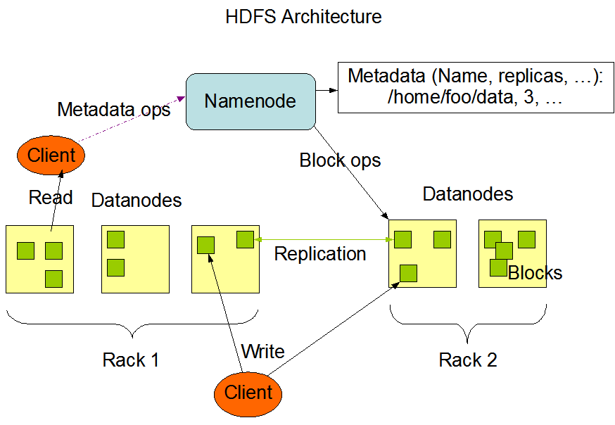

Проект Apache Hadoop разрабатывает программное обеспечение с открытым исходным кодом для надежных масштабируемых распределенных вычислений.

Программная библиотека Apache Hadoop - это платформа, которая позволяет выполнять распределенную обработку больших наборов данных между кластерами с использованием простых моделей программирования. Он предназначен для масштабирования от отдельных серверов до тысяч машин, каждая из которых предлагает отдельные вычисления и хранение.

Проект Apache Hadoop включает следующие модули:

- Hadoop Common - общие утилиты, поддерживающие другие модули Hadoop
- HDFS - распределенная файловая система, обеспечивающая высокопроизводительный доступ к данным приложения.
- Hadoop YARN - структура для планирования заданий и управления ресурсами кластера.
- Hadoop MapReduce - система на основе YARN для параллельной обработки больших наборов данных.

## HDFS

Данная распределенная файловая система предназначена для работы на стандартном оборудовании. HDFS отличается высокой отказоустойчивостью и предназначена на развертывании на недорогом оборудовании. HDFS обеспечивает высокопроизводительный доступ к данным и подходит для приложений с большими объемами данных.

Основная архитектурная цель HDFS - это обнаружение сбоев и быстрое автоматическое восстановление после них.

Приложения, работающие в HDFS, нуждаются в потоковом доступе к своим наборам данных. HDFS больше предназначена для пакетной обработки, чем для интерактивного использования. Акцент делается на высокой пропускной способности доступа к данным.

HDFS имеет master/slave архитектуру. Кластер HDFS состоит из одного узла NameNode, главного сервера, который управляет пространством имен файловой системы и регулирует доступ клиентов к файлам. Кроме того, существует несколько узлов DataNodes, которые управляют хранилищем, подключенному к узлам. HDFS предоставляет пространство имен файловой системы и позволяет хранить пользовательские данные в файлах. Внутри файл разбивается на один или несколько блоков и эти блоки хранятся в наборе узлов. NameNode выполняет операции пространства имен файловой системы, такие как открытие, закрытие, переименование файлов и каталогов. DataNodes отвечают за обслуживание запросов чтения и записи от клиентов файловой системы. DataNodes также выполняют создание, удаление и репликацию блоков по команде NameNode.

## Hadoop YARN

Фундаментальная идея YARN состоит в разделении функций управления ресурсами и планирования/мониторинга заданий на отдельные дэймоны. Идея состоит в том, чтобы иметь глобальный ResourseManager (RM) и ApplicationMaster (AM) для каждого приложения.

ResourseManager и NodeManager образуют структуру вычисления данных. ResouresManager имеет наивысший статус и распределяет ресурсы между всеми приложениями в системе. NodeManager - это агент инфраструктуры для каждой машины, который отвечает за контейнеры, отслеживает использование ими ресурсов (процессор, память, диск, сеть) и сообщает об этом RM.

RM имеет два основных компонента: Планировщик и ApplicationManager.

Планировщик отвечает за распределение ресурсов между различными запущенными приложениями, с учетом известных ограничений емкости и очередей. Планировщик не выполняет мониторинг или отслеживание. Планировщик выполняет свою функцию планирования на основе требований приложений к ресурсам. Имеет подключаемую политику, которая отвечает за разделение ресурсов кластера между различными очередями.

ApplicationManager отвечает за прием отправленных заданий, согласование контейнера для выполнения конкретного приложения ApplicationMaster и предоставляет службу для перезапуска контейнера ApplicationManager в случае сбоя. ApplicationMaster для каждого приложения отвечает за согласование и планировщиком соответствующих контейнеров ресурсов, отслеживание их статуса и мониторинг выполнения.

## Hadoop MapReduce

Hadoop MapReduce программный фрэймворк для написания приложений, которые обрабатывают большие (многотерабайтные) объемы данных параллельно на больших кластерах надежным и отказоустойчивым способом.

Работа MapReduce заключается в разбивке входного набора данных на независимые блоки, которые обрабатываются параллельно. Платформа сортирует выходные данные карт, которые затем вводятся в сокращенные задачи. Как правила, ввод и вывод задач хранятся в файловой системе. Фрэймворк заботится о планировании задач, контролирует их и повторно выполняет невыполненные.

Обычно вычислительные узлы и узлы хранения совпадают, то есть инфраструктура MapReduce и HDFS работают на одном наборе узлов. Эта конфигурация позволяет платформе эффективно планировать задачи на узлах, где данные уже присутствуют, что приводит к очень высокой совокупной пропускной способности кластера.
