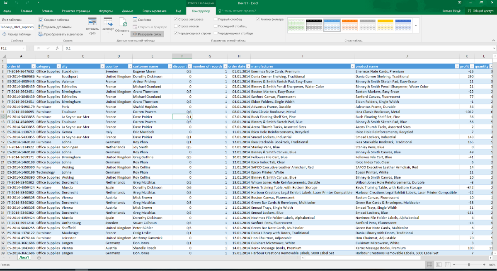

Описание
--------

Витрина данных (Data Mart) это срез базы данных, который призван представлять собой массив узкоспециализированной тематической информации, ориентированный под определенные запросы.

Идея создания витрин данных была предложена в 1991 году Forrester Research. Хранилище информации представлялось как определенное множество специфических баз данных, которые содержат в себе сведения, относящиеся к конкретным векторам деятельности корпорации.

Преимущества такого среза заключаются в максимальной приближенности целевой части хранилища данных к конкретному пользователю; содержании тематических подмножеств заранее агрегированных специалистами данных, которые в дальнейшем проще настраивать и проектировать; также для реализации витрина данных не требуется вычислительная техника большой мощности.

Apache Hive
-----------

В сервисе VK Cloud Solutions Big Bata используется витрина данных Hive.

Apache Hive - это система хранилища данных в экосистеме Hadoop.

Удобным и доступным способом для работы с Hive является использование интерфейса Hive View в интерфейсе Ambari. Hive View предоставляет следующие возможности:

*   интерактивное выполнение SQL-запросов;
*   визуализация плана запросов;
*   создание и удаление таблиц;
*   сохранение и просмотр истории запросов;
*   добавление пользовательских функций (UDF);
*   отладка работы задач Tez;
*   настройки параметров Hive;

Чтобы открыть Hive View, кликните на кнопку  в правом верхнем углу панели меню и в выпадающем списке выберите Hive View 2.0. Для упрощения миграции со старых версий Ambari, сервис также использует предыдущую версию Hive View (1.0). Она обладает меньшими возможностями, но имеет привычный интерфейс.

Вкладка QUERY позволяет в интерактивном режиме выполнять запросы. 

Загрузка данных
---------------

Для выполнения более сложных запросов необходимо сначала создать таблицы и загрузить данные. 

Во вкладке Tables при нажатии кнопки "+" и затем "UPLOAD TABLE" открывается интерфейс создания таблицы при помощи загрузки файла .csv.

Далее, необходимо выбрать следующие параметры:

*   Field type - CSV
*   Field Delimiter - , (запятая)
*   Escape Character - \\ (обратный слэш)
*   Quote Character - " (двойные кавычки)
*   Is first row header -  включено

Если загружаемые данные имеют другой формат, то следует выставить соответствующие настройки при загрузке файла.

Ниже необходимо выбрать "Upload from Local", кликнуть на текст "Drag file to upload or click to browse" и загрузить необходимый файл.

Также можно проверить корректность введенных данных и при необходимости изменить их:

Далее следует нажать кнопку "Create". Hive View сначала загружает CSV-файл во временную таблицу и в случае успеха перемещает в таблицу с задним именем.