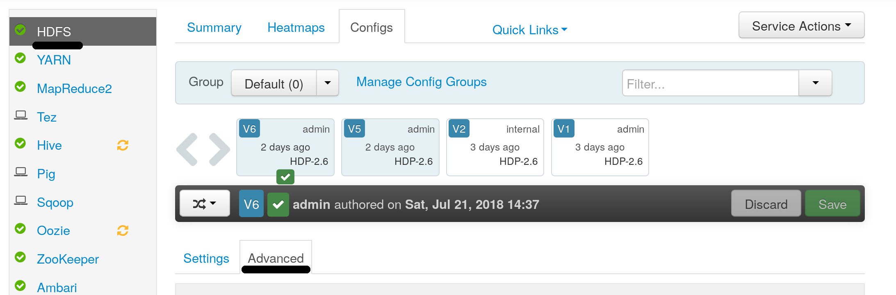
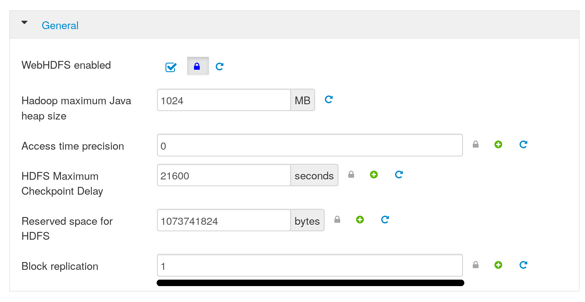

По умолчанию кластера Hadoop и Spark в VK Cloud Solutions используют фактор репликации данных (dfs.replication) равным 1. Использование данного значения фактора репликации означает, что данные HDFS будут храниться в кластере в единственном экземпляре. При этом избыточность и надежность хранения данных обеспечивается исключительно нижележащей инфраструктурой SDS (Software Defined Storage), подключенной к серверам кластера по высокоскоростному каналу связи. 

При необходимости фактор репликации HDFS может быть изменен на бо́льшие значения. В таком случае избыточность хранения данных будет обеспечиваться как на уровне самого HDFS, так и на уровне блочного хранения данных в SDS, что обеспечит еще большую надежность и скорость обработки данных.

Для изменения фактора репликации для отдельных файлов используйте команду «hdfs dfs -setrep»: 

```
hdfs dfs -setrep 3 /user/admin/superstore.csv
```

Для рекурсивного применения к директории добавьте флаг -R:

```
hdfs dfs -setrep 3 -R /user/admin
```

Для получения заданного числа копий используйте команду «hdfs dfs -stat»:

```
hdfs dfs -stat %r /path/to/file
```

Для получения реального числа копий можно воспользоваться «hdfs fsck»:

```
hdfs fsck /user/admin/data.csv
/user/admin/data.csv:  Under replicated BP-1014754436-192.168.99.119-1532095262675:blk_1073743175_2396. Target Replicas is 3 but found 1 live replica(s), 0 decommissioned replica(s) and 0 decommissioning replica(s).
Status: HEALTHY
 Total size: 2878934 B
 Total dirs: 0
 Total files:   1
 Total symlinks:             0
 Total blocks (validated):   1 (avg. block size 2878934 B)
 Minimally replicated blocks:   1 (100.0 %)
 Over-replicated blocks:     0 (0.0 %)
 Under-replicated blocks:    1 (100.0 %)
 Mis-replicated blocks:      0 (0.0 %)
 Default replication factor: 1
 Average block replication:  1.0
 Corrupt blocks:             0
 Missing replicas:           2 (66.666664 %)
 Number of data-nodes:       1
 Number of racks:            1
FSCK ended at Mon Jul 23 17:20:46 UTC 2018 in 1 milliseconds
The filesystem under path '/user/admin/data.csv' is HEALTHY 
```

Ненулевое число «Under-replicated blocks»  в выводе fsck может означать, что заданное число копий данных для указанного файла еще не было достигнуто, например по причине отсутствия необходимого количества узлов.

При уменьшении размера кластера при масштабировании, сервис VK Cloud Solutions BigData автоматически дожидается перемещения данных на другие узлы и уменьшения числа under-replicated blocks до нуля перед отключением выводимого из эксплуатации узла. Если же один или несколько файлов имеют фактор репликации больше, чем целевое число рабочих узлов, то процесс масштабирования будет ждать бесконечно до тех пор, пока число копий не будет уменьшено до целевого числа рабочих узлов.

Для изменения фактора репликации для всех новых файлов, зайдите в интерфейс Ambari, секция HDFS, вкладка Configs, вкладка Advanced:



В секции General поменяйте значение «Blocks Replication» (dfs.replication) на необходимое и примените конфигурацию:



При необходимости изменить значение фактора репликации по умолчанию для всех новых кластеров, обратитесь в [службу поддержки](https://help.mail.ru/infra/support).