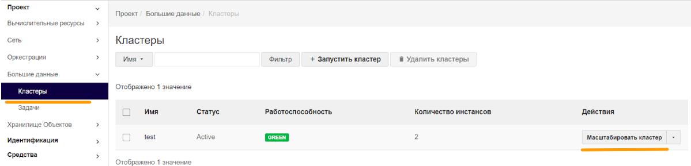
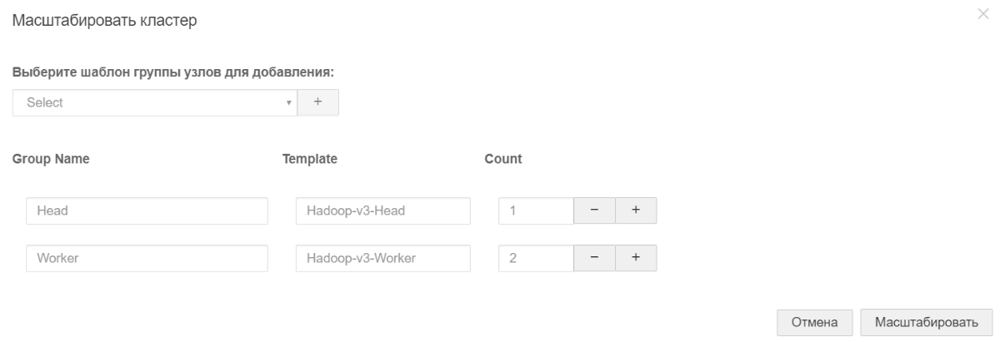

1.  В интерфейсе Horizon перейдите в раздел «Большие данные» →«Кластеры» и кликните «Масштабировать кластер».
    
    
    
2.  В появившемся окне укажите новое количество рабочих узлов и кликните «Масштабировать». Изменить количество головных узлов невозможно.
    
    
    
3.  Появится сообщение «Успешно: Масштабированный кластер успешно запущен», а в столбце СТАТУС появится индикатор хода выполнения задачи.
    
    
    
    Процесс масштабирования также можно отслеживать, кликнув имя кластера и перейдя на вкладку «События кластера».
    
4.  По окончании масштабирования на вкладке «Инстансы» появится информация о новом добавленном узлеtest-hadoop-worker-3.