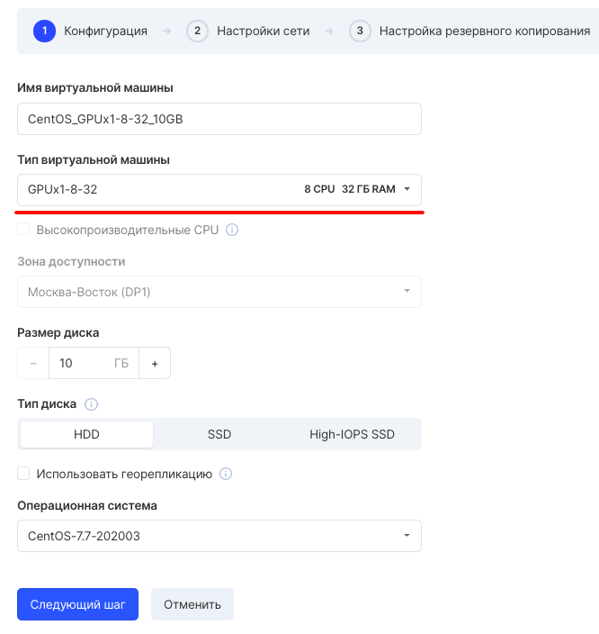

VK Cloud Solutions представляет сервис "Облачные вычисления на базе NVIDIA GPU". Облачные вычисления на базе GPU дают возможность компаниям справляться с задачами, решение которых ранее было либо невозможно, либо требовало огромных ресурсов.

Используются самые производительные графические процессоры NVIDIA® Tesla® V100 для обучения и инференса глубоких нейросетей.

## Высокопроизводительные вычисления (HPC)

Решение задач, требующие больших вычислительных мощностей, проще проводить, используя облачные вычисления на GPU. Это сокращает время проведения исследований и ожидания результатов.

## Рендеринг графики на стороне сервера

Скорость рендеринга графики на стороне сервера с помощью самого продвинутого графического процессора NVIDIA® Tesla® V100, значительно превышает скорость рендеринга на обычной видеокарте.

Время на решение задач в области глубокого обучения, графической визуализации и высокопроизводительных вычислений можно сократить **с дней** **до часов**. Обучение нейронных сетей, решение сложных задач по проектированию или передовыми исследованиями — благодаря NVIDIA® Tesla® V100 и VK Cloud Solutions можно получить максимальную производительность.

## GPU-ускоренные вычисления в облаке

Новые поколения научных приложений и задач, связанных с искусственным интеллектом и машинным обучением, требуют колоссальное количество вычислительных мощностей, с которыми не справляются даже современные CPU серверы. Для успешного решения таких задач применяются GPU-ускоренные серверы.

В зависимости от типа задач 1 современный GPU сервер может заменить до 100 обычных CPU серверов. Это достигается за счет разного способа выполнения задач. CPU состоит из нескольких ядер, оптимизированных для последовательной обработки данных, а в GPU используются тысячи более мелких ядер для эффективной обработки параллельных задач.

Облачные вычисления на базе GPU выведут на новый уровень производительности и значительно сократят время на обработку данных, при этом позволив сэкономить средства компании.

VK CS предоставляет видеокарты NVIDIA® Tesla® V100 с 16 ГБ видеопамяти.

## Тарификация

Тарификация посекундная. Арендуйте и развертывайте вычислительные мощности за минуты и отключайте их сразу после выполнения своих задач. Платите только за фактическое использование ресурсов с посекундной тарификацией.

Актуальные тарифы можно увидеть [на этой странице](https://mcs.mail.ru/cloud-gpu/).

## Подключение

Для подключения достаточно отправить заявку [со страницы сервиса](https://mcs.mail.ru/app/services/gpu/) и (после подтверждения) виртуальные машины с установленной видеокартой Tesla станут доступны для создания.

После подтверждения заявки в наборе конфигураций виртуальных машин появятся конфигурации с префиксом GPU. Это конфигурации с установленной видеокартой Tesla.

## Программное обеспечение

Рекомендуется установить следующее программное обеспечение для работы с GPU:

- CUDA Toolkit: [официальная документация](https://developer.nvidia.com/cuda-toolkit)
- Deepo (поддерживает. CUDA 10.2): [официальная документация](https://github.com/ufoym/deepo)
