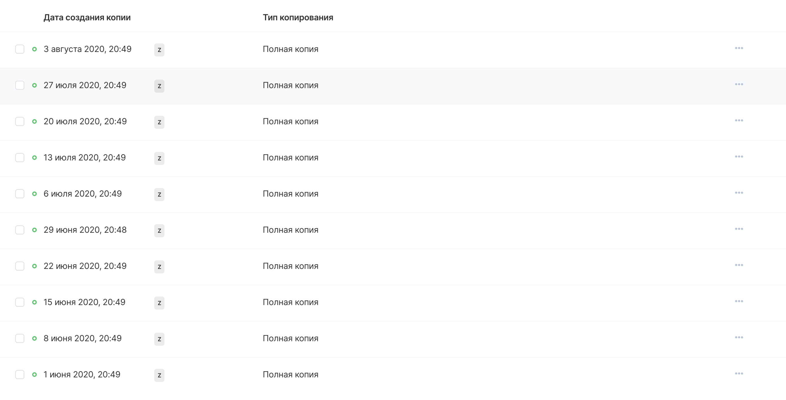

Контроль за наличием резервных копий помогает предотвратить утрату важных данных, а также предоставляет информацию о возможных точках восстановления виртуальной машины в случае ее отказа или необходимости отменить проделанные изменения.

## Панель управления VK CS

Для просмотра резервных копий [в личном кабинете VK CS](https://mcs.mail.ru/app/services/infra/servers/) следует:

1.  Перейти в раздел "Резервное копирование" сервиса "Облачные вычисления".
2.  Перейти в требуемый план резервного копирования в разделе "Автоматическое" или "Ручное", появится интерфейс просмотра резервных копий:

Для удаления резервной копии требуется в контекстном меню точки восстановления выбрать "Удалить копию".

Для приостановки или возобновления создания резервных копий необходимо на странице "Резервное копирование" выделить требуемый план и в верхнем меню нажать на "Остановить" или "Активировать".
