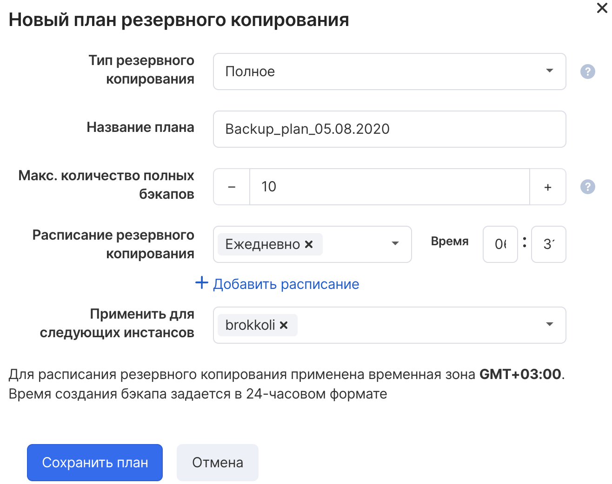

В VK CS существует возможность создавать резервные копии виртуальных машин по расписанию.

Автоматическое резервное копирование представлено в виде "Плана резервного копирования" и включает в себя все диски инстанса, добавление или удаление дисков ВМ также изменяет план.

**Внимание**

Резервные копии размещаются в общем хранилище данных и оплачиваются в соответствии с тарифом. Подробную информацию о стоимости хранения можно увидеть в детализации Биллинга проекта.

После удаления виртуальной машины все резервные копии сохраняются в проекте. Удаление резервных копий, созданных планом, потребуют ручной операции удаления самого плана. Ручные бэкапы можно удалить в любой момент при необходимости.

Настройка плана резервного доступны из нескольких интерфейсов.

## Панель управления VK CS

Для создания плана [в личном кабинете VK CS](https://mcs.mail.ru/app/services/infra/servers/) следует:

1.  Перейти в раздел "Резервное копирование" сервиса "Облачные вычисления".
2.  На вкладке "Автоматическое" нажать "Добавить" для добавления плана.
3.  Настроить параметры резервного копирования:

    <table style="width: 100%;"><tbody><tr><td style="width: 39.3333%; background-color: rgb(239, 239, 239);">Параметр</td><td style="width: 60.5334%; background-color: rgb(239, 239, 239);">Описание</td></tr><tr><td style="width: 39.3333%;">Тип резервного копирования</td><td style="width: 60.5334%;">Полное или инкрементальное резервное копирование. Инкрементальное позволяет сэкономить место, снизить расходы и увеличить скорость создания бэкапов</td></tr><tr><td style="width: 39.3333%;">Название плана</td><td style="width: 60.5334%;">Название плана резервного копирования</td></tr><tr><td style="width: 39.3333%;">Макс. количество полных бэкапов</td><td style="width: 60.5334%;">Настраивает количество хранимых полных резервных копий</td></tr><tr><td style="width: 39.3333%;">Расписание резервного копирования</td><td style="width: 60.5334%;">Задает дни и время создания копий. Возможно создание нескольких расписаний</td></tr><tr><td style="width: 39.3333%;">Применить для следующих инстансов</td><td style="width: 60.5334%;">Выбор виртуальных машин, для которых будут создаваться копии</td></tr></tbody></table>

4.  Нажать "Сохранить план".

Для редактирования плана резервного копирования в разделе "Резервное копирование" требуется в контекстном меню плана выбрать пункт "Изменить".

Для удаления плана следует в контекстном меню плана выбрать "Удалить". Это также удалит все точки восстановления (резервные копии).
