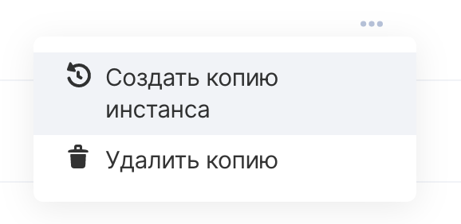
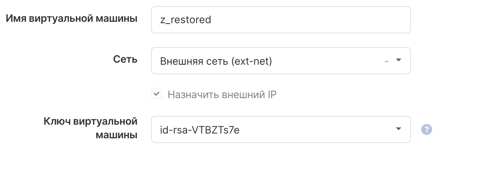

Восстановление инстанса из резервной копии помогает создать копию виртуальной машины на определенный момент времени, когда была создана точка бэкапа.

**Примечание**

Инкрементальные резервные копии консолидируются в полный бэкап по настроенному в Плане резервного копирования расписанию.

При восстановлении следует ориентироваться только на полную резервную копию инстанса.

Панель управления VK CS
---------------------

Для восстановления резервной копии [в личном кабинете VK CS](https://mcs.mail.ru/app/services/infra/servers/) следует:

1.  Перейти в раздел "Резервное копирование" сервиса "Облачные вычисления".
2.  Перейти в требуемый план резервного копирования в разделе "Автоматическое" или "Ручное", появится интерфейс просмотра резервных копий:
3.  В контекстном меню точки восстановления выбрать "Создать копию инстанса":
4.  Настроить параметры инстанса, восстанавливаемого из бэкапа:
5.  Выбрать "Создать копию инстанса из бэкапа", после чего начнется создание новой виртуальной машины.

