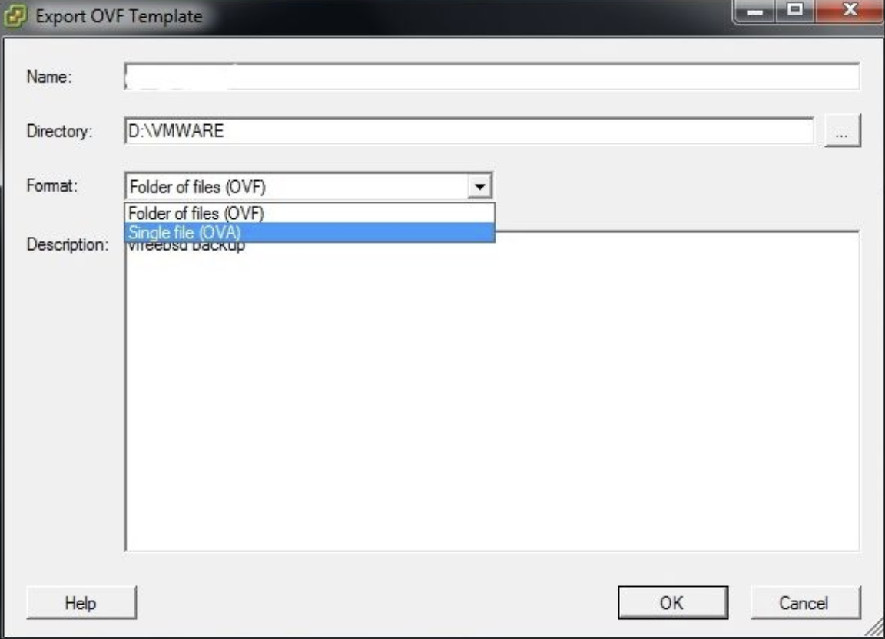

Миграция виртуальных машин между сервисами/платформами, на которых их можно запускать и эксплуатировать, как правило, состоит из нескольких этапов:

**Внимание**

Перед миграцией ВМ убедитесь, что следующие требования соблюдены:

- Операционная система имеет 64-битную архитектуру
- ВМ использует BIOS
- Текущий пользователь обладает правами Администратора
- ВМ должна иметь хотя бы один подключенный диск

## Подготовка к миграции

Перед миграцией виртуальной машины следует произвести подготовительные действия, направленные на обеспечение функционалом имеющийся виртуальный сервер:

**Интеграция драйверов**

Прежде всего следует скачать и установить драйверы пакета VirtIO в существующую виртуальную машину.

- [Windows](https://fedorapeople.org/groups/virt/virtio-win/direct-downloads/archive-virtio/virtio-win-0.1.171-1/) - скачивание и [инструкция](https://www.linux-kvm.org/page/WindowsGuestDrivers/Download_Drivers) к установке
- [Linux](https://www.linux-kvm.org/page/Virtio) - скачивание и [инструкции](https://www.linux-kvm.org/page/Virtio) к установке

В некоторых случаях, при невозможности автоматической установки драйверов, может потребоваться их ручное добавление и установка драйверов из загруженного пакета драйверов VirtIO.

После установки драйверов необходимо установить гостевой агент QEMU Guest Agent. Используется установщик, соответствующий архитектуре имеющейся виртуальной машины.

**Добавление драйверов в реестр**

Для корректного определения драйверов необходимо добавить их в системный реестр Windows.

Для этого следует:

1.  Загрузить [Virtio Registry File](http://migration.platform9.com.s3-us-west-1.amazonaws.com/virtio.reg) на инстанс.
2.  Открыть редактор реестра Windows и импортировать загруженный файл.

**Удаление VMWare Tools**

В случае миграции с платформы VMWare на другие, необходимо удалить программное обеспечение платформы, а именно VMWare Tools. Действие рекомендуется произвести через стандартную оснастку Установки и удаления программ (для Windows), или менеджер приложений, существующий в операционной системе.

## Экспорт виртуальной машины

**Внимание**

Перед проведением операций экспорта виртуальную машину необходимо остановить.

Для экспорта виртуальной машины в файл следует выбрать желаемую ВМ, затем экспортировать ее шаблон, использую функцию Export OVF Template.

В окне экспорта следует указать имя желаемое экспортируемого шаблона, а также формат экспорта "Folder of files (OVF)".



## Загрузка образа ВМ в VK CS

Полученный в результате экспорта файл \*.vmdk следует загрузить в существующий проект VK CS.

Для загрузки образа виртуальной машины рекомендуется использовать Openstack CLI, чтобы избежать возможных ошибок обработки веб интерфейсом файлов большого размера. Чтобы загрузить образ \*.vmdk следует воспользоваться командой:

```
openstack image create --private --container-format bare --disk-format vmdk --property store=s3 --file <файл.vmdk> <название_образа>
```

Если инстанс, созданный из образа, должен поддерживать резервное копирование, необходимо загрузить его с указанием метаданных наличия гостевого агента:

```
openstack image create --private --container-format bare --disk-format vmdk --file <файл.vmdk> --property hw_qemu_guest_agent=yes --property store=s3 --property os_require_quiesce=yes <название_образа>
```
