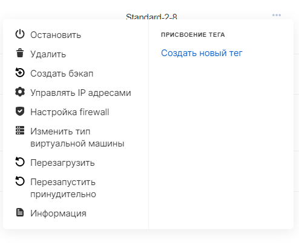
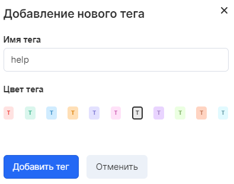
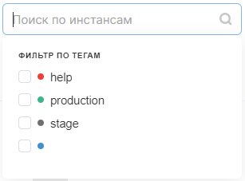

К виртуальным машинам можно добавлять теги - произвольные сочетания символов, позволяющие индексировать инстансы или фильтровать по определенному тегу.

Панель управления VK CS
---------------------

Для управления тегами [в личном кабинете VK CS](https://mcs.mail.ru/app/services/infra/servers/) следует:

1.  Перейти на страницу "Виртуальные машины" раздела "Облачные вычисления".
2.  В контекстном меню инстанса в разделе "присвоение тега" выбрать существующие теги или создать новый:
3.  При создании нового тега существует возможность выбрать цвет и имя тега:
4.  Возможен поиск инстансов по тегу:

OpenStack CLI
-------------

Управление тегами в клиенте openstack осуществляется с помощью команд nova.

Добавление тега:

```
nova server-tag-add <ID инстанса> <тэг>
```

Просмотр тегов сервера:

```
nova server-tag-list <ID инстанса>
```

Удаление тега:

```
nova server-tag-delete <ID инстанса> <тэг>
```

Удаление всех тегов инстанса:

```
nova server-tag-delete-all <ID инстанса>
```