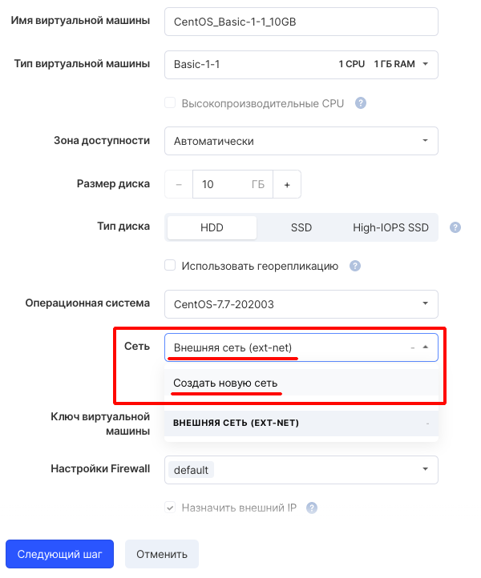
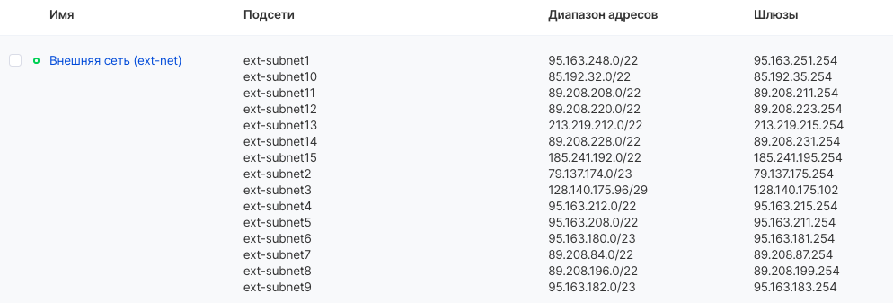
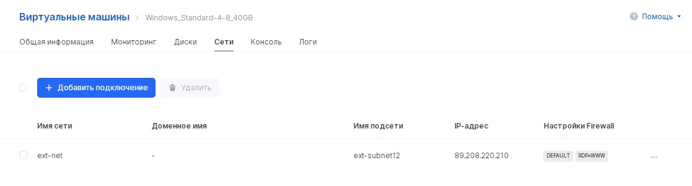
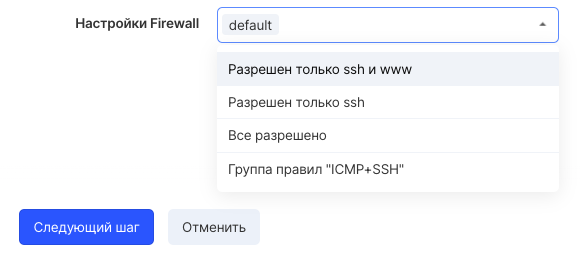

К виртуальным машинам возможно подключить несколько портов различных сетей. Порт - виртуальная сетевая карта инстанса, для которой настраиваются группы безопасности, подключенная сеть и DNS-имя.

## Подключение сети при создании ВМ

Виртуальная машина при создании по умолчанию подключается к внешней сети (Ext-net). Это означает, что виртуальная машина получает IP-адрес из некоторого диапазона (см. ниже):





Также можно создать новую сеть "на лету", при создании виртуальной машины. При этом параметры сети можно выбрать самостоятельно.

## Добавление подключения после создания ВМ

Для управления сетевыми подключениями ВМ [в личном кабинете VK CS](https://mcs.mail.ru/app/services/infra/servers/) следует:

1.  Перейти на страницу "Виртуальные машины" раздела "Облачные вычисления".
2.  Открыть карточку инстанса, перейти на вкладку "Сети". На этой странице отображаются все сетевые подключения. 
3.  Для добавления сетевого интерфейса требуется выбрать "Добавить подключение" и настроить параметры в соответствии с таблицей:

    <table style="width: 99%; margin-right: calc(1%);"><tbody><tr><td style="width: 21.1729%; background-color: rgb(239, 239, 239);">Имя</td><td style="width: 78.6436%; background-color: rgb(239, 239, 239);">Задание имени порта</td></tr><tr><td style="width: 21.1729%;">Сеть для подключения</td><td style="width: 78.6436%;">Выбор подсети, к которой будет подключен порт</td></tr><tr><td style="width: 21.1729%;">DNS-имя</td><td style="width: 78.6436%;">Доступно для приватных сетей. Ввод имени DNS, по которому можно обращаться к инстансу, используя приватный DNS</td></tr><tr><td style="width: 21.1729%;">Задать IP адрес</td><td style="width: 78.6436%;">Выбор элемента позволяет ввести конкретный IP в поле "IP-адрес". Адрес должен принадлежать выбранной подсети</td></tr><tr><td class="currently-active" style="width: 21.1729%;">Настройки firewall</td><td style="width: 78.6436%;">Выбор групп безопасности, устанавливающих правила прохождения трафика</td></tr></tbody></table>

4.  После сохранения параметров сетевой интерфейс будет добавлен к ВМ.

## Группы безопасности

При создании виртуальной машины по умолчанию подставляется группа безопасности (правило Firewall, правило хождения траффика) "**default**":



Правило Firewall "**default**" работает следующим образом:

**Входящий траффик**: По умолчанию разрешен только входящий трафик от инстансов, состоящих в группе безопасности default. При этом трафик из сети Интернет не разрешен.

**Исходящий траффик**: По умолчанию разрешен исходящий трафик внутри внутренней сети и в сеть Интернет.

## OpenStack CLI

Для подключения сети к ВМ с помощью клиента OpenStack необходимо:

1\. Получить список сетей:

```
openstack network list --all
```

2\. Получить список групп безопасности:

```
openstack security group list
```

3\. Получить список портов в сети:

```
openstack port list --long --network <ID сети>
```

4\. Создать порт:

```
openstack port create --network <ID сети> <имя порта>
```

В результате в указанной сети будет создан порт с IP адресом и группой безопасности default.

Также возможно создать порт с указанным IP адресом, описанием, DNS-именем, группой безопасности и [опцией DHCP](https://github.com/Juniper/contrail-controller/wiki/Extra-DHCP-Options):

```
openstack port create --network <ID сети> --fixed-ip subnet=<ID подсети>,ip-address=<IP адрес> --description <описание> --dns-name <DNS имя> --extra-dhcp-option name=time-servers,value=<IP адрес> --security-group <ID группы безопасности> <имя порта>
```

В результате выполнения команды будут получены описание и ID порта.

Далее необходимо присоединить порт к инстансу:

```
openstack server add port <ID инстанса> <ID порта>
```

Посмотреть все порты виртуальной машины можно командой:

```
openstack port list --server <ID инстанса>
```
