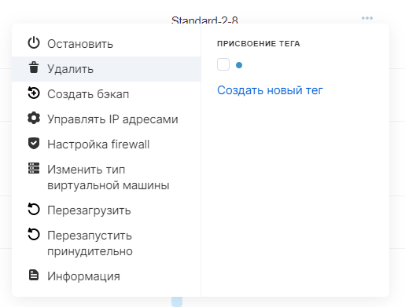
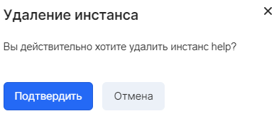

Удаление инстанса удаляет виртуальную машину и рут диск сервера, если иное не настроено политикой удаления дисков.

**Осторожно**

Обратить операцию удаления невозможно, поэтому сперва рекомендуется сделать резервную копию сервера.

Если требуется удалить только виртуальную машину - следует отсоединить диски перед удалением и заменить рут диск на временный.

## Панель управления VK CS

Для удаления инстанса [в личном кабинете VK CS](https://mcs.mail.ru/app/services/infra/servers/) следует:

1.  Перейти на страницу "Виртуальные машины" раздела "Облачные вычисления".
2.  В контекстном меню инстанса выбрать пункт"Удалить":
3.  Подтвердить проведение операции:

## OpenStack CLI

Удаление инстанса в клиенте OpenStack осуществляется командой:

```
openstack server delete <ID сервера>
```

Просмотр политики удаления дисков:

```
nova show <ID инстанса>
```

В результате выполнения команды в строке " os-extended-volumes:volumes_attached" перечислены ID дисков и политика их удаления ("delete_on_termination").
