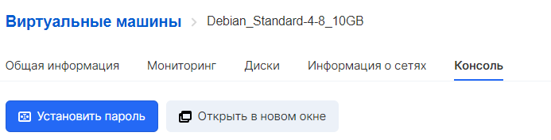

В VK CS возможна установка пароля пользователя операционных систем Windows и Linux. Для этого должны выполняться следующие условия:

- Инстанс создан из образа, предоставленного VK CS, или в системе установлен и работает гостевой агент QEMU
- С момента создания ВМ прошло не менее 15 минут

## Панель управления VK CS

Чтобы задать пароль [в личном кабинете VK CS](https://mcs.mail.ru/app/services/infra/servers/), следует:

1.  Перейти на страницу "Виртуальные машины" сервиса "Облачные вычисления".
2.  Нажать на нужный инстанс, перейти на вкладку "Консоль".
3.  Выбрать "Установить пароль". В появившемся меню установки пароля ввести пароль в форму ввода или выбрать опцию "Сгенерировать":

    **Внимание**

    Пароль должен содержать заглавные и строчные буквы латинского алфавита, цифры, символы !"#$%&()\*+,-.:;<=>?@[]^\_\`{}~

    Пароль должен содержать хотя бы одну букву или цифру, помимо специальных символов.

4.  Нажать на "Задать пароль". Это отправит команду инстансу на смену пароля для пользователя, который отображен в меню на шаге 3. Если операция завершится успешно, в интерфейсе появится уведомление:

## OpenStack CLI

Для установки пароля в клиенте OpenStack следует выполнить команду:

```
openstack server set --root-password <ID инстанса>
```

Появится приглашение ввода пароля.

Получить ID инстанса возможно в панели VK CS или выполнив:

```
openstack server list
```
