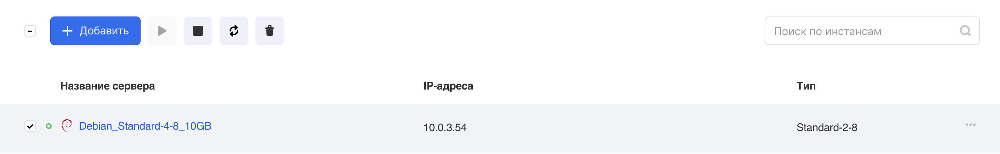
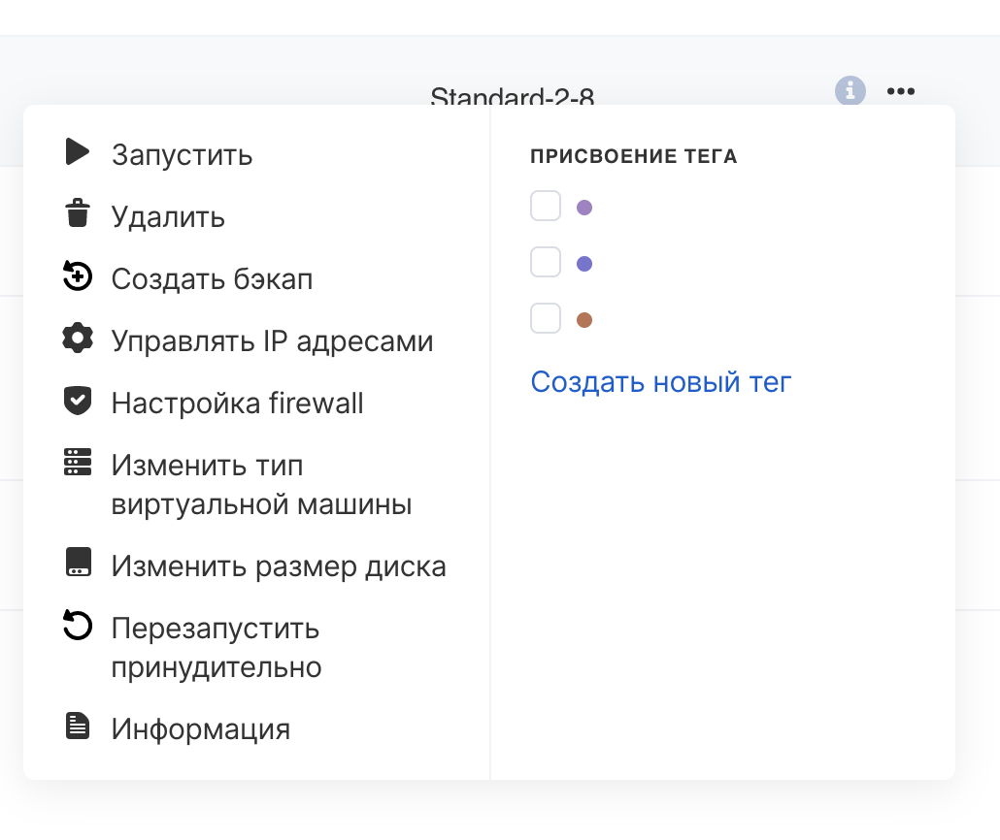
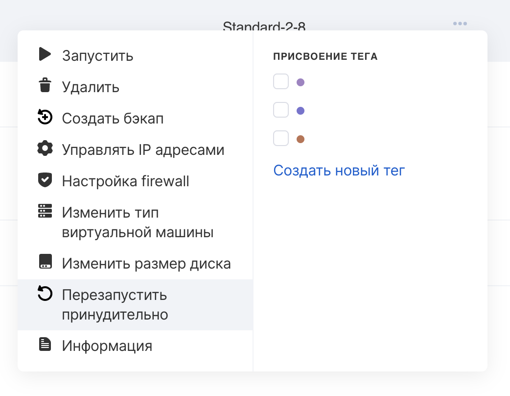

## Панель управления VK CS

Для работы с ВМ [в личном кабинете VK CS](https://mcs.mail.ru/app/services/infra/servers/) следует:

1.  Перейти на страницу "Виртуальные машины" раздела "Облачные вычисления".
2.  Выбрать инстансы и нажать на кнопку с действием в верхнем меню. Доступны остановка, запуск, перезагрузка и удаление машин.Также действия можно вызвать из контекстного меню:
3.  Выбрать требуемое действие и подтвердить операцию:

Если инстанс по каким-либо причинам не отвечает, можно воспользоваться принудительной перезагрузкой, вызвать опцию можно из контекстного меню виртуальной машины:

**Информация**

Обычная перезагрузка делает попытку корректно завершить работу операционной системы инстанса (graceful shutdown), принудительная перезагрузка эквивалентна выключению и включению питания (power cycle).

## OpenStack CLI

Для включения ВМ необходимо выполнить в клиенте OpenStack:

```
openstack server start <ID инстанса>
```

Выключение:

```
openstack server stop <ID инстанса>
```

Перезагрузка:

```
openstack server reboot <ID инстанса>
```

Принудительная перезагрузка:

```
openstack server reboot --hard <ID инстанса>
```
