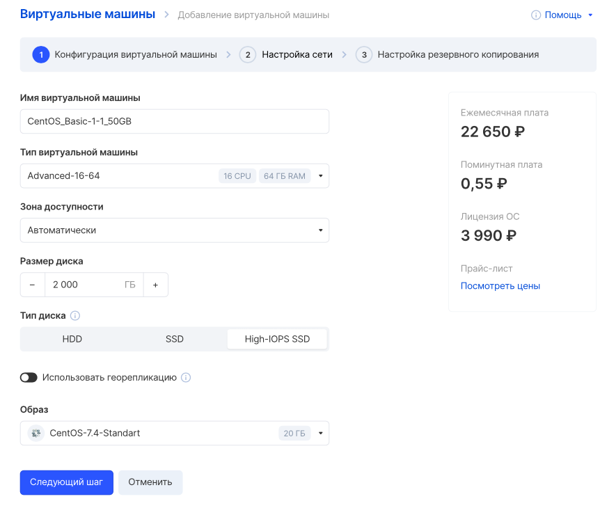
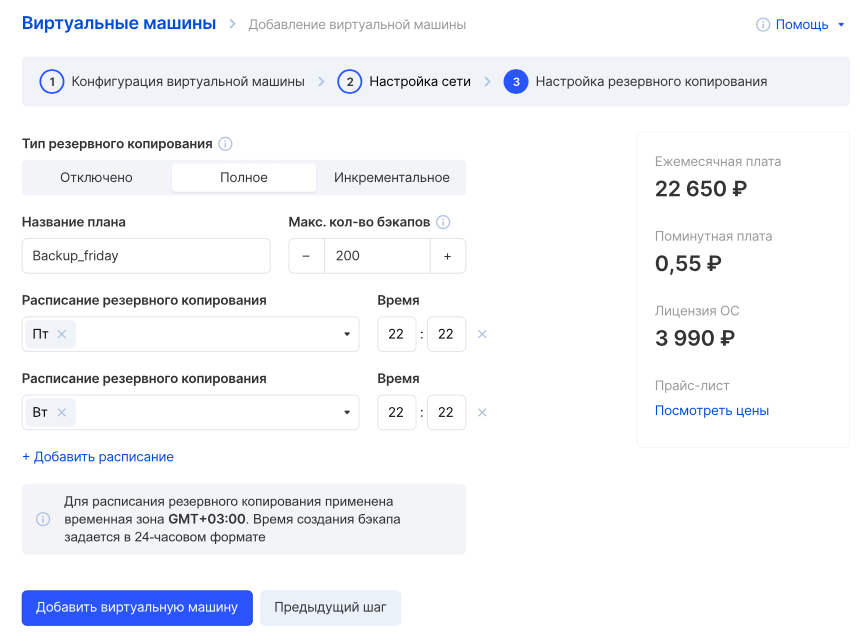

Сервис Облачные вычисления обладает широким функционалом, благодаря которому можно создавать и управлять масштабируемыми виртуальными машинами.

Виртуальные машины могут иметь операционную систему семейства OC Linux и Windows, доступные при создании виртуальных машин. Каждый диск с операционной системой автоматически реплицируется внутри своей зоны доступности, что обеспечивает надежное хранение данных.

Инфраструктура VK CS защищена в соответствии с ФЗ-152 только в зоне доступности MS1.

## Перед началом работы

Для создания виртуальной машины следует зарегистрироваться на Платформе VK CS, перейти в личный кабинет и убедиться что сервис Облачных вычислений активен, баланс счета положительный, а квот достаточно для создания желаемой конфигурации инстанса.

## Шаблоны конфигураций

Существует несколько групп конфигураций (флейворов) виртуальных машин, которые доступны в проекте для создания виртуальных машин:

<table style="width: 100%; margin-right: calc(0%);"><tbody><tr><td style="width: 16.6329%; background-color: rgb(239, 239, 239);">Название</td><td style="width: 33.9622%; background-color: rgb(239, 239, 239);">Параметры конфигураций</td><td class="currently-active" style="width: 49.3262%; background-color: rgb(239, 239, 239);">Описание</td></tr><tr><td style="width: 16.6329%;">Basic</td><td style="width: 33.9622%;">До 2 vCPU До 4 GB RAM</td><td style="width: 49.3262%;">базовая группа, содержащая конфигурации ВМ с невысокой производительностью</td></tr><tr><td style="width: 16.6329%;">Standard</td><td style="width: 33.9622%;">От 2 до 4 vCPU От 4 GB до 16 GB RAM</td><td style="width: 49.3262%;">группа с повышенным количеством CPU и объемом RAM</td></tr><tr><td style="width: 16.6329%;">Advanced</td><td style="width: 33.9622%;">От 8 до 16 vCPU От 16 GB до 64 GB RAM</td><td style="width: 49.3262%;">группа для создания высокопроизводительных инстансов</td></tr><tr><td style="width: 16.6329%;">Heavy</td><td style="width: 33.9622%;">От 16 vCPU От 64 GB RAM</td><td style="width: 49.3262%;">особая группа, характеризующая индивидуальные производительные конфигурации</td></tr><tr><td style="width: 16.6329%;">Custom</td><td style="width: 33.9622%;">Не ограничено</td><td style="width: 49.3262%;">группа индивидуальных конфигураций, создаваемых по запросу</td></tr></tbody></table>

По умолчанию в проекте доступны конфигурации Basic, Standard и Advanced. Для создания конфигураций типа Heavy или индивидуальных (Custom) следует [обратиться в техническую поддержку](https://mcs.mail.ru/docs/contacts). Стоимость конфигураций Heavy и Custom рассчитывается индивидуально для каждого запроса.

## Производительность ВМ

Серверное оборудование VK CS, находящееся в дата-центрах, на котором размещаются виртуальные машины, обладает следующими характеристиками:

<table style="width: 99%; margin-right: calc(1%);"><tbody><tr><td style="width: 36.7519%; background-color: rgb(239, 239, 239);">Параметр</td><td style="width: 63.1202%; background-color: rgb(239, 239, 239);">Значение</td></tr><tr><td style="width: 36.7519%;">Процессоры (Стандартные)</td><td style="width: 63.1202%;">
Intel(R) Xeon(R) Gold 6230 CPU @ 2.10GHz

Intel(R) Xeon(R) Gold 6238R CPU @ 2.20GHz
</td></tr><tr><td style="width: 36.7519%;">Процессоры (Высокопроизводительные)</td><td style="width: 63.1202%;">
Intel(R) Xeon(R) Gold 6230 CPU @ 3.40GHz

Intel(R) Xeon(R) Gold 6238R CPU @ 3.70GHz
</td></tr><tr><td style="width: 36.7519%;">Оперативная память</td><td style="width: 63.1202%;">DDR4, Synchronous, 2400 MHz</td></tr><tr><td style="width: 36.7519%;">Канал связи</td><td style="width: 63.1202%;">до 1Гбит/с, без ограничений по трафику</td></tr><tr><td style="width: 36.7519%;">Тип виртуализации</td><td style="width: 63.1202%;">KVM + OpenStack</td></tr></tbody></table>

По умолчанию в проекте доступны конфигурации, которые позволяют создать виртуальные машины на серверах с процессорами категории "Стандарт": Intel(R) Xeon(R) Gold 6230 CPU @ 2.10GHz и Intel(R) Xeon(R) Gold 6238R CPU @ 2.20GHz. Гарантированная частота процессоров категории "Стандарт" составляет 2.10GHz, но может быть по факту выше.

Для получения доступа к высокопроизводительным процессорам Intel(R) Xeon(R) Gold 6230 CPU @ 3.40GHz и Intel(R) Xeon(R) Gold 6238R CPU @ 3.70GHz необходимо [обратиться в техническую поддержку](https://mcs.mail.ru/docs/contacts). Стоимость конфигурации виртуальной машины с высокопроизводительным процессором рассчитывается индивидуально для каждого запроса. Гарантированная частота высокопроизводительных процессоров составляет 3.00GHz, но может быть по факту выше.

После получения доступа создать виртуальную машину с высокопроизводительным процессором можно в личном кабинете, отметив опцию "Показывать только высокопроизводительные CPU" в мастере создания инстанса:

## Создание ВМ

Создание виртуальной машины производится в разделе Виртуальный машины раздела Облачные вычисления с помощью кнопки "Создать инстанс".

При нажатии на кнопку в окне откроется конфигуратор виртуальной машины, состоящий из нескольких этапов, в результате определяющий параметры создаваемой ВМ.

На всех этапах конфигуратор информирует о стоимости создаваемого инстанса, дополнительных возможностях, а также позволяет обратиться в поддержку в случае возникновения вопросов.

В зависимости от семейства ОС создаваемой машины, поля информации, необходимые для создания, динамически изменяются:

**Для ОС Windows**

<table border="0" cellpadding="0" cellspacing="0" style="margin-right: calc(1%); width: 99%;" width="315"><tbody><tr><td style="width: 35.8047%;"><strong>Параметр</strong></td><td style="width: 63.9314%;"><strong>Описание</strong></td></tr><tr><td height="19" style="width: 35.8047%;" width="79.68253968253968%">Имя виртуальной машины</td><td style="width: 63.9314%;" width="20.317460317460316%">Отображаемое имя инстанса. Также задает hostname в ОС</td></tr><tr><td height="19" style="width: 35.8047%;">Тип виртуальной машины</td><td style="width: 63.9314%;">Предустановленная конфигурация ВМ (CPU и RAM)</td></tr><tr><td height="19" style="width: 35.8047%;">Высокопроизводительные CPU</td><td style="width: 63.9314%;">При наличии в проекте конфигураций с высокопроизводительными процессорами, включение опции переключит список типов виртуальной машины на отображение таких конфигураций</td></tr><tr><td height="19" style="width: 35.8047%;">Зона доступности</td><td style="width: 63.9314%;">Выбор датацентра, где будет запущен инстанс</td></tr><tr><td height="19" style="width: 35.8047%;">Размер диска</td><td style="width: 63.9314%;">Задает размер диска ВМ в GB</td></tr><tr><td height="19" style="width: 35.8047%;">Тип диска</td><td style="width: 63.9314%;">Тип создаваемого диска инстанса, <a href="https://mcs.mail.ru/help/ru_RU/vm-volumes/volume-sla" rel="noopener noreferrer" target="_blank">подробнее</a></td></tr><tr><td height="19" style="width: 35.8047%;">Операционная система</td><td style="width: 63.9314%;">Образ операционной системы (версия, редакция)</td></tr><tr><td height="19" style="width: 35.8047%;">Сеть</td><td style="width: 63.9314%;">Создание ВМ во внешней (ext-net) или в приватной сети</td></tr><tr><td height="19" style="width: 35.8047%;">Адрес подсети</td><td style="width: 63.9314%;">Появляется при выборе опции "Создать новую сеть". Задает CIDR новой подсети</td></tr><tr><td height="19" style="width: 35.8047%;">DNS-имя</td><td style="width: 63.9314%;">Появляется при выборе приватной сети. Задает DNS имя ВМ, <a href="https://mcs.mail.ru/help/networks/private-dns" rel="noopener noreferrer" target="_blank">подробнее</a></td></tr><tr><td height="19" style="width: 35.8047%;">Ключ виртуальной машины</td><td style="width: 63.9314%;">Появляется при выборе приватной сети. Используется для расшифровки пароля администратора</td></tr><tr><td height="19" style="width: 35.8047%;">Использовать конфигурационный диск</td><td style="width: 63.9314%;">Включение данной опции настраивает сеть в операционной системе при создании ВМ в ext-net или приватной сети без DHCP сервера</td></tr><tr><td height="19" style="width: 35.8047%;">Настройки firewall</td><td style="width: 63.9314%;">Выбор доступных группы безопасности, включающей в себя разрешающие правила прохождения трафика</td></tr><tr><td height="19" style="width: 35.8047%;">Назначить внешний IP</td><td style="width: 63.9314%;">Появляется при выборе приватной сети. Назначает плавающий IP</td></tr></tbody></table>

**Для ОС Linux**

<table border="0" cellpadding="0" cellspacing="0" style="margin-right: calc(1%); width: 99%;" width="315"><tbody><tr><td style="width: 35.5409%;"><strong>Параметр</strong></td><td style="width: 64.3272%;"><strong>Описание</strong></td></tr><tr><td height="19" style="width: 35.5409%;" width="79.68253968253968%">Имя виртуальной машины</td><td style="width: 64.3272%;" width="20.317460317460316%">Отображаемое имя инстанса. Также задает hostname в ОС</td></tr><tr><td height="19" style="width: 35.5409%;">Тип виртуальной машины</td><td style="width: 64.3272%;">Предустановленная конфигурация ВМ (CPU и RAM)</td></tr><tr><td height="19" style="width: 35.5409%;">Высокопроизводительные CPU</td><td style="width: 64.3272%;">При наличии в проекте конфигураций с высокопроизводительными процессорами, включение опции переключит список типов виртуальной машины на отображение таких конфигураций</td></tr><tr><td height="19" style="width: 35.5409%;">Зона доступности</td><td style="width: 64.3272%;">Выбор датацентра, где будет запущен инстанс</td></tr><tr><td height="19" style="width: 35.5409%;">Размер диска</td><td style="width: 64.3272%;">Задает размер диска ВМ в GB</td></tr><tr><td height="19" style="width: 35.5409%;">Тип диска</td><td style="width: 64.3272%;">Тип создаваемого диска инстанса, подробнее</td></tr><tr><td height="19" style="width: 35.5409%;">Операционная система</td><td style="width: 64.3272%;">Образ операционной системы (версия, редакция)</td></tr><tr><td height="19" style="width: 35.5409%;">Сеть</td><td style="width: 64.3272%;">Создание ВМ во внешней (ext-net) или в приватной сети</td></tr><tr><td height="19" style="width: 35.5409%;">Адрес подсети</td><td style="width: 64.3272%;">Появляется при выборе опции "Создать новую сеть". Задает CIDR новой подсети</td></tr><tr><td height="19" style="width: 35.5409%;">DNS-имя</td><td style="width: 64.3272%;">Появляется при выборе приватной сети. Задает DNS имя ВМ, подробнее</td></tr><tr><td height="19" style="width: 35.5409%;">Ключ виртуальной машины</td><td style="width: 64.3272%;">Используется для доступа к инстансу по протоколу ssh</td></tr><tr><td height="19" style="width: 35.5409%;">Использовать конфигурационный диск</td><td style="width: 64.3272%;">Включение данной опции настраивает сеть в операционной системе при создании ВМ в ext-net или приватной сети без DHCP сервера</td></tr><tr><td height="19" style="width: 35.5409%;">Настройки firewall</td><td style="width: 64.3272%;">Выбор доступных группы безопасности, включающей в себя разрешающие правила прохождения трафика</td></tr><tr><td height="19" style="width: 35.5409%;">Назначить внешний IP</td><td style="width: 64.3272%;">Появляется при выборе приватной сети. Назначает плавающий IP</td></tr></tbody></table>

На следующем шаге настраивается виртуальная сеть. Можно выбрать существующую сеть или создать новую (подробнее можно прочитать в статье "[Создание и удаление сетей](https://mcs.mail.ru/help/ru_RU/networks/create-net)". Также заметим в скобках, что тип сети "shadowport" может быть выбран только для конфигурации ВМ "shadowport").

На следующем шаге настраивается план автоматического резервного копирования ВМ.

После чего следует перейти на этап создания кнопкой "Добавить виртуальную машину".

## Завершение

Виртуальная машина будет создана в течение 10-15 минут. В данный период разворачивается операционная система на диск инстанса, а также работают системные инструменты, обеспечивающие настройку виртуальной машины в соответствии с указанными параметрами.

**Внимание**

Не закрывайте окно создания нового инстанса.

По окончании настройки инстанса откроется страница с характеристиками сервера и инструкцией по подключению к нему.
