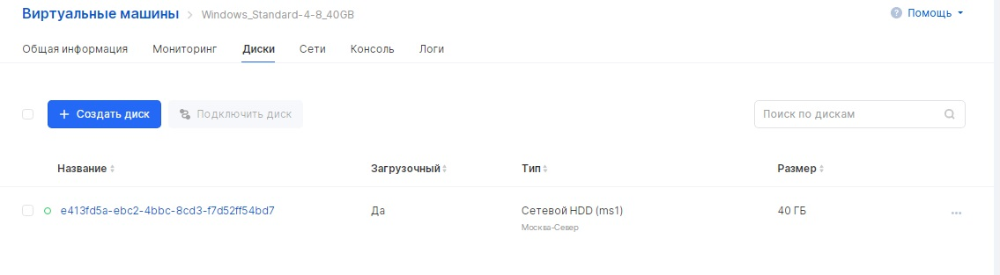
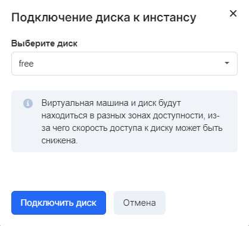

Инстансы VK CS поддерживают различные операции с дисками.

## Панель управления VK CS

Для совершения операций с дисками виртуальной машины [в личном кабинете VK CS](https://mcs.mail.ru/app/services/infra/servers/) следует:

1.  Перейти на страницу "Виртуальные машины" раздела "Облачные вычисления".
2.  Открыть страницу инстанса, перейти на вкладку "Диски". 

Доступные операции в верхнем меню раздела:

- Создание диска
- Подключение существующего диска к инстансу

Доступные операции контекстного меню диска:

- Изменение размера диска
- Просмотр списка снимков диска
- Смена типа диска (требует отсоединения диска)
- Замена root-диска
- Отключение диска
- Создание снимка диска (снапшота)

**Внимание**

После расширения диска в операционной системе инстанса необходимо также выполнить его расширение.

**Для семейства ОС Linux**

Получить список разделов

```
fdisk -l
```

Расширить требуемый раздел (в примере /dev/vda1)

```
growpart /dev/vda 1
resize2fs /dev/vda1
```

**Для семейства ОС Windows**

Открыть оснастку управления дисками (diskmgmt.msc), в контекстном меню нужного раздела выбрать "Расширить раздел".

## OpenStack CLI

Управление дисками инстанса осуществляется с помощью следующих команд:

Получить список дисков:

```
openstack volume list
```

Получить список виртуальных машин:

```
openstack server list
```

Присоединить или отсоединить диск:

```
openstack server add(remove) volume <ID инстанса> <ID диска>
```

**Примечание**

Изменить размер диска с помощью CLI возможно только после его отсоединения от инстанса.
