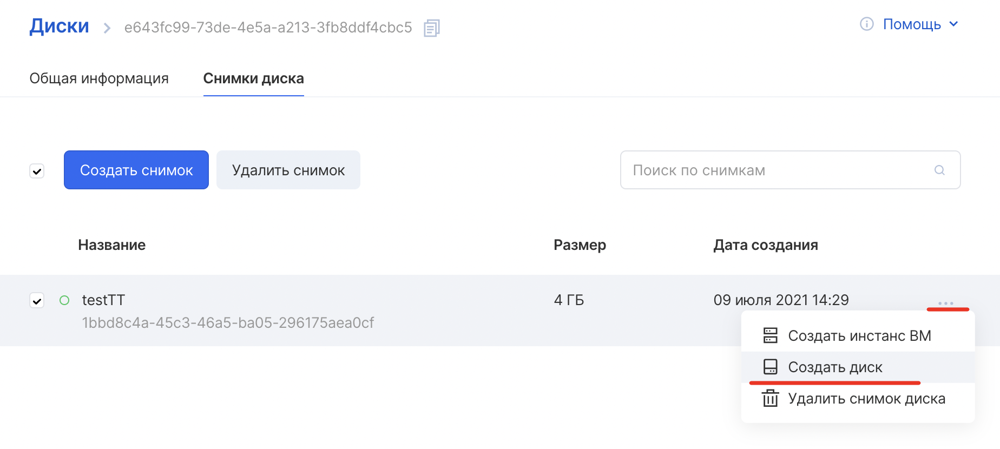
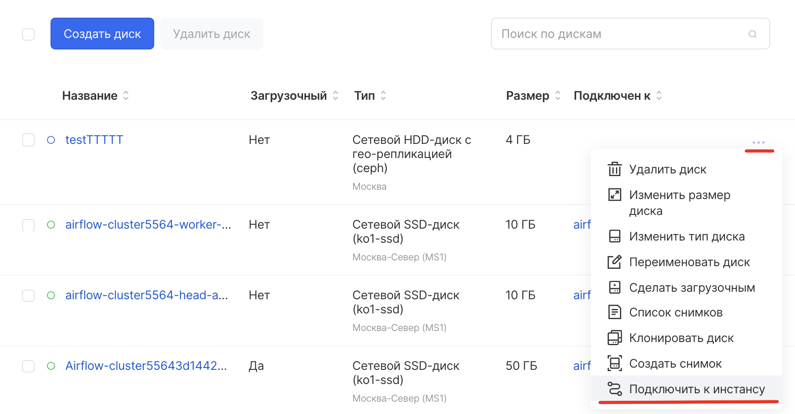
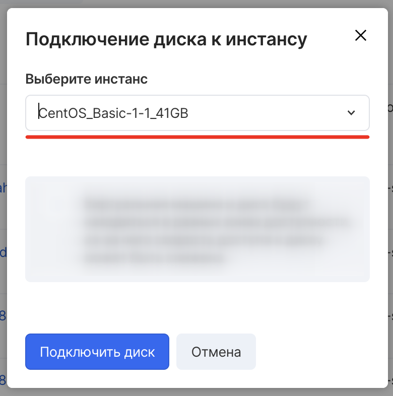

В VK CS возможна передача дисков между проектами и ВМ. 

Передача между проектами
------------------------

#### OpenStack CLI

Для передачи диска в клиенте OpenStack следует:

Получить список дисков:

```
openstack volume list --long
```

Создать запрос передачи диска:

```
openstack volume transfer request create <ID диска>
```

В результате выполнения команды будут получены auth_key и id запроса. Эти данные необходимо сохранить и использовать в команде подтверждения передачи диска. 

Далее, выполнить команду в проекте, который является адресатом передачи:

```
openstack volume transfer request accept --auth-key <ключ> <id запроса>
```

Проверить, что диск передан корректно:

```
openstack volume show <ID диска>
```

После обратиться в техническую поддержку и сообщить, какой диск из какого в какой проект был перемещен, чтобы оплата за диск больше не списывалась с исходного проекта.

Передача между ВМ
-----------------

#### Панель управления VK CS

1\. Создайте снапшот диска по [этой инструкции](https://mcs.mail.ru/help/ru_RU/vm-volumes/volume-snapshot).  

2\. Создайте диск из снапшота:

3\. Найдите созданный диск в списке дисков. В контекстном меню диска выберите "Подключить к инстансу", затем выберите нужную виртуальную машину для подключения:



