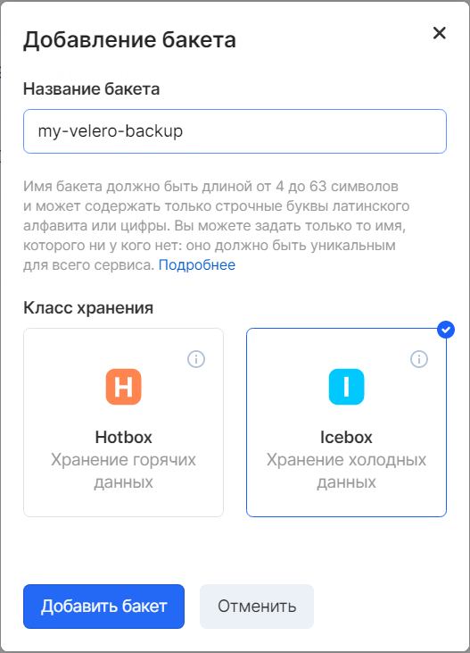

При помощи Velero можно создать резервную копию кластера Kubernetes в облако VK Cloud и развернуть эту копию в новый кластер. Эта операция полезна при необходимости тиражировать кластер с пользовательскими настройками.

Для этого понадобится:

- Развернутый в VK Cloud кластер Kubernetes;
- Velero клиент;
- Плагин OpenStack.

## Описание

Velero — это удобный инструмент резервного копирования для Kubernetes, который сжимает и бэкапит объекты Kubernetes в объектное хранилище.

Он может сделать снапшот с persistent volume кластера, используя возможности создания снапшотов блочных устройств облачного провайдера. Как следствие, Velero может развернуть Persistent Volumes из бэкапа в первозданном виде.

Каждая операция Velero — резервное копирование по требованию, резервное копирование по расписанию, восстановление из бэкапа — это кастомный ресурс, определенный с помощью Custom Resource Definition. Также Velero содержит собственные контроллеры для отслеживания операций с резервным копированием.

Velero идеально подходит для плана аварийного восстановления и для подготовки кластера Kubernetes к обновлению, путем создания снапшотов состояния ресурсов кластера. В этом сценарии мы установим и настроим Velero для взаимодействия с кластером Kubernetes на VK Cloud и сделаем бэкап неймспейса со всем содержимым в облачное S3-хранилище VK Cloud Storage, используя плагин Openstack.

## Установка Velero client

Velero состоит из:

- клиента, который устанавливается на локальный компьютер администратора кластера Kubernetes;
- сервера, который запускается в самом кластере kubernetes.

Дополнительно может понадобиться клиент Openstack с пакетом API блочного хранилища. Подробнее читайте [здесь](https://mcs.mail.ru/help/ru_RU/user-account/mgmt-interfaces#section-3).

Установите клиент Velero на Ubuntu 20.04. Используйте версию проекта — [1.2.0.](https://github.com/vmware-tanzu/velero/releases/tag/v1.2.0)

Затем скачайте архив с клиентом на локальную машину администратора Kubernetes, распакуйте и установите:

```
wget https://github.com/vmware-tanzu/velero/releases/download/v1.2.0/velero-v1.2.0-linux-amd64.tar.gz
tar -zxvf velero-v1.2.0-linux-amd64.tar.gz
sudo cp velero-v1.2.0-linux-amd64/velero /usr/local/bin
```

Чтобы проверить работоспособность Velero, вызовите справочную информацию:

```
velero --help
```

## Создание бакета для бекапов

Так как Velero сохраняет свои бэкапы в S3-хранилище, необходимо перед установкой сервера в кластер, предварительно создать бакет в S3-хранилище.

Создайте бакет my-velero-backup в сервисе "Объектное хранилище", используя Панель VK Cloud.



Также необходимо создать аккаунт для доступа к бакету в сервисе «Объектное хранилище» и получить ключи доступа:

.png>)

Полученные ключи доступа запишите в файл s3_creds:

```
[default]
aws_access_key_id=<Access Key ID>
aws_secret_access_key=<Secret Key>
```

## Установка сервера velero

Инсталляция Velero состоит из нескольких объектов Kubernetes, которые работают вместе над созданием, планированием и управлением резервными копиями.

> **Важно**<br />Перед установкой Velero убедитесь, что node-узлы кластера имеют как минимум 2 CPU, либо, что включено автомасштабирование кластера. Подробнее об автомасштабировании кластера вы можете узнать в [статье](/base/k8s/manage-k8s/scale-k8s#na_sozdannom_klastere).

Команда `velero install` выполнит предварительные шаги по настройке вашего кластера, в частности:

- создаст namespace velero;
- добавит velero сервис аккаунт;
- сконфигурирует rbac для доступа сервис аккаунта Velero;
- установит CRD для специфических Velero ресурсов — Backup, Schedule, Restore, Config.

Выполните команду:

```
velero install \
--plugins velero/velero-plugin-for-aws:v1.0.0,registry.infra.mail.ru:5010/velero/velero-plugin-mcs:v1.2.0 \
--provider aws \
--bucket my-velero-backup \
--secret-file ./s3_creds \
--use-volume-snapshots=false \
--backup-location-config region=mail,s3ForcePathStyle="true",s3Url=https://hb.bizmrg.com:443
```

Остановимся подробно на аргументах:

- \--plugins velero/velero-plugin-for-aws:v1.0.0,registry.infra.mail.ru:5010/velero/velero-plugin-mcs:v1.2.0 — плагины для взаимодействия с S3 хранилищем для бэкапов и создания snapshot PV.
- \--provider aws — протокол взаимодействия с S3 хранилищем.
- \--bucket my-velero-backup — бакет для бэкапов.
- \--secret-file ./s3_cred — файл с ключами подключения к S3 хранилищу.
- \--use-volume-snapshots=false — отключим создание снапшотов PV для текущим провайдером. Для создания снапшотов будет использоваться плагин.
- \--backup-location-config region=mail,s3ForcePathStyle="true",s3Url=https://hb.bizmrg.com:443 — конечная точка подключения к Объектному хранилищу VK Cloud.

После выполнения команды можно увидеть подобный вывод:

```
CustomResourceDefinition/backups.velero.io: attempting to create resource
CustomResourceDefinition/backups.velero.io: already exists, proceeding
CustomResourceDefinition/backups.velero.io: created
...
Deployment/velero: attempting to create resource
Deployment/velero: already exists, proceeding
Deployment/velero: created
Velero is installed! ⛵ Use 'kubectl logs deployment/velero -n velero' to view the status.
```

## Установка плагина VK Cloud

Далее необходимо установить плагин VK Cloud для работы с блочным хранилищем.

Для начала нужно получить openstack rc файл, содержащий в себе переменные окружения, необходимые для доступа к API Openstack. Получить файл можно в меню «[Настройки проекта](https://mcs.mail.ru/app/project/keys/)» в личном кабинете VK Cloud. Для этого перейдите в раздел «API ключи» и нажмите «Скачать openrc  версии 3».

Сохраните файл как openrc.sh. Далее добавьте права на выполнение:

```
. openrc.sh
```

Введите пароль от своего аккаунта VK Cloud. После этого в переменных окружения будут выставлены параметры доступа к openstack.

Создайте credential файл для плагина, используя параметры учетной записи:

```
kubectl -n velero create secret generic openstack-cloud-credentials \
--from-literal OS_PROJECT_ID=$OS_PROJECT_ID \
--from-literal OS_REGION_NAME=$OS_REGION_NAME \
--from-literal OS_IDENTITY_API_VERSION=$OS_IDENTITY_API_VERSION \
--from-literal OS_PASSWORD=$OS_PASSWORD \
--from-literal OS_AUTH_URL=$OS_AUTH_URL \
--from-literal OS_USERNAME=$OS_USERNAME \
--from-literal OS_INTERFACE=$OS_INTERFACE \
--from-literal OS_FILE_OPERATION_TIMEOUT=$OS_FILE_OPERATION_TIMEOUT \
--from-literal OS_DOMAIN_NAME=$OS_USER_DOMAIN_NAME -o yaml
```

Результат выполнения команды должен быть таким:

```
apiVersion: v1
data:
OS_AUTH_URL: aHR0cHM6Ly9pbmZyYS5tYWlsLnJ1OjM1MzU3L3YzLw==
OS_DOMAIN_ID: ""
OS_FILE_OPERATION_TIMEOUT: ""
OS_IDENTITY_API_VERSION: Mw==
OS_INTERFACE: cHVibGslj
OS_PASSWORD: xxxxxxxxxxxxxx
OS_PROJECT_DOMAIN_ID: MmY4NDhkYWY3xMWY1NDQ0ZfmIzOWVlZDVdmYmZkOTFiMmI=
OS_PROJECT_ID: MGNkYldrWFhNjQwMmQ0NDI0ZTk2NzZjNzVhNzIwYWZhODU=
OS_REGION_NAME: UmVnsdaW9uT25l
OS_USERNAME: cm9tYW5lbmtvZGVueXNAZ21haWwuYas29t
kind: Secret
metadata:
creationTimestamp: "2020-04-14T10:38:33Z"
name: openstack-cloud-credentials
namespace: velero
resourceVersion: "5976669"
selfLink: /api/v1/namespaces/velero/secrets/openstack-cloud-credentials
uid: 923ad314-b870-476f-9da7-4b2a526d9bbb
type: Opaque
```

Отредактируйте Deployment Velero. Для этого выполните команду:

```
kubectl edit deployment/velero -n velero
```

В открывшемся окне редактора найдите секцию:

```
spec:
  containers:
  - args:
    - server
    command:
    - /velero
```

И приведите ее к следующему виду:

```
spec:
  containers:
  - args:
    - server
    envFrom:
    - secretRef:
        name: openstack-cloud-credentials
    command:
    - /velero
```

Так же найдите секцию:

```
     - image: velero/velero-plugin-for-aws:v1.0.0
        imagePullPolicy: IfNotPresent
        name: velero-plugin-for-aws
        resources: {}
        terminationMessagePath: /dev/termination-log
```

и приведите её к следующему виду:

```
     - image: velero/velero-plugin-for-aws:v1.0.0
        imagePullPolicy: IfNotPresent
        name: velero-plugin-for-aws
        resources:
          limits:
            cpu: "1"
            memory: 512Mi
          requests:
            cpu: 500m
            memory: 256Mi
        terminationMessagePath: /dev/termination-log
```

Найдите секцию:

```
     - image: registry.infra.mail.ru:5010/velero/velero-plugin-mcs:v1.2.0
        imagePullPolicy: IfNotPresent
        name: velero-plugin-mcs
        resources: {}
        terminationMessagePath: /dev/termination-log
```

И приведите её к виду:

```
     - image: registry.infra.mail.ru:5010/velero/velero-plugin-mcs:v1.2.0
        imagePullPolicy: IfNotPresent
        name: velero-plugin-mcs
        resources:
          limits:
            cpu: "1"
            memory: 512Mi
          requests:
            cpu: 500m
            memory: 256Mi
        terminationMessagePath: /dev/termination-log
```

Создадим дефолтный snapshot-location для провайдера openstack.

```
velero snapshot-location create default --provider openstack --config region=mail
```

Настроенные локации для хранения снапшотов можно посмотреть с помощью команды:

```
velero get snapshot-locations
```

Проверьте статус командой:

```
kubectl logs deployment/velero -n velero
```

В выводе не должно содержаться ошибок.

Перезапустите деплоймент:

```
kubectl rollout restart deployment/velero -n velero
```

Проверим, что плагин установился и в списке есть строка velero.io/openstack.

```
velero plugin get
```

```
NAME                              KIND
velero.io/pod                     BackupItemAction
velero.io/pv                      BackupItemAction
velero.io/service-account         BackupItemAction
velero.io/aws                     ObjectStore
velero.io/add-pv-from-pvc         RestoreItemAction
velero.io/add-pvc-from-pod        RestoreItemAction
velero.io/change-storage-class    RestoreItemAction
velero.io/cluster-role-bindings   RestoreItemAction
velero.io/job                     RestoreItemAction
velero.io/pod                     RestoreItemAction
velero.io/restic                  RestoreItemAction
velero.io/role-bindings           RestoreItemAction
velero.io/service                 RestoreItemAction
velero.io/service-account         RestoreItemAction
velero.io/aws                     VolumeSnapshotter
*velero.io/openstack               VolumeSnapshotter*
```

## Создание бэкапа

Проверять создание и восстановление из бэкапов можно на примере сервера nginx.

Создайте манифест, в котором опишем deployment и Persistent Volume Claim с указанием, что volume должен создаваться через блочное хранилище VK Cloud.

Создайте файл nginx-app.yml, в котором опишем deployment и Persistent Volume Vlaim с указанием, что volume должен создаваться через блочное хранилище VK Cloud.

```
---
apiVersion: v1
kind: Namespace
metadata:
 name: nginx-example
 labels:
   app: nginx

---
apiVersion: storage.k8s.io/v1
kind: StorageClass
metadata:
 name: cinder
provisioner: kubernetes.io/cinder

---
kind: PersistentVolumeClaim
apiVersion: v1
metadata:
 name: mypvc
 namespace: nginx-example
spec:
 storageClassName: cinder
 accessModes:
   - ReadWriteOnce
 resources:
   requests:
     storage: 3Gi


---
apiVersion: apps/v1
kind: Deployment
metadata:
 name: nginx-deployment
 namespace: nginx-example
spec:
 replicas: 1
 selector:
   matchLabels:
     app: nginx
 template:
   metadata:
     labels:
       app: nginx
   spec:
     volumes:
       - name: nginx-logs
         persistentVolumeClaim:
          claimName: mypvc
     containers:
     - image: nginx:1.21.3
       name: nginx
       ports:
       - containerPort: 80
       volumeMounts:
         - mountPath: "/var/log/nginx"
           name: nginx-logs
           readOnly: false

---
apiVersion: v1
kind: Service
metadata:
 labels:
   app: nginx
 name: my-nginx
 namespace: nginx-example
spec:
 ports:
 - port: 80
   targetPort: 80
 selector:
   app: nginx
 type: LoadBalancer
```

Примените манифест:

```
kubectl apply -f nginx-app.yml
```

В кластере появится неймспейс nginx-example с работающим nginx сервером. Посмотрите какой IP-адрес выдаст сервису nginx loadbalancer kubernetes и перейдите по этому IP в браузере:

```
kubectl get svc -n nginx-example
NAME TYPE CLUSTER-IP EXTERNAL-IP PORT(S) AGE
my-nginx   LoadBalancer   10.254.244.134   95.163.250.147     80:31545/TCP   2m54s
```

Убедитесь, что создался persistent volume:

```
kubectl get pv
NAME                                   	CAPACITY   ACCESS MODES   RECLAIM POLICY   STATUS   CLAIM             	STORAGECLASS   REASON   AGE
pvc-47587acc-8ec0-413a-b0c0-9a1d3848672f   3Gi    	RWO        	Delete       	Bound	nginx-example/mypvc   cinder              	11s

kubectl describe  pv pvc-47587acc-8ec0-413a-b0c0-9a1d3848672f
Name:            pvc-47587acc-8ec0-413a-b0c0-9a1d3848672f
Labels:          <none>
Annotations:     pv.kubernetes.io/provisioned-by: cinder.csi.openstack.org
Finalizers:      [kubernetes.io/pv-protection]
StorageClass:    cinder
Status:          Bound
Claim:           nginx-example/mypvc
Reclaim Policy:  Delete
Access Modes:    RWO
VolumeMode:      Filesystem
Capacity:        3Gi
Node Affinity:   <none>
Message:
Source:
  Type:       Cinder (a Persistent Disk resource in OpenStack)
  VolumeID:   76bcc859-dea5-4b44-ba8c-46c4bd664e97
  FSType:     ext4
  ReadOnly:   false
  SecretRef:  nil
Events:       <none>
```

Проверьте, что в блочном хранилище создался соответствующий диск:

```
openstack volume show 76bcc859-dea5-4b44-ba8c-46c4bd664e97
```

Velero предлагает широкую вариативность по выбору объектов для резервного копирования. Вы можете указать через selector объекты с конкретными лейблами, либо указать весь неймспейс целиком.

Создайте бэкап для всего неймспейса nginx-example, выполнив следующую команду:

```
velero backup create nginx-example --include-namespaces nginx-example
```

Для того, чтобы посмотреть существующие резервные копии, у velero есть команда velero get backups:

```
velero get backups
NAME            STATUS      CREATED                         EXPIRES   STORAGE LOCATION   SELECTOR
nginx-example   Completed   2020-02-07 16:02:26 +0300 MSK   29d       default            <none>
```

Также есть возможность более подробно изучить содержание бэкапа командой describe:

```
velero backup describe nginx-example --details

Name:         nginx-example

Namespace:    velero

Labels:       velero.io/storage-location=default
Annotations:  <none>

Phase:  Completed

Namespaces:
 Included:  nginx-example
 Excluded:  <none>
Resources:
 Included:        \*
 Excluded:        <none>
 Cluster-scoped:  auto

Label selector:  <none>

Storage Location:  default

Snapshot PVs:  auto

TTL:  720h0m0s

Hooks:  <none>

Backup Format Version:  1

Started:    2020-02-07 16:02:26 +0300 MSK
Completed:  2020-02-07 16:02:27 +0300 MSK

Expiration:  2020-03-08 16:02:26 +0300 MSK

Resource List:
 apps/v1/Deployment:
    - nginx-example/nginx-deployment
 apps/v1/ReplicaSet:
    - nginx-example/nginx-deployment-5754944d6c
    - nginx-example/nginx-deployment-7bfb85948d
 v1/Endpoints:
    - nginx-example/my-nginx
 v1/Namespace:
    - nginx-example
 v1/Pod:
    - nginx-example/nginx-deployment-7bfb85948d-jfzh9
    - nginx-example/nginx-deployment-7bfb85948d-x7h7t
 v1/Secret:
    - nginx-example/default-token-9svxb
 v1/Service:
    - nginx-example/my-nginx
 v1/ServiceAccount:
    - nginx-example/default

Persistent Volumes: <none included>
```

Список ресурсов отражает каждый из объектов Kubernetes, которые попали в бэкап. Сначала убедитесь в наличии бэкапа в S3-хранилище, затем, что в блочном хранилище также создался бэкап:

```
openstack volume backup list
```

## Восстановление из бэкапа

Сэмулируйте катастрофу и удалите неймспейс с тестовым приложением:

```
kubectl delete ns nginx-example
```

Убедитесь, что неймспейс удален:

```
kubectl get ns
NAME              STATUS   AGE
default           Active   21h
ingress-nginx     Active   21h
kube-node-lease   Active   21h
kube-public       Active   21h
kube-system       Active   21h
magnum-tiller     Active   21h
velero            Active   3h16m
```

Теперь приступите к восстановлению из бэкапа. Задайте команду:

```
velero restore create --from-backup nginx-example
Restore request "nginx-example-20200207171734" submitted successfully.
Run \`velero restore describe nginx-example-20200207171734\` or \`velero restore logs nginx-example-20200207171734\` for more details.
```

Неймспейс со всеми ресурсами успешно восстановлен. Убедитесь в этом, выполнив следующую команду:

```
kubectl get pods -n nginx-example
NAME                                READY   STATUS    RESTARTS   AGE
nginx-deployment-7bfb85948d-jfzh9   1/1     Running   0          62s
nginx-deployment-7bfb85948d-x7h7t   1/1     Running   0          62s
```

Видно, что неймспейс и поды веб-сервера восстановлены. Также убедимся, что диск в блочном хранилище был восстановлен:

```
openstack volume list
```

Если восстановление производится в другой кластер, то перед восстановлением из бекапа необходимо заново повторить настройку Velero для нового кластера (повторить пункты: установка Velero в кластер Kubernetes, установка плагина VK Cloud). Бакет и ключи доступа к бакету используются уже существующие.

## Удаление бэкапа

Для удаления бэкапа применим команду:

```
velero backup delete nginx-example
```

Бэкап в velero и бэкап в блочном хранилище будут удалены.

## Создание бэкапа по расписанию

У Velero существует механизм создания резервных копий по расписанию. За это отвечает планировщик, схожий по своему функционалу с сron.

Создайте расписание для ежечасного бэкапа тестового неймспейса nginx-example. Для этого выполните команду:

```
velero schedule create daily --schedule="@every 1h" --include-namespaces nginx-example --ttl 24h0m0s
Schedule "daily" created successfully.
```

На этапе создания расписания нужно задать имя расписания — в нашем случае daily и через аргументы передать параметры:

- \--schedule="@every 1h" — создавать 1 раз в час. Этот параметр в качестве аргументов может принимать различные варианты задания расписания, в том числе и по cron схеме, например,--schedule="0 \*/6 \* \* \*". Подробности использования можно посмотреть в справочной информации:

  ```
  velero --help
  ```

- --include-namespaces nginx-example — какой неймспейс включаем в бэкап.
- \--ttl — как долго будет жить версия бэкапа до удаления.

Чтобы посмотреть какие есть расписания, выполните команду:

```
velero get schedule
NAME STATUS CREATED SCHEDULE BACKUP TTL LAST BACKUP SELECTOR
daily   Enabled   2020-04-14 11:43:46 +0000 UTC   @every 1h   24h0m0s      2m ago        <none>
```

В списке бэкапов резервная копия по расписанию будет иметь префикс с названием расписания:

```
velero get backups
NAME STATUS CREATED EXPIRES STORAGE LOCATION SELECTOR
daily-20200414114346 Completed 2020-04-14 11:43:46 +0000 UTC 23h default
nginx-example          Completed   2020-04-14 11:25:46 +0000 UTC   29d       default            <none>
```

## Удаление Velero из кластера Kubernetes

Если Velero больше не нужен, то удаление производится следующей командой:

```
kubectl delete namespace/velero clusterrolebinding/velero
```

Velero, а также все созданные бэкапы будут удалены.
