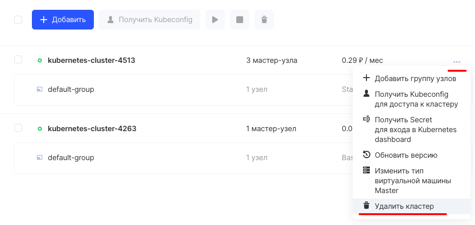

Прежде чем удалить кластер необходимо убедиться что он находится во включенном состоянии. В противном случае операция удаления не может быть выполнена.

## В Панели VK CS

Для удаления кластера через Панель VK CS следует перейти на список кластеров в разделе "Контейнеры", в контекстном меню выбранного кластера нажать опцию "Удалить кластер".



## При помощи Terraform

Команда **terraform destroy** удаляет ресурсы из конфигурации Terraform. Эта команда обратна команде **terraform apply**, поскольку она удаляет все ресурсы, указанные в конфигурации. Он не уничтожает работающие где-либо еще ресурсы, не описанные в текущей конфигурации.

```
terraform destroy
# ...
  # instance.example will be destroyed
  - resource "instance" "example" {
      - ami                          = "ami-fc0b939c" -> null
# ...
```

Префикс указывает на то, что экземпляр будет уничтожен. Как и в случае с apply, Terraform показывает свой план выполнения и ожидает подтверждения, прежде чем вносить какие-либо изменения.

Необходимо ввести **yes**, чтобы выполнить план удаления.

```
# ...
instance.example: Destroying... [id=i-0589469dd150b453b]
Destroy complete! Resources: 1 destroyed.
# ...
```

Как и в случае с **apply**, Terraform определяет порядок, в котором объекты должны быть уничтожены. В этом случае был только один ресурс. В более сложных случаях с несколькими ресурсами Terraform уничтожит их в подходящем порядке с учетом зависимостей.
